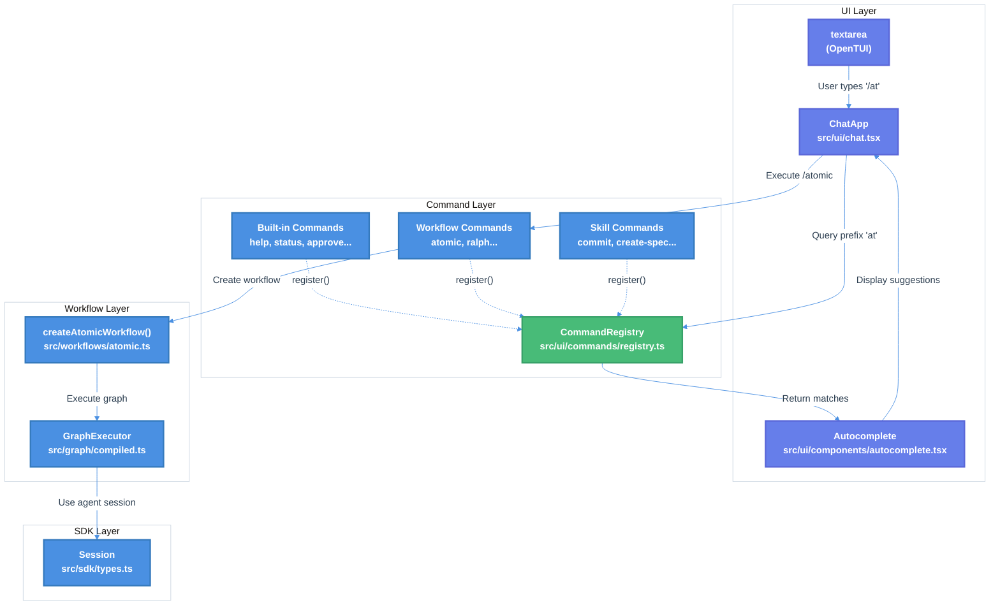

# TUI Command Auto-Complete System Technical Design Document

| Document Metadata      | Details     |
| ---------------------- | ----------- |
| Author(s)              | Developer   |
| Status                 | Draft (WIP) |
| Team / Owner           | Atomic CLI  |
| Created / Last Updated | 2026-01-31  |

## 1. Executive Summary

This RFC proposes implementing a command auto-complete system for the Atomic TUI chat interface. The system will register workflow names, built-in commands, and skills as executable slash commands, displaying suggestions in a two-column layout (name | description) as the user types. This enables users to discover and execute workflows with natural syntax: `/workflow-name Do this task`.

Currently, users must know exact command names and cannot discover available functionality through the TUI. The proposed solution provides discoverability, reduces user friction, and creates a consistent command invocation pattern across workflows, built-ins, and skills.

**Research Reference:** `research/docs/2026-01-31-atomic-current-workflow-architecture.md`, Section 11 (Command Auto-Complete System Proposed)

## 2. Context and Motivation

### 2.1 Current State

**Architecture:** The Atomic TUI (`src/ui/chat.tsx`) provides a full-screen terminal chat interface built with OpenTUI/React. Users interact via a `<textarea>` component that submits messages to a coding agent session.

**Current Chat Flow (`src/ui/index.ts:104-307`):**
```
User Input → handleSubmit() → session.stream(content) → Display Response
```

**Limitations:**
- No command discovery mechanism - users must know command names in advance
- No autocomplete as users type
- No unified interface for invoking workflows, skills, and built-in commands
- Workflow execution requires CLI flags rather than inline invocation

**Current UI Components (from `src/ui/chat.tsx`):**
- `AtomicHeader` - Logo and app info display
- `MessageBubble` - Message rendering with role-based styling
- `ChatApp` - Main chat application with textarea input
- `LoadingIndicator` - Animated loading dots

### 2.2 The Problem

- **User Impact:** Users cannot discover available commands without reading documentation; new users face steep learning curve
- **Business Impact:** Reduced adoption of workflow features due to discoverability issues
- **Technical Debt:** No unified command execution layer - workflows, skills, and built-ins are invoked through disparate mechanisms

**Research Reference:** Section 11.3-11.5 of the architecture document proposes a CommandRegistry pattern with auto-registration from workflow definitions.

## 3. Goals and Non-Goals

### 3.1 Functional Goals

- [ ] Create a `CommandRegistry` class that stores and retrieves command definitions
- [ ] Implement a `CommandDefinition` interface supporting workflows, built-ins, and skills
- [ ] Auto-register workflow commands from `src/workflows/atomic.ts` exports
- [ ] Implement built-in commands: `/help`, `/status`, `/approve`, `/reject`, `/theme`, `/clear`
- [ ] Register skills from the system-reminder skill list as commands
- [ ] Create an `Autocomplete` React component with two-column layout (name | description)
- [ ] Integrate autocomplete into `ChatApp` component with proper keyboard navigation
- [ ] Support Tab to complete, Enter to execute, Escape to dismiss
- [ ] Execute commands with arguments: `/workflow-name <user arguments>`
- [ ] Workflow commands are invoked using the workflow's `name` property as the slash command (e.g., a workflow with `name: "atomic"` is invoked via `/atomic <args>`). Aliases defined in `WorkflowMetadata.aliases` (e.g., `["ralph", "loop"]`) also work as valid invocation names.
- [ ] We WILL support agent-specific commands loaded from configuration folders (`.opencode/`, `.claude/`, `.github/`) based on the `-a` flag (e.g., `atomic chat -a claude` loads commands from `.claude/` folder, both local and global)

### 3.2 Non-Goals (Out of Scope)

- [ ] We will NOT implement fuzzy matching in this version (prefix matching only)

- [ ] We will NOT persist command history across sessions
- [ ] We will NOT implement command aliases beyond those defined in WorkflowMetadata
- [ ] We will NOT add mouse click support for autocomplete selection

## 4. Proposed Solution (High-Level Design)

### 4.1 System Architecture Diagram



### 4.2 Architectural Pattern

We are adopting a **Registry Pattern** combined with **Observer Pattern**:

- **Registry Pattern:** `CommandRegistry` acts as a central lookup table for all command definitions, allowing dynamic registration and prefix-based search
- **Observer Pattern:** The `ChatApp` component observes input changes and updates the `Autocomplete` component state accordingly

**Research Reference:** Section 11.2-11.3 details the CommandRegistry class design and registration flow.

### 4.3 Key Components

| Component                  | Responsibility              | File Location                          | Justification                                           |
| -------------------------- | --------------------------- | -------------------------------------- | ------------------------------------------------------- |
| `CommandRegistry`          | Store and retrieve commands | `src/ui/commands/registry.ts`          | Centralized lookup enables consistent command discovery |
| `CommandDefinition`        | Define command interface    | `src/ui/commands/registry.ts`          | Type safety and consistent command structure            |
| `Autocomplete`             | Render suggestion dropdown  | `src/ui/components/autocomplete.tsx`   | Reusable UI component for command suggestions           |
| `registerBuiltinCommands`  | Register help, status, etc. | `src/ui/commands/builtin-commands.ts`  | Separation of concerns for built-in commands            |
| `registerWorkflowCommands` | Register atomic workflow    | `src/ui/commands/workflow-commands.ts` | Automatic workflow-to-command mapping                   |
| `registerSkillCommands`    | Register skills             | `src/ui/commands/skill-commands.ts`    | Skills integration with command system                  |

## 5. Detailed Design

### 5.1 API Interfaces

#### 5.1.1 CommandDefinition Interface

**File:** `src/ui/commands/registry.ts`

```typescript
export interface CommandDefinition {
  /** Command name without slash (e.g., "atomic") */
  name: string;
  /** Short description for autocomplete display */
  description: string;
  /** Command category for sorting and display */
  category: "workflow" | "builtin" | "skill";
  /** Execute the command with arguments */
  execute: (args: string, context: CommandContext) => Promise<CommandResult>;
  /** Alternative names (e.g., ["ralph"]) */
  aliases?: string[];
  /** Hide from autocomplete suggestions */
  hidden?: boolean;
}
```

#### 5.1.2 CommandContext Interface

```typescript
export interface CommandContext {
  /** Active session for agent communication */
  session: Session;
  /** Current workflow chat state */
  state: WorkflowChatState;
  /** Add a message to the chat history */
  addMessage: (msg: ChatMessage) => void;
  /** Set streaming state */
  setStreaming: (streaming: boolean) => void;
}
```

#### 5.1.3 CommandResult Interface

```typescript
export interface CommandResult {
  /** Whether the command executed successfully */
  success: boolean;
  /** Optional message to display */
  message?: AgentMessage;
  /** Optional state updates to apply */
  stateUpdate?: Partial<WorkflowChatState>;
}
```

### 5.2 Data Model / Schema

#### 5.2.1 WorkflowChatState Extension

**File:** `src/ui/chat.tsx` (state additions)

```typescript
interface WorkflowChatState {
  // Existing state
  messages: ChatMessage[];
  isStreaming: boolean;

  // New state for autocomplete
  showAutocomplete: boolean;
  autocompleteInput: string;
  selectedSuggestionIndex: number;

  // New state for workflow execution
  workflowActive: boolean;
  workflowType: string | null;
  initialPrompt: string | null;
  pendingApproval: boolean;
  specApproved: boolean;
  feedback: string | null;
}
```

#### 5.2.2 AutocompleteProps Interface

**File:** `src/ui/components/autocomplete.tsx`

```typescript
export interface AutocompleteProps {
  /** Current input text */
  input: string;
  /** Show/hide dropdown */
  visible: boolean;
  /** Currently selected index */
  selectedIndex: number;
  /** Callback when selection changes */
  onSelect: (command: string) => void;
  /** Callback when index changes */
  onIndexChange: (index: number) => void;
  /** Maximum suggestions to display */
  maxSuggestions?: number;
}
```

### 5.3 CommandRegistry Class Implementation

**File:** `src/ui/commands/registry.ts`

```typescript
export class CommandRegistry {
  private commands: Map<string, CommandDefinition> = new Map();
  private aliases: Map<string, string> = new Map();

  /**
   * Register a command definition.
   */
  register(command: CommandDefinition): void {
    this.commands.set(command.name.toLowerCase(), command);
    command.aliases?.forEach(alias => {
      this.aliases.set(alias.toLowerCase(), command.name.toLowerCase());
    });
  }

  /**
   * Get a command by name or alias.
   */
  get(name: string): CommandDefinition | undefined {
    const normalized = name.toLowerCase();
    const resolved = this.aliases.get(normalized) ?? normalized;
    return this.commands.get(resolved);
  }

  /**
   * Search for commands matching a prefix.
   * Returns commands sorted by: exact match > category > alphabetical
   */
  search(prefix: string): CommandDefinition[] {
    const normalized = prefix.toLowerCase();
    return Array.from(this.commands.values())
      .filter(cmd => !cmd.hidden && cmd.name.startsWith(normalized))
      .sort((a, b) => {
        // Exact match first
        if (a.name === normalized) return -1;
        if (b.name === normalized) return 1;
        // Then by category (workflow > skill > builtin)
        if (a.category !== b.category) {
          const order = { workflow: 0, skill: 1, builtin: 2 };
          return order[a.category] - order[b.category];
        }
        // Then alphabetically
        return a.name.localeCompare(b.name);
      });
  }

  /**
   * Get all visible commands.
   */
  all(): CommandDefinition[] {
    return Array.from(this.commands.values()).filter(cmd => !cmd.hidden);
  }
}

export const globalRegistry = new CommandRegistry();
```

### 5.4 Keyboard Navigation Algorithm

**File:** `src/ui/components/autocomplete.tsx`

```typescript
// Keyboard navigation state machine
const handleKeyboard = (key: KeyEvent) => {
  if (!visible || suggestions.length === 0) return;

  switch (key.name) {
    case "up":
      // Move selection up, wrap to bottom
      onIndexChange(
        selectedIndex <= 0 ? suggestions.length - 1 : selectedIndex - 1
      );
      break;

    case "down":
      // Move selection down, wrap to top
      onIndexChange(
        selectedIndex >= suggestions.length - 1 ? 0 : selectedIndex + 1
      );
      break;

    case "tab":
      // Complete with selected suggestion
      onSelect(suggestions[selectedIndex].name);
      break;

    case "return":
      // Submit command
      onSelect(suggestions[selectedIndex].name);
      break;

    case "escape":
      // Close autocomplete (handled by parent)
      break;
  }
};
```

### 5.5 Built-in Commands Definition

**File:** `src/ui/commands/builtin-commands.ts`

| Command    | Description                   | Execute Behavior                          |
| ---------- | ----------------------------- | ----------------------------------------- |
| `/help`    | Show available commands       | List all commands with descriptions       |
| `/status`  | Show workflow progress        | Display current feature/iteration status  |
| `/approve` | Approve current specification | Set `specApproved: true` in state         |
| `/reject`  | Reject and request revisions  | Set `specApproved: false`, store feedback |
| `/theme`   | Switch theme (dark/light)     | Toggle `ThemeContext`                     |
| `/clear`   | Clear chat history            | Reset messages array                      |

### 5.6 Workflow Command Registration

**File:** `src/ui/commands/workflow-commands.ts`

**Key Principle:** Each workflow's `name` property becomes its slash command. For example, a workflow defined with `name: "atomic"` is automatically registered as `/atomic` and can be invoked with `/atomic <args>`. Aliases provide alternative invocation names for the same workflow.

```typescript
export const WORKFLOW_DEFINITIONS: WorkflowMetadata[] = [
  {
    name: "atomic",
    description: "Full autonomous development loop (research → spec → implement → PR)",
    aliases: ["ralph", "loop"],
    createWorkflow: createAtomicWorkflow,
  },
];

export function registerWorkflowCommands(): void {
  for (const workflow of WORKFLOW_DEFINITIONS) {
    const command: CommandDefinition = {
      name: workflow.name,
      description: workflow.description,
      category: "workflow",
      aliases: workflow.aliases,
      execute: async (args, ctx) => {
        const graph = workflow.createWorkflow();
        ctx.addMessage({
          role: "assistant",
          content: `Starting ${workflow.name} workflow...`,
        });
        return {
          success: true,
          stateUpdate: {
            workflowActive: true,
            workflowType: workflow.name,
            initialPrompt: args,
          },
        };
      },
    };
    globalRegistry.register(command);
  }
}
```

### 5.7 Skill Commands Registration

**File:** `src/ui/commands/skill-commands.ts`

Skills are registered from the system-reminder skill list:

| Skill                 | Description                         |
| --------------------- | ----------------------------------- |
| `commit`              | Create well-formatted commit        |
| `research-codebase`   | Document codebase structure         |
| `create-spec`         | Create execution plan from research |
| `create-feature-list` | Create feature list from spec       |
| `implement-feature`   | Implement single feature            |
| `create-gh-pr`        | Commit and submit pull request      |
| `explain-code`        | Explain code functionality          |
| `ralph:ralph-loop`    | Start Ralph Loop                    |
| `ralph:cancel-ralph`  | Cancel active Ralph Loop            |
| `ralph:ralph-help`    | Explain Ralph Loop commands         |

## 6. Alternatives Considered

| Option                                | Pros                                | Cons                                          | Reason for Rejection                                                        |
| ------------------------------------- | ----------------------------------- | --------------------------------------------- | --------------------------------------------------------------------------- |
| Option A: CLI-only commands           | Simple, no UI changes               | No discoverability, poor UX                   | Users cannot discover commands in the TUI context                           |
| Option B: Fixed command list          | Simpler implementation              | Not extensible, duplicates skill definitions  | Would need manual updates when workflows/skills change                      |
| Option C: Registry Pattern (Selected) | Extensible, discoverable, type-safe | More complex initial implementation           | **Selected:** Enables dynamic registration and consistent command interface |
| Option D: Fuzzy matching              | Better UX for typos                 | Increased complexity, potential false matches | Deferred to future iteration - prefix matching sufficient for MVP           |

## 7. Cross-Cutting Concerns

### 7.1 Security and Privacy

- **Command Injection:** All command arguments are passed as strings; execution handlers must validate/sanitize inputs
- **Data Protection:** No sensitive data stored in command registry; session credentials handled by SDK layer
- **Threat Model:** Primary concern is unintended command execution; mitigated by explicit Tab/Enter confirmation

### 7.2 Observability Strategy

- **Metrics:** Track command usage (`command_invoked{name, category}`) for analytics
- **Logging:** Log command execution start/end with arguments (sanitized) for debugging
- **Errors:** Command execution errors surfaced as chat messages to user

### 7.3 Scalability and Capacity Planning

- **Command Count:** Expected 10-50 commands; Map lookup is O(1), search is O(n) but n is small
- **Memory:** CommandRegistry holds command definitions in memory; negligible footprint (<1KB)
- **Performance:** Autocomplete updates on each keystroke; search completes in <1ms for expected command count

## 8. Migration, Rollout, and Testing

### 8.1 Deployment Strategy

- [ ] Phase 1: Implement `CommandRegistry` and built-in commands (no UI changes)
- [ ] Phase 2: Add `Autocomplete` component with keyboard navigation
- [ ] Phase 3: Integrate into `ChatApp` with input detection
- [ ] Phase 4: Register workflow and skill commands
- [ ] Phase 5: Full integration testing and polish

### 8.2 Feature Flag

No feature flag needed - this is an additive feature that enhances existing TUI without breaking changes.

### 8.3 Test Plan

#### Unit Tests

**File:** `tests/ui/commands/registry.test.ts`

```typescript
describe("CommandRegistry", () => {
  test("register() adds command to registry");
  test("get() retrieves command by name");
  test("get() retrieves command by alias");
  test("get() returns undefined for unknown command");
  test("search() returns commands matching prefix");
  test("search() excludes hidden commands");
  test("search() sorts by category then alphabetically");
  test("all() returns all visible commands");
});
```

**File:** `tests/ui/commands/builtin-commands.test.ts`

```typescript
describe("Built-in Commands", () => {
  test("/help lists all commands");
  test("/status shows workflow state");
  test("/approve sets specApproved to true");
  test("/reject sets specApproved to false and stores feedback");
  test("/theme toggles dark/light");
  test("/clear resets messages array");
});
```

#### Integration Tests

**File:** `tests/ui/autocomplete.test.tsx`

```typescript
describe("Autocomplete Component", () => {
  test("renders suggestions matching input prefix");
  test("highlights selected suggestion");
  test("keyboard up/down navigates suggestions");
  test("Tab completes selected command");
  test("Enter executes selected command");
  test("Escape hides autocomplete");
});
```

#### End-to-End Tests

**File:** `tests/ui/chat-commands.test.tsx`

```typescript
describe("ChatApp Command Integration", () => {
  test("typing '/' shows autocomplete");
  test("typing '/at' filters to 'atomic' workflow");
  test("executing '/atomic Build feature' starts workflow");
  test("executing '/help' shows help message");
});
```

## 9. Implementation Plan

### 9.1 File Structure

```
src/ui/
├── chat.tsx                    # Modified: Add autocomplete state and handlers
├── index.ts                    # Modified: Export command system
├── theme.tsx                   # Unchanged
├── code-block.tsx              # Unchanged
├── components/
│   └── autocomplete.tsx        # NEW: Two-column autocomplete dropdown
└── commands/
    ├── index.ts                # NEW: Command system exports and initialization
    ├── registry.ts             # NEW: CommandRegistry class
    ├── builtin-commands.ts     # NEW: Built-in command definitions
    ├── workflow-commands.ts    # NEW: Workflow command registration
    └── skill-commands.ts       # NEW: Skill command registration
```

### 9.2 Implementation Order

1. **registry.ts** - Core `CommandRegistry` class and types
2. **builtin-commands.ts** - Built-in command definitions
3. **workflow-commands.ts** - Workflow registration from `src/workflows/atomic.ts`
4. **skill-commands.ts** - Skill registration from system-reminder list
5. **commands/index.ts** - Exports and `initializeCommands()` function
6. **autocomplete.tsx** - Autocomplete UI component
7. **chat.tsx modifications** - State, handlers, and autocomplete integration
8. **index.ts modifications** - Export command system

### 9.3 Dependencies

| Dependency       | Version  | Purpose                                  |
| ---------------- | -------- | ---------------------------------------- |
| `@opentui/react` | existing | React reconciler for terminal UI         |
| `@opentui/core`  | existing | Core primitives (box, text, useKeyboard) |
| React            | existing | Component framework                      |

No new dependencies required.

## 10. Human-in-the-Loop (HITL) Architecture

**Research Reference:** Section 13 of `research/docs/2026-01-31-atomic-current-workflow-architecture.md`

### 10.1 HITL Mechanisms Overview

| SDK              | Ask Question Tool |
| ---------------- | ----------------- |
| Claude Agent SDK | `AskUserQuestion` |
| OpenCode SDK     | `question` tool   |

### 10.2 Atomic Graph Engine - waitNode Signal Integration

**File:** `src/graph/nodes.ts:588-623`

The `waitNode` factory emits a `human_input_required` signal that pauses workflow execution:

```typescript
interface WaitNodeConfig<TState extends BaseState> {
  id: NodeId;
  prompt: string | ((state: TState) => string);
  autoApprove?: boolean;
  inputMapper?: (input: string, state: TState) => Partial<TState>;
  name?: string;
  description?: string;
}
```

**Signal Emission:**
```typescript
return {
  signals: [{
    type: "human_input_required",
    message: resolvedPrompt,
    data: { nodeId: id, inputMapper: inputMapper ? true : false },
  }],
};
```

**Signal Handling in GraphExecutor (`compiled.ts:355-367`):**
```typescript
const humanInputSignal = result.signals.find(
  (s) => s.type === "human_input_required"
);
if (humanInputSignal) {
  yield { nodeId: currentNodeId, state, result, status: "paused" };
  return;  // Stops the generator
}
```

### 10.3 Resume Flow for Paused Workflows

1. Client receives `ExecutionResult.snapshot` with paused state
2. Client modifies state with human input (via `/approve` or `/reject` command)
3. Client calls `execute/stream` with `resumeFrom: modifiedSnapshot`
4. GraphExecutor restores state and continues from wait node

### 10.4 AskUserQuestion Integration (Claude SDK)

**Tool Input Structure:**
```typescript
interface AskUserQuestionInput {
  questions: Array<{
    question: string;      // The complete question to ask
    header: string;        // Short label (max 12 chars)
    options: Array<{
      label: string;       // Display text (1-5 words)
      description: string; // Explanation of the option
    }>;
    multiSelect: boolean;  // Allow multiple selections
  }>;
  answers?: Record<string, string>; // User answers populated after selection
}
```

**Example - Handling Clarifying Questions:**
```typescript
async function handleAskUserQuestion(input: AskUserQuestionInput) {
  const answers: Record<string, string> = {};

  for (const q of input.questions) {
    console.log(`\n${q.header}: ${q.question}`);
    q.options.forEach((opt, i) => console.log(`  ${i + 1}. ${opt.label}`));

    const response = await prompt("Your choice: ");
    const idx = parseInt(response) - 1;
    answers[q.question] = (idx >= 0 && idx < q.options.length)
      ? q.options[idx].label
      : response;
  }

  return { questions: input.questions, answers };
}
```

### 10.5 OpenCode Question Tool

```typescript
interface QuestionInput {
  header: string;
  question: string;
  options: string[];
}
```

## 11. Rich UI Component System (OpenTUI)

**Research Reference:** Section 14 of `research/docs/2026-01-31-atomic-current-workflow-architecture.md`

### 11.1 OpenTUI Package Structure

| Package          | Purpose                                          |
| ---------------- | ------------------------------------------------ |
| `@opentui/core`  | Standalone core with imperative API, Yoga layout |
| `@opentui/react` | React reconciler for declarative development     |
| `@opentui/solid` | SolidJS reconciler for reactive integration      |

**Basic Setup:**
```tsx
import { createCliRenderer } from "@opentui/core"
import { createRoot } from "@opentui/react"

const renderer = await createCliRenderer()
const root = createRoot(renderer)
root.render(<App />)
```

### 11.2 Core Layout Components

| Component      | Purpose                  | Key Props                                           |
| -------------- | ------------------------ | --------------------------------------------------- |
| `<box>`        | Container (like `<div>`) | `border`, `borderStyle`, `flexDirection`, `padding` |
| `<text>`       | Text display             | `fg`, `bg`, `attributes`                            |
| `<scrollbox>`  | Scrollable container     | `focused`, `stickyScroll`                           |
| `<ascii-font>` | ASCII art text           | `text`, `font`                                      |

### 11.3 Input Components

| Component      | Purpose             | Events                            |
| -------------- | ------------------- | --------------------------------- |
| `<input>`      | Single-line text    | `onInput`, `onChange`, `onSubmit` |
| `<textarea>`   | Multi-line text     | `onSubmit`, `onContentChange`     |
| `<select>`     | Dropdown selection  | `onChange`, `onSelect`            |
| `<tab-select>` | Tab-based selection | `onChange`, `onSelect`            |

### 11.4 Flexbox Layout (Yoga Engine)

```tsx
<box
  flexDirection="column"
  justifyContent="space-between"
  alignItems="center"
  flexGrow={1}
  padding={2}
>
  <text>Flex child 1</text>
  <text>Flex child 2</text>
</box>
```

**Absolute Positioning:**
```tsx
<box position="absolute" left={0} top={0}>
  <text>Top Left</text>
</box>

<box position="absolute" right={0} bottom={0}>
  <text>Bottom Right</text>
</box>
```

### 11.5 Keyboard Event Handling

**useKeyboard Hook:**
```tsx
import { useKeyboard } from "@opentui/react"

function App() {
  useKeyboard((key) => {
    if (key.name === "escape") process.exit(0)
    if (key.ctrl && key.name === "c") { /* Handle Ctrl+C */ }
  })

  return <text>Press ESC to exit</text>
}
```

**KeyEvent Properties:**
| Property   | Type    | Description                       |
| ---------- | ------- | --------------------------------- |
| `name`     | string  | Key name ("escape", "enter", "a") |
| `ctrl`     | boolean | Ctrl modifier pressed             |
| `meta`     | boolean | Meta/Cmd modifier pressed         |
| `shift`    | boolean | Shift modifier pressed            |
| `sequence` | string  | Raw input sequence                |

### 11.6 Rich Content Components

**Code Display:**
```tsx
<code
  content={`const x = 1;\nconsole.log(x);`}
  filetype="javascript"
  syntaxStyle={syntaxStyle}
/>
```

**Diff Viewer:**
```tsx
<diff unified content={diffContent} />
<diff split content={diffContent} />
```

**Markdown Rendering:**
```tsx
<markdown
  content={`# Hello\n\nThis is **bold**.`}
  syntaxStyle={syntaxStyle}
  conceal={true}
  streaming={true}
/>
```

### 11.7 Theming and Styling

**Direct Props Styling:**
```tsx
<box
  backgroundColor="#1a1b26"
  borderColor="#7aa2f7"
  borderStyle="rounded"
>
  <text fg="#c0caf5">Styled content</text>
</box>
```

**RGBA Color Class:**
```tsx
import { RGBA } from "@opentui/core"

const red = RGBA.fromInts(255, 0, 0, 255)
const blue = RGBA.fromHex("#0000FF")
```

**Styled Text Utilities:**
```tsx
import { t, bold, italic, fg, bg, red, green } from "@opentui/core"

const styledText = t`Hello ${fg("red")("World")} with ${bold("bold")} text!`
const coloredText = t`${red("Error")}: ${green("Success")}`
```

### 11.8 Animation System

**Research Reference:** Section 14.7 of `research/docs/2026-01-31-atomic-current-workflow-architecture.md`

**useTimeline Hook:**
```tsx
import { useTimeline } from "@opentui/react"

function AnimatedBox() {
  const [width, setWidth] = useState(0)

  const timeline = useTimeline({
    duration: 2000,
    loop: false,
    autoplay: true,
  })

  useEffect(() => {
    timeline.add(
      { width },
      {
        width: 50,
        duration: 2000,
        ease: "linear",
        onUpdate: (animation) => setWidth(animation.targets[0].width),
      }
    )
  }, [])

  return <box style={{ width, backgroundColor: "#6a5acd" }} />
}
```

**Animation Use Cases:**
| Use Case           | Animation Type    | Duration   |
| ------------------ | ----------------- | ---------- |
| Loading indicator  | Pulsing dots      | 600ms loop |
| Progress bar       | Width transition  | Varies     |
| Notification toast | Slide in/fade out | 300ms      |
| Menu expansion     | Height transition | 200ms      |

### 11.9 Console/Debugging System

**Research Reference:** Section 14.8 of `research/docs/2026-01-31-atomic-current-workflow-architecture.md`

**Console Configuration:**
```tsx
const renderer = await createCliRenderer({
  consoleOptions: {
    position: ConsolePosition.BOTTOM,
    sizePercent: 30,
    colorError: "#FF0000",
    startInDebugMode: false,
  },
  openConsoleOnError: true,
})

// All console calls captured
console.log("This appears in the overlay")
console.error("Error message")

// Toggle console visibility
renderer.console.toggle()
```

**Console Position Options:**
| Position                 | Description                       |
| ------------------------ | --------------------------------- |
| `ConsolePosition.BOTTOM` | Debug overlay at bottom of screen |
| `ConsolePosition.TOP`    | Debug overlay at top of screen    |
| `ConsolePosition.RIGHT`  | Debug overlay on right side       |
| `ConsolePosition.LEFT`   | Debug overlay on left side        |

**Debug Mode Features:**
- Captures all `console.log`, `console.error`, `console.warn` calls
- Auto-opens on uncaught errors when `openConsoleOnError: true`
- Keyboard shortcut to toggle visibility (configurable)
- Scrollable log history

## 12. Tool Result Display Patterns

**Research Reference:** Section 15 of `research/docs/2026-01-31-atomic-current-workflow-architecture.md`

### 12.1 OpenCode ToolRegistry Pattern

OpenCode uses a registry pattern to map tool names to rendering components:

**BasicTool Component:**
```typescript
interface BasicToolProps {
  icon: ReactComponent;
  title: string;
  subtitle?: string;
  children: ReactNode;
  forceOpen?: boolean;
  locked?: boolean;
}

// Usage
<BasicTool icon={FileIcon} title="Read" subtitle={filePath}>
  <Markdown>{props.output}</Markdown>
</BasicTool>
```

**Tool-Specific Rendering:**
| Tool    | Component | Output Format                                |
| ------- | --------- | -------------------------------------------- |
| `bash`  | `Bash`    | Command + stdout/stderr as code block        |
| `edit`  | `Edit`    | Unified diff with syntax highlighting        |
| `write` | `Write`   | File content with "Created"/"Updated" status |
| `read`  | `Read`    | File content (truncated if large)            |
| `grep`  | `Grep`    | Matching lines in markdown                   |
| `task`  | `Task`    | Nested message history from sub-agent        |

### 12.2 Proposed ToolResultRegistry for Atomic

**File:** `src/ui/tools/registry.ts` (proposed)

```typescript
interface ToolRenderer {
  icon: string;
  title: (input: unknown) => string;
  render: (props: ToolRenderProps) => React.ReactNode;
}

const TOOL_RENDERERS: Record<string, ToolRenderer> = {
  Read: {
    icon: '📄',
    title: (input) => `Read: ${input.file_path}`,
    render: ({ output, syntaxStyle }) => (
      <box border borderStyle="single" padding={1}>
        <code content={output} syntaxStyle={syntaxStyle} />
      </box>
    ),
  },

  Edit: {
    icon: '✏️',
    title: (input) => `Edit: ${input.file_path}`,
    render: ({ input, syntaxStyle }) => (
      <diff unified content={generateDiff(input.old_string, input.new_string)} />
    ),
  },

  Bash: {
    icon: '💻',
    title: (input) => `Bash: ${input.command?.slice(0, 50)}...`,
    render: ({ output }) => (
      <box border borderStyle="single" padding={1}>
        <code content={output} filetype="bash" />
      </box>
    ),
  },

  Write: {
    icon: '📝',
    title: (input) => `Write: ${input.file_path}`,
    render: ({ input, output }) => (
      <box border borderStyle="single" padding={1}>
        <text fg="green">✓ {output.includes('Created') ? 'Created' : 'Updated'}</text>
        <code content={input.content?.slice(0, 200)} />
      </box>
    ),
  },
};
```

### 12.3 Copilot SDK ToolResult Structure

**Research Reference:** Section 15.3 of `research/docs/2026-01-31-atomic-current-workflow-architecture.md`

```typescript
interface ToolResult {
  textResultForLlm: string;
  binaryResultsForLlm?: ToolBinaryResult[];
  resultType: "success" | "failure";
  error?: string;  // NOT exposed to LLM
  sessionLog?: string;
  toolTelemetry?: object;
}

interface ToolBinaryResult {
  data: string;        // Base64-encoded
  mimeType: string;    // e.g., "image/png"
  type: "base64";
  description?: string;
}
```

**Result Normalization Rules:**
| Return Type        | Conversion                            |
| ------------------ | ------------------------------------- |
| `null`/`undefined` | Empty success `ToolResult`            |
| `string`           | Used as `textResultForLlm`            |
| `ToolResult`       | Passed through directly               |
| Other types        | JSON-serialized as `textResultForLlm` |

### 12.4 MessageV2 Structure (OpenCode Pattern)

OpenCode uses a discriminated union for message parts that we should adopt:

```typescript
type MessagePart =
  | TextPart        // Text content
  | ReasoningPart   // AI reasoning (thinking)
  | ToolPart        // Tool calls and results
  | FilePart        // File attachments
  | SnapshotPart    // Environment snapshots
  | PatchPart       // Code changes
  | StepStartPart   // Step markers
  | StepFinishPart  // Step completion
  | SubtaskPart     // Subtask delegation
  | RetryPart;      // Retry attempts

interface ToolPart {
  type: "tool";
  id: string;
  callID: string;
  tool: string;  // "bash", "edit", "read", etc.
  state: ToolState;
}

type ToolState =
  | { status: "pending" }
  | { status: "running"; input: unknown }
  | { status: "completed"; input: unknown; output: string; metadata?: unknown }
  | { status: "error"; input: unknown; error: string };
```

### 12.5 Current Atomic TUI MessageBubble Implementation

**Research Reference:** Section 15.5 of `research/docs/2026-01-31-atomic-current-workflow-architecture.md`

**File:** `src/ui/chat.tsx`

The current Atomic TUI uses `MessageBubble` for message display:

```tsx
function MessageBubble({ message, syntaxStyle }: MessageBubbleProps) {
  const roleLabel = message.role === "assistant" ? "Atomic" : "You"
  const roleColor = message.role === "assistant" ? ATOMIC_PINK : USER_SKY

  // For streaming content
  const showLoadingAnimation = message.streaming && !message.content

  return (
    <box flexDirection="column" padding={1}>
      <box flexDirection="row">
        <text fg={roleColor} attributes={2}>{roleLabel}</text>
        <text fg={MUTED_LAVENDER} attributes={4}>{timestamp}</text>
      </box>
      {showLoadingAnimation ? (
        <LoadingIndicator />
      ) : message.role === "assistant" ? (
        <markdown content={message.content} syntaxStyle={syntaxStyle} streaming />
      ) : (
        <text wrapMode="word">{message.content}</text>
      )}
    </box>
  )
}
```

**MessageBubble Features:**
| Feature              | Implementation                                        |
| -------------------- | ----------------------------------------------------- |
| Role differentiation | Color-coded labels (pink for assistant, sky for user) |
| Timestamps           | Muted lavender italic timestamp                       |
| Streaming support    | LoadingIndicator when streaming with no content       |
| Markdown rendering   | Full markdown support for assistant messages          |
| Word wrapping        | `wrapMode="word"` for user messages                   |

### 12.6 Streaming UI Updates

**Event Types:**
| Event Type                | Use Case                        |
| ------------------------- | ------------------------------- |
| `assistant.message_delta` | Streaming text (word-by-word)   |
| `assistant.message`       | Final complete message          |
| `tool.execution_start`    | Show "tool executing" indicator |
| `tool.execution_progress` | Update progress bar             |
| `tool.execution_complete` | Show tool result                |

**Example Event Handler:**
```typescript
session.on((event) => {
  switch (event.type) {
    case "assistant.message_delta":
      process.stdout.write(event.data.deltaContent)
      break
    case "tool.execution_start":
      console.log(`Executing: ${event.data.toolName}...`)
      break
    case "tool.execution_complete":
      console.log(`Done: ${event.data.toolCallId}`)
      break
  }
})
```

## 13. Event System Architecture

**Research Reference:** Section 17 of `research/docs/2026-01-31-atomic-current-workflow-architecture.md`

### 13.1 OpenCode Dual-Bus Architecture

```
┌─────────────────┐         ┌─────────────────┐
│      Bus        │ ──────▶ │   GlobalBus     │
│ (Per-Instance)  │         │ (Aggregated)    │
└─────────────────┘         └─────────────────┘
        │                           │
        ▼                           ▼
   Internal                    SSE Endpoint
   Components                  /global/event
```

**Key Events:**
| Event                  | Payload                          | Description              |
| ---------------------- | -------------------------------- | ------------------------ |
| `message.updated`      | `{ info: Message }`              | Message content changed  |
| `message.part.updated` | `{ part: Part, delta?: string }` | Part updated (streaming) |
| `session.created`      | `{ info: Session.Info }`         | New session created      |
| `session.error`        | `{ sessionID?, error }`          | Error in session         |
| `permission.asked`     | `PermissionRequest`              | User approval needed     |

**Subscription Patterns:**
```typescript
// Direct subscription
Bus.subscribe(MessageV2.Event.PartUpdated, (payload) => {
  console.log("Part updated:", payload.part)
})

// SDK client subscription
client.event.subscribe((event) => {
  switch (event.type) {
    case "message.part.updated":
      handlePartUpdate(event.payload)
      break
  }
})
```

### 13.2 Copilot SDK Events

**Research Reference:** Section 17.2 of `research/docs/2026-01-31-atomic-current-workflow-architecture.md`

**Event Flow:**
```typescript
session.on((event) => {
  switch (event.type) {
    case "tool.execution_start":
      console.log(`→ Running: ${event.data.toolName}`)
      break
    case "tool.execution_complete":
      console.log(`✓ Completed: ${event.data.toolCallId}`)
      break
    case "assistant.message_delta":
      process.stdout.write(event.data.deltaContent)
      break
    case "session.idle":
      console.log()
      break
  }
})
```

**Copilot Event Types:**
| Event Type                | Data                       | Description               |
| ------------------------- | -------------------------- | ------------------------- |
| `tool.execution_start`    | `{ toolName, toolCallId }` | Tool begins execution     |
| `tool.execution_complete` | `{ toolCallId, result }`   | Tool finished             |
| `assistant.message_delta` | `{ deltaContent }`         | Partial text chunk        |
| `assistant.message`       | `{ content }`              | Complete message          |
| `session.idle`            | `{}`                       | Session waiting for input |

### 13.3 Atomic Graph Engine Signals

**Signal Types (`src/graph/types.ts:121-125`):**
```typescript
type Signal =
  | "context_window_warning"
  | "checkpoint"
  | "human_input_required"
  | "debug_report_generated";
```

**Signal Flow:**
1. Node emits signal via `NodeResult.signals`
2. GraphExecutor detects signal in `stream()` method
3. For `human_input_required`, execution pauses and yields snapshot
4. For `checkpoint`, state is persisted via checkpointer
5. For `context_window_warning`, callback is triggered

**Progress Events:**
```typescript
interface ProgressEvent<TState extends BaseState = BaseState> {
  nodeId: NodeId;
  state: TState;
  status: ExecutionStatus;
  timestamp: string;
}
```

### 13.4 Claude Agent SDK Message Types

```typescript
type SDKMessage =
  | SDKAssistantMessage      // Claude's response
  | SDKUserMessage           // User input
  | SDKResultMessage         // Final result
  | SDKSystemMessage         // System initialization
  | SDKPartialAssistantMessage // Streaming partial
  | SDKCompactBoundaryMessage; // Conversation compaction
```

**Streaming with Partial Messages:**
```typescript
for await (const message of query({
  prompt: "...",
  options: { includePartialMessages: true }
})) {
  if (message.type === 'stream_event') {
    // Handle real-time streaming updates
    console.log(message.event)
  }
}
```

**Message Type Use Cases:**
| Message Type                 | When Emitted             | UI Action                        |
| ---------------------------- | ------------------------ | -------------------------------- |
| `SDKPartialAssistantMessage` | During streaming         | Append to current message bubble |
| `SDKAssistantMessage`        | After streaming complete | Finalize message bubble          |
| `SDKResultMessage`           | Session ends             | Show completion status           |
| `SDKCompactBoundaryMessage`  | Context compaction       | Show truncation indicator        |

## 14. Additional UI Components

**Research Reference:** Section 18 of `research/docs/2026-01-31-atomic-current-workflow-architecture.md`

### 14.1 Proposed UserQuestionDialog Component

**File:** `src/ui/components/user-question-dialog.tsx` (proposed)

```tsx
interface UserQuestionDialogProps {
  question: {
    question: string;
    header: string;
    options: Array<{ label: string; description: string }>;
    multiSelect: boolean;
  };
  onAnswer: (answer: string | string[]) => void;
}

function UserQuestionDialog({ question, onAnswer }: UserQuestionDialogProps) {
  const { colors } = useTheme()
  const [selectedIndex, setSelectedIndex] = useState(0)
  const [selectedOptions, setSelectedOptions] = useState<Set<number>>(new Set())

  useKeyboard((key) => {
    if (key.name === 'up') setSelectedIndex(i => Math.max(0, i - 1))
    if (key.name === 'down') setSelectedIndex(i => Math.min(question.options.length - 1, i + 1))
    if (key.name === 'space' && question.multiSelect) {
      setSelectedOptions(prev => {
        const next = new Set(prev)
        if (next.has(selectedIndex)) next.delete(selectedIndex)
        else next.add(selectedIndex)
        return next
      })
    }
    if (key.name === 'return') {
      if (question.multiSelect) {
        onAnswer(Array.from(selectedOptions).map(i => question.options[i].label))
      } else {
        onAnswer(question.options[selectedIndex].label)
      }
    }
  })

  return (
    <box
      position="absolute"
      left="10%"
      top="30%"
      width="80%"
      border
      borderStyle="double"
      borderColor={colors.accent}
      backgroundColor={colors.background}
      padding={2}
    >
      <box flexDirection="column">
        <text fg={colors.accent} attributes={2}>{question.header}</text>
        <text fg={colors.foreground}>{question.question}</text>
        <box height={1} />
        {question.options.map((opt, i) => (
          <box key={opt.label} flexDirection="row">
            <text
              fg={i === selectedIndex ? colors.accent : colors.foreground}
              attributes={i === selectedIndex ? 2 : 0}
            >
              {i === selectedIndex ? '▸ ' : '  '}
              {question.multiSelect && (selectedOptions.has(i) ? '[x] ' : '[ ] ')}
              {opt.label}
            </text>
            <text fg={colors.muted}> - {opt.description}</text>
          </box>
        ))}
      </box>
    </box>
  )
}
```

### 14.2 Proposed StreamingState Management

**File:** `src/ui/hooks/use-streaming-state.ts` (proposed)

```typescript
interface StreamingState {
  isStreaming: boolean;
  streamingMessageId: string | null;
  toolExecutions: Map<string, ToolExecutionState>;
  pendingQuestions: UserQuestion[];
}

interface ToolExecutionState {
  toolName: string;
  status: 'pending' | 'running' | 'completed' | 'error';
  input: unknown;
  output?: string;
  error?: string;
  startedAt: number;
  completedAt?: number;
}

// Hook for streaming state
function useStreamingState() {
  const [state, setState] = useState<StreamingState>({
    isStreaming: false,
    streamingMessageId: null,
    toolExecutions: new Map(),
    pendingPermissions: [],
  });

  const handleChunk = useCallback((messageId: string, chunk: string) => {
    setState(prev => ({
      ...prev,
      isStreaming: true,
      streamingMessageId: messageId,
    }));
    // Append chunk to message content
  }, []);

  const handleToolStart = useCallback((callId: string, toolName: string, input: unknown) => {
    setState(prev => ({
      ...prev,
      toolExecutions: new Map(prev.toolExecutions).set(callId, {
        toolName,
        status: 'running',
        input,
        startedAt: Date.now(),
      }),
    }));
  }, []);

  const handleToolComplete = useCallback((callId: string, output: string) => {
    setState(prev => {
      const executions = new Map(prev.toolExecutions);
      const existing = executions.get(callId);
      if (existing) {
        executions.set(callId, {
          ...existing,
          status: 'completed',
          output,
          completedAt: Date.now(),
        });
      }
      return { ...prev, toolExecutions: executions };
    });
  }, []);

  return { state, handleChunk, handleToolStart, handleToolComplete };
}
```

### 14.3 Proposed WorkflowStatusBar Component

**File:** `src/ui/components/workflow-status-bar.tsx` (proposed)

```tsx
interface WorkflowStatusBarProps {
  workflowActive: boolean;
  workflowType: string | null;
  currentNode: string | null;
  iteration: number;
  featureProgress: { completed: number; total: number } | null;
}

function WorkflowStatusBar({
  workflowActive,
  workflowType,
  currentNode,
  iteration,
  featureProgress,
}: WorkflowStatusBarProps) {
  const { colors } = useTheme();

  if (!workflowActive) return null;

  return (
    <box
      flexDirection="row"
      paddingLeft={2}
      paddingRight={2}
      gap={2}
      borderStyle="single"
      borderColor={colors.border}
    >
      <text fg={colors.accent}>⚡ {workflowType}</text>
      {currentNode && (
        <text fg={colors.muted}>Node: {currentNode}</text>
      )}
      <text fg={colors.muted}>Iteration: {iteration}</text>
      {featureProgress && (
        <text fg={colors.success}>
          Features: {featureProgress.completed}/{featureProgress.total}
        </text>
      )}
    </box>
  );
}
```

## 15. Updated File Structure

```
src/ui/
├── chat.tsx                      # Modified: Add autocomplete, HITL, tool display
├── index.ts                      # Modified: Export all new systems
├── theme.tsx                     # Unchanged
├── code-block.tsx                # Unchanged
├── components/
│   ├── autocomplete.tsx          # NEW: Two-column autocomplete dropdown
│   ├── user-question-dialog.tsx  # NEW: User question dialog for HITL
│   ├── workflow-status-bar.tsx   # NEW: Workflow progress indicator
│   └── tool-result.tsx           # NEW: Tool result rendering component
├── commands/
│   ├── index.ts                  # NEW: Command system exports
│   ├── registry.ts               # NEW: CommandRegistry class
│   ├── builtin-commands.ts       # NEW: Built-in commands
│   ├── workflow-commands.ts      # NEW: Workflow commands
│   └── skill-commands.ts         # NEW: Skill commands
├── tools/
│   ├── index.ts                  # NEW: Tool rendering exports
│   └── registry.ts               # NEW: ToolResultRegistry
└── hooks/
    ├── index.ts                  # NEW: Custom hooks exports
    ├── use-streaming-state.ts    # NEW: Streaming state management
    └── use-workflow-state.ts     # NEW: Workflow state management
```

## 16. Implementation Priority

**Research Reference:** Section 19 of `research/docs/2026-01-31-atomic-current-workflow-architecture.md`

### 16.1 High Priority (Phase 1)

- [ ] `CommandRegistry` class and command interface
- [ ] Built-in commands (`/help`, `/status`, `/approve`, `/reject`)
- [ ] `Autocomplete` component with keyboard navigation
- [ ] Integration with `ChatApp` input handling
- [ ] `UserQuestionDialog` component for HITL interactions

### 16.2 Medium Priority (Phase 2)

- [ ] Workflow command registration from `src/workflows/atomic.ts`
- [ ] Skill command registration
- [ ] `ToolResultRegistry` for tool-specific rendering
- [ ] `StreamingState` hook for real-time updates
- [ ] `WorkflowStatusBar` component

### 16.3 Lower Priority (Phase 3)

- [ ] Event bus integration for multi-session scenarios
- [ ] Animation system for progress indicators
- [ ] Console debugging overlay

## 17. Key Takeaways from Research

1. **AskUserQuestion Pattern**: Claude's `AskUserQuestion` tool and OpenCode's `question` tool provide clean mechanisms for agent-to-user clarifying questions.

2. **Signal-Based Execution**: Atomic's `human_input_required` signal provides a clean mechanism for pausing graph execution and resuming with user input.

3. **ToolRegistry Pattern**: OpenCode's approach of mapping tool names to rendering components is highly extensible and should be adopted.

4. **Dual Event System**: OpenCode's Bus/GlobalBus pattern enables both local and global event handling, useful for multi-session scenarios.

5. **OpenTUI Components**: The library provides all necessary primitives (box, text, scrollbox, input, select) for building rich user question dialogs and tool result displays.

6. **Streaming Support**: All SDKs support streaming with delta events; UI must handle both streaming and completed states.

## 18. Open Questions / Unresolved Issues

- [ ] **Alias Collision:** How should we handle if a skill name conflicts with a built-in command? (Proposed: built-in takes precedence)
- [ ] **Multi-select Skills:** Skills like `ralph:ralph-loop` have namespaced names - should we support both `/ralph-loop` and `/ralph:ralph-loop`?
- [ ] **Session Requirements:** Some commands require an active session - how do we handle commands invoked before session initialization?
- [ ] **Workflow Arguments:** How are workflow initial prompts parsed and passed to the graph executor? (Proposed: entire argument string becomes `initialPrompt` in state)
- [ ] **Tool Result Truncation:** How do we handle tool outputs that exceed terminal viewport? (Proposed: scrollable container with expand/collapse)
- [ ] **Concurrent Workflows:** Can users run multiple workflows simultaneously? (Proposed: single workflow at a time for MVP)

---

# APPENDICES: Current Architecture Foundation

The following appendices document the existing Atomic architecture that this spec builds upon. This context is essential for understanding how the new command system integrates with existing components.

**Research Reference:** `research/docs/2026-01-31-atomic-current-workflow-architecture.md`, Sections 1-10

---

## Appendix A: SDK Architecture

### A.1 SDK Module Exports

**File:** `src/sdk/index.ts`

The SDK module exports a unified coding agent client interface supporting Claude, OpenCode, and Copilot agents.

```typescript
// Type exports for unified interface
export type {
  PermissionMode,
  McpServerConfig,
  SessionConfig,
  MessageRole,
  MessageContentType,
  AgentMessage,
  ContextUsage,
  Session,
  EventType,
  CodingAgentClient,
  ToolDefinition,
} from "./types.ts";

// Client factory exports
export { ClaudeAgentClient, createClaudeAgentClient } from "./claude-client.ts";
export { OpenCodeClient, createOpenCodeClient } from "./opencode-client.ts";
export { CopilotClient, createCopilotClient } from "./copilot-client.ts";

// Hook system exports
export { HookManager, createHookManager } from "./hooks.ts";
```

### A.2 Core SDK Types

**File:** `src/sdk/types.ts`

**CodingAgentClient Interface (lines 326-375):**
```typescript
export interface CodingAgentClient {
  readonly agentType: AgentType;

  createSession(config?: SessionConfig): Promise<Session>;
  resumeSession(sessionId: string): Promise<Session | null>;
  on<T extends EventType>(eventType: T, handler: EventHandler<T>): () => void;
  registerTool(tool: ToolDefinition): void;
  start(): Promise<void>;
  stop(): Promise<void>;
}
```

**Session Interface (lines 116-152):**
```typescript
export interface Session {
  readonly id: string;
  send(message: string): Promise<AgentMessage>;
  stream(message: string): AsyncIterable<AgentMessage>;
  summarize(): Promise<void>;
  getContextUsage(): Promise<ContextUsage>;
  destroy(): Promise<void>;
}
```

**SessionConfig Interface (lines 29-50):**
```typescript
export interface SessionConfig {
  model?: string;
  sessionId?: string;
  systemPrompt?: string;
  tools?: string[];
  mcpServers?: McpServerConfig[];
  permissionMode?: PermissionMode;
  maxBudgetUsd?: number;
  maxTurns?: number;
}
```

### A.3 Claude Agent Client Implementation

**File:** `src/sdk/claude-client.ts`

The `ClaudeAgentClient` class implements `CodingAgentClient` using the `@anthropic-ai/claude-agent-sdk` package.

```typescript
export class ClaudeAgentClient implements CodingAgentClient {
  readonly agentType = "claude" as const;

  private eventHandlers: Map<EventType, Set<EventHandler<EventType>>>;
  private sessions: Map<string, ClaudeSessionState>;
  private registeredHooks: ClaudeHookConfig;
  private registeredTools: Map<string, McpSdkServerConfigWithInstance>;
  private isRunning = false;

  // Creates session using SDK query() function
  async createSession(config: SessionConfig = {}): Promise<Session> {
    const sessionId = config.sessionId ?? `claude-${Date.now()}-...`;
    const options = this.buildSdkOptions({ ...config, sessionId });
    const queryInstance = query({ prompt, options });
    return this.wrapQuery(queryInstance, sessionId, config);
  }

  // Session wrapper provides unified interface
  private wrapQuery(queryInstance, sessionId, config): Session {
    return {
      id: sessionId,
      send: async (message) => { /* consume query */ },
      stream: (message) => { /* yield chunks */ },
      summarize: async () => { /* context compaction */ },
      getContextUsage: async () => { /* token tracking */ },
      destroy: async () => { /* cleanup */ },
    };
  }
}

// Factory function
export function createClaudeAgentClient(): ClaudeAgentClient {
  return new ClaudeAgentClient();
}
```

---

## Appendix B: Graph Engine Architecture

### B.1 Graph Module Exports

**File:** `src/graph/index.ts`

The graph module exports the complete workflow execution engine.

**Key Exports:**
- Type exports: `NodeId`, `NodeType`, `NodeDefinition`, `BaseState`, `Signal`, `ExecutionError`, etc.
- Builder: `GraphBuilder`, `graph()` factory function
- Node factories: `agentNode`, `toolNode`, `decisionNode`, `waitNode`, `parallelNode`
- Execution: `GraphExecutor`, `executeGraph`, `streamGraph`
- Checkpointing: `MemorySaver`, `FileSaver`, `ResearchDirSaver`

### B.2 Core Graph Types

**File:** `src/graph/types.ts`

**NodeType (line 76):**
```typescript
export type NodeType = "agent" | "tool" | "decision" | "wait" | "subgraph" | "parallel";
```

**BaseState Interface (lines 86-93):**
```typescript
export interface BaseState {
  executionId: string;
  lastUpdated: string;
  outputs: Record<NodeId, unknown>;
}
```

**Signal Types (lines 121-125):**
```typescript
export type Signal =
  | "context_window_warning"
  | "checkpoint"
  | "human_input_required"
  | "debug_report_generated";
```

**NodeResult (lines 205-222):**
```typescript
export interface NodeResult<TState extends BaseState = BaseState> {
  stateUpdate?: Partial<TState>;
  goto?: NodeId | NodeId[];
  signals?: SignalData[];
}
```

**CompiledGraph (lines 407-418):**
```typescript
export interface CompiledGraph<TState extends BaseState = BaseState> {
  nodes: Map<NodeId, NodeDefinition<TState>>;
  edges: Edge<TState>[];
  startNode: NodeId;
  endNodes: Set<NodeId>;
  config: GraphConfig<TState>;
}
```

### B.3 Graph Builder

**File:** `src/graph/builder.ts`

The `GraphBuilder` class provides a fluent API for workflow construction.

```typescript
export class GraphBuilder<TState extends BaseState = BaseState> {
  private nodes: Map<NodeId, NodeDefinition<TState>>;
  private edges: Edge<TState>[];
  private startNodeId: NodeId | null;
  private currentNodeId: NodeId | null;
  private conditionalStack: ConditionalBranch<TState>[];

  // Fluent API methods
  start(node: NodeDefinition<TState>): this;     // Set start node
  then(node: NodeDefinition<TState>): this;      // Chain nodes
  if(condition: EdgeCondition<TState>): this;    // Conditional branch
  else(): this;                                   // Else branch
  endif(): this;                                  // Close conditional
  parallel(config: ParallelConfig<TState>): this; // Parallel execution
  loop(bodyNode, config: LoopConfig<TState>): this; // Loop construct
  wait(promptOrNode): this;                       // Human-in-the-loop
  catch(handler: NodeDefinition<TState>): this;   // Error handler
  end(): this;                                    // Mark terminal
  compile(config?: GraphConfig<TState>): CompiledGraph<TState>;
}

// Factory function
export function graph<TState extends BaseState = BaseState>(): GraphBuilder<TState> {
  return new GraphBuilder<TState>();
}
```

### B.4 Node Factory Functions

**File:** `src/graph/nodes.ts`

**agentNode (lines 163-261):**
```typescript
export function agentNode<TState extends BaseState>(
  config: AgentNodeConfig<TState>
): NodeDefinition<TState> {
  return {
    id: config.id,
    type: "agent",
    execute: async (ctx) => {
      const client = globalClientProvider?.(agentType);
      const session = await client.createSession(fullSessionConfig);
      const messages = [];
      for await (const chunk of session.stream(message)) {
        messages.push(chunk);
      }
      return { stateUpdate: outputMapper(messages, ctx.state) };
    },
  };
}
```

**toolNode (lines 361-429):**
```typescript
export function toolNode<TState, TArgs, TResult>(
  config: ToolNodeConfig<TState, TArgs, TResult>
): NodeDefinition<TState> {
  return {
    id: config.id,
    type: "tool",
    execute: async (ctx) => {
      const result = await execute(resolvedArgs, abortController.signal);
      return { stateUpdate: outputMapper(result, ctx.state) };
    },
  };
}
```

**decisionNode (lines 498-520):**
```typescript
export function decisionNode<TState extends BaseState>(
  config: DecisionNodeConfig<TState>
): NodeDefinition<TState> {
  return {
    id: config.id,
    type: "decision",
    execute: async (ctx) => {
      for (const route of routes) {
        if (route.condition(ctx.state)) {
          return { goto: route.target };
        }
      }
      return { goto: fallback };
    },
  };
}
```

**waitNode (lines 588-623):**
```typescript
export function waitNode<TState extends BaseState>(
  config: WaitNodeConfig<TState>
): NodeDefinition<TState> {
  return {
    id: config.id,
    type: "wait",
    execute: async (ctx) => {
      if (autoApprove) {
        return { stateUpdate: inputMapper?.("", ctx.state) };
      }
      return {
        signals: [{
          type: "human_input_required",
          message: resolvedPrompt,
        }],
      };
    },
  };
}
```

### B.5 Graph Executor

**File:** `src/graph/compiled.ts`

The `GraphExecutor` class handles actual execution with BFS traversal, retry logic, and checkpointing.

```typescript
export class GraphExecutor<TState extends BaseState = BaseState> {
  async execute(options: ExecutionOptions<TState>): Promise<ExecutionResult<TState>> {
    let lastResult;
    for await (const stepResult of this.stream(options)) {
      lastResult = stepResult;
      if (terminal state) break;
    }
    return { state, status, snapshot };
  }

  async *stream(options): AsyncGenerator<StepResult<TState>> {
    // Initialize state
    // BFS queue traversal
    while (nodeQueue.length > 0) {
      const node = graph.nodes.get(currentNodeId);
      const result = await executeWithRetry(node, state, errors);

      // Update state
      if (result.stateUpdate) state = mergeState(state, result.stateUpdate);

      // Handle signals (human_input_required -> pause)
      if (result.signals) { /* handle */ }

      // Auto-checkpoint
      if (config.autoCheckpoint) { await saveCheckpoint(...) }

      // Get next nodes
      const nextNodes = getNextNodes(currentNodeId, state, result);
      nodeQueue.push(...nextNodes);

      yield { nodeId, state, result, status };
    }
  }
}

// Factory functions
export function createExecutor<TState>(graph: CompiledGraph<TState>): GraphExecutor<TState>;
export async function executeGraph<TState>(graph, options?): Promise<ExecutionResult<TState>>;
export async function* streamGraph<TState>(graph, options?): AsyncGenerator<StepResult<TState>>;
```

---

## Appendix C: Atomic Workflow Architecture

### C.1 Workflow Module Exports

**File:** `src/workflows/index.ts`

```typescript
export {
  createAtomicWorkflow,
  createTestAtomicWorkflow,
  DEFAULT_MAX_ITERATIONS,
  ATOMIC_NODE_IDS,
  type AtomicWorkflowConfig,
  createAtomicState,
  type AtomicWorkflowState,
  type Feature,
  // Node definitions for testing/customization
  researchNode,
  createSpecNode,
  reviewSpecNode,
  waitForApprovalNode,
  createFeatureListNode,
  selectFeatureNode,
  implementFeatureNode,
  checkFeaturesNode,
  createPRNode,
} from "./atomic.ts";
```

### C.2 Atomic Workflow Node IDs

**File:** `src/workflows/atomic.ts` (lines 38-49)

```typescript
export const ATOMIC_NODE_IDS = {
  RESEARCH: "research",
  CREATE_SPEC: "create-spec",
  REVIEW_SPEC: "review-spec",
  WAIT_FOR_APPROVAL: "wait-for-approval",
  CHECK_APPROVAL: "check-approval",
  CREATE_FEATURE_LIST: "create-feature-list",
  SELECT_FEATURE: "select-feature",
  IMPLEMENT_FEATURE: "implement-feature",
  CHECK_FEATURES: "check-features",
  CREATE_PR: "create-pr",
} as const;
```

### C.3 Workflow Configuration

**File:** `src/workflows/atomic.ts` (lines 431-442)

```typescript
export interface AtomicWorkflowConfig {
  maxIterations?: number;       // Default: 100
  checkpointing?: boolean;      // Default: true
  checkpointDir?: string;       // Default: research/checkpoints
  autoApproveSpec?: boolean;    // For testing
  graphConfig?: Partial<GraphConfig<AtomicWorkflowState>>;
}
```

### C.4 Workflow Creation

**File:** `src/workflows/atomic.ts` (lines 462-516)

```typescript
export function createAtomicWorkflow(config = {}): CompiledGraph<AtomicWorkflowState> {
  let builder = graph<AtomicWorkflowState>()
    // Phase 1: Research and Specification
    .start(researchNode)
    .then(createSpecNode)
    .then(reviewSpecNode);

  if (autoApproveSpec) {
    builder = builder.then(createFeatureListNode);
  } else {
    builder = builder
      .then(waitForApprovalNode)
      .then(checkApprovalNode)
      .then(createFeatureListNode);
  }

  // Phase 2: Feature Implementation Loop
  builder = builder.loop(implementFeatureNode, {
    until: (state) => state.allFeaturesPassing || state.iteration >= maxIterations,
    maxIterations,
  });

  // Phase 3: Create Pull Request
  builder = builder.then(createPRNode).end();

  return builder.compile(compiledConfig);
}
```

### C.5 Node Definitions Summary

| Node                    | Type         | Description                  | File Line |
| ----------------------- | ------------ | ---------------------------- | --------- |
| `researchNode`          | agentNode    | Analyzes codebase            | 108-132   |
| `createSpecNode`        | agentNode    | Generates spec from research | 137-165   |
| `reviewSpecNode`        | decisionNode | Spec approval routing        | 170-182   |
| `waitForApprovalNode`   | waitNode     | Human approval pause         | 187-204   |
| `checkApprovalNode`     | decisionNode | Post-approval routing        | 210-222   |
| `createFeatureListNode` | agentNode    | Extracts features from spec  | 227-268   |
| `selectFeatureNode`     | decisionNode | Feature selection            | 273-290   |
| `implementFeatureNode`  | agentNode    | Implements current feature   | 295-347   |
| `checkFeaturesNode`     | decisionNode | Checks feature status        | 352-369   |
| `createPRNode`          | toolNode     | Creates GitHub PR            | 374-422   |

---

## Appendix D: CLI Command System

### D.1 CLI Entry Point

**File:** `src/cli.ts`

Uses Commander.js for command parsing.

```typescript
export function createProgram() {
  const program = new Command()
    .name("atomic")
    .version(VERSION)
    .option("-f, --force", "Overwrite all config files")
    .option("-y, --yes", "Auto-confirm all prompts");

  // Commands registered:
  program.command("init", { isDefault: true });  // Interactive setup
  program.command("run");                         // Run agent
  program.command("chat");                        // Interactive chat
  program.command("config").command("set");       // Configuration
  program.command("update");                      // Self-update
  program.command("uninstall");                   // Remove installation
  program.command("ralph").command("setup");      // Ralph loop setup
  program.command("ralph").command("stop");       // Ralph loop stop
  program.command("upload-telemetry", { hidden: true }); // Internal

  return program;
}
```

### D.2 Command Implementations

| Command       | File                            | Description                                                           |
| ------------- | ------------------------------- | --------------------------------------------------------------------- |
| `init`        | `src/commands/init.ts`          | Interactive agent selection via `@clack/prompts`, copies config files |
| `run-agent`   | `src/commands/run-agent.ts`     | Validates agent key, auto-runs init if needed, spawns agent process   |
| `ralph setup` | `src/commands/ralph.ts:733-868` | Checks graph engine flag, creates state file, starts loop             |
| `ralph stop`  | `src/commands/ralph.ts:556-722` | Reads hook input, validates iterations, outputs JSON                  |
| `chat`        | `src/commands/chat.ts`          | Creates SDK client, streams workflow execution                        |

### D.3 Command Registration Pattern

```typescript
program
  .command("commandName")
  .description("...")
  .option("-x, --option <value>", "...")
  .argument("[args...]", "...")
  .action(async (args, opts) => {
    await commandHandler(args, opts);
  });
```

---

## Appendix E: Configuration System

### E.1 Ralph Configuration

**File:** `src/config/ralph.ts`

**RalphConfig Interface (lines 20-45):**
```typescript
export interface RalphConfig {
  useGraphEngine: boolean;     // Feature flag
  maxIterations: number;       // 0 = unlimited
  featureListPath: string;     // Default: "research/feature-list.json"
  completionPromise?: string;  // Exit signal
}
```

**Environment Variables (lines 80-89):**
```typescript
export const RALPH_ENV_VARS = {
  ATOMIC_USE_GRAPH_ENGINE: "ATOMIC_USE_GRAPH_ENGINE",
} as const;
```

**Feature Flag Check (lines 128-130):**
```typescript
export function isGraphEngineEnabled(): boolean {
  return process.env[RALPH_ENV_VARS.ATOMIC_USE_GRAPH_ENGINE] === "true";
}
```

**Configuration Loader (lines 165-182):**
```typescript
export function loadRalphConfig(options: LoadRalphConfigOptions = {}): RalphConfig {
  const useGraphEngine = options.useGraphEngine ?? isGraphEngineEnabled();
  const maxIterations = options.maxIterations ?? RALPH_DEFAULTS.maxIterations;
  const featureListPath = options.featureListPath ?? RALPH_DEFAULTS.featureListPath;

  return { useGraphEngine, maxIterations, featureListPath, completionPromise };
}
```

### E.2 Feature Flags

| Flag         | Environment Variable      | Default | Description                  |
| ------------ | ------------------------- | ------- | ---------------------------- |
| Graph Engine | `ATOMIC_USE_GRAPH_ENGINE` | `false` | Enable graph-based execution |

### E.3 Default Values

```typescript
// Ralph defaults (src/config/ralph.ts:94-101)
RALPH_DEFAULTS = {
  useGraphEngine: false,
  maxIterations: 0,  // unlimited
  featureListPath: "research/feature-list.json",
}

// Graph defaults (src/graph/types.ts:588-592)
DEFAULT_GRAPH_CONFIG = {
  maxConcurrency: 1,
  contextWindowThreshold: 60,
  autoCheckpoint: true,
}

// Retry defaults (src/graph/types.ts:579-583)
DEFAULT_RETRY_CONFIG = {
  maxAttempts: 3,
  backoffMs: 1000,
  backoffMultiplier: 2,
}
```

---

## Appendix F: Data Flow

### F.1 Graph Workflow Execution Flow

```
1. Entry: ralphSetup() or chatCommand() with workflow flag
2. Feature Flag Check: isGraphEngineEnabled() at ralph.ts:735
3. Client Creation: createClientForAgentType(agentType) at ralph.ts:317
4. Workflow Creation: createAtomicWorkflow(config) at ralph.ts:336
5. State Initialization: createAtomicState() at ralph.ts:339
6. Stream Execution: streamGraph(workflow, { initialState }) at ralph.ts:346
7. Node Execution: GraphExecutor.stream() iterates through nodes
8. State Updates: mergeState() applies stateUpdate from each node
9. Human Input: human_input_required signal pauses execution
10. Completion: Terminal node reached or max steps exceeded
```

### F.2 Hook-Based Execution Flow (Legacy)

```
1. Entry: ralphSetup() when ATOMIC_USE_GRAPH_ENGINE !== "true"
2. State File Creation: .claude/ralph-loop.local.md with frontmatter
3. Agent Spawn: External agent process runs with initial prompt
4. Stop Hook: Agent calls `atomic ralph stop -a claude` on exit attempt
5. Transcript Analysis: ralphStop() reads transcript for completion
6. Loop Continuation: JSON output blocks stop, feeds prompt back
7. Exit Conditions: Max iterations, all features passing, or completion promise
```

### F.3 TUI Command Execution Flow (New)

```
1. User types: /atomic Implement feature X
2. Input Detection: handleInputChange() detects "/" prefix
3. Autocomplete: CommandRegistry.search("atomic") returns matches
4. Selection: User presses Tab to complete, Enter to execute
5. Command Parsing: parseSlashCommand("/atomic Implement feature X")
6. Registry Lookup: globalRegistry.get("atomic")
7. Command Execution: cmdDef.execute("Implement feature X", context)
8. Workflow Start: createAtomicWorkflow(), streamGraph()
9. State Update: WorkflowChatState updated with workflowActive: true
10. UI Update: WorkflowStatusBar shows progress, messages streamed
```

---

## Appendix G: Key Design Patterns

### G.1 Factory Pattern

- **Client factories:** `createClaudeAgentClient()`, `createOpenCodeClient()`, `createCopilotClient()`
- **Node factories:** `agentNode()`, `toolNode()`, `decisionNode()`, `waitNode()`
- **Graph factory:** `graph()` creates `GraphBuilder`
- **Executor factory:** `createExecutor(compiledGraph)`

### G.2 Builder Pattern

`GraphBuilder` provides fluent API: `.start().then().if().else().endif().loop().end().compile()`

### G.3 Adapter Pattern

`ClaudeAgentClient` adapts `@anthropic-ai/claude-agent-sdk` to unified `CodingAgentClient` interface

### G.4 State Machine Pattern

Graph execution is essentially a state machine with nodes as states and edges as transitions

### G.5 Observer Pattern

- Event handlers registered via `client.on(eventType, handler)`
- Progress callbacks via `config.onProgress`

### G.6 Dependency Injection

- `setClientProvider(provider)` injects client factory into agent nodes
- Enables testing with mock clients

### G.7 Registry Pattern (New)

- `CommandRegistry` provides centralized command lookup
- `ToolResultRegistry` maps tool names to renderers

---

## Appendix H: Current File Structure

```
src/
├── cli.ts                    # CLI entry point (Commander.js)
├── commands/
│   ├── init.ts               # Interactive setup
│   ├── run-agent.ts          # Run agent command
│   ├── ralph.ts              # Ralph loop setup/stop
│   ├── chat.ts               # Chat interface
│   ├── config.ts             # Config management
│   ├── update.ts             # Self-update
│   └── uninstall.ts          # Uninstall
├── config/
│   ├── index.ts              # Config exports
│   └── ralph.ts              # Ralph configuration
├── sdk/
│   ├── index.ts              # SDK exports
│   ├── types.ts              # Core types
│   ├── claude-client.ts      # Claude implementation
│   ├── opencode-client.ts    # OpenCode implementation
│   ├── copilot-client.ts     # Copilot implementation
│   ├── hooks.ts              # Hook manager
│   ├── claude-hooks.ts       # Claude-specific hooks
│   ├── opencode-hooks.ts     # OpenCode-specific hooks
│   └── copilot-hooks.ts      # Copilot-specific hooks
├── graph/
│   ├── index.ts              # Graph exports
│   ├── types.ts              # Graph types
│   ├── annotation.ts         # State annotations
│   ├── builder.ts            # GraphBuilder class
│   ├── nodes.ts              # Node factory functions
│   ├── compiled.ts           # GraphExecutor
│   └── checkpointer.ts       # Checkpoint implementations
├── workflows/
│   ├── index.ts              # Workflow exports
│   └── atomic.ts             # Atomic (Ralph) workflow
└── ui/
    ├── chat.tsx              # Main chat component
    ├── index.ts              # CLI integration, startChatUI
    ├── theme.tsx             # Theme context
    └── code-block.tsx        # Syntax highlighting
```

---

# END OF APPENDICES

---

## 19. References

### Research Documents

- `research/docs/2026-01-31-atomic-current-workflow-architecture.md`:
  - Section 11: Command Auto-Complete System (Proposed)
  - Section 12: File Structure Summary (Updated)
  - Section 13: Human-in-the-Loop Architecture
  - Section 14: Rich UI Component System (OpenTUI) - including Animation (14.7) and Console (14.8)
  - Section 15: Tool Result Display Patterns - including Copilot ToolResult (15.3) and MessageBubble (15.5)
  - Section 16: Permission and Approval Flows - including Copilot CLI Hooks (16.2)
  - Section 17: Event System Architecture - including OpenCode Bus (17.1) and Copilot Events (17.2)
  - Section 18: Integration Recommendations
  - Section 19: Summary of HITL and Rich UI Patterns
- `research/docs/2026-01-31-workflow-config-semantics.md` - Configuration patterns and precedence
- `research/docs/2026-01-31-opentui-library-research.md` - OpenTUI component patterns

### Existing Implementation Files

| File                       | Description                                | Lines   |
| -------------------------- | ------------------------------------------ | ------- |
| `src/ui/chat.tsx`          | Current chat UI implementation             | 1-694   |
| `src/ui/index.ts`          | CLI integration and `startChatUI` function | 1-425   |
| `src/ui/theme.tsx`         | Theme context and provider                 | 1-333   |
| `src/workflows/atomic.ts`  | Atomic workflow definition                 | 1-561   |
| `src/graph/index.ts`       | Graph engine exports                       | 1-235   |
| `src/graph/types.ts`       | Graph types including Signal               | 1-600+  |
| `src/graph/nodes.ts`       | Node factory functions (waitNode)          | 588-623 |
| `src/graph/compiled.ts`    | GraphExecutor with signal handling         | 202-588 |
| `src/sdk/types.ts`         | CodingAgentClient and Session interfaces   | 1-400+  |
| `src/sdk/claude-client.ts` | Claude Agent SDK integration               | 142-654 |
| `src/config/ralph.ts`      | Ralph configuration and feature flags      | 1-182   |

### SDK Documentation Sources

- [Claude Code Settings](https://code.claude.com/docs/en/settings) - AskUserQuestion, canUseTool callback
- [DeepWiki - anomalyco/opencode](https://deepwiki.com/anomalyco/opencode) - OpenCode permission system
- [DeepWiki - github/copilot-sdk](https://deepwiki.com/github/copilot-sdk) - Copilot PermissionHandler
- [DeepWiki - anomalyco/opentui](https://deepwiki.com/anomalyco/opentui) - OpenTUI component library

### Design Patterns Referenced

| Pattern               | Usage                                 | Source                  |
| --------------------- | ------------------------------------- | ----------------------- |
| Registry Pattern      | CommandRegistry, ToolResultRegistry   | OpenCode                |
| Observer Pattern      | Event subscription, input observation | All SDKs                |
| Factory Pattern       | Node factories, client factories      | `src/graph/nodes.ts`    |
| Builder Pattern       | GraphBuilder fluent API               | `src/graph/builder.ts`  |
| Adapter Pattern       | SDK client adapters                   | `src/sdk/*-client.ts`   |
| State Machine Pattern | Graph execution                       | `src/graph/compiled.ts` |
