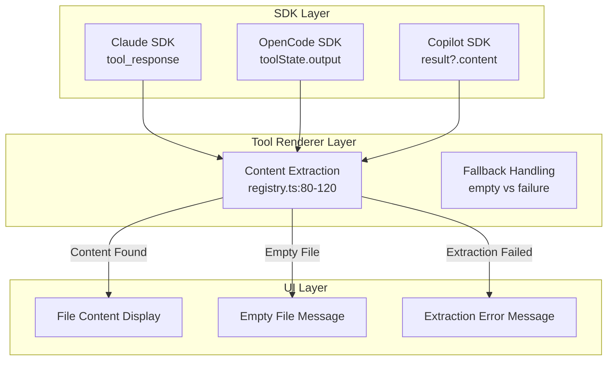

# OpenCode TUI Empty File Fix and UI Consistency Technical Design Document

| Document Metadata      | Details                                                                        |
| ---------------------- | ------------------------------------------------------------------------------ |
| Author(s)              | OpenCode Agent                                                                 |
| Status                 | Draft (WIP)                                                                    |
| Team / Owner           | Atomic CLI                                                                     |
| Created / Last Updated | 2026-02-12                                                                     |

## 1. Executive Summary

This RFC proposes fixing the OpenCode TUI's incorrect display of "(empty file)" when rendering file contents from the Read tool, and ensuring consistent UI rendering across all agent SDK variants (OpenCode, Claude, Copilot). The root cause is that the output extraction logic in `src/ui/tools/registry.ts:76-125` doesn't handle all possible format variations returned by different SDKs. The proposed solution extends the extraction logic with additional format checks and adds comprehensive test coverage for all SDK output formats.

**Research Reference:** `research/docs/2026-02-12-opencode-tui-empty-file-fix-ui-consistency.md`

## 2. Context and Motivation

### 2.1 Current State

**Architecture:** The ToolResultRegistry (`src/ui/tools/registry.ts`) provides tool-specific renderers that transform SDK tool outputs into displayable content. Each SDK emits `tool.complete` events with different output formats that flow through:

```
SDK Layer (different formats)
    │
    ├── Claude: hookInput.tool_response → toolResult
    ├── OpenCode: toolState.output → toolResult  
    └── Copilot: result?.content → toolResult
    │
    ▼
Tool Renderer (src/ui/tools/registry.ts:76-125)
    │
    │  readToolRenderer.render({ input, output }) {
    │    // Extract content from output
    │    return { content: content ? content.split("\n") : ["(empty file)"] };
    │  }
```

**Current Extraction Logic (lines 80-113):**

1. **String output:** Try JSON parse, then check for:
   - `parsed.file.content` (Claude nested format)
   - `parsed.content` (simple wrapped format)
   - Fall back to raw string

2. **Object output:** Check for:
   - `output.file.content` (Claude nested format)
   - `output.output` (OpenCode wrapped format)
   - `output.content` (generic format)
   - Fall back to `JSON.stringify(output, null, 2)`

**Limitations (from Research Section 3):**
- If output is an object with `output.text`, `output.value`, or `output.data` fields, these aren't checked
- OpenCode's direct string output may not be properly handled in all cases
- The JSON.parse fallback may not handle all variations

### 2.2 The Problem

The "(empty file)" text appears at `src/ui/tools/registry.ts:121`:

```typescript
return {
  title: filePath,
  content: content ? content.split("\n") : ["(empty file)"],  // <-- Issue here
  language,
  expandable: true,
};
```

| Problem | User Impact | Business Impact |
|---------|-------------|-----------------|
| "(empty file)" shown incorrectly | Users cannot see file contents | Trust issues with tool reliability |
| Missing SDK format handling | Inconsistent behavior across agents | Developer confusion, support burden |
| No distinction between empty vs extraction failure | Debugging difficulty | Time wasted investigating non-issues |

**Research Reference:** Section "Root Cause Analysis" and "SDK Output Format Differences" in `research/docs/2026-02-12-opencode-tui-empty-file-fix-ui-consistency.md`

## 3. Goals and Non-Goals

### 3.1 Functional Goals

- [ ] Fix OpenCode SDK content extraction to handle all output format variations
- [ ] Add extraction checks for `output.text`, `output.value`, and `output.data` fields
- [ ] Ensure Claude SDK format handling remains functional
- [ ] Ensure Copilot SDK format handling remains functional
- [ ] Add debug logging to capture actual SDK output formats (optional, can be removed post-fix)
- [ ] Differentiate between actually empty files and extraction failures

### 3.2 Non-Goals (Out of Scope)

- [ ] We will NOT change the SDK clients to normalize outputs at the source (separate future effort)
- [ ] We will NOT add new tool renderers (only fixing existing Read tool renderer)
- [ ] We will NOT change the `ToolCompleteEventData` interface
- [ ] We will NOT implement UI for tool permission prompts (not needed - auto-approve mode)

## 4. Proposed Solution (High-Level Design)

### 4.1 System Architecture Diagram



### 4.2 Architectural Pattern

We continue using the **Tool Renderer Pattern** with enhanced content extraction logic. The pattern centralizes output normalization in the renderer layer rather than in each SDK client.

### 4.3 Key Components

| Component | Responsibility | File | Justification |
| --------- | -------------- | ---- | ------------- |
| readToolRenderer.render() | Extract file content from various SDK formats | `src/ui/tools/registry.ts:76-125` | Single point of normalization |
| Output extraction logic | Handle string/object/wrapped formats | `src/ui/tools/registry.ts:80-113` | Format-agnostic extraction |
| Test cases | Verify all SDK format variations | `tests/ui/tools/registry.test.ts` | Regression prevention |

## 5. Detailed Design

### 5.1 Enhanced Output Extraction Logic

**File:** `src/ui/tools/registry.ts:76-125`

The `readToolRenderer.render()` method will be updated with additional extraction checks:

```typescript
render(props: ToolRenderProps): ToolRenderResult {
  const filePath = (props.input.file_path ?? props.input.path ?? props.input.filePath ?? "unknown") as string;
  let content: string | undefined;
  let isEmptyFile = false;
  
  if (typeof props.output === "string") {
    if (props.output === "") {
      isEmptyFile = true;
    } else {
      try {
        const parsed = JSON.parse(props.output);
        if (parsed.file && typeof parsed.file.content === "string") {
          content = parsed.file.content;
          isEmptyFile = content === "";
        } else if (typeof parsed.content === "string") {
          content = parsed.content;
          isEmptyFile = content === "";
        } else if (typeof parsed === "string") {
          content = parsed;
          isEmptyFile = content === "";
        } else if (typeof parsed.text === "string") {
          content = parsed.text;
          isEmptyFile = content === "";
        } else if (typeof parsed.value === "string") {
          content = parsed.value;
          isEmptyFile = content === "";
        } else if (typeof parsed.data === "string") {
          content = parsed.data;
          isEmptyFile = content === "";
        } else {
          content = props.output;
        }
      } catch {
        content = props.output;
      }
    }
  } else if (props.output && typeof props.output === "object") {
    const output = props.output as Record<string, unknown>;
    if (output.file && typeof output.file === "object") {
      const file = output.file as Record<string, unknown>;
      content = typeof file.content === "string" ? file.content : undefined;
      isEmptyFile = content === "";
    } else if (typeof output.output === "string") {
      content = output.output;
      isEmptyFile = content === "";
    } else if (typeof output.content === "string") {
      content = output.content;
      isEmptyFile = content === "";
    } else if (typeof output.text === "string") {
      // Additional field for OpenCode/Copilot variations
      content = output.text;
      isEmptyFile = content === "";
    } else if (typeof output.value === "string") {
      // Additional field for generic wrapped formats
      content = output.value;
      isEmptyFile = content === "";
    } else if (typeof output.data === "string") {
      // Additional field for data-wrapped formats
      content = output.data;
      isEmptyFile = content === "";
    } else if (typeof output.result === "string") {
      // Copilot result field
      content = output.result;
      isEmptyFile = content === "";
    }
  }

  // Detect language from file extension
  const ext = filePath.split(".").pop()?.toLowerCase() || "";
  const language = getLanguageFromExtension(ext);

  // Differentiate between empty file and extraction failure
  if (content !== undefined) {
    return {
      title: filePath,
      content: content === "" ? ["(empty file)"] : content.split("\n"),
      language,
      expandable: true,
    };
  }

  // Extraction failed - show debug info
  return {
    title: filePath,
    content: [
      "(could not extract file content)",
      "",
      "Debug: output type = " + typeof props.output,
      "Debug: output = " + (typeof props.output === "object" 
        ? JSON.stringify(props.output, null, 2) 
        : String(props.output)),
    ],
    language,
    expandable: true,
  };
}
```

### 5.2 Extraction Priority Order

The extraction will check fields in this order for object outputs:

1. `output.file?.content` - Claude nested format
2. `output.output` - OpenCode wrapped format (existing)
3. `output.content` - Generic format (existing)
4. `output.text` - Alternative generic (NEW)
5. `output.value` - Another alternative (NEW)
6. `output.data` - Data-wrapped format (NEW)
7. `output.result` - Copilot result field (NEW)
8. Fall back to extraction failure message

### 5.3 SDK Output Format Reference

| SDK | Location | Format Pattern | Extraction Path |
|-----|----------|----------------|-----------------|
| OpenCode | `toolState.output` | Direct string | `props.output` (string) |
| OpenCode | `toolState.output` | Wrapped object | `output.output` or `output.content` |
| Claude | `hookInput.tool_response` | JSON string | `parsed.file.content` or `parsed.content` |
| Claude | `hookInput.tool_response` | Object | `output.file?.content` or `output.content` |
| Copilot | `result?.content` | String or object | `output.content` or direct string |

**Research Reference:** Section "SDK Output Format Differences" and "Current Output Format Patterns" in `research/docs/2026-02-12-opencode-tui-empty-file-fix-ui-consistency.md`

## 6. Alternatives Considered

| Option | Pros | Cons | Reason for Rejection |
| ------ | ---- | ---- | -------------------- |
| **Option A: Normalize at SDK layer** | Single source of truth, cleaner renderer | Requires changes to 3 SDK clients, more invasive | **Deferred:** Higher risk, can be done as follow-up |
| **Option B: Use JSON.stringify for all unknown formats** | Simple implementation | Poor UX, shows raw JSON to users | **Rejected:** Defeats purpose of tool rendering |
| **Option C: Enhanced extraction in renderer (Selected)** | Minimal code changes, low risk, immediate fix | Renderer has more responsibility | **Selected:** Pragmatic fix that addresses immediate issue |

## 7. Cross-Cutting Concerns

### 7.1 Observability Strategy

- **Debug Logging:** Optional temporary logging can be added to capture actual SDK output formats:
  ```typescript
  console.log("[DEBUG] readToolRenderer output:", {
    type: typeof props.output,
    keys: typeof props.output === 'object' ? Object.keys(props.output) : null,
    preview: typeof props.output === 'string' ? props.output.slice(0, 100) : null
  });
  ```
- **Extraction Failure Visibility:** The debug output in the failure case helps identify new format variations

### 7.2 Backward Compatibility

- All existing test cases must pass
- Claude and Copilot rendering behavior must remain unchanged
- Only OpenCode behavior should improve (from broken to working)

## 8. Migration, Rollout, and Testing

### 8.1 Test Plan

**File:** `tests/ui/tools/registry.test.ts`

Add test cases for:

```typescript
describe("readToolRenderer - SDK format variations", () => {
  // Existing tests remain unchanged
  
  test("render handles OpenCode direct string output", () => {
    const props: ToolRenderProps = {
      input: { path: "/path/to/file.ts" },
      output: "const x = 1;",  // Direct string, no wrapping
    };
    const result = readToolRenderer.render(props);
    expect(result.content).toEqual(["const x = 1;"]);
  });

  test("render handles OpenCode { output: string } without metadata", () => {
    const props: ToolRenderProps = {
      input: { path: "/path/to/file.ts" },
      output: { output: "const x = 1;" },
    };
    const result = readToolRenderer.render(props);
    expect(result.content).toEqual(["const x = 1;"]);
  });

  test("render handles output.text field", () => {
    const props: ToolRenderProps = {
      input: { path: "/path/to/file.ts" },
      output: { text: "const x = 1;" },
    };
    const result = readToolRenderer.render(props);
    expect(result.content).toEqual(["const x = 1;"]);
  });

  test("render handles output.value field", () => {
    const props: ToolRenderProps = {
      input: { path: "/path/to/file.ts" },
      output: { value: "const x = 1;" },
    };
    const result = readToolRenderer.render(props);
    expect(result.content).toEqual(["const x = 1;"]);
  });

  test("render handles output.data field", () => {
    const props: ToolRenderProps = {
      input: { path: "/path/to/file.ts" },
      output: { data: "const x = 1;" },
    };
    const result = readToolRenderer.render(props);
    expect(result.content).toEqual(["const x = 1;"]);
  });

  test("render handles Copilot result field", () => {
    const props: ToolRenderProps = {
      input: { path: "/path/to/file.ts" },
      output: { result: "const x = 1;" },
    };
    const result = readToolRenderer.render(props);
    expect(result.content).toEqual(["const x = 1;"]);
  });

  test("render shows extraction failure for unknown format", () => {
    const props: ToolRenderProps = {
      input: { path: "/path/to/file.ts" },
      output: { unknown: { nested: "value" } },
    };
    const result = readToolRenderer.render(props);
    expect(result.content[0]).toBe("(could not extract file content)");
  });

  test("render differentiates empty file from extraction failure", () => {
    const emptyProps: ToolRenderProps = {
      input: { path: "/path/to/empty.txt" },
      output: { content: "" },
    };
    const emptyResult = readToolRenderer.render(emptyProps);
    expect(emptyResult.content).toEqual(["(empty file)"]);

    const failedProps: ToolRenderProps = {
      input: { path: "/path/to/file.ts" },
      output: { unknownField: "value" },
    };
    const failedResult = readToolRenderer.render(failedProps);
    expect(failedResult.content[0]).toBe("(could not extract file content)");
  });

  test("render handles undefined output", () => {
    const props: ToolRenderProps = {
      input: { path: "/path/to/file.ts" },
      output: undefined,
    };
    const result = readToolRenderer.render(props);
    expect(result.content[0]).toBe("(could not extract file content)");
  });

  test("render handles null output", () => {
    const props: ToolRenderProps = {
      input: { path: "/path/to/file.ts" },
      output: null,
    };
    const result = readToolRenderer.render(props);
    expect(result.content[0]).toBe("(could not extract file content)");
  });
});
```

### 8.2 Verification Commands

```bash
# Run all tests
bun test

# Run specific registry tests
bun test tests/ui/tools/registry.test.ts

# Type checking
bun typecheck

# Linting
bun lint
```

### 8.3 Manual Testing

1. Run `bun run src/cli.ts chat -a opencode` in a test project
2. Ask the agent to read a file with content
3. Verify file content displays correctly (not "(empty file)")
4. Repeat with `-a claude` and `-a copilot` to verify no regression

## 9. Open Questions / Unresolved Issues

- [ ] Should debug output in extraction failure case be kept permanently or removed after initial fix verification?
- [ ] Should we add optional debug logging flag to help with future format variations?
- [ ] Should extraction logic eventually move to SDK clients for cleaner separation?

**Research Reference:** Section "Open Questions" in `research/docs/2026-02-12-opencode-tui-empty-file-fix-ui-consistency.md`

## 10. References

- Research Document: `research/docs/2026-02-12-opencode-tui-empty-file-fix-ui-consistency.md`
- Related: `research/docs/2026-02-04-agent-subcommand-parity-audit.md` - SDK interface parity
- Related: `research/docs/2026-02-01-chat-tui-parity-implementation.md` - TUI parity progress
- Related: `research/docs/2026-02-01-claude-code-ui-patterns-for-atomic.md` - UI patterns reference
