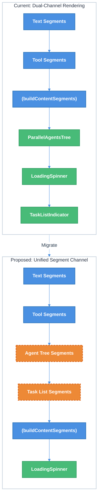

# TUI Layout: Streaming Content Ordering Fix — Technical Design Document

| Document Metadata      | Details     |
| ---------------------- | ----------- |
| Author(s)              | Alex Lavaee |
| Status                 | Draft (WIP) |
| Team / Owner           | Atomic CLI  |
| Created / Last Updated | 2026-02-12  |

## 1. Executive Summary

This RFC proposes fixing the TUI content ordering bug where new streamed text appears **above** completed task lists and sub-agent trees instead of **below** them. Currently, `ParallelAgentsTree` and `TaskListIndicator` are rendered at fixed positions at the bottom of `MessageBubble`, outside the chronologically-ordered content segment system. When text streams in after a sub-agent completes, it gets sliced into the segments area (above) while the agent tree stays pinned below — breaking visual chronology. The fix integrates these components into the existing `buildContentSegments()` interleaving system by assigning them `contentOffsetAtStart` values, ensuring all content renders in true chronological order.

## 2. Context and Motivation

### 2.1 Current State

The Atomic TUI uses a **content-offset-based segmentation system** to interleave streamed text and tool outputs. When a tool call starts, `handleToolStart` captures the current `message.content.length` as `contentOffsetAtStart`. The `buildContentSegments()` function (`src/ui/chat.tsx:1140-1198`) slices the accumulated content string at these offsets to produce an ordered array of `ContentSegment` objects (alternating text and tool blocks), rendered top-to-bottom in chronological order.

**However**, two key UI components are rendered **outside** this segment system:

| Component            | Rendering Position                              | Source                                           |
| -------------------- | ----------------------------------------------- | ------------------------------------------------ |
| `ParallelAgentsTree` | Fixed below all segments (`chat.tsx:1400-1416`) | `parallelAgents` prop / `message.parallelAgents` |
| `TaskListIndicator`  | Fixed below spinner (`chat.tsx:1427-1433`)      | `todoItems` / `message.taskItems`                |

This creates a **dual-channel rendering architecture**: interleaved segments (chronological) and fixed-position components (always at bottom). Text and inline tool calls correctly interleave, but "meta" components like agent trees and task lists are always pinned below all segments regardless of when they appeared.

> **Ref**: [research/docs/2026-02-12-tui-layout-streaming-content-ordering.md](../research/docs/2026-02-12-tui-layout-streaming-content-ordering.md) — Full root cause analysis

**Current MessageBubble rendering order** (`src/ui/chat.tsx:1314-1442`):

| Order | Component                | Position       |
| ----- | ------------------------ | -------------- |
| 1     | Skill load indicators    | Top            |
| 2     | MCP server list          | Top            |
| 3     | Context info display     | Top            |
| 4     | **Interleaved segments** | Middle         |
| 5     | **ParallelAgentsTree**   | Below segments |
| 6     | **Loading spinner**      | Below agents   |
| 7     | **TaskListIndicator**    | Below spinner  |
| 8     | Completion summary       | Bottom         |

### 2.2 The Problem

**User Impact**: When an agent completes a sub-agent task and then streams follow-up text, the new text appears **above** the agent tree and task list, breaking the expected top-to-bottom chronological reading order. Users see:

```
● Let me analyze this...            ← Text before tool (correct)
  ⎿ Read src/main.ts               ← Tool segment (correct)
  Based on the results...           ← Text AFTER agent (WRONG — should be below tree)
  ◉ explore(Find files)             ← Parallel agents tree (stuck at bottom)
  ⣷ Thinking...                     ← Spinner (stuck at bottom)
  ☑ 3 tasks (1 done, 2 open)       ← Task list (stuck at bottom)
```

**Expected behavior**:

```
● Let me analyze this...            ← Text before tool
  ⎿ Read src/main.ts               ← Tool segment
  ◉ explore(Find files)             ← Parallel agents tree (chronological)
  ☑ 3 tasks (1 done, 2 open)       ← Task list (chronological)
  Based on the results...           ← Text AFTER agent (correct position)
  ⣷ Thinking...                     ← Spinner (always last)
```

**Technical Debt**: The fixed-position rendering was a simpler initial implementation, but it creates an architectural inconsistency: tool calls (bash, read, edit, grep, etc.) correctly interleave with text via `buildContentSegments()`, while structurally similar meta-components (agent trees, task lists) bypass the system entirely.

> **Ref**: [research/docs/2026-01-19-cli-ordering-fix.md](../research/docs/2026-01-19-cli-ordering-fix.md) — Same architectural pattern (fixed position vs. chronological ordering) was previously fixed for CLI banner ordering

## 3. Goals and Non-Goals

### 3.1 Functional Goals

- [ ] `ParallelAgentsTree` renders at its chronological position within the content segment stream, not at a fixed bottom position
- [ ] `TaskListIndicator` renders at its chronological position within the content segment stream, not at a fixed bottom position
- [ ] Text streamed after a sub-agent or task list update appears **below** the agent tree / task list, not above
- [ ] The loading spinner remains at the absolute bottom (always last, not part of segments)
- [ ] Existing inline tool call rendering (bash, read, edit, grep, etc.) continues to work unchanged
- [ ] Both live (streaming) and baked (completed message) rendering produce correct ordering
- [ ] No regression in the content offset capture mechanism for standard tool calls

### 3.2 Non-Goals (Out of Scope)

- [ ] We will NOT redesign the `buildContentSegments()` algorithm fundamentally — only extend it to handle new segment types
- [ ] We will NOT change the `ParallelAgentsTree` or `TaskListIndicator` component internals — only their positioning within `MessageBubble`
- [ ] We will NOT address collapsibility behavior changes when completed components shrink — this is a separate visual polish concern
- [ ] We will NOT change how SDK events are emitted — the fix is entirely in the UI rendering layer
- [ ] We will NOT change the rendering of skill loads, MCP servers, or context info (items 1-3 in the rendering order)

## 4. Proposed Solution (High-Level Design)

### 4.1 System Architecture Diagram



### 4.2 Architectural Pattern

We are adopting a **unified content segment model** — extending the existing `ContentSegment` discriminated union to include `"agents"` and `"tasks"` segment types alongside existing `"text"` and `"tool"` types. This follows the same pattern established by `buildContentSegments()` for inline tool calls: capture an offset when the component first appears, and let the segmentation function place it in chronological order.

### 4.3 Key Components

| Component              | Change Required                                                                         | Justification                                         |
| ---------------------- | --------------------------------------------------------------------------------------- | ----------------------------------------------------- |
| `ContentSegment`       | Add `"agents"` and `"tasks"` type variants                                              | Extends segment model to include meta-components      |
| `buildContentSegments` | Accept agents/tasks data and inject them as segments at correct offsets                 | Single function produces the complete rendering order |
| `MessageBubble`        | Remove fixed-position rendering of agents tree and task list; render from segments only | Eliminates dual-channel architecture                  |
| `handleToolStart`      | Capture content offset for sub-agent spawning tools (task tool)                         | Provides positioning data for agent tree segments     |
| `ChatMessage`          | Add offset fields for agents and tasks placement                                        | Stores chronological position alongside the data      |

## 5. Detailed Design

### 5.1 Extended ContentSegment Interface

**File**: `src/ui/chat.tsx` (around line 1129-1134)

Extend the existing `ContentSegment` interface to support agent tree and task list segment types:

```typescript
interface ContentSegment {
  type: "text" | "tool" | "agents" | "tasks";
  content?: string;                    // Present when type is "text"
  toolCall?: MessageToolCall;          // Present when type is "tool"
  agents?: ParallelAgent[];            // Present when type is "agents"
  taskItems?: TaskItem[];              // Present when type is "tasks"
  tasksExpanded?: boolean;             // Present when type is "tasks"
  key: string;
}
```

### 5.2 Offset Tracking for Agents and Tasks

**File**: `src/ui/chat.tsx` — `ChatMessage` interface (around line 402-470)

Add content offset fields to track when agents and tasks first appeared:

```typescript
interface ChatMessage {
  content: string;
  toolCalls?: MessageToolCall[];
  parallelAgents?: ParallelAgent[];
  taskItems?: TaskItem[];
  streaming?: boolean;
  // NEW: Offset positions for chronological placement
  agentsContentOffset?: number;   // Content length when first agent appeared
  tasksContentOffset?: number;    // Content length when first task list appeared
  // ...
}
```

**File**: `src/ui/chat.tsx` — `handleToolStart` (around line 1775-1787)

When a tool that spawns sub-agents (e.g., `Task`, `task`) starts, capture the content offset for agents. Similarly, when `TodoWrite` is called, capture the offset for tasks:

```typescript
// When a sub-agent-spawning tool starts:
if (isSubAgentTool(toolName)) {
  // Capture offset only on first agent appearance (don't overwrite)
  if (msg.agentsContentOffset === undefined) {
    msg.agentsContentOffset = msg.content.length;
  }
}

// When TodoWrite is called:
if (toolName === "TodoWrite") {
  if (msg.tasksContentOffset === undefined) {
    msg.tasksContentOffset = msg.content.length;
  }
}
```

### 5.3 Updated `buildContentSegments()` Function

**File**: `src/ui/chat.tsx` (around line 1140-1198)

Extend the function signature to accept agents and tasks data with their offsets, and inject them as segments at the correct chronological positions:

```typescript
function buildContentSegments(
  content: string,
  toolCalls: MessageToolCall[],
  // NEW parameters:
  agents?: ParallelAgent[] | null,
  agentsOffset?: number,
  taskItems?: TaskItem[] | null,
  tasksOffset?: number,
  tasksExpanded?: boolean,
): ContentSegment[] {
  // Filter out HITL tools (unchanged)
  const visibleToolCalls = toolCalls.filter(tc =>
    tc.toolName !== "AskUserQuestion" && tc.toolName !== "question" && tc.toolName !== "ask_user"
  );

  // Build a unified list of "insertion points" (tools + agents + tasks)
  // Each has an offset and produces a segment
  interface InsertionPoint {
    offset: number;
    segment: ContentSegment;
  }

  const insertions: InsertionPoint[] = [];

  // Add tool call insertions
  for (const tc of visibleToolCalls) {
    insertions.push({
      offset: tc.contentOffsetAtStart ?? 0,
      segment: { type: "tool", toolCall: tc, key: `tool-${tc.id}` },
    });
  }

  // Add agents tree insertion (if agents exist)
  if (agents && agents.length > 0 && agentsOffset !== undefined) {
    insertions.push({
      offset: agentsOffset,
      segment: { type: "agents", agents, key: "agents-tree" },
    });
  }

  // Add task list insertion (if tasks exist)
  if (taskItems && taskItems.length > 0 && tasksOffset !== undefined) {
    insertions.push({
      offset: tasksOffset,
      segment: { type: "tasks", taskItems, tasksExpanded, key: "task-list" },
    });
  }

  // Sort all insertions by offset ascending
  insertions.sort((a, b) => a.offset - b.offset);

  // Build segments by slicing content at insertion offsets
  const segments: ContentSegment[] = [];
  let lastOffset = 0;

  for (const ins of insertions) {
    if (ins.offset > lastOffset) {
      const textContent = content.slice(lastOffset, ins.offset).trimEnd();
      if (textContent) {
        segments.push({ type: "text", content: textContent, key: `text-${lastOffset}` });
      }
    }
    segments.push(ins.segment);
    // Only advance lastOffset for tool calls (agents/tasks don't consume text)
    if (ins.segment.type === "tool") {
      lastOffset = ins.offset;
    } else {
      // For agents/tasks, advance past their offset to avoid re-slicing
      lastOffset = Math.max(lastOffset, ins.offset);
    }
  }

  // Remaining text after last insertion
  if (lastOffset < content.length) {
    const remaining = content.slice(lastOffset).trimStart();
    if (remaining) {
      segments.push({ type: "text", content: remaining, key: `text-${lastOffset}` });
    }
  }

  return segments;
}
```

### 5.4 Updated MessageBubble Rendering

**File**: `src/ui/chat.tsx` — `MessageBubble` component (around line 1314-1442)

Remove the fixed-position rendering of `ParallelAgentsTree` and `TaskListIndicator`. Instead, render them from the segments array:

**Call site change** (around line 1314):

```typescript
// BEFORE:
const segments = buildContentSegments(message.content, message.toolCalls || []);

// AFTER:
const agentsToShow = parallelAgents?.length ? parallelAgents
  : message.parallelAgents?.length ? message.parallelAgents
  : null;
const taskItemsToShow = message.streaming ? todoItems : message.taskItems;

const segments = buildContentSegments(
  message.content,
  message.toolCalls || [],
  agentsToShow,
  message.agentsContentOffset,
  taskItemsToShow,
  message.tasksContentOffset,
  tasksExpanded,
);
```

**Segment rendering loop** (around line 1351-1398) — add cases for new segment types:

```typescript
{segments.map((segment, index) => {
  if (segment.type === "text" && segment.content?.trim()) {
    // ... existing text rendering (unchanged)
  } else if (segment.type === "tool" && segment.toolCall) {
    // ... existing tool rendering (unchanged)
  } else if (segment.type === "agents" && segment.agents) {
    // NEW: Render ParallelAgentsTree inline
    return (
      <ParallelAgentsTree
        key={segment.key}
        agents={segment.agents}
        compact={true}
        maxVisible={5}
        noTopMargin={index === 0}
      />
    );
  } else if (segment.type === "tasks" && segment.taskItems) {
    // NEW: Render TaskListIndicator inline
    return (
      <TaskListIndicator
        key={segment.key}
        items={segment.taskItems}
        expanded={segment.tasksExpanded}
      />
    );
  }
  return null;
})}
```

**Remove** the fixed-position blocks at lines 1400-1416 (ParallelAgentsTree) and 1427-1433 (TaskListIndicator). The loading spinner (lines 1418-1425) remains at the bottom, unchanged.

### 5.5 Offset Capture During Streaming

**File**: `src/ui/chat.tsx` — `handleToolStart` (around line 1775-1787)

Extend the existing offset capture logic to set `agentsContentOffset` when sub-agent-spawning tools start:

```typescript
const handleToolStart = useCallback((toolId, toolName, input) => {
  // ... existing streaming state update ...

  const messageId = streamingMessageIdRef.current;
  if (messageId) {
    setMessages((prev) =>
      prev.map((msg) => {
        if (msg.id === messageId) {
          // ... existing tool call creation logic (unchanged) ...

          // NEW: Capture agents offset on sub-agent-spawning tool
          const updatedMsg = { ...msg, toolCalls: [...(msg.toolCalls || []), newToolCall] };
          if (isSubAgentTool(toolName) && msg.agentsContentOffset === undefined) {
            updatedMsg.agentsContentOffset = msg.content.length;
          }
          return updatedMsg;
        }
        return msg;
      })
    );
  }

  // TodoWrite offset capture
  if (toolName === "TodoWrite" && input.todos && Array.isArray(input.todos)) {
    // ... existing todo handling ...
    // NEW: Capture tasks offset
    setMessages((prev) =>
      prev.map((msg) =>
        msg.id === messageId && msg.tasksContentOffset === undefined
          ? { ...msg, tasksContentOffset: msg.content.length }
          : msg
      )
    );
  }
}, [streamingState]);
```

A helper function identifies sub-agent-spawning tools:

```typescript
function isSubAgentTool(toolName: string): boolean {
  const subAgentTools = ["Task", "task", "dispatch_agent", "spawn_agent"];
  return subAgentTools.includes(toolName);
}
```

### 5.6 Fallback Behavior

When `agentsContentOffset` or `tasksContentOffset` is `undefined` (e.g., for messages that predate this change, or edge cases where the offset wasn't captured), the components fall back to appearing at the end of all segments — equivalent to the current behavior. This is handled by `buildContentSegments()` not injecting a segment when the offset is undefined, and `MessageBubble` rendering them at the bottom as a fallback:

```typescript
// Fallback: If agents/tasks weren't placed in segments, render at bottom (legacy behavior)
const agentsInSegments = segments.some(s => s.type === "agents");
const tasksInSegments = segments.some(s => s.type === "tasks");

{!agentsInSegments && agentsToShow && (
  <ParallelAgentsTree agents={agentsToShow} compact={true} maxVisible={5} />
)}
{!tasksInSegments && taskItemsToShow?.length > 0 && (
  <TaskListIndicator items={taskItemsToShow} expanded={tasksExpanded} />
)}
```

### 5.7 State Machine: Segment Lifecycle

```
Message starts streaming (empty content)
    ↓
Text chunks append to content       → text segments grow
    ↓
Tool starts (handleToolStart)       → contentOffsetAtStart captured for tool
    ↓
Sub-agent tool starts               → agentsContentOffset captured (first time only)
    ↓
TodoWrite called                    → tasksContentOffset captured (first time only)
    ↓
More text streams in                → text segments extend past all offsets
    ↓
buildContentSegments() re-runs      → produces: [text₁, tool, agents, tasks, text₂]
    ↓
Message completes                   → data baked into message; offsets persist
```

## 6. Alternatives Considered

| Option                                                                                                                                              | Pros                                                                                                                                       | Cons                                                                                                                                                   | Reason for Rejection                                                                         |
| --------------------------------------------------------------------------------------------------------------------------------------------------- | ------------------------------------------------------------------------------------------------------------------------------------------ | ------------------------------------------------------------------------------------------------------------------------------------------------------ | -------------------------------------------------------------------------------------------- |
| **A: Keep fixed positions, reorder segments** — Move text segments that occur after agent/task offsets to render below the fixed components         | Simple change; no segment type extension                                                                                                   | Breaks the segment abstraction; requires special-case slicing logic; fragile if multiple agents/tasks exist                                            | Adds complexity without solving the root architectural issue                                 |
| **B: Render agents/tasks as virtual tool calls** — Create synthetic `MessageToolCall` entries for agents/tasks and render them through `ToolResult` | Reuses existing pipeline entirely; no new segment types                                                                                    | Agent trees and task lists have different visual styling than tool results; would require custom renderers within `ToolResult` that don't belong there | Conflates conceptually different UI components; over-engineering the tool system             |
| **C: Unified segment model (Selected)** — Extend `ContentSegment` with new types and inject agents/tasks at their chronological offset              | Clean extension of existing pattern; maintains type safety; each component renders with its own styling; chronological ordering guaranteed | Slightly larger change to `buildContentSegments()`; new fields on `ChatMessage`                                                                        | **Selected**: Cleanest separation of concerns; follows established pattern; minimal coupling |
| **D: Timestamp-based ordering** — Use wall-clock timestamps instead of content offsets to order all components                                      | Works for any component regardless of content stream                                                                                       | Timestamps can drift; content offsets are more precise for interleaving with text; would require refactoring the entire segment system                 | Over-scoped; content offsets already work well for tool calls                                |

## 7. Cross-Cutting Concerns

### 7.1 Backward Compatibility

- **Existing messages**: Messages stored without `agentsContentOffset` / `tasksContentOffset` fields will use the fallback rendering path (Section 5.6), producing identical behavior to the current implementation.
- **Session history**: Completed messages with baked `parallelAgents` and `taskItems` but no offset fields will render with the fallback path — no data migration needed.

### 7.2 Performance

- `buildContentSegments()` currently runs on every render during streaming (each chunk triggers re-render). Adding 0-2 extra insertion points to the sort has negligible impact (O(n log n) where n is typically < 20).
- The `segments.some(s => s.type === "agents")` fallback check is O(n) but only runs once per render.

### 7.3 OpenTUI Layout

The change does not affect OpenTUI's Yoga flexbox layout. Components are still rendered as children of a `<box flexDirection="column">` container. The only change is their **order** within the children list — Yoga handles reflow automatically.

> **Ref**: [research/docs/2026-01-31-opentui-library-research.md](../research/docs/2026-01-31-opentui-library-research.md) — OpenTUI uses Yoga flexbox; child order determines visual order

### 7.4 SDK Compatibility

This change is entirely in the UI rendering layer (`src/ui/chat.tsx`). No SDK event format changes are needed. All three SDKs (Claude, OpenCode, Copilot) emit the same unified events (`tool.start`, `tool.complete`, `message.delta`) that are already consumed by the existing handlers.

> **Ref**: [research/docs/2026-02-12-sdk-ui-standardization-comprehensive.md](../research/docs/2026-02-12-sdk-ui-standardization-comprehensive.md) — UI components are already SDK-agnostic

## 8. Migration, Rollout, and Testing

### 8.1 Deployment Strategy

This is a non-breaking UI change. No feature flags needed.

- [ ] Phase 1: Implement `ContentSegment` type extensions and updated `buildContentSegments()`
- [ ] Phase 2: Add offset capture in `handleToolStart` for sub-agent tools and `TodoWrite`
- [ ] Phase 3: Update `MessageBubble` rendering to use segments for agents/tasks with fallback
- [ ] Phase 4: Remove fixed-position rendering blocks (only after fallback is verified)

### 8.2 Test Plan

- **E2E Tests** (visual verification):
  - Run `bun run src/cli.ts chat -a <agent>` and trigger a multi-step task and sub-agents where <agent> is `claude`, `opencode`, AND `copilot` using the `tmux-cli` and proposed test in `@src/CLAUDE.md` file
  - Test all three SDKs to verify consistent behavior
  - Verify agent tree appears inline with text flow
  - Verify task list appears inline with text flow
  - Verify follow-up text appears below both components
  - Verify overall chronological order is correct
  - Save screenshots for verification with `tmux capture` command

## 9. Open Questions / Unresolved Issues

- [ ] **Sub-agent tool name list**: What is the complete set of tool names that spawn sub-agents? The research identifies `Task`/`task` but there may be SDK-specific variants (e.g., `dispatch_agent`, `spawn_agent`). Need to audit `src/ui/tools/registry.ts` and SDK clients.

Yes, make sure you understand what tools create the task list and dispatch agents.

- [ ] **Multiple sequential sub-agent spawns**: If multiple sub-agent tools are called in the same message, should each get its own `ParallelAgentsTree` segment (one per spawn), or should all agents merge into a single tree? Currently a single tree is used — the offset capture (`first time only`) preserves this. Is this desired?

If multiple sub-agents are called in the same message the tree view should be aggregated. In general, the rule for merging is to check if there is an active sub-agent tree segment already rendered. If so, new agents merge into that existing segment. If not, a new segment is created. This allows for both single and multiple spawn scenarios to be handled gracefully.

- [ ] **Task list updates mid-stream**: `TodoWrite` can be called multiple times in a single message (updating task statuses). Should each call create a new task list segment, or should the single segment update in place? The current proposal captures only the first offset and updates the data in place — matching current behavior.

Update the data in-place so the task list segment remains stable in the UI. This also simplifies the implementation and avoids potential jank from multiple segments appearing/disappearing. Also, make sure sure that the ctrl + shift + t shortcut for toggling task list expansion still works correctly with the new segment-based rendering. Currently the list isn't being expanded and ... placeholder is showing instead of the actual extended task list. Also, make sure that the task test covers one row before being truncated with ... to the terminal # of columns.

- [ ] **Collapsing behavior on completion**: When a `ParallelAgentsTree` or `TaskListIndicator` transitions from active to completed and visually shrinks, does content below shift up unexpectedly? This is a pre-existing UX concern not introduced by this change, but worth noting.

Ensure that collapsing behavior is consistent and doesn't cause jarring layout shifts. Verify this with `tmux-cli` command.

> **Ref**: [research/docs/2026-02-12-tui-layout-streaming-content-ordering.md — Open Questions](../research/docs/2026-02-12-tui-layout-streaming-content-ordering.md) — Original open questions from research
