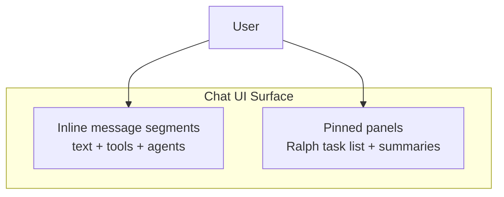
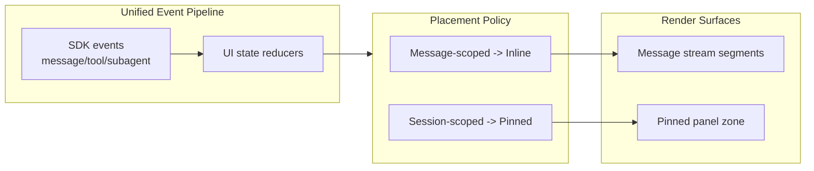

# Atomic CLI Technical Design Document / RFC

| Document Metadata      | Details          |
| ---------------------- | ---------------- |
| Author(s)              | Developer        |
| Status                 | In Review (RFC)  |
| Team / Owner           | Atomic CLI (TUI) |
| Created / Last Updated | 2026-02-15       |

## 1. Executive Summary

This RFC defines an explicit UI placement model for chat streaming so inline vs pinned behavior is deterministic and maintainable. Today, the UI mixes chronological segment rendering and independently pinned panels, which makes task/sub-agent placement hard to reason about and leaves partially-unused inline task plumbing in the code path ([research/docs/2026-02-15-ui-inline-streaming-vs-pinned-elements.md](../research/docs/2026-02-15-ui-inline-streaming-vs-pinned-elements.md)).  
The proposal formalizes two surfaces: **message-scoped inline stream artifacts** (text/tools/sub-agent tree) and **session-scoped pinned artifacts** (Ralph task panel, compaction summaries), removes contradictory task-segment behavior, and adds explicit background-agent lifecycle mapping so status rendering matches runtime events across SDKs ([research/docs/2026-02-15-sub-agent-tree-status-lifecycle-sdk-parity.md](../research/docs/2026-02-15-sub-agent-tree-status-lifecycle-sdk-parity.md)).  
Impact: clearer UX rules, fewer ordering regressions, cleaner renderer logic, and easier future feature work on streaming/persistent UI.

## 2. Context and Motivation

### 2.1 Current State

- Chat content uses offset-based inline segment insertion (`text/tool/hitl/agents/tasks`), sorted by insertion offsets and rendered in message order.
- Sub-agent trees are currently rendered inline as `agents` segments.
- Ralph tasks are currently shown in a persistent pinned panel (`TaskListPanel`) outside message stream flow.
- Task segments still exist in segment-building logic but are intentionally suppressed in message rendering (`return null`), creating confusing dual behavior and dead-end paths.



Research basis:
- Inline-vs-pinned split, task suppression, and offset behavior: [2026-02-15-ui-inline-streaming-vs-pinned-elements](../research/docs/2026-02-15-ui-inline-streaming-vs-pinned-elements.md)
- Prior ordering analysis: [2026-02-12-tui-layout-streaming-content-ordering](../research/docs/2026-02-12-tui-layout-streaming-content-ordering.md)
- Ralph pinned task-list evolution: [2026-02-13-ralph-task-list-ui](../research/docs/2026-02-13-ralph-task-list-ui.md)

### 2.2 The Problem

- **User impact:** placement behavior can appear inconsistent when some artifacts stream inline and others remain pinned.
- **Engineering impact:** task UI has both inline insertion scaffolding and pinned rendering in parallel, increasing maintenance cost and accidental regressions.
- **Lifecycle impact:** `background` status exists in type/render layers but lacks clear runtime assignment path in current event handling.

## 3. Goals and Non-Goals

### 3.1 Functional Goals

- [ ] Define and implement an explicit placement contract for each artifact class (inline vs pinned).
- [ ] Keep sub-agent tree updates chronological within message stream when message-scoped.
- [ ] Keep Ralph workflow task list deterministic as a pinned session panel.
- [ ] Eliminate contradictory task-segment code paths in message rendering.
- [ ] Add explicit runtime mapping for background sub-agent status lifecycle.
- [ ] Preserve sticky-scroll, interruption, and deferred-completion behavior.

### 3.2 Non-Goals (Out of Scope)

- [ ] Rewriting OpenTUI layout primitives or replacing ScrollBox behavior.
- [ ] Redesigning visual style of `ParallelAgentsTree` or `TaskListPanel`.
- [ ] Changing SDK wire protocols for event emission.
- [ ] Introducing new workflow/task orchestration semantics outside UI placement and status lifecycle.

## 4. Proposed Solution (High-Level Design)

### 4.1 System Architecture Diagram



### 4.2 Architectural Pattern

- **Pattern:** Policy-based dual-surface rendering.
- Message-scoped artifacts remain in chronological segment flow.
- Session-scoped artifacts render in fixed panel slots.
- Placement rules become explicit and centralized rather than inferred from ad-hoc renderer branches.

### 4.3 Key Components

| Component | Responsibility | Technology Stack | Justification |
| --- | --- | --- | --- |
| `src/ui/chat.tsx` placement policy helpers | Route each artifact to inline or pinned surface | React + OpenTUI TSX | Central source of rendering truth |
| `buildContentSegments()` | Render only inline-eligible segments | TypeScript | Keeps chronological stream deterministic |
| `TaskListPanel` integration | Render workflow task list in pinned zone | OpenTUI component tree | Matches Ralph session-level semantics |
| `src/ui/index.ts` sub-agent lifecycle mapping | Assign explicit `background` vs running/completed/error/interrupted transitions | Event reducer logic | Aligns status model with runtime |
| `ParallelAgentsTree` | Display lifecycle status counts and ordering | Existing component | Reuse proven rendering; improve status correctness |

## 5. Detailed Design

### 5.1 API Interfaces (Internal Contracts)

Proposed internal placement contract:

```ts
type RenderSurface = "inline" | "pinned";

type ArtifactKind =
  | "text"
  | "tool"
  | "hitl"
  | "agents"
  | "workflow_tasks"
  | "summary";

interface PlacementDecision {
  artifact: ArtifactKind;
  surface: RenderSurface;
  reason: string;
}
```

Rules (initial):
- `text/tool/hitl/agents` -> `inline`
- `workflow_tasks/summary` -> `pinned`

### 5.2 Data Model / Schema

No persistent storage migration is required; this is UI state/dataflow cleanup.

State-model updates:
- Replace ambiguous `tasks` segment usage with explicit artifact kind (`workflow_tasks`) where needed.
- Keep existing offset metadata for inline artifacts.
- Add/complete runtime status mapping for `background` in sub-agent state transitions.

### 5.3 Algorithms and State Management

1. **Placement resolution**
   - Resolve artifact class -> surface using a single policy function.
   - Inline artifacts enter `buildContentSegments()` and are offset-sorted.
   - Pinned artifacts bypass segment list and render in fixed panel layout.

2. **Task rendering cleanup**
   - Remove suppressed `tasks` inline branch (`return null`) and associated contradictory insertion path.
   - Ensure workflow tasks render exclusively through pinned panel path.

3. **Background lifecycle handling**
   - On task/sub-agent events with background mode, assign `background` status explicitly.
   - Maintain existing completion deferral while active agents/tools remain.
   - Transition `background` -> terminal states on completion/error/interruption.

4. **Ordering invariants**
   - Inline content order continues to use offset sort and text slicing.
   - Pinned panel order remains deterministic by layout container position.

## 6. Alternatives Considered

| Option | Pros | Cons | Reason for Rejection |
| --- | --- | --- | --- |
| Make everything inline | Maximum chronology consistency | Breaks intentional persistent-panel UX for workflow tasks | Rejected: conflicts with Ralph panel intent from prior design |
| Make everything pinned | Simpler rendering model | Loses chronological context for tools/agents inside messages | Rejected: harms readability and existing inline expectations |
| Keep current mixed behavior without formal policy | No immediate refactor | Continues ambiguity and dead code paths | Rejected: does not solve maintenance and lifecycle clarity |
| **Selected: Explicit dual-surface policy** | Preserves UX intent and clarifies code ownership | Requires targeted refactor and tests | Selected for best balance of clarity and stability |

## 7. Cross-Cutting Concerns

### 7.1 Security and Privacy

- No new network boundaries, auth surface, or secret-handling path.
- No new PII collection or persistence introduced.

### 7.2 Observability Strategy

- Add debug-level logs (existing logging pattern) for placement decisions during streaming in development mode.
- Add structured status-transition checks for `background` lifecycle in test coverage.
- Validate finalization paths still convert active statuses correctly after interruption/completion flows.

### 7.3 Scalability and Capacity Planning

- Change is UI-local and bounded by per-message segment count.
- Removing contradictory branches slightly reduces render complexity.
- No additional storage or external service load.

## 8. Migration, Rollout, and Testing

### 8.1 Deployment Strategy

- [ ] Phase 1: Introduce placement policy helper and artifact classification.
- [ ] Phase 2: Remove contradictory inline task segment pathway and keep workflow task panel pinned.
- [ ] Phase 3: Wire explicit background status assignment in sub-agent lifecycle transitions.
- [ ] Phase 4: Validate through SDK-parity regression checks and rollout.

### 8.2 Data Migration Plan

- No data migration required.
- Backward compatibility preserved because message-history format is not fundamentally changed; rendering-path cleanup remains within UI logic.

### 8.3 Test Plan

- **Unit Tests:**
  - Placement policy mapping (`artifact -> surface`) including negative cases.
  - Sub-agent status transitions including `background` -> terminal paths.
- **Integration Tests:**
  - Streaming chat with inline agents and pinned workflow tasks coexisting.
  - Deferred completion behavior when tools/agents still running.
- **End-to-End Tests:**
  - Cross-SDK parity scenarios (Claude/OpenCode/Copilot mappings feed same UI rules).
  - Visual/ordering verification for inline stream and pinned panel zones.

## 9. Open Questions / Unresolved Issues

- [x] **Should non-Ralph `TodoWrite` task updates stay pinned or render inline?**  
  Answer: Non-Ralph `TodoWrite` task updates should render inline.

- [x] **For `background` agents, should the header/count UX present them as a separate state or grouped with running?**  
  Answer: Group `background` with running in header/count UX.

- [x] **Do we keep dormant compatibility hooks for legacy inline `tasks` segments behind a feature flag, or remove them entirely now?**  
  Answer: Remove dormant compatibility hooks entirely now.

## 10. Research References

1. [research/docs/2026-02-15-ui-inline-streaming-vs-pinned-elements.md](../research/docs/2026-02-15-ui-inline-streaming-vs-pinned-elements.md)
2. [research/docs/2026-02-13-ralph-task-list-ui.md](../research/docs/2026-02-13-ralph-task-list-ui.md)
3. [research/docs/2026-02-12-tui-layout-streaming-content-ordering.md](../research/docs/2026-02-12-tui-layout-streaming-content-ordering.md)
4. [research/docs/2026-02-15-sub-agent-tree-status-lifecycle-sdk-parity.md](../research/docs/2026-02-15-sub-agent-tree-status-lifecycle-sdk-parity.md)
