# Unified Workflow Execution Interface — Technical Design Document / RFC

| Document Metadata      | Details     |
| ---------------------- | ----------- |
| Author(s)              | lavaman131  |
| Status                 | Draft (WIP) |
| Team / Owner           | Atomic CLI  |
| Created / Last Updated | 2026-02-26  |

## 1. Executive Summary

The Atomic CLI's workflow execution layer currently uses a hardcoded dispatch pattern: `createWorkflowCommand()` checks `metadata.name === "ralph"` and routes to a specialized 200-line handler that builds and streams a graph. All non-Ralph workflows receive a generic handler that only sets UI state flags and sends the user's prompt through normal chat — no graph is built or executed. Meanwhile, the `WorkflowSDK` class (a generic facade designed for exactly this purpose) is never used at runtime.

This RFC proposes a **Unified Workflow Execution Interface** that:

1. Extends `WorkflowMetadata` and the custom workflow file export format to support graph factories, state factories, and UI progress declarations
2. Replaces the `if (name === "ralph")` dispatch with a generic execution path that works for any graph-backed workflow
3. Reconciles the TUI's sub-agent bridge (`context.spawnSubagentParallel`) with the SDK's `SubagentGraphBridge` into a single composable bridge interface
4. Generalizes Ralph-specific UI coupling (session tracking, task lists, cancellation) into workflow-agnostic abstractions

The result enables any custom workflow file in `.atomic/workflows/` to define a graph that executes with full streaming, progress updates, task tracking, and session management — identical to what Ralph has today, but without per-workflow command scaffolding.

> **Research basis:** [research/docs/2026-02-25-unified-workflow-execution-research.md](../research/docs/2026-02-25-unified-workflow-execution-research.md) — comprehensive architecture audit of current state.

---

## 2. Context and Motivation

### 2.1 Current State

The codebase contains a mature, generic graph execution engine with:

- A fluent `GraphBuilder<TState>` API ([research §5.1](../research/docs/2026-02-25-unified-workflow-execution-research.md))
- 12 node factory functions (agent, tool, subagent, parallel, decision, wait, etc.) ([research §5.2](../research/docs/2026-02-25-unified-workflow-execution-research.md))
- `GraphExecutor` with queue-based traversal, retry, checkpointing, and streaming ([research §5.3](../research/docs/2026-02-25-unified-workflow-execution-research.md))
- A typed annotation system for state management ([research §5.4](../research/docs/2026-02-25-unified-workflow-execution-research.md))
- Reusable workflow templates (`sequential`, `mapReduce`, `reviewCycle`, `taskLoop`) ([research §5.5](../research/docs/2026-02-25-unified-workflow-execution-research.md))
- A `WorkflowSDK` facade class with `execute()`, `stream()`, and `registerWorkflow()` methods ([research §4](../research/docs/2026-02-25-unified-workflow-execution-research.md))
- Generic session management via `WorkflowSession` ([research §6.3](../research/docs/2026-02-25-unified-workflow-execution-research.md))
- A command registry supporting dynamic workflow command registration ([research §1.1](../research/docs/2026-02-25-unified-workflow-execution-research.md))

**Architecture Diagram (Current State):**

```
┌───────────────────────────────────────────────────────────────┐
│                        UI LAYER                               │
│                                                               │
│  chat.tsx ─── executeCommand() ─── globalRegistry.get()       │
│     │                                      │                  │
│     │ Ralph state:                  CommandDefinition          │
│     │  - ralphSessionId            execute(args, context)     │
│     │  - ralphSessionDir                   │                  │
│     │  - ralphTaskIds                      ▼                  │
│     │                        ┌─────────────────────┐          │
│     │                        │createWorkflowCommand│          │
│     │                        │  (dispatch check)   │          │
│     │                        └───────┬─────────────┘          │
│     │                          ┌─────┴─────┐                  │
│     │                  name==="ralph"  name!=="ralph"          │
│     │                          │            │                  │
│     │                          ▼            ▼                  │
│     │                createRalphCmd    generic handler         │
│     │                (200 lines)      (sets state only)       │
│     │                          │            │                  │
│     │                          ▼            ▼                  │
│     │                Graph execution  onStreamMessage          │
│     │                + streaming      (regular chat)           │
└─────┼──────────────────────────┼──────────────────────────────┘
      │                          │
┌─────┼──────────────────────────┼──────────────────────────────┐
│     │           WORKFLOW LAYER │                               │
│     │                          ▼                               │
│     │            createRalphWorkflow()                         │
│     │                   │                                      │
│     │                   ▼                                      │
│     │            streamGraph(compiled, {initialState})         │
│     │                                                          │
│     │   ┌──────────────────────────────────────────────┐       │
│     │   │ WorkflowSDK (exists but UNUSED at runtime)   │       │
│     │   │ - init(config)                               │       │
│     │   │ - execute(compiled, options)                  │       │
│     │   │ - stream(compiled, options)                   │       │
│     │   │ - registerWorkflow(name, workflow)            │       │
│     │   └──────────────────────────────────────────────┘       │
└────────────────────────────────────────────────────────────────┘
```

### 2.2 The Problem

- **Only Ralph can execute graphs.** The `if (metadata.name === "ralph")` dispatch at `workflow-commands.ts:543-548` is the sole mechanism routing a workflow to actual graph execution. Every other workflow gets a no-op generic handler that just sends the prompt as a regular chat message ([research §3](../research/docs/2026-02-25-unified-workflow-execution-research.md)).

- **Custom workflows cannot define graphs.** The custom workflow file format (`.atomic/workflows/*.ts`) only exports metadata (name, description, version). There is no mechanism to export a graph factory, state factory, or node descriptions ([research §7.5](../research/docs/2026-02-25-unified-workflow-execution-research.md)).

- **200 lines of duplicable orchestration.** `createRalphCommand()` manually constructs bridges, registries, graphs, and streaming loops. Any new graph-backed workflow would need to duplicate this boilerplate ([research §2.2](../research/docs/2026-02-25-unified-workflow-execution-research.md)).

- **WorkflowSDK is dead code.** The SDK class designed for generic execution is never used at runtime because Ralph bypasses it for TUI-specific bridge routing ([research §4.3](../research/docs/2026-02-25-unified-workflow-execution-research.md)).

- **Ralph couples deeply into the UI layer.** `CommandContext` has `setRalphSessionDir`, `setRalphSessionId`, `setRalphTaskIds` methods. `chat.tsx` has `ralphSessionId`, `ralphSessionDir`, `ralphTaskIds` state variables. The TodoWrite guard filters by Ralph task IDs. Ctrl+C cleanup references Ralph state ([research §8](../research/docs/2026-02-25-unified-workflow-execution-research.md)).

---

## 3. Goals and Non-Goals

### 3.1 Functional Goals

- [ ] Any custom workflow file in `.atomic/workflows/` can export a graph factory and have it execute with full streaming, progress, and session management
- [ ] The Ralph workflow continues to work identically to today (zero regression)
- [ ] Ralph-specific UI coupling (session tracking, task lists, cancellation) is replaced with workflow-agnostic abstractions
- [ ] `WorkflowMetadata` is extended with graph/state factory fields
- [ ] A single generic execution path handles all graph-backed workflows (no `if (name === "ralph")` dispatch)
- [ ] The TUI's sub-agent bridge and the SDK's `SubagentGraphBridge` are reconciled into a composable interface
- [ ] Node-level progress descriptions are declarable per-workflow (not hardcoded)
- [ ] `CommandContext` Ralph-specific methods are replaced with generic workflow equivalents

### 3.2 Non-Goals (Out of Scope)

- [ ] We will NOT change the graph execution engine itself (`GraphBuilder`, `GraphExecutor`, node factories) — it is already generic
- [ ] We will NOT rewrite the Ralph workflow graph definition (`ralph/graph.ts`, `ralph/state.ts`) — only its command integration
- [ ] We will NOT add a visual graph editor or YAML-based workflow definitions
- [ ] We will NOT change how custom workflow files are discovered (`discoverWorkflowFiles()`, `loadWorkflowsFromDisk()`) — only what exports are recognized
- [ ] We will NOT change the `WorkflowSession` internals — only how sessions are initialized from command handlers
- [ ] We will NOT build support for multi-workflow concurrent execution (one active workflow at a time constraint is preserved)

---

## 4. Proposed Solution (High-Level Design)

### 4.1 System Architecture Diagram (Proposed)

```mermaid
%%{init: {'theme':'base', 'themeVariables': { 'primaryColor':'#f8f9fa','primaryTextColor':'#2c3e50','primaryBorderColor':'#4a5568','lineColor':'#4a90e2','secondaryColor':'#ffffff','tertiaryColor':'#e9ecef'}}}%%

flowchart TB
    classDef ui fill:#5a67d8,stroke:#4c51bf,stroke-width:2.5px,color:#ffffff,font-weight:600
    classDef engine fill:#4a90e2,stroke:#357abd,stroke-width:2.5px,color:#ffffff,font-weight:600
    classDef workflow fill:#48bb78,stroke:#38a169,stroke-width:2.5px,color:#ffffff,font-weight:600
    classDef bridge fill:#667eea,stroke:#5a67d8,stroke-width:2.5px,color:#ffffff,font-weight:600
    classDef file fill:#718096,stroke:#4a5568,stroke-width:2.5px,color:#ffffff,font-weight:600,stroke-dasharray:6 3

    User(("◉ User")):::ui

    subgraph UILayer["UI Layer"]
        ChatTUI["chat.tsx<br><i>Generic workflow state</i>"]:::ui
        CmdRegistry["Command Registry<br><i>globalRegistry</i>"]:::ui
        WorkflowCtx["WorkflowContext<br><i>replaces Ralph-specific</i>"]:::bridge
    end

    subgraph ExecutionLayer["Unified Execution Layer"]
        direction TB
        GenericHandler["createWorkflowCommand()<br><i>single path for all</i>"]:::engine
        WorkflowExecutor["WorkflowExecutor<br><i>generic orchestration</i>"]:::engine
        BridgeAdapter["ComposableBridge<br><i>reconciles TUI + SDK bridges</i>"]:::bridge
    end

    subgraph GraphEngine["Graph Engine (unchanged)"]
        StreamGraph["streamGraph()"]:::engine
        GraphExec["GraphExecutor"]:::engine
        NodeFactories["12 Node Factories"]:::engine
    end

    subgraph Workflows["Workflow Definitions"]
        RalphDef["Ralph<br><i>builtin: createGraph()</i>"]:::workflow
        CustomA["custom-a.ts<br><i>exports createGraph()</i>"]:::workflow
        CustomB["custom-b.ts<br><i>exports createGraph()</i>"]:::workflow
    end

    Files[(".atomic/workflows/*.ts")]:::file

    User -->|"/workflow prompt"| CmdRegistry
    CmdRegistry --> GenericHandler
    GenericHandler -->|"metadata.createGraph()"| WorkflowExecutor
    WorkflowExecutor -->|"bridge, registry, state"| StreamGraph
    StreamGraph --> GraphExec
    GraphExec --> NodeFactories
    WorkflowExecutor --> BridgeAdapter
    WorkflowExecutor --> WorkflowCtx
    WorkflowCtx --> ChatTUI

    Files -.->|"discovery"| Workflows
    Workflows -.->|"register"| CmdRegistry

    style UILayer fill:#ffffff,stroke:#cbd5e0,stroke-width:2px,stroke-dasharray:8 4
    style ExecutionLayer fill:#ffffff,stroke:#cbd5e0,stroke-width:2px,stroke-dasharray:8 4
    style GraphEngine fill:#ffffff,stroke:#cbd5e0,stroke-width:2px,stroke-dasharray:8 4
    style Workflows fill:#ffffff,stroke:#cbd5e0,stroke-width:2px,stroke-dasharray:8 4
```



### 4.2 Architectural Pattern

We are adopting a **Strategy + Facade** pattern:

- **Strategy:** Each workflow provides a `createGraph()` factory function and optional `createState()`, `nodeDescriptions`, and `capabilities` — pluggable strategies for graph construction, state initialization, UI progress, and feature opt-in.
- **Facade:** A new `WorkflowExecutor` class (or function) encapsulates the 200 lines of orchestration currently in `createRalphCommand()` into a generic, reusable execution pipeline.

### 4.3 Key Components

| Component                      | Responsibility                                                      | Current State                              | Change Required                                                               |
| ------------------------------ | ------------------------------------------------------------------- | ------------------------------------------ | ----------------------------------------------------------------------------- |
| `WorkflowDefinition` interface | Extended metadata + graph/state factories                           | `WorkflowMetadata` (metadata only)         | **New**: Add `createGraph`, `createState`, `nodeDescriptions`, `capabilities` |
| `WorkflowExecutor`             | Generic graph orchestration (bridge, registry, streaming, progress) | `createRalphCommand()` (Ralph-only)        | **New**: Extract and generalize from Ralph handler                            |
| `WorkflowContext`              | Workflow-agnostic session/task/cancellation tracking                | Ralph-specific methods on `CommandContext` | **New**: Replace `setRalphSession*` with `setWorkflowSession*`                |
| `ComposableBridge`             | Unified sub-agent bridge (TUI + SDK compatible)                     | Two incompatible bridges                   | **New**: Adapter interface reconciling both patterns                          |
| `createWorkflowCommand()`      | Single dispatch for all workflows                                   | `if (name === "ralph")` hardcoded check    | **Modify**: Remove Ralph check, use generic path                              |
| Custom workflow file exports   | Graph factory + metadata                                            | Metadata only                              | **Extend**: Recognize `createGraph`, `createState`, etc.                      |

---

## 5. Detailed Design

### 5.1 Extended Workflow Definition Interface

The existing `WorkflowMetadata` is extended with execution-related fields to form `WorkflowDefinition`. The design is **fully declarative** — all workflow behavior is inferred from the graph definition and state structure rather than requiring explicit capability flags. ([research §9.3](../research/docs/2026-02-25-unified-workflow-execution-research.md); external patterns: [LangGraph's declarative graph model, Inngest's declarative step definitions](../research/docs/2026-02-25-workflow-sdk-patterns.md))

> **Decision (Q1):** Custom workflows export a **declarative graph builder config** (nodes, edges, state annotations) rather than a `createGraph()` function returning `CompiledGraph`. The framework compiles the config, enabling validation, tooling, and consistent error handling before execution.
>
> **Decision (Q4):** A standard `WorkflowTask` interface is defined for consistent task list rendering across all workflows.
>
> **Decision (Q5):** Explicit `WorkflowCapabilities` flags are removed. All behavior is declarative — the framework infers capabilities from the graph definition (e.g., subagent nodes imply subagent support, task annotations imply task list support).

```typescript
// src/ui/commands/workflow-commands.ts (extended)

import type {
    BaseState,
    NodeDefinition,
    Edge,
    StateAnnotations,
} from "../../workflows/graph/types";

/**
 * Standard task interface for workflow task list UI.
 * All task-list-capable workflows must use this shape.
 */
export interface WorkflowTask {
    /** Unique task identifier */
    id: string;
    /** Human-readable task title */
    title: string;
    /** Task status */
    status: "pending" | "in_progress" | "completed" | "failed" | "blocked";
    /** Optional task dependencies (IDs of tasks that must complete first) */
    blockedBy?: string[];
    /** Optional error message if status is "failed" */
    error?: string;
}

/**
 * Declarative graph configuration exported by custom workflows.
 * The framework compiles this into a CompiledGraph.
 */
export interface WorkflowGraphConfig<TState extends BaseState = BaseState> {
    /** Node definitions for the graph */
    nodes: NodeDefinition<TState>[];
    /** Edge definitions connecting nodes */
    edges: Edge<TState>[];
    /** The starting node ID */
    startNode: string;
    /** State annotations with reducers (defines state shape and merge behavior) */
    stateAnnotations?: StateAnnotations<TState>;
    /** Maximum iterations for loops (default: 100) */
    maxIterations?: number;
}

/**
 * Extended workflow definition that includes execution logic.
 * Backward-compatible with WorkflowMetadata (all new fields optional).
 * Fully declarative — capabilities are inferred from the graph definition.
 */
export interface WorkflowDefinition extends WorkflowMetadata {
    /**
     * Declarative graph configuration for this workflow.
     * The framework validates and compiles this into a CompiledGraph.
     * If absent, the workflow falls back to the generic chat handler.
     */
    graphConfig?: WorkflowGraphConfig<BaseState>;

    /**
     * Factory function to create the initial state for graph execution.
     * Receives the user's prompt and session context.
     */
    createState?: (params: WorkflowStateParams) => BaseState;

    /**
     * Map of node IDs to human-readable progress descriptions.
     * Replaces the hardcoded `getNodePhaseDescription()`.
     * Nodes not in this map are silently skipped in UI progress.
     * Example: { "planner": "🧠 Planning tasks...", "worker": "⚡ Implementing..." }
     */
    nodeDescriptions?: Record<string, string>;
}

export interface WorkflowStateParams {
    /** The user's prompt text */
    prompt: string;
    /** UUID session ID for this execution */
    sessionId: string;
    /** Session directory path */
    sessionDir: string;
    /** Maximum iterations (from workflow config or global default) */
    maxIterations: number;
}
```

**Backward compatibility:** `WorkflowDefinition extends WorkflowMetadata` — all new fields are optional. Existing workflows with metadata-only exports continue to work via the generic chat handler path.

**Capability inference:** The framework inspects the graph config to determine capabilities:

- **Task list**: Inferred if state annotations include a `tasks` field typed as `WorkflowTask[]`
- **Subagents**: Inferred if any node has `type: "agent"` or uses subagent/parallel subagent node factories
- **Session persistence**: Always enabled for graph-backed workflows
- **Approval gates**: Inferred if any node has `type: "wait"` or `type: "ask_user"`

### 5.2 Custom Workflow File Export Format (Extended)

Custom workflow files in `.atomic/workflows/*.ts` now export a **declarative graph config** alongside metadata. The framework compiles the config into a `CompiledGraph`:

```typescript
// .atomic/workflows/my-workflow.ts

import { subagentNode, toolNode } from "atomic/workflows/graph";
import type {
    WorkflowGraphConfig,
    WorkflowStateParams,
    WorkflowTask,
} from "atomic/types";

// === Metadata (unchanged) ===
export const name = "my-workflow";
export const description = "My custom graph-backed workflow";
export const aliases = ["mw"];
export const version = "1.0.0";

// === NEW: Declarative Graph Config ===
export const graphConfig: WorkflowGraphConfig<MyState> = {
    startNode: "planner",
    nodes: [
        subagentNode({
            id: "planner",
            agent: "planner",
            task: (s) => s.prompt,
        }),
        toolNode({ id: "execute", execute: (s) => runTask(s) }),
    ],
    edges: [{ from: "planner", to: "execute" }],
    maxIterations: 50,
};

// === NEW: State Factory ===
export function createState(params: WorkflowStateParams): MyState {
    return {
        executionId: params.sessionId,
        prompt: params.prompt,
        tasks: [],
        outputs: {},
    };
}

// === NEW: Node Descriptions (undescribed nodes are silently skipped) ===
export const nodeDescriptions: Record<string, string> = {
    planner: "🧠 Planning tasks...",
    execute: "⚡ Executing task...",
};
```

Note: No explicit `capabilities` export is needed — the framework infers capabilities from the graph config (e.g., presence of subagent nodes implies subagent support, `tasks` in state implies task list support).

### 5.3 Workflow Loader Changes (`loadWorkflowsFromDisk`)

The existing `loadWorkflowsFromDisk()` at `workflow-commands.ts:401-471` is extended to extract the new exports:

```typescript
// In loadWorkflowsFromDisk() — additional extraction after existing metadata
const workflowDef: WorkflowDefinition = {
    // Existing metadata fields (unchanged)
    name: workflowName,
    description: module.description ?? `Custom workflow: ${workflowName}`,
    aliases: module.aliases,
    version: module.version,
    minSDKVersion: module.minSDKVersion,
    stateVersion: module.stateVersion,
    migrateState: module.migrateState,
    source,

    // NEW: Execution fields (declarative)
    graphConfig: module.graphConfig ?? undefined,
    createState:
        typeof module.createState === "function"
            ? module.createState
            : undefined,
    nodeDescriptions: module.nodeDescriptions ?? undefined,
};
```

**Validation at load time:** When `graphConfig` is present, the framework validates:

- `startNode` references a node that exists in `nodes`
- All edge `from`/`to` references exist in `nodes`
- No orphaned nodes (every node is reachable from `startNode`)
- State annotations are consistent with node signatures

**Change scope:** ~10 lines added to `loadWorkflowsFromDisk()`. No existing logic modified.

### 5.4 Generic `WorkflowContext` (Replacing Ralph-Specific UI Coupling)

Replace Ralph-specific methods on `CommandContext` with generic workflow equivalents:

```typescript
// src/ui/commands/registry.ts — CommandContext changes

export interface CommandContext {
    // ... existing generic methods (unchanged) ...

    // REMOVE (Ralph-specific):
    // setRalphSessionDir: (dir: string | null) => void;
    // setRalphSessionId: (id: string | null) => void;
    // setRalphTaskIds: (ids: Set<string>) => void;

    // ADD (generic workflow):
    setWorkflowSessionDir: (dir: string | null) => void;
    setWorkflowSessionId: (id: string | null) => void;
    setWorkflowTaskIds: (ids: Set<string>) => void;
}
```

**In `chat.tsx`**, rename state variables:

- `ralphSessionId` → `workflowSessionId`
- `ralphSessionDir` → `workflowSessionDir`
- `ralphTaskIds` → `workflowTaskIds`

**In `CommandContextState`**, rename:

- `ralphConfig` → `workflowConfig` (same shape, generic name):

```typescript
workflowConfig?: {
    userPrompt: string | null;
    sessionId?: string;
    workflowName?: string;  // NEW: track which workflow is running
};
```

### 5.5 `WorkflowExecutor` — Generic Orchestration

> **Decision (Q2):** The `WorkflowSDK` class is **completely removed** as a breaking change. All execution logic is consolidated into `WorkflowExecutor`. This eliminates the unused abstraction layer and the confusion of having two execution paths.
>
> **Decision (Q3):** The sub-agent bridge is injected **after compilation** by mutating `compiled.config.runtime`, matching Ralph's existing pattern. The bridge is an execution concern, not a graph definition concern.
>
> **Decision (Q6):** Undescribed nodes are **silently skipped** — the executor only shows progress for nodes listed in `nodeDescriptions`.

Extract the ~200 lines of orchestration from `createRalphCommand()` into a reusable function. The `WorkflowExecutor` replaces both `createRalphCommand()` and the now-removed `WorkflowSDK`:

```typescript
// src/workflows/executor.ts (NEW file — replaces WorkflowSDK)

import { streamGraph } from "./graph/compiled";
import { compileGraphConfig } from "./graph/compiler";
import { SubagentTypeRegistry } from "./graph/subagent-registry";
import { discoverAgentInfos } from "../ui/commands/agent-commands";
import { initWorkflowSession, getWorkflowSessionDir } from "./session";
import type {
    WorkflowDefinition,
    WorkflowStateParams,
    WorkflowTask,
} from "../ui/commands/workflow-commands";
import type { CommandContext } from "../ui/commands/registry";
import type { BaseState, CompiledGraph } from "./graph/types";

export interface WorkflowExecutionResult {
    success: boolean;
    message?: string;
    error?: Error;
}

/**
 * Generic workflow executor that handles:
 * 1. Graph compilation from declarative config
 * 2. Session initialization
 * 3. State construction via workflow's createState()
 * 4. Bridge + registry setup (injected post-compilation)
 * 5. Graph streaming with progress callbacks
 * 6. Task list updates (inferred from state annotations)
 * 7. Error/cancellation handling
 *
 * This replaces both createRalphCommand() and the removed WorkflowSDK.
 */
export async function executeWorkflow(
    definition: WorkflowDefinition,
    prompt: string,
    context: CommandContext,
    options?: { maxIterations?: number },
): Promise<WorkflowExecutionResult> {
    const { graphConfig, createState, nodeDescriptions } = definition;

    if (!graphConfig) {
        return { success: false, message: "Workflow has no graph definition" };
    }

    // 1. Validate and compile the declarative graph config
    const compiled = compileGraphConfig(graphConfig);

    // 2. Session initialization
    const sessionId = crypto.randomUUID();
    const sessionDir = getWorkflowSessionDir(sessionId);
    void initWorkflowSession(definition.name, sessionId);

    // 3. State construction
    const maxIterations =
        options?.maxIterations ?? graphConfig.maxIterations ?? 100;
    const stateParams: WorkflowStateParams = {
        prompt,
        sessionId,
        sessionDir,
        maxIterations,
    };

    const initialState = createState
        ? createState(stateParams)
        : ({ executionId: sessionId, prompt, outputs: {} } as BaseState);

    // 4. Bridge + registry setup (injected post-compilation)
    const hasSubagentNodes = inferHasSubagentNodes(compiled);
    const bridge = hasSubagentNodes ? createBridgeAdapter(context) : undefined;
    const registry = hasSubagentNodes ? createSubagentRegistry() : undefined;

    compiled.config.runtime = {
        ...compiled.config.runtime,
        subagentBridge: bridge,
        subagentRegistry: registry,
    };

    // 5. Infer task list support from state
    const hasTaskList = inferHasTaskList(compiled);

    // 6. Stream execution
    let sessionTracked = false;
    let lastNodeId: string | null = null;

    try {
        for await (const step of streamGraph(compiled, { initialState })) {
            // Progress updates — silently skip undescribed nodes
            if (step.nodeId !== lastNodeId && nodeDescriptions) {
                const desc = nodeDescriptions[step.nodeId];
                if (desc) {
                    context.addMessage(
                        "assistant",
                        `**Workflow Progress:** ${desc}`,
                    );
                }
                lastNodeId = step.nodeId;
            }

            // Task list updates (inferred from state, no capability flag needed)
            if (hasTaskList && step.state.tasks?.length > 0) {
                context.setTodoItems(step.state.tasks);

                if (!sessionTracked) {
                    context.setWorkflowSessionDir(sessionDir);
                    context.setWorkflowSessionId(sessionId);
                    const taskIds = new Set(
                        (step.state.tasks as WorkflowTask[])
                            .map((t) => t.id)
                            .filter(
                                (id): id is string =>
                                    id != null && id.length > 0,
                            ),
                    );
                    context.setWorkflowTaskIds(taskIds);
                    sessionTracked = true;
                }
            }
        }

        return { success: true };
    } catch (error) {
        if (error instanceof Error && error.message === "Workflow cancelled") {
            return { success: true, message: "Workflow cancelled" };
        }
        return {
            success: false,
            message: `Workflow failed: ${error instanceof Error ? error.message : String(error)}`,
            error: error instanceof Error ? error : new Error(String(error)),
        };
    }
}

/** Infers whether the compiled graph uses subagent nodes */
function inferHasSubagentNodes(compiled: CompiledGraph<BaseState>): boolean {
    for (const node of compiled.nodes.values()) {
        if (node.type === "agent" || node.id.includes("subagent")) return true;
    }
    return false;
}

/** Infers whether the state schema includes a tasks field */
function inferHasTaskList(compiled: CompiledGraph<BaseState>): boolean {
    return compiled.config.metadata?.hasTaskList === true;
}

/** Creates a bridge adapter wrapping the TUI's spawnSubagentParallel */
function createBridgeAdapter(context: CommandContext) {
    return {
        async spawn(agent: SubagentSpawnOptions, abortSignal?: AbortSignal) {
            const [result] = await context.spawnSubagentParallel!(
                [{ ...agent, abortSignal }],
                abortSignal,
            );
            return result!;
        },
        spawnParallel: (
            agents: SubagentSpawnOptions[],
            abortSignal?: AbortSignal,
        ) => context.spawnSubagentParallel!(agents, abortSignal),
    };
}

/** Creates and populates a subagent type registry */
function createSubagentRegistry(): SubagentTypeRegistry {
    const registry = new SubagentTypeRegistry();
    for (const agent of discoverAgentInfos()) {
        registry.register({
            name: agent.name,
            info: agent,
            source: agent.source,
        });
    }
    return registry;
}
```

### 5.6 Unified `createWorkflowCommand()` (Removing Ralph Dispatch)

The dispatch function is simplified to a single path:

```typescript
// src/ui/commands/workflow-commands.ts

function createWorkflowCommand(
    definition: WorkflowDefinition,
): CommandDefinition {
    // No more `if (metadata.name === "ralph")` check

    const hasGraph = definition.graphConfig != null;

    return {
        name: definition.name,
        description: definition.description,
        category: "workflow",
        aliases: definition.aliases,
        argumentHint: definition.argumentHint,
        execute: async (
            args: string,
            context: CommandContext,
        ): Promise<CommandResult> => {
            // Prevent concurrent workflows
            if (context.state.workflowActive) {
                return {
                    success: false,
                    message: `A workflow is already active (${context.state.workflowType}).`,
                };
            }

            const prompt = args.trim();
            if (!prompt) {
                return {
                    success: false,
                    message: `Please provide a prompt for the ${definition.name} workflow.`,
                };
            }

            // If no graph factory, fall back to generic chat handler
            if (!hasGraph) {
                context.addMessage(
                    "system",
                    `Starting **${definition.name}** workflow...`,
                );
                return {
                    success: true,
                    stateUpdate: {
                        workflowActive: true,
                        workflowType: definition.name,
                        initialPrompt: prompt,
                        pendingApproval: false,
                        specApproved: undefined,
                        feedback: null,
                    },
                };
            }

            // Graph-backed workflow: use WorkflowExecutor
            context.updateWorkflowState({
                workflowActive: true,
                workflowType: definition.name,
                workflowConfig: {
                    sessionId: crypto.randomUUID(),
                    userPrompt: prompt,
                    workflowName: definition.name,
                },
            });
            context.setStreaming(true);
            context.addMessage(
                "assistant",
                `Starting **${definition.name}** workflow...`,
            );

            const result = await executeWorkflow(definition, prompt, context);

            context.setStreaming(false);

            return {
                success: result.success,
                message: result.success
                    ? `**${definition.name}** workflow completed successfully.`
                    : result.message,
                stateUpdate: {
                    workflowActive: false,
                    workflowType: null,
                    initialPrompt: null,
                },
            };
        },
    };
}
```

### 5.7 Ralph Migration — Becoming a Standard Workflow

The Ralph workflow becomes a standard `WorkflowDefinition` by exporting a declarative graph config:

```typescript
// src/workflows/ralph/index.ts (new or modified)

import { subagentNode, toolNode, decisionNode } from "../graph/nodes";
import { createRalphState } from "./state";
import type {
    WorkflowDefinition,
    WorkflowStateParams,
    WorkflowGraphConfig,
} from "../../ui/commands/workflow-commands";
import type { RalphWorkflowState } from "./state";

// Declarative graph config extracted from createRalphWorkflow()
const ralphGraphConfig: WorkflowGraphConfig<RalphWorkflowState> = {
    startNode: "planner",
    nodes: [
        subagentNode({
            id: "planner",
            agent: "planner",
            task: (s) => s.yoloPrompt,
        }),
        toolNode({ id: "parse-tasks", execute: parseTasks }),
        toolNode({ id: "select-ready-tasks", execute: selectReadyTasks }),
        // ... worker node, reviewer node, fixer node (same structure as current)
    ],
    edges: [
        { from: "planner", to: "parse-tasks" },
        { from: "parse-tasks", to: "select-ready-tasks" },
        // ... loop and conditional edges
    ],
    maxIterations: 100,
};

export const ralphWorkflowDefinition: WorkflowDefinition = {
    // Existing metadata
    name: "ralph",
    description:
        "Autonomous implementation workflow: plan → implement → review → fix",
    aliases: [],
    argumentHint: "PROMPT",

    // Declarative graph config (framework compiles it)
    graphConfig: ralphGraphConfig,

    // State factory
    createState: (params: WorkflowStateParams) =>
        createRalphState(params.sessionId, {
            yoloPrompt: params.prompt,
            ralphSessionDir: params.sessionDir,
            maxIterations: params.maxIterations,
        }),

    // Node descriptions (extracted from getNodePhaseDescription)
    // Undescribed nodes are silently skipped in UI
    nodeDescriptions: {
        planner: "🧠 Planning — decomposing into tasks...",
        "parse-tasks": "📋 Parsing task list...",
        "select-ready-tasks": "🔍 Selecting ready tasks...",
        worker: "⚡ Working — implementing tasks...",
        reviewer: "🔎 Reviewing implementation...",
        fixer: "🔧 Applying fixes...",
    },
};
```

The builtin workflow registration in `getAllWorkflows()` would then use `ralphWorkflowDefinition` directly, and `createRalphCommand()` can be deleted.

### 5.8 Sub-Agent Bridge Reconciliation

> **Decision (Q2):** With `WorkflowSDK` completely removed, the `SubagentGraphBridge` and `ProviderRegistry` are also removed. The TUI bridge adapter becomes the sole bridge implementation.

The current two bridge patterns are collapsed into one ([research §4.3, §13.3](../research/docs/2026-02-25-unified-workflow-execution-research.md)):

**Problem (resolved):**

1. ~~**TUI Bridge**: `context.spawnSubagentParallel()` — routes through the TUI's existing agent session~~
2. ~~**SDK Bridge**: `SubagentGraphBridge` — creates its own sessions via `ProviderRegistry`~~

**Solution — Single Bridge Interface (TUI-backed):**

```typescript
// src/workflows/graph/bridge.ts (new file)

export interface WorkflowBridge {
    spawn(
        agent: SubagentSpawnOptions,
        abortSignal?: AbortSignal,
    ): Promise<SubagentResult>;
    spawnParallel(
        agents: SubagentSpawnOptions[],
        abortSignal?: AbortSignal,
    ): Promise<SubagentResult[]>;
}

/**
 * Creates a bridge from the TUI's spawnSubagentParallel.
 * This is the sole bridge implementation (WorkflowSDK and SubagentGraphBridge are removed).
 */
export function createTUIBridge(context: CommandContext): WorkflowBridge {
    return {
        async spawn(agent, abortSignal) {
            const [result] = await context.spawnSubagentParallel!(
                [{ ...agent, abortSignal }],
                abortSignal,
            );
            return result!;
        },
        spawnParallel: (agents, abortSignal) =>
            context.spawnSubagentParallel!(agents, abortSignal),
    };
}
```

The `WorkflowExecutor` uses `createTUIBridge(context)` for sub-agent spawning. For test scenarios, mock implementations of `WorkflowBridge` can be provided directly.

### 5.9 Data Model / Schema Changes

**No database schema changes** — this is an in-memory TypeScript type system change.

**Key type changes:**

| Type                                      | Field Changes                                                                                                                          |
| ----------------------------------------- | -------------------------------------------------------------------------------------------------------------------------------------- |
| `WorkflowMetadata` → `WorkflowDefinition` | Add `graphConfig?`, `createState?`, `nodeDescriptions?`                                                                                |
| `CommandContext`                          | `setRalphSessionDir` → `setWorkflowSessionDir`, `setRalphSessionId` → `setWorkflowSessionId`, `setRalphTaskIds` → `setWorkflowTaskIds` |
| `CommandContextState`                     | `ralphConfig` → `workflowConfig` (add `workflowName` field)                                                                            |
| Chat.tsx state                            | `ralphSessionId` → `workflowSessionId`, `ralphSessionDir` → `workflowSessionDir`, `ralphTaskIds` → `workflowTaskIds`                   |

### 5.10 State Machine: Workflow Execution Lifecycle

```
                        ┌──────────┐
                        │  IDLE    │
                        └────┬─────┘
                             │ /workflow prompt
                             ▼
                    ┌────────────────┐
           ┌───────│  INITIALIZING  │
           │       └────────┬───────┘
           │                │ session created, state built
           │                ▼
           │       ┌────────────────┐
           │       │   STREAMING   │◄─────────────┐
           │       └────────┬───────┘              │
           │                │                      │
           │         ┌──────┴──────┐               │
           │         │             │               │
           │    step.done    step.next         Ctrl+C
           │         │             │               │
           │         ▼             ▼               ▼
           │  ┌────────────┐  ┌──────────┐  ┌───────────┐
           │  │ COMPLETED  │  │STREAMING │  │ CANCELLED │
           │  └────────────┘  └──────────┘  └───────────┘
           │
           │  (no graphConfig)
           ▼
    ┌──────────────┐
    │ CHAT_FALLBACK│  (generic handler, sends prompt as chat)
    └──────────────┘
```

---

## 6. Alternatives Considered

| Option                                                        | Pros                                                                                                       | Cons                                                                                                                                                           | Reason for Rejection                                                                         |
| ------------------------------------------------------------- | ---------------------------------------------------------------------------------------------------------- | -------------------------------------------------------------------------------------------------------------------------------------------------------------- | -------------------------------------------------------------------------------------------- |
| **A: Route through `WorkflowSDK.stream()`**                   | Cleanest abstraction, SDK manages all deps                                                                 | Creates redundant sessions in TUI context, SDK bypassed for good reasons ([research §4.3](../research/docs/2026-02-25-unified-workflow-execution-research.md)) | TUI already has active sessions; WorkflowSDK is being completely removed                     |
| **B: Keep Ralph dispatch, add per-workflow dispatches**       | No refactoring needed                                                                                      | Multiplies the pattern: `if (name === "foo")` for each new workflow, O(n) scaling problem                                                                      | Defeats the purpose of a unified interface                                                   |
| **C: YAML/JSON workflow definitions**                         | Declarative, no code needed                                                                                | Limited expressiveness, can't express complex logic (loops, conditionals, custom tools), learning new DSL                                                      | TypeScript declarative config is already expressive and type-safe                            |
| **D: `createGraph()` function returning CompiledGraph**       | Maximum flexibility, workflows control full builder API                                                    | No framework-level validation before compilation, harder to introspect for tooling                                                                             | Declarative config enables validation, capability inference, and framework-level compilation |
| **E: Declarative graph config + WorkflowExecutor (Selected)** | Framework validates/compiles config, capabilities inferred, fully declarative, WorkflowSDK removed cleanly | Requires a `compileGraphConfig()` utility function                                                                                                             | **Selected:** Best balance of declarative design, validation, and simplicity                 |

---

## 7. Cross-Cutting Concerns

### 7.1 Security and Privacy

- **No new attack surface:** Custom workflow files are already dynamically imported; this change only recognizes additional exports from the same files.
- **Bridge isolation:** The composable bridge pattern preserves the existing trust model — TUI bridge reuses the TUI session's permissions, SDK bridge uses SDK-level credentials.
- **Session isolation:** `WorkflowSession` already isolates session directories per workflow execution; this is unchanged.

### 7.2 Observability Strategy

- **Progress descriptions:** Each workflow declares `nodeDescriptions` — the executor emits these as assistant messages (same pattern Ralph uses today).
- **Streaming events:** The `streamGraph()` async generator already yields `StepResult` events with `nodeId`, `state`, and timing — no additional instrumentation needed.
- **Error propagation:** Errors are caught in `executeWorkflow()` and returned as `WorkflowExecutionResult` — the command handler can display them.

### 7.3 Backward Compatibility

- **`WorkflowDefinition extends WorkflowMetadata`:** All new fields are optional. Existing metadata-only workflows continue to hit the generic chat handler path.
- **`WorkflowSDK` removal (Breaking):** The `WorkflowSDK` class, `SubagentGraphBridge`, and `ProviderRegistry` are completely removed. Any code importing from `src/workflows/graph/sdk.ts` must be updated. This is an intentional breaking change.
- **Ralph regression test:** Ralph becomes a `WorkflowDefinition` with declarative `graphConfig` and `createState` — functionally identical to `createRalphCommand()` but going through the generic path.
- **UI rename (`ralph*` → `workflow*`):** This is a breaking change for any external code referencing `setRalphSessionDir` etc. Since `CommandContext` is internal to the TUI, this is acceptable.

---

## 8. Migration, Rollout, and Testing

### 8.1 Deployment Strategy

- [ ] **Phase 1: Foundation** — Create `WorkflowDefinition` interface (with `graphConfig`, `WorkflowTask`, `WorkflowGraphConfig`), `compileGraphConfig()` compiler, `WorkflowExecutor` function, and `WorkflowBridge` interface. Unit test all new code.
- [ ] **Phase 2: WorkflowSDK Removal (Breaking)** — Remove `WorkflowSDK` class, `SubagentGraphBridge`, `ProviderRegistry`, and related code from `src/workflows/graph/sdk.ts`. Update/remove `sdk.test.ts`. Remove any imports referencing these.
- [ ] **Phase 3: UI Generalization** — Rename Ralph-specific fields in `CommandContext`, `CommandContextState`, and `chat.tsx` to generic workflow equivalents (`ralph*` → `workflow*`). Update all references.
- [ ] **Phase 4: Ralph Migration** — Create `ralphWorkflowDefinition` with declarative `graphConfig`, `createState`, and `nodeDescriptions`. Wire through `createWorkflowCommand()` generic path. Delete `createRalphCommand()`.
- [ ] **Phase 5: Loader Extension** — Extend `loadWorkflowsFromDisk()` to recognize `graphConfig`, `createState`, `nodeDescriptions` exports. Add validation at load time. Test with a sample custom workflow file.
- [ ] **Phase 6: Cleanup** — Remove `getNodePhaseDescription()`, remove `if (name === "ralph")` dispatch, remove unused Ralph-specific code and `WorkflowCapabilities`. Run full test suite.

### 8.2 Test Plan

- **Unit Tests:**
    - `compileGraphConfig`: Test compilation from declarative config, validation errors
    - `WorkflowExecutor`: Test with mock graph config, mock context, mock bridge
    - `WorkflowDefinition` validation: Test with/without `graphConfig`, `createState`
    - `WorkflowTask` interface: Test task list rendering with standard task shape
    - `createTUIBridge`: Test delegation to `spawnSubagentParallel`
    - Capability inference: Test inferring subagent support, task list support from graph config
    - `loadWorkflowsFromDisk`: Test extraction of new exports from mock workflow files
- **Integration Tests:**
    - Ralph workflow executes identically through generic path (regression)
    - Custom workflow file with `graphConfig` export executes correctly
    - Custom workflow file without `graphConfig` falls back to chat handler
    - Task list updates work for workflows with `WorkflowTask[]` in state
    - Undescribed nodes are silently skipped in progress output
    - Ctrl+C cancellation works for generic workflows
- **End-to-End Tests:**
    - Create a sample workflow in `.atomic/workflows/test-workflow.ts` with declarative graph config
    - Execute via `/test-workflow <prompt>` in TUI
    - Verify streaming, progress messages, session creation, and completion

---

## 9. Resolved Decisions

All open questions have been resolved:

| #   | Question                      | Decision                                                                                                                                        |
| --- | ----------------------------- | ----------------------------------------------------------------------------------------------------------------------------------------------- |
| 1   | Custom workflow graph exports | **Declarative graph builder config** (nodes, edges) — framework compiles. Enables validation before execution.                                  |
| 2   | WorkflowSDK usage             | **Completely removed** (breaking change). All execution logic consolidated into `WorkflowExecutor`.                                             |
| 3   | Bridge injection timing       | **After compilation** — mutate `compiled.config.runtime`. Bridge is an execution concern, not a definition concern.                             |
| 4   | Task list abstraction         | **Standard `WorkflowTask` interface** defined (`id`, `title`, `status`, `blockedBy?`, `error?`). All task-list workflows conform to this shape. |
| 5   | Capability defaults           | **No explicit capabilities** — removed entirely. All behavior is declarative and inferred from the graph definition.                            |
| 6   | `nodeDescriptions` fallback   | **Show nothing** — silently skip undescribed nodes. Only show progress for nodes the workflow author explicitly describes.                      |
