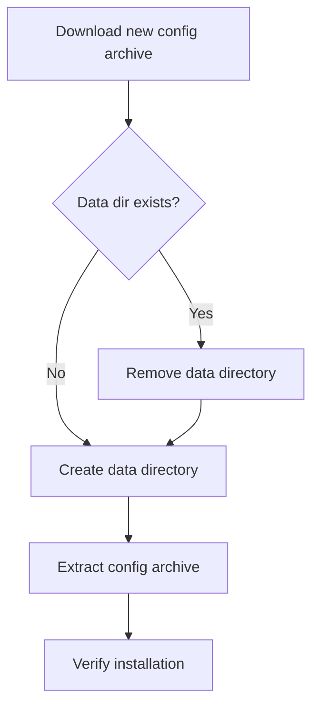

# Atomic CLI: Clean Data Directory on Update

| Document Metadata      | Details                  |
| ---------------------- | ------------------------ |
| Author(s)              | lavaman131              |
| Status                 | Draft (WIP)             |
| Team / Owner           | Atomic CLI              |
| Created / Last Updated | 2026-01-23              |

## 1. Executive Summary

This spec proposes modifying the update logic in Atomic CLI's binary installation path to completely remove the data directory before extracting new config files. Currently, the update flow extracts new config archives on top of the existing data directory, leaving stale artifacts (renamed or deleted files from previous versions) in place. The fix ensures a clean state after each update by removing and recreating the data directory before extraction. The same change applies to the `install.sh` and `install.ps1` scripts for the re-install case.

## 2. Context and Motivation

### 2.1 Current State

The `atomic update` command (for binary installations) downloads a new config archive and extracts it **on top of** the existing data directory without clearing it first. Both `tar -xzf` and `Expand-Archive -Force` overwrite existing files but **do not remove** files that no longer exist in the new version.

Reference: [`src/commands/update.ts:245-249`](src/commands/update.ts#L245-L249)

```typescript
const dataDir = getBinaryDataDir();
await extractConfig(configPath, dataDir);
```

The `extractConfig()` function at [`src/commands/update.ts:116-147`](src/commands/update.ts#L116-L147) calls `mkdir(dataDir, { recursive: true })` then extracts over the existing directory contents.

The data directory paths (from [`src/utils/config-path.ts:54-64`](src/utils/config-path.ts#L54-L64)):
- **Unix:** `$XDG_DATA_HOME/atomic` or `~/.local/share/atomic`
- **Windows:** `%LOCALAPPDATA%\atomic`

### 2.2 The Problem

- **User Impact:** Stale config files from previous versions persist silently, potentially causing incorrect behavior when the CLI copies configs into user projects.
- **Technical Debt:** No mechanism exists to reconcile old vs. new directory contents during update.
- **Silent Failures:** Users have no indication that outdated artifacts remain after updating.

Research reference: [`research/docs/2026-01-23-update-data-dir-clean-install.md`](../research/docs/2026-01-23-update-data-dir-clean-install.md)

## 3. Goals and Non-Goals

### 3.1 Functional Goals

- [x] The data directory is completely removed and recreated before extracting new config files during `atomic update`.
- [x] The `install.sh` script removes and recreates the data directory before extraction (handles re-install case).
- [x] The `install.ps1` script removes and recreates the data directory before extraction (handles re-install case).
- [x] No stale artifacts remain after update or re-install.

### 3.2 Non-Goals (Out of Scope)

- [ ] We will NOT implement a backup/restore mechanism for the data directory.
- [ ] We will NOT add user-specific persistent state to the data directory (it contains only bundled config templates).
- [ ] We will NOT change the extraction tools themselves (`tar`, `Expand-Archive`).

## 4. Proposed Solution (High-Level Design)

### 4.1 Overview

Add a directory removal step immediately before the config extraction in all three code paths:

1. **TypeScript (`updateCommand`)** - `rm(dataDir, { recursive: true, force: true })` before `extractConfig()`
2. **Bash (`install.sh`)** - `rm -rf "$DATA_DIR"` before `tar -xzf`
3. **PowerShell (`install.ps1`)** - `Remove-Item -Recurse -Force $DataDir` before `Expand-Archive`

The `extractConfig()` function already calls `mkdir(dataDir, { recursive: true })`, and the install scripts already call `mkdir -p` / `New-Item`, so the directory is recreated automatically.

### 4.2 Flow Diagram



### 4.3 Key Components

| Component        | File                      | Change                                              |
| ---------------- | ------------------------- | --------------------------------------------------- |
| Update command   | `src/commands/update.ts`  | Add `rm()` call before `extractConfig()`            |
| Bash installer   | `install.sh`              | Add `rm -rf "$DATA_DIR"` before `tar` extraction    |
| PS installer     | `install.ps1`             | Add `Remove-Item` before `Expand-Archive`           |

## 5. Detailed Design

### 5.1 TypeScript Change (`src/commands/update.ts`)

**Location:** Lines 245-249 in `updateCommand()`

**Before:**
```typescript
// Update config files
s.start("Updating config files...");
const dataDir = getBinaryDataDir();
await extractConfig(configPath, dataDir);
s.stop("Config files updated");
```

**After:**
```typescript
// Update config files
s.start("Updating config files...");
const dataDir = getBinaryDataDir();
await rm(dataDir, { recursive: true, force: true });
await extractConfig(configPath, dataDir);
s.stop("Config files updated");
```

The `rm` import already exists on line 10: `import { mkdir, rm, rename, chmod } from "fs/promises"`.

The `extractConfig()` function already calls `await mkdir(dataDir, { recursive: true })` as its first operation, so the directory is recreated before extraction.

### 5.2 Bash Change (`install.sh`)

**Location:** Lines 201-203

**Before:**
```bash
# Extract config files to data directory
info "Installing config files to ${DATA_DIR}..."
tar -xzf "${tmp_dir}/${BINARY_NAME}-config.tar.gz" -C "$DATA_DIR"
```

**After:**
```bash
# Extract config files to data directory (clean install)
info "Installing config files to ${DATA_DIR}..."
rm -rf "$DATA_DIR"
mkdir -p "$DATA_DIR"
tar -xzf "${tmp_dir}/${BINARY_NAME}-config.tar.gz" -C "$DATA_DIR"
```

### 5.3 PowerShell Change (`install.ps1`)

**Location:** Lines 139-141

**Before:**
```powershell
# Extract config files to data directory
Write-Info "Installing config files to ${DataDir}..."
Expand-Archive -Path $TempConfig -DestinationPath $DataDir -Force
```

**After:**
```powershell
# Extract config files to data directory (clean install)
Write-Info "Installing config files to ${DataDir}..."
if (Test-Path $DataDir) { Remove-Item -Recurse -Force $DataDir }
$null = New-Item -ItemType Directory -Force -Path $DataDir
Expand-Archive -Path $TempConfig -DestinationPath $DataDir -Force
```

## 6. Alternatives Considered

| Option                        | Pros                                              | Cons                                         | Reason for Rejection                                                |
| ----------------------------- | ------------------------------------------------- | -------------------------------------------- | ------------------------------------------------------------------- |
| A: Extract over existing      | No code change needed                             | Stale artifacts persist silently             | Current approach; causes the bug we're fixing                       |
| B: Diff and remove stale      | Preserves user modifications                      | Complex, requires manifest tracking          | Over-engineered; data dir has no user-modified content              |
| C: Remove then extract (Selected) | Simple, reliable, guarantees clean state      | Brief window without config if crash occurs  | **Selected:** Simplest fix; crash recovery is acceptable tradeoff   |
| D: Extract to temp, then swap | Atomic operation, no window without config        | Platform-specific rename semantics, complex  | Unnecessary complexity for config templates                         |

## 7. Cross-Cutting Concerns

### 7.1 Error Recovery

If the process crashes after removing the data directory but before extraction completes, the user is left without config data. In this state:
- The binary still works but `getConfigRoot()` in [`src/utils/config-path.ts:77-94`](src/utils/config-path.ts#L77-L94) throws an error directing the user to reinstall.
- The user can recover by re-running `atomic update` or re-running the install script.
- This is an acceptable tradeoff: the failure window is very brief (milliseconds), and the alternative (stale files) causes silent correctness issues.

### 7.2 Security

No security implications. The data directory contains only bundled config templates from the release archive. The checksums are verified before this step executes.

### 7.3 Backward Compatibility

No backward compatibility concerns. The data directory is write-only from the perspective of the update/install process, and read-only from the CLI's runtime perspective. Users do not modify files in this directory.

## 8. Migration, Rollout, and Testing

### 8.1 Deployment Strategy

- Ship the change in the next release. All users running `atomic update` to that version (or later) will get the clean-install behavior.
- No feature flag needed; this is a correctness fix.

### 8.2 Test Plan

- **Unit Tests:** No new unit tests needed; the change is a single `rm()` call using existing, well-tested Node.js/Bun APIs.
- **Integration Tests:** The existing E2E tests in [`tests/e2e/update-command.test.ts`](../tests/e2e/update-command.test.ts) only test error paths and installation type detection (run from source, not binary). These tests are unaffected by this change.
- **Manual Verification:**
  1. Build a binary with an older config set
  2. Add a stale file to the data directory manually
  3. Run `atomic update`
  4. Verify the stale file no longer exists

## 9. Open Questions / Unresolved Issues

- [x] ~~Should a backup of the data dir be created before removal?~~ **Resolved: No.** The data directory contains only bundled templates that can be restored by re-running update/install. A backup adds complexity for a rare failure scenario with a simple recovery path.
- [x] ~~Should install scripts be updated too, or only the TypeScript path?~~ **Resolved: Yes, all three paths.** The install scripts can be used for re-installation, where the same stale artifact problem applies.
