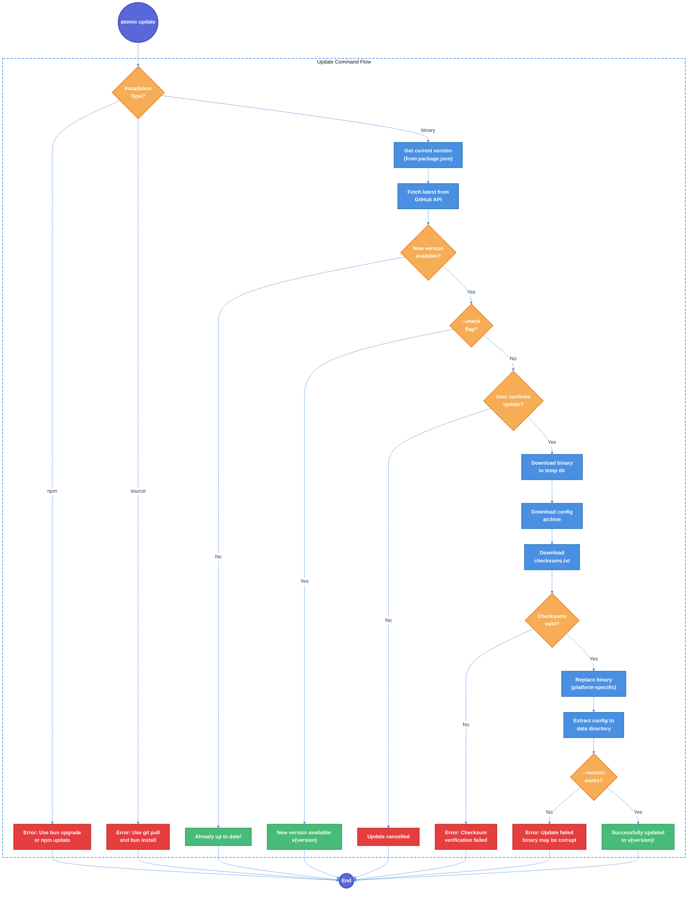
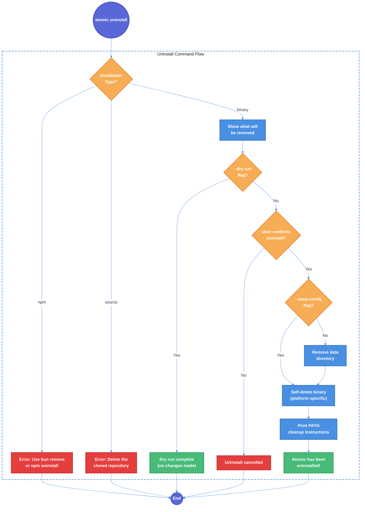

# Atomic CLI Update and Uninstall Commands Technical Design Document

| Document Metadata      | Details                                   |
| ---------------------- | ----------------------------------------- |
| Author(s)              | lavaman131                                |
| Status                 | Draft (WIP)                               |
| Team / Owner           | flora131/atomic                           |
| Created / Last Updated | 2026-01-21                                |

## 1. Executive Summary

This RFC proposes adding `atomic update` and `atomic uninstall` CLI commands that are exclusively available for binary installations. The `atomic update` command will fetch the latest release from GitHub, verify checksums, and perform an atomic binary replacement with config file updates. The `atomic uninstall` command will cleanly remove the binary and data directories. Both commands detect the installation type and provide helpful guidance for npm/bun users to use their native package manager commands instead (`bun upgrade`/`npm update`).

**Key Commands (Post-Implementation):**
```bash
# Binary installation only
atomic update           # Update to latest version
atomic update --check   # Check for updates without installing
atomic uninstall        # Remove atomic CLI completely

# npm/bun installations (existing mechanism)
bun upgrade @bastani/atomic
npm update -g @bastani/atomic
```

**Research Reference:** [research/docs/2026-01-21-update-uninstall-commands.md](../research/docs/2026-01-21-update-uninstall-commands.md)

## 2. Context and Motivation

### 2.1 Current State

The Atomic CLI supports three installation methods with distinct update mechanisms:

**Installation Detection** (`src/utils/config-path.ts:29-45`):
```typescript
export function detectInstallationType(): InstallationType {
  const dir = import.meta.dir;

  // Bun compiled executables use a virtual filesystem with '$bunfs' prefix
  if (dir.includes("$bunfs") || dir.startsWith("B:\\") || dir.startsWith("b:\\")) {
    return "binary";
  }

  // Check for node_modules in path (npm/bun installed)
  if (dir.includes("node_modules")) {
    return "npm";
  }

  // Default to source (development mode)
  return "source";
}
```

| Installation Type | Detection Method | Current Update Mechanism |
|-------------------|------------------|-------------------------|
| `binary` | `$bunfs` in path | Manual re-run of install script |
| `npm` | `node_modules` in path | `bun upgrade` / `npm update` |
| `source` | Default fallback | `git pull && bun install` |

**Current Directory Structure:**

| Platform | Binary Location | Data Directory |
|----------|-----------------|----------------|
| Unix | `~/.local/bin/atomic` | `$XDG_DATA_HOME/atomic` or `~/.local/share/atomic` |
| Windows | `%USERPROFILE%\.local\bin\atomic.exe` | `%LOCALAPPDATA%\atomic` |

**Reference:** [research/docs/2026-01-21-update-uninstall-commands.md - "Directory Locations"](../research/docs/2026-01-21-update-uninstall-commands.md)

### 2.2 The Problem

- **No Self-Update:** Binary users must re-run the install script to update, which is cumbersome
- **No Clean Uninstall:** Binary users must manually locate and delete files to uninstall
- **Inconsistent UX:** npm/bun users have `upgrade`/`update` commands, binary users don't
- **Version Drift:** Without easy updates, binary users may run outdated versions
- **Standard Expectation:** Modern CLI tools (Bun, Deno, Rust toolchain) all support `update` and `uninstall` commands

### 2.3 CLI Command Flow

**Current Command Structure** (`src/index.ts:172-199`):
```typescript
const command = positionals[0];

switch (command) {
  case "init":
    await initCommand({ ... });
    break;
  case undefined:
    // default to init
    await initCommand({ ... });
    break;
  default:
    console.error(`Unknown command: ${command}`);
    process.exit(1);
}
```

**Reference:** [research/docs/2026-01-21-update-uninstall-commands.md - "Current CLI Command Structure"](../research/docs/2026-01-21-update-uninstall-commands.md)

## 3. Goals and Non-Goals

### 3.1 Functional Goals

**Update Command:**
- [ ] Implement `atomic update` command for binary installations only
- [ ] Show helpful error message with package manager guidance for npm/bun installations
- [ ] Check current version against latest GitHub release
- [ ] Display "Already up to date" message when no update is available
- [ ] Download new binary with progress indicator
- [ ] Download and extract new config files to data directory
- [ ] Verify SHA256 checksums before installation
- [ ] Perform atomic binary replacement (platform-specific handling for Windows)
- [ ] Support `--yes/-y` flag to skip confirmation
- [ ] Support `--check` flag to only check for updates without installing
- [ ] Support `--version <v>` flag to install a specific version (not just latest)
- [ ] Handle network failures gracefully with retry guidance
- [ ] Handle GitHub API rate limiting with `GITHUB_TOKEN` suggestion

**Uninstall Command:**
- [ ] Implement `atomic uninstall` command for binary installations only
- [ ] Show helpful error message with package manager guidance for npm/bun installations
- [ ] Display what will be removed before confirmation
- [ ] Support `--yes/-y` flag to skip confirmation
- [ ] Support `--keep-config` flag to preserve data directory
- [ ] Support `--dry-run` flag to preview without removing
- [ ] Remove data directory (`~/.local/share/atomic` or `%LOCALAPPDATA%\atomic`)
- [ ] Remove binary with platform-specific self-deletion handling
- [ ] Print PATH cleanup instructions for shell configs

### 3.2 Non-Goals (Out of Scope)

- [ ] We will NOT auto-modify shell config files to remove PATH entries (too risky, provide manual instructions instead)
- [ ] We will NOT implement automatic rollback capability (adds complexity, can be added later)
- [ ] We will NOT implement automatic update checks on CLI invocation (intrusive, can be added later)
- [ ] We will NOT add update/uninstall for npm/bun installations (they have their own mechanisms)
- [ ] We will NOT support `atomic update` for source installations (use `git pull`)
- [ ] We will NOT add Windows ARM64 support in this version (binary not built for ARM64)

## 4. Proposed Solution (High-Level Design)

### 4.1 Command Flow Diagrams

#### Update Command Flow



#### Uninstall Command Flow



### 4.2 Architectural Pattern

**Installation-Aware Command Pattern**

Both commands follow the same pattern:
1. Check installation type using existing `detectInstallationType()`
2. Route to appropriate handler (binary) or error message (npm/source)
3. Perform platform-specific operations (Unix vs Windows)

This pattern aligns with existing CLI tools like Bun (`bun upgrade` detects how Bun was installed) and Deno (`deno upgrade`).

### 4.3 Key Components

| Component | Responsibility | Technology | Justification |
|-----------|---------------|------------|---------------|
| `src/commands/update.ts` | Update command handler | TypeScript | Matches existing command structure |
| `src/commands/uninstall.ts` | Uninstall command handler | TypeScript | Matches existing command structure |
| `src/utils/download.ts` | Download and checksum utilities | Bun fetch + CryptoHasher | Native Bun APIs, no dependencies |
| `src/utils/config-path.ts` | Extended with binary path helpers | TypeScript | Existing location for path utilities |

### 4.4 Installation Type Behavior Matrix

| Command | Binary Install | npm/bun Install | Source Install |
|---------|---------------|-----------------|----------------|
| `atomic update` | Updates binary + config | Error: use package manager | Error: use git pull |
| `atomic update --check` | Shows available update | Error | Error |
| `atomic uninstall` | Removes binary + data | Error: use package manager | Error: not applicable |
| `atomic uninstall --dry-run` | Shows what would be removed | Error | Error |

**Reference:** [research/docs/2026-01-21-update-uninstall-commands.md - "Command Behavior Summary"](../research/docs/2026-01-21-update-uninstall-commands.md)

## 5. Detailed Design

### 5.1 New Utility Functions

#### `src/utils/config-path.ts` Extensions

```typescript
/**
 * Get the directory where the binary is installed
 * Default: ~/.local/bin (Unix) or %USERPROFILE%\.local\bin (Windows)
 * Overridable via ATOMIC_INSTALL_DIR environment variable
 */
export function getBinaryInstallDir(): string {
  if (isWindows()) {
    return process.env.ATOMIC_INSTALL_DIR ||
      join(process.env.USERPROFILE || "", ".local", "bin");
  }
  return process.env.ATOMIC_INSTALL_DIR ||
    join(process.env.HOME || "", ".local", "bin");
}

/**
 * Get the full path to the atomic binary
 */
export function getBinaryPath(): string {
  const dir = getBinaryInstallDir();
  const name = isWindows() ? "atomic.exe" : "atomic";
  return join(dir, name);
}
```

#### `src/utils/download.ts` (New File)

```typescript
import { join } from "path";

const GITHUB_REPO = "flora131/atomic";

export interface ReleaseInfo {
  version: string;      // e.g., "0.2.0" (without 'v' prefix)
  tagName: string;      // e.g., "v0.2.0"
  publishedAt: string;  // ISO date
  body: string;         // Release notes (markdown)
}

/**
 * Fetch the latest release info from GitHub API
 */
export async function getLatestRelease(): Promise<ReleaseInfo> {
  const url = `https://api.github.com/repos/${GITHUB_REPO}/releases/latest`;
  const response = await fetch(url, {
    headers: {
      "Accept": "application/vnd.github.v3+json",
      // Include token if available to avoid rate limits
      ...(process.env.GITHUB_TOKEN && {
        "Authorization": `Bearer ${process.env.GITHUB_TOKEN}`
      })
    }
  });

  if (!response.ok) {
    if (response.status === 403) {
      throw new Error(
        "GitHub API rate limit exceeded. Set GITHUB_TOKEN environment variable to increase limit."
      );
    }
    throw new Error(`Failed to fetch release info: ${response.status}`);
  }

  const data = await response.json();
  return {
    version: data.tag_name.replace(/^v/, ""),
    tagName: data.tag_name,
    publishedAt: data.published_at,
    body: data.body || "",
  };
}

/**
 * Download a file to a temporary location with progress reporting
 */
export async function downloadFile(
  url: string,
  destPath: string,
  onProgress?: (percent: number) => void
): Promise<void> {
  const response = await fetch(url);

  if (!response.ok) {
    throw new Error(`Download failed: ${response.status} ${response.statusText}`);
  }

  const contentLength = response.headers.get("content-length");
  const total = contentLength ? parseInt(contentLength, 10) : 0;
  let loaded = 0;

  const reader = response.body?.getReader();
  if (!reader) {
    throw new Error("Failed to read response body");
  }

  const chunks: Uint8Array[] = [];

  while (true) {
    const { done, value } = await reader.read();
    if (done) break;

    chunks.push(value);
    loaded += value.length;

    if (onProgress && total > 0) {
      onProgress(Math.round((loaded / total) * 100));
    }
  }

  // Combine chunks and write to file
  const data = new Uint8Array(loaded);
  let position = 0;
  for (const chunk of chunks) {
    data.set(chunk, position);
    position += chunk.length;
  }

  await Bun.write(destPath, data);
}

/**
 * Verify SHA256 checksum of a file against checksums.txt content
 */
export async function verifyChecksum(
  filePath: string,
  checksumsTxt: string,
  expectedFilename: string
): Promise<boolean> {
  // Parse checksum from checksums.txt
  // Format: "<hash>  <filename>" (two spaces between hash and filename)
  const lines = checksumsTxt.split("\n");
  const line = lines.find(l => l.includes(expectedFilename));

  if (!line) {
    throw new Error(`No checksum found for ${expectedFilename}`);
  }

  const expectedHash = line.split(/\s+/)[0].toLowerCase();

  // Calculate actual hash using Bun's crypto
  const file = Bun.file(filePath);
  const data = await file.arrayBuffer();
  const hasher = new Bun.CryptoHasher("sha256");
  hasher.update(data);
  const actualHash = hasher.digest("hex");

  return actualHash === expectedHash;
}

/**
 * Get platform-specific binary filename for download
 */
export function getBinaryFilename(): string {
  const platform = process.platform;
  const arch = process.arch;

  let os: string;
  switch (platform) {
    case "linux": os = "linux"; break;
    case "darwin": os = "darwin"; break;
    case "win32": os = "windows"; break;
    default: throw new Error(`Unsupported platform: ${platform}`);
  }

  let archStr: string;
  switch (arch) {
    case "x64": archStr = "x64"; break;
    case "arm64": archStr = "arm64"; break;
    default: throw new Error(`Unsupported architecture: ${arch}`);
  }

  const ext = platform === "win32" ? ".exe" : "";
  return `atomic-${os}-${archStr}${ext}`;
}

/**
 * Get platform-specific config archive filename
 */
export function getConfigArchiveFilename(): string {
  return isWindows() ? "atomic-config.zip" : "atomic-config.tar.gz";
}

/**
 * Build download URL for a specific version and asset
 */
export function getDownloadUrl(version: string, filename: string): string {
  // version should include 'v' prefix (e.g., "v0.1.0")
  return `https://github.com/${GITHUB_REPO}/releases/download/${version}/${filename}`;
}
```

### 5.2 Update Command Implementation

#### `src/commands/update.ts`

```typescript
/**
 * Update command - Self-update for binary installations
 */

import { confirm, spinner, log, note, isCancel, cancel } from "@clack/prompts";
import { join } from "path";
import { tmpdir } from "os";
import { mkdir, rm, rename, chmod } from "fs/promises";
import { existsSync } from "fs";

import { detectInstallationType, getBinaryPath, getBinaryDataDir } from "../utils/config-path";
import { isWindows } from "../utils/detect";
import { VERSION } from "../version";
import {
  getLatestRelease,
  downloadFile,
  verifyChecksum,
  getBinaryFilename,
  getConfigArchiveFilename,
  getDownloadUrl,
  type ReleaseInfo
} from "../utils/download";

export interface UpdateOptions {
  /** Skip confirmation prompt */
  yes?: boolean;
  /** Only check for updates, don't install */
  check?: boolean;
  /** Update to specific version (e.g., "v0.2.0") */
  version?: string;
}

/**
 * Compare two semver version strings
 * Returns true if v1 > v2
 */
function isNewerVersion(v1: string, v2: string): boolean {
  const parse = (v: string) => v.replace(/^v/, "").split(".").map(Number);
  const [major1, minor1, patch1] = parse(v1);
  const [major2, minor2, patch2] = parse(v2);

  if (major1 !== major2) return major1 > major2;
  if (minor1 !== minor2) return minor1 > minor2;
  return patch1 > patch2;
}

/**
 * Replace binary on Unix systems (atomic rename)
 */
async function replaceBinaryUnix(newBinaryPath: string, targetPath: string): Promise<void> {
  // Make executable
  await chmod(newBinaryPath, 0o755);
  // Atomic rename (replaces existing)
  await rename(newBinaryPath, targetPath);
}

/**
 * Replace binary on Windows (rename strategy for locked executables)
 */
async function replaceBinaryWindows(newBinaryPath: string, targetPath: string): Promise<void> {
  const oldPath = targetPath + ".old";

  // Clean up any previous .old file
  if (existsSync(oldPath)) {
    try {
      await rm(oldPath, { force: true });
    } catch {
      // Ignore - may still be locked from previous update
    }
  }

  // Rename running executable to .old
  await rename(targetPath, oldPath);

  try {
    // Move new binary to target location
    await rename(newBinaryPath, targetPath);
  } catch (e) {
    // Rollback: restore old binary
    await rename(oldPath, targetPath);
    throw e;
  }

  // Try to delete old binary (may fail if still running)
  try {
    await rm(oldPath, { force: true });
  } catch {
    // Will be cleaned up on next update
    log.warn(`Could not remove old binary: ${oldPath}`);
    log.warn("It will be cleaned up automatically on next update.");
  }
}

/**
 * Extract config archive to data directory
 */
async function extractConfig(archivePath: string, dataDir: string): Promise<void> {
  // Ensure data directory exists
  await mkdir(dataDir, { recursive: true });

  if (isWindows()) {
    // Use PowerShell's Expand-Archive for zip files
    const result = Bun.spawnSync({
      cmd: ["powershell", "-Command", `Expand-Archive -Path '${archivePath}' -DestinationPath '${dataDir}' -Force`],
      stdout: "pipe",
      stderr: "pipe"
    });

    if (!result.success) {
      throw new Error(`Failed to extract config: ${result.stderr.toString()}`);
    }
  } else {
    // Use tar for .tar.gz files
    const result = Bun.spawnSync({
      cmd: ["tar", "-xzf", archivePath, "-C", dataDir],
      stdout: "pipe",
      stderr: "pipe"
    });

    if (!result.success) {
      throw new Error(`Failed to extract config: ${result.stderr.toString()}`);
    }
  }
}

export async function updateCommand(options: UpdateOptions = {}): Promise<void> {
  const installType = detectInstallationType();

  // Check if update is supported for this installation type
  if (installType === "npm") {
    log.error("'atomic update' is not available for npm/bun installations.");
    log.info("");
    log.info("To update atomic, use your package manager:");
    log.info("  bun upgrade @bastani/atomic");
    log.info("  # or");
    log.info("  npm update -g @bastani/atomic");
    process.exit(1);
  }

  if (installType === "source") {
    log.error("'atomic update' is not available in development mode.");
    log.info("");
    log.info("To update atomic from source:");
    log.info("  git pull");
    log.info("  bun install");
    process.exit(1);
  }

  // Binary installation - proceed with update
  const s = spinner();

  try {
    s.start("Checking for updates...");

    let targetVersion: string;
    let releaseInfo: ReleaseInfo | null = null;

    if (options.version) {
      // Use specified version
      targetVersion = options.version.startsWith("v") ? options.version : `v${options.version}`;
    } else {
      // Fetch latest version
      releaseInfo = await getLatestRelease();
      targetVersion = releaseInfo.tagName;
    }

    const targetVersionNum = targetVersion.replace(/^v/, "");
    s.stop(`Current version: v${VERSION}`);

    // Compare versions
    if (!isNewerVersion(targetVersionNum, VERSION)) {
      if (targetVersionNum === VERSION) {
        log.success("You're already running the latest version!");
      } else {
        log.warn(`Version ${targetVersion} is older than current version v${VERSION}`);
        log.info("Use --version with a newer version number to update.");
      }
      return;
    }

    log.info(`New version available: ${targetVersion}`);

    // If --check flag, just report and exit
    if (options.check) {
      if (releaseInfo?.body) {
        note(releaseInfo.body, "Release Notes");
      }
      log.info("");
      log.info("Run 'atomic update' to install this version.");
      return;
    }

    // Confirm update unless --yes flag
    if (!options.yes) {
      const shouldUpdate = await confirm({
        message: `Update to ${targetVersion}?`,
        initialValue: true
      });

      if (isCancel(shouldUpdate) || !shouldUpdate) {
        cancel("Update cancelled.");
        return;
      }
    }

    // Create temp directory for downloads
    const tempDir = join(tmpdir(), `atomic-update-${Date.now()}`);
    await mkdir(tempDir, { recursive: true });

    try {
      const binaryFilename = getBinaryFilename();
      const configFilename = getConfigArchiveFilename();

      // Download binary
      s.start(`Downloading ${binaryFilename}...`);
      const binaryPath = join(tempDir, binaryFilename);
      await downloadFile(
        getDownloadUrl(targetVersion, binaryFilename),
        binaryPath,
        (percent) => s.message(`Downloading ${binaryFilename}... ${percent}%`)
      );
      s.stop(`Downloaded ${binaryFilename}`);

      // Download config archive
      s.start(`Downloading ${configFilename}...`);
      const configPath = join(tempDir, configFilename);
      await downloadFile(
        getDownloadUrl(targetVersion, configFilename),
        configPath
      );
      s.stop(`Downloaded ${configFilename}`);

      // Download and verify checksums
      s.start("Verifying checksums...");
      const checksumsPath = join(tempDir, "checksums.txt");
      await downloadFile(
        getDownloadUrl(targetVersion, "checksums.txt"),
        checksumsPath
      );
      const checksumsTxt = await Bun.file(checksumsPath).text();

      const binaryValid = await verifyChecksum(binaryPath, checksumsTxt, binaryFilename);
      if (!binaryValid) {
        throw new Error(`Checksum verification failed for ${binaryFilename}`);
      }

      const configValid = await verifyChecksum(configPath, checksumsTxt, configFilename);
      if (!configValid) {
        throw new Error(`Checksum verification failed for ${configFilename}`);
      }
      s.stop("Checksums verified");

      // Replace binary
      s.start("Installing binary...");
      const targetBinaryPath = getBinaryPath();

      if (isWindows()) {
        await replaceBinaryWindows(binaryPath, targetBinaryPath);
      } else {
        await replaceBinaryUnix(binaryPath, targetBinaryPath);
      }
      s.stop("Binary installed");

      // Update config files
      s.start("Updating config files...");
      const dataDir = getBinaryDataDir();
      await extractConfig(configPath, dataDir);
      s.stop("Config files updated");

      // Verify installation
      s.start("Verifying installation...");
      const verifyResult = Bun.spawnSync({
        cmd: [targetBinaryPath, "--version"],
        stdout: "pipe",
        stderr: "pipe"
      });

      if (!verifyResult.success) {
        throw new Error("Installation verification failed");
      }
      s.stop("Installation verified");

      log.success(`Successfully updated to ${targetVersion}!`);
      log.info("");
      log.info("Run 'atomic --help' to see what's new.");

    } finally {
      // Cleanup temp directory
      await rm(tempDir, { recursive: true, force: true });
    }

  } catch (error) {
    s.stop("Update failed");
    const message = error instanceof Error ? error.message : String(error);
    log.error(`Update failed: ${message}`);

    if (message.includes("rate limit")) {
      log.info("");
      log.info("To avoid rate limits, set the GITHUB_TOKEN environment variable:");
      log.info("  export GITHUB_TOKEN=<your-token>");
    }

    process.exit(1);
  }
}
```

### 5.3 Uninstall Command Implementation

#### `src/commands/uninstall.ts`

```typescript
/**
 * Uninstall command - Remove binary installation
 */

import { confirm, log, note, isCancel, cancel } from "@clack/prompts";
import { rm, rename, unlink } from "fs/promises";
import { existsSync } from "fs";

import { detectInstallationType, getBinaryPath, getBinaryDataDir, getBinaryInstallDir } from "../utils/config-path";
import { isWindows, isMacOS, isLinux } from "../utils/detect";

export interface UninstallOptions {
  /** Skip confirmation prompt */
  yes?: boolean;
  /** Keep data directory, only remove binary */
  keepConfig?: boolean;
  /** Show what would be removed without removing */
  dryRun?: boolean;
}

/**
 * Get shell config paths and cleanup instructions
 */
function getPathCleanupInstructions(): string {
  const binDir = getBinaryInstallDir();

  return `
To complete the uninstallation, remove the PATH entry from your shell config:

Bash (~/.bashrc or ~/.bash_profile):
  Remove: export PATH="${binDir}:$PATH"

Zsh (~/.zshrc):
  Remove: export PATH="${binDir}:$PATH"

Fish (~/.config/fish/config.fish):
  Remove: fish_add_path ${binDir}

PowerShell ($PROFILE):
  Remove the line that adds ${binDir} to $env:Path
`.trim();
}

export async function uninstallCommand(options: UninstallOptions = {}): Promise<void> {
  const installType = detectInstallationType();

  // Check if uninstall is supported for this installation type
  if (installType === "npm") {
    log.error("'atomic uninstall' is not available for npm/bun installations.");
    log.info("");
    log.info("To uninstall atomic, use your package manager:");
    log.info("  bun remove -g @bastani/atomic");
    log.info("  # or");
    log.info("  npm uninstall -g @bastani/atomic");
    process.exit(1);
  }

  if (installType === "source") {
    log.error("'atomic uninstall' is not applicable for source installations.");
    log.info("");
    log.info("To remove atomic from source:");
    log.info("  1. Delete the cloned repository directory");
    log.info("  2. Run 'bun unlink' if you linked it globally");
    process.exit(1);
  }

  // Binary installation - proceed with uninstall
  const binaryPath = getBinaryPath();
  const dataDir = getBinaryDataDir();

  const binaryExists = existsSync(binaryPath);
  const dataDirExists = existsSync(dataDir);

  if (!binaryExists && !dataDirExists) {
    log.success("Atomic is already uninstalled (no files found).");
    return;
  }

  // Show what will be removed
  log.info("This will remove:");
  if (binaryExists) {
    log.info(`  - Binary:    ${binaryPath}`);
  }
  if (dataDirExists && !options.keepConfig) {
    log.info(`  - Data:      ${dataDir}`);
  }
  if (options.keepConfig && dataDirExists) {
    log.info(`  - (keeping)  ${dataDir}`);
  }
  log.info("");

  // Dry run - just show what would be removed
  if (options.dryRun) {
    log.info("Dry run complete. No files were removed.");
    return;
  }

  // Confirm uninstall unless --yes flag
  if (!options.yes) {
    const shouldUninstall = await confirm({
      message: "Are you sure you want to uninstall atomic?",
      initialValue: false
    });

    if (isCancel(shouldUninstall) || !shouldUninstall) {
      cancel("Uninstall cancelled.");
      return;
    }
  }

  try {
    // Remove data directory (unless --keep-config)
    if (dataDirExists && !options.keepConfig) {
      log.step("Removing data directory...");
      await rm(dataDir, { recursive: true, force: true });
      log.success("Data directory removed");
    }

    // Remove binary (self-deletion)
    if (binaryExists) {
      log.step("Removing binary...");

      if (isWindows()) {
        // Windows: Cannot delete running executable, rename it instead
        const deletePath = binaryPath + ".delete";

        // Clean up any previous .delete file
        if (existsSync(deletePath)) {
          try {
            await rm(deletePath, { force: true });
          } catch {
            // Ignore
          }
        }

        // Rename current executable
        await rename(binaryPath, deletePath);
        log.success("Binary marked for deletion");
        log.warn("");
        log.warn("Note: The binary has been renamed to:");
        log.warn(`  ${deletePath}`);
        log.warn("");
        log.warn("Please delete this file manually, or restart your computer");
        log.warn("to complete the uninstallation.");
      } else {
        // Unix: Can delete self directly
        await unlink(binaryPath);
        log.success("Binary removed");
      }
    }

    log.success("");
    log.success("Atomic has been uninstalled.");

    // Show PATH cleanup instructions
    note(getPathCleanupInstructions(), "PATH Cleanup (Manual)");

  } catch (error) {
    const message = error instanceof Error ? error.message : String(error);
    log.error(`Uninstall failed: ${message}`);

    if (message.includes("permission") || message.includes("EACCES")) {
      log.info("");
      log.info("Permission denied. Try running with elevated privileges or");
      log.info("manually delete the files shown above.");
    }

    process.exit(1);
  }
}
```

### 5.4 CLI Integration

#### `src/index.ts` Modifications

Add to imports:
```typescript
import { updateCommand } from "./commands/update";
import { uninstallCommand } from "./commands/uninstall";
```

Add to `parseArgs` options:
```typescript
const { values, positionals } = parseArgs({
  args: rawArgs,
  options: {
    agent: { type: "string", short: "a" },
    force: { type: "boolean", short: "f" },
    yes: { type: "boolean", short: "y" },
    version: { type: "boolean", short: "v" },
    help: { type: "boolean", short: "h" },
    "no-banner": { type: "boolean" },
    // New flags for update/uninstall
    check: { type: "boolean" },
    "keep-config": { type: "boolean" },
    "dry-run": { type: "boolean" },
    "target-version": { type: "string" }, // --target-version for update
  },
  strict: false,
  allowPositionals: true,
});
```

Add to command switch statement:
```typescript
switch (command) {
  case "init":
    // ... existing init handling ...
    break;

  case "update":
    await updateCommand({
      yes: values.yes as boolean | undefined,
      check: values.check as boolean | undefined,
      version: values["target-version"] as string | undefined,
    });
    break;

  case "uninstall":
    await uninstallCommand({
      yes: values.yes as boolean | undefined,
      keepConfig: values["keep-config"] as boolean | undefined,
      dryRun: values["dry-run"] as boolean | undefined,
    });
    break;

  case undefined:
    // ... existing default handling ...
    break;

  default:
    console.error(`Unknown command: ${command}`);
    console.error("Run 'atomic --help' for usage information.");
    process.exit(1);
}
```

### 5.5 Help Text Updates

Update `showHelp()` function to include new commands:

```typescript
function showHelp(): void {
  console.log(`
atomic - Configuration manager for coding agents

USAGE:
  atomic [command] [options]

COMMANDS:
  init                    Initialize agent configuration (default)
  update                  Update atomic to the latest version (binary install only)
  uninstall               Remove atomic from your system (binary install only)

OPTIONS:
  -a, --agent <name>      Pre-select agent (claude, opencode, copilot)
  -f, --force             Force overwrite of preserved files
  -y, --yes               Auto-confirm all prompts
  -v, --version           Show version number
  -h, --help              Show this help message
      --no-banner         Hide ASCII banner

UPDATE OPTIONS:
      --check             Only check for updates, don't install
      --target-version    Update to specific version (e.g., v0.2.0)

UNINSTALL OPTIONS:
      --keep-config       Keep config files, only remove binary
      --dry-run           Show what would be removed without removing

AGENT RUN MODE:
  atomic -a <agent> -- [agent-args...]

  Run an agent directly with arguments passed through.

EXAMPLES:
  atomic                      # Interactive setup
  atomic init -a claude       # Initialize Claude config
  atomic init --force --yes   # Force reinitialize, no prompts
  atomic update               # Update to latest version
  atomic update --check       # Check for available updates
  atomic uninstall            # Remove atomic completely
  atomic uninstall --dry-run  # Preview uninstall

For more information, visit: https://github.com/flora131/atomic
`.trim());
}
```

## 6. Alternatives Considered

| Option | Pros | Cons | Reason for Rejection |
|--------|------|------|---------------------|
| **A: Re-run install script** | Simple, existing | Requires network, downloads entire binary | Not user-friendly, no version comparison |
| **B: Auto-update on CLI invocation** | Always up-to-date | Intrusive, slows down commands | Can be added later as opt-in feature |
| **C: Package manager only** | Consistent with npm/bun | Binary users have no easy update path | Need to support binary installation |
| **D: Dedicated update binary** | Separation of concerns | Additional complexity, two binaries | Over-engineered for this use case |
| **E: Self-update commands (Selected)** | User-friendly, explicit | Platform-specific handling needed | **Selected:** Matches industry standard (Bun, Deno, Rust) |

## 7. Cross-Cutting Concerns

### 7.1 Security and Privacy

- **HTTPS-only:** All downloads use HTTPS (GitHub enforces this)
- **Checksum verification:** SHA256 checksums validated before execution
- **No elevated privileges:** Update/uninstall operate on user directories only
- **No telemetry:** Commands do not send any analytics data
- **GitHub token optional:** Rate limit mitigation via `GITHUB_TOKEN` env var

### 7.2 Error Handling

| Scenario | Handling |
|----------|----------|
| Network failure during download | Delete partial file, show error with retry instructions |
| Checksum mismatch | Delete downloaded file, show error, suggest retry |
| Insufficient permissions | Check permissions before operation, suggest solutions |
| Already up to date | Inform user, exit 0 (success) |
| GitHub API rate limit | Suggest using `GITHUB_TOKEN` env var |
| Binary locked (Windows) | Rename strategy with manual cleanup instructions |
| Data directory not found | Warn but continue (for uninstall) |

**Reference:** [research/docs/2026-01-21-update-uninstall-commands.md - "Edge Cases and Error Handling"](../research/docs/2026-01-21-update-uninstall-commands.md)

### 7.3 Platform-Specific Considerations

**Unix (Linux/macOS):**
- Binary replacement via atomic `rename()` syscall
- Running process continues from memory, new invocations use new binary
- Self-deletion works via `unlink()`

**Windows:**
- Running executables are locked and cannot be deleted/overwritten
- Binary replacement via rename strategy: `atomic.exe` -> `atomic.exe.old`, then move new binary
- Self-deletion via rename to `.delete` with manual cleanup instructions

**Reference:** [research/docs/2026-01-21-update-uninstall-commands.md - "Platform-Specific Binary Replacement"](../research/docs/2026-01-21-update-uninstall-commands.md)

## 8. Migration, Rollout, and Testing

### 8.1 Deployment Strategy

1. Create `src/commands/update.ts` and `src/commands/uninstall.ts`
2. Create `src/utils/download.ts`
3. Extend `src/utils/config-path.ts` with new helper functions
4. Modify `src/index.ts` to add new commands
5. Update help text
6. Update README.md documentation
7. Merge to `main` branch
8. Create new release - commands available immediately

### 8.2 Test Plan

#### Unit Tests

- [ ] `verifyChecksum()` with valid and invalid checksums
- [ ] `isNewerVersion()` version comparison logic
- [ ] `getBinaryFilename()` for all supported platforms
- [ ] `getConfigArchiveFilename()` for Unix vs Windows
- [ ] Installation type detection edge cases

#### Integration Tests

| Test Case | Platform | Expected Result |
|-----------|----------|-----------------|
| `atomic update` | Binary (Linux) | Downloads and replaces binary |
| `atomic update` | Binary (macOS) | Downloads and replaces binary |
| `atomic update` | Binary (Windows) | Downloads and uses rename strategy |
| `atomic update --check` | Binary | Shows available update, no changes |
| `atomic update` | npm install | Error with package manager guidance |
| `atomic update` | Source | Error with git pull guidance |
| `atomic update --yes` | Binary | Skips confirmation prompt |
| `atomic uninstall` | Binary (Linux) | Removes binary and data dir |
| `atomic uninstall` | Binary (Windows) | Renames binary to .delete |
| `atomic uninstall --keep-config` | Binary | Keeps data directory |
| `atomic uninstall --dry-run` | Binary | Shows what would be removed |
| `atomic uninstall` | npm install | Error with package manager guidance |
| Checksum mismatch | Binary | Error, files cleaned up |
| Network failure | Binary | Error with retry guidance |
| Already up to date | Binary | Success message, no changes |

#### Manual Testing Checklist

- [ ] Test update from older version on Linux x64
- [ ] Test update from older version on macOS arm64
- [ ] Test update from older version on Windows x64
- [ ] Test update --check flag behavior
- [ ] Test update with --target-version flag
- [ ] Test uninstall removes all expected files
- [ ] Test uninstall --keep-config preserves data
- [ ] Test uninstall --dry-run shows preview
- [ ] Test error messages for npm installations
- [ ] Test error messages for source installations
- [ ] Verify PATH cleanup instructions are accurate

## 9. Open Questions / Unresolved Issues

- [ ] **Changelog display**: Should `atomic update` show a changelog/release notes before prompting? The GitHub API provides release body text.
  - Current: Show in `--check` mode only
  - Recommendation: Add `--changelog` flag to show release notes

- [ ] **Automatic update checks**: Should atomic periodically check for updates and notify users (like npm does)?
  - Current: Not implemented
  - Recommendation: Defer to future version, can be opt-in via config

- [ ] **Rollback capability**: Should we keep one previous version for rollback purposes?
  - Current: Not implemented
  - Recommendation: Defer, adds complexity; users can re-run install script with specific version

- [ ] **Windows self-deletion**: Is there a better approach than renaming to `.delete`?
  - Current: Rename and provide manual instructions
  - Alternative: Spawn cleanup process that waits for parent to exit (more complex)

## 10. Implementation File Changes

| File | Change Type | Description |
|------|-------------|-------------|
| `src/commands/update.ts` | Create | Update command handler (~200 lines) |
| `src/commands/uninstall.ts` | Create | Uninstall command handler (~150 lines) |
| `src/utils/download.ts` | Create | Download, checksum, and URL utilities (~150 lines) |
| `src/utils/config-path.ts` | Modify | Add `getBinaryInstallDir()` and `getBinaryPath()` |
| `src/index.ts` | Modify | Add update/uninstall cases to switch, update parseArgs options |
| `README.md` | Modify | Add "Updating Atomic" and update "Uninstalling Atomic" sections |

## 11. Implementation Checklist

### Phase 1: Core Infrastructure

- [ ] Add `getBinaryInstallDir()` and `getBinaryPath()` to `src/utils/config-path.ts`
- [ ] Create `src/utils/download.ts` with:
  - [ ] `getLatestRelease()` function
  - [ ] `downloadFile()` with progress callback
  - [ ] `verifyChecksum()` function
  - [ ] `getBinaryFilename()` and `getConfigArchiveFilename()` helpers
  - [ ] `getDownloadUrl()` builder

### Phase 2: Update Command

- [ ] Create `src/commands/update.ts` with:
  - [ ] Installation type check with helpful error messages
  - [ ] Version comparison logic
  - [ ] `--check` flag handling
  - [ ] Download binary with progress
  - [ ] Download and verify config archive
  - [ ] Checksum verification
  - [ ] Platform-specific binary replacement
  - [ ] Config extraction
  - [ ] Installation verification
- [ ] Add `update` case to `src/index.ts` switch statement
- [ ] Add update-specific flags to `parseArgs`

### Phase 3: Uninstall Command

- [ ] Create `src/commands/uninstall.ts` with:
  - [ ] Installation type check with helpful error messages
  - [ ] Preview of files to be removed
  - [ ] `--dry-run` flag handling
  - [ ] `--keep-config` flag handling
  - [ ] Data directory removal
  - [ ] Platform-specific binary self-deletion
  - [ ] PATH cleanup instructions
- [ ] Add `uninstall` case to `src/index.ts` switch statement
- [ ] Add uninstall-specific flags to `parseArgs`

### Phase 4: Documentation and Help

- [ ] Update `showHelp()` with new commands and options
- [ ] Update README.md "Updating Atomic" section
- [ ] Update README.md "Uninstalling Atomic" section to include CLI command

### Phase 5: Testing

- [ ] Write unit tests for version comparison
- [ ] Write unit tests for checksum verification
- [ ] Test update command on Linux
- [ ] Test update command on macOS
- [ ] Test update command on Windows
- [ ] Test uninstall command on all platforms
- [ ] Test error paths (network failure, checksum mismatch, etc.)

## 12. Code References

### Existing Implementation (to be modified)
- `src/index.ts:146-158` - parseArgs options definition
- `src/index.ts:172-199` - Command switch statement
- `src/utils/config-path.ts:29-45` - `detectInstallationType()` function
- `src/utils/config-path.ts:54-64` - `getBinaryDataDir()` function
- `src/utils/detect.ts:52-68` - Platform detection utilities
- `src/version.ts:1-6` - VERSION constant from package.json

### Installation Scripts (reference for paths)
- `install.sh:11-12` - Unix binary and data directory paths
- `install.ps1:16-17` - Windows binary and data directory paths

### Release Structure (reference for downloads)
- `.github/workflows/publish.yml:40-57` - Binary build targets
- `.github/workflows/publish.yml:110-132` - Release asset uploads

## 13. Related Research Documents

- [research/docs/2026-01-21-update-uninstall-commands.md](../research/docs/2026-01-21-update-uninstall-commands.md) - Primary research document with detailed analysis
- [research/docs/2026-01-21-binary-distribution-installers.md](../research/docs/2026-01-21-binary-distribution-installers.md) - Related research on binary distribution and install scripts
- [research/docs/2026-01-20-cross-platform-support.md](../research/docs/2026-01-20-cross-platform-support.md) - Cross-platform considerations

## 14. User Experience Examples

### Update Command

```
$ atomic update

Checking for updates...
Current version: v0.1.0
New version available: v0.2.0

? Update to v0.2.0? › Yes

Downloading atomic-linux-x64... 100%
Downloaded atomic-linux-x64
Downloading atomic-config.tar.gz...
Downloaded atomic-config.tar.gz
Verifying checksums...
Checksums verified
Installing binary...
Binary installed
Updating config files...
Config files updated
Verifying installation...
Installation verified

✓ Successfully updated to v0.2.0!

Run 'atomic --help' to see what's new.
```

```
$ atomic update
# When installed via npm

✗ 'atomic update' is not available for npm/bun installations.

To update atomic, use your package manager:
  bun upgrade @bastani/atomic
  # or
  npm update -g @bastani/atomic
```

### Uninstall Command

```
$ atomic uninstall

This will remove:
  - Binary:    /home/user/.local/bin/atomic
  - Data:      /home/user/.local/share/atomic

? Are you sure you want to uninstall atomic? › Yes

◇ Removing data directory...
✓ Data directory removed
◇ Removing binary...
✓ Binary removed

✓ Atomic has been uninstalled.

╭─────────────────────────────────────────────────────────────╮
│                    PATH Cleanup (Manual)                     │
├─────────────────────────────────────────────────────────────┤
│ To complete the uninstallation, remove the PATH entry from  │
│ your shell config:                                          │
│                                                             │
│ Bash (~/.bashrc or ~/.bash_profile):                        │
│   Remove: export PATH="/home/user/.local/bin:$PATH"         │
│                                                             │
│ Zsh (~/.zshrc):                                             │
│   Remove: export PATH="/home/user/.local/bin:$PATH"         │
│                                                             │
│ Fish (~/.config/fish/config.fish):                          │
│   Remove: fish_add_path /home/user/.local/bin               │
╰─────────────────────────────────────────────────────────────╯
```
