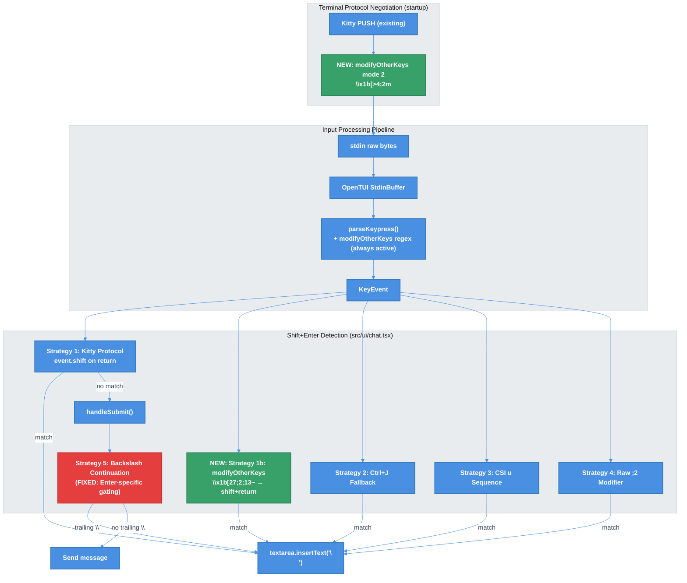

# Shift+Enter Reliability Fix — Multi-Protocol Keyboard Enhancement (Issue #233)

| Document Metadata      | Details                                |
| ---------------------- | -------------------------------------- |
| Author(s)              | lavaman131                             |
| Status                 | Draft (WIP)                            |
| Team / Owner           | Atomic CLI                             |
| Created / Last Updated | 2026-02-22                             |

## 1. Executive Summary

Shift+Enter behavior in the Atomic TUI is unreliable: it works on the first press but fails on subsequent presses (submitting the message instead of inserting a newline). Deep investigation reveals two compounding issues: (1) the `kittyKeyboardDetectedRef` flag is set by ANY CSI u event (e.g., Backspace → `\x1b[127u`), which permanently disables the backslash fallback, and (2) VS Code's xterm.js does NOT support the `modifyOtherKeys` protocol (`CSI > 4;2 m` is silently ignored), eliminating it as a fix for VS Code users. This spec proposes a **multi-protocol defense-in-depth approach**: enable `modifyOtherKeys` mode 2 for terminals that support it (GNOME Terminal, xterm, Alacritty, WezTerm, iTerm2), and fix the `kittyKeyboardDetectedRef` gating logic to be Enter-specific rather than any-CSI-u.

## 2. Context and Motivation

### 2.1 Current State

The Atomic TUI uses OpenTUI for terminal rendering and input handling. The renderer enables the Kitty keyboard protocol via `useKittyKeyboard: { disambiguate: true }` at initialization (`src/ui/index.ts:1646`), which results in Kitty flags `1 | 4 = 5` (DISAMBIGUATE + ALTERNATE_KEYS) due to `buildKittyKeyboardFlags()` defaulting `alternateKeys` to `true` (see [Research: OpenTUI Key Handling](../research/docs/2026-02-22-opentui-key-handling.md)).

The chat textarea (`src/ui/chat.tsx`) implements 5 Shift+Enter detection strategies:

| # | Strategy                    | Condition                                                  | VS Code (Kitty ON) | VS Code (Kitty OFF) | GNOME Terminal | xterm |
|---|-----------------------------|------------------------------------------------------------|---------------------|----------------------|----------------|-------|
| 1 | Kitty protocol direct       | `event.shift \|\| event.meta` on return/linefeed           | ✅                  | ❌                   | ❌             | ❌    |
| 2 | Ctrl+J universal fallback   | `event.name === "linefeed"` without modifiers              | ✅                  | ✅                   | ✅             | ✅    |
| 3 | CSI u escape sequence       | Raw ends with `u`, matches `\x1b[(?:13\|10)`               | ✅                  | ❌                   | ❌             | ❌    |
| 4 | Shifted return in raw       | Raw contains `;2` and isn't plain `\r`/`\n`                | ✅                  | ❌                   | ❌             | ❌    |
| 5 | Backslash continuation      | Input ends with `\`, Kitty not detected                    | ⚠️ Disabled by bug  | ⚠️ Shows artifact    | ⚠️             | ⚠️    |

**Architecture**: The keyboard handling is entirely agent-agnostic — Copilot, OpenCode, and Claude all share the same `<textarea>` component and key handling code path (see [Research: §4](../research/docs/2026-02-22-233-vscode-shift-enter-backslash-bug.md)).

**Event dispatch**: OpenTUI uses a two-tier event system:
- **TIER 1** (global `useKeyboard` hooks): Executes first. `stopPropagation()` prevents TIER 2.
- **TIER 2** (focused renderable's `handleKeyPress`): Matches against `_keyBindingsMap` using composite keys (`name:ctrl:shift:meta:super`). The binding `{ name: "return", shift: true, action: "newline" }` correctly maps to "newline" at this tier.

### 2.2 The Problem

#### Primary Bug: "Works First Time, Fails After"

**Reproduction** (VS Code 1.109+, default settings with Kitty protocol enabled):
1. Type "Hello" (or nothing)
2. Press Shift+Enter → newline inserted ✅
3. Press Backspace → newline deleted
4. Press Shift+Enter → message submitted incorrectly ❌

#### Root Cause Analysis

**Finding 1: `kittyKeyboardDetectedRef` is overly broad** (`src/ui/chat.tsx:4254-4255`):
```typescript
if (!kittyKeyboardDetectedRef.current && event.raw?.endsWith("u") && event.raw.startsWith("\x1b[")) {
  kittyKeyboardDetectedRef.current = true;
}
```
This sets the flag on ANY CSI u event — including Backspace (`\x1b[127u`), Tab (`\x1b[9u`), or even Enter itself (`\x1b[13u`). Once set to `true`, the backslash fallback at line 5361 is permanently disabled:
```typescript
if (!kittyKeyboardDetectedRef.current && value.endsWith("\\")) { ... }
```

**Finding 2: xterm.js does NOT support `modifyOtherKeys`** (confirmed via [xtermjs/xterm.js](https://github.com/xtermjs/xterm.js) and [microsoft/vscode](https://github.com/microsoft/vscode) analysis). The escape sequence `\x1b[>4;2m` is silently ignored. This eliminates `modifyOtherKeys` as a fix for VS Code.

**Finding 3: VS Code 1.86+ (2026-02-11) enabled Kitty protocol by default** via `terminal.integrated.enableKittyKeyboardProtocol: true`. With Kitty protocol active, Shift+Enter should consistently send `\x1b[13;2u`. However, the user reports inconsistent behavior.

**Finding 4: OpenTUI already parses `modifyOtherKeys` unconditionally** (`index-vnvba6q9.js:2194`). The regex `modifyOtherKeysRe` always matches `\x1b[27;modifier;codepoint~` sequences. However, OpenTUI does NOT send the enablement escape sequence (`\x1b[>4;2m`) to the terminal. For non-VS-Code terminals that support `modifyOtherKeys` (GNOME Terminal, xterm, Alacritty, WezTerm, iTerm2), sending this sequence would enable proper Shift+Enter detection without Kitty protocol.

#### Secondary Bug: Backslash Visual Artifact

In terminals without Kitty protocol AND without `modifyOtherKeys`, Shift+Enter may send `\` followed by `\r`. The `\` is rendered in the textarea before the `\r` triggers `handleSubmit()`, creating a visible artifact (see [Research: §1](../research/docs/2026-02-22-233-vscode-shift-enter-backslash-bug.md)).

### 2.3 Scope

- **Primary**: Affects all users where Shift+Enter is unreliable across any terminal (VS Code, GNOME Terminal, xterm, etc.)
- **VS Code specific**: VS Code 1.86+ has Kitty enabled by default; older versions require user configuration
- **Non-VS-Code terminals**: `modifyOtherKeys` enablement would fix Shift+Enter in GNOME Terminal, xterm, Alacritty, WezTerm, and iTerm2

## 3. Goals and Non-Goals

### 3.1 Functional Goals

- [ ] Fix the "works first time, fails after" Shift+Enter behavior
- [ ] Enable `modifyOtherKeys` mode 2 for terminals that support it (GNOME Terminal, xterm, Alacritty, WezTerm, iTerm2)
- [ ] Fix `kittyKeyboardDetectedRef` to only track Kitty-encoded *modified Enter* events (not any CSI u event)
- [ ] Add documentation about Shift+Enter in various terminals
- [ ] Preserve backslash line-continuation as a deliberate user action
- [ ] Add test coverage for Shift+Enter detection and `modifyOtherKeys` parsing

### 3.2 Non-Goals (Out of Scope)

- [ ] Modifying VS Code's xterm.js or OpenTUI upstream
- [ ] Supporting Win32 Input Mode or PowerShell-specific sequences
- [ ] Adding UI configuration for custom Shift+Enter key bindings (Ctrl+J already works universally)
- [ ] Implementing full Kitty keyboard protocol support in non-xterm.js terminals (that's OpenTUI's responsibility)

## 4. Proposed Solution (High-Level Design)

### 4.1 System Architecture Diagram



### 4.2 Architectural Pattern

The fix follows a **multi-protocol defense-in-depth** pattern:

1. **Protocol enablement** (new): Send `\x1b[>4;2m` at startup to enable `modifyOtherKeys` mode 2. Terminals that support it will send `\x1b[27;2;13~` for Shift+Enter. Terminals that don't (VS Code/xterm.js) silently ignore it.
2. **Kitty protocol** (existing): VS Code 1.86+ sends `\x1b[13;2u` for Shift+Enter when Kitty is enabled.
3. **Bug fix**: Fix `kittyKeyboardDetectedRef` to only gate the backslash fallback on Kitty-encoded *Enter/Return* events, not any CSI u event.
4. **Backslash fallback** (retained): Last resort for terminals without any protocol support.

### 4.3 Key Components

| Component                          | Responsibility                                              | Location                            | Justification                                                              |
| ---------------------------------- | ----------------------------------------------------------- | ----------------------------------- | -------------------------------------------------------------------------- |
| modifyOtherKeys Enablement         | Send `\x1b[>4;2m` at startup, `\x1b[>4;0m` on exit        | `src/ui/index.ts` (renderer setup)  | Enables Shift+Enter detection for GNOME Terminal, xterm, etc.              |
| kittyKeyboardDetectedRef Fix       | Only set on Kitty-encoded Enter (codepoint 13/10), not all  | `src/ui/chat.tsx` (useKeyboard)     | Prevents backslash fallback from being disabled by unrelated CSI u events  |
| Documentation                      | Shift+Enter troubleshooting for various terminals            | README / docs                       | Guides users to optimal terminal configuration                            |

## 5. Detailed Design

### 5.1 modifyOtherKeys Protocol Enablement

**Concept**: OpenTUI already parses `modifyOtherKeys` sequences unconditionally via its `modifyOtherKeysRe` regex. The missing piece is sending the enablement escape sequence to the terminal. We add this to the renderer setup/teardown lifecycle.

**Implementation** (`src/ui/index.ts`):

```typescript
// After renderer creation, enable modifyOtherKeys mode 2
// This is a no-op for terminals that don't support it (e.g., VS Code/xterm.js)
process.stdout.write("\x1b[>4;2m"); // Enable modifyOtherKeys mode 2

// On cleanup (renderer destroy, SIGINT, SIGTERM, exit):
process.stdout.write("\x1b[>4;0m"); // Disable modifyOtherKeys
```

**Terminal compatibility**:

| Terminal         | modifyOtherKeys Support | Shift+Enter Sequence           | Result          |
|------------------|-------------------------|--------------------------------|-----------------|
| GNOME Terminal   | ✅ Yes                  | `\x1b[27;2;13~`               | Detected ✅     |
| xterm            | ✅ Yes (originator)     | `\x1b[27;2;13~`               | Detected ✅     |
| Alacritty        | ✅ Yes                  | `\x1b[27;2;13~`               | Detected ✅     |
| WezTerm          | ✅ Yes                  | `\x1b[27;2;13~`               | Detected ✅     |
| iTerm2           | ✅ Yes                  | `\x1b[27;2;13~`               | Detected ✅     |
| VS Code (xterm.js)| ❌ No (silently ignored)| N/A (uses Kitty instead)       | No effect ⚠️   |
| Windows Terminal | ❌ No                   | N/A                            | No effect ⚠️   |

**OpenTUI's existing parser** (`index-vnvba6q9.js:2194`):
```javascript
// This regex is ALWAYS active — no configuration needed
var modifyOtherKeysRe = /^\x1b\[27;(\d+);(\d+)~$/;
// Parses modifier and codepoint, e.g., \x1b[27;2;13~ → shift=true, codepoint=13 → name="return"
```

**Lifecycle management**: The `modifyOtherKeys` enablement should be sent AFTER the Kitty PUSH sequence. On exit, it should be disabled BEFORE the Kitty POP. Order matters because some terminals may interact unexpectedly if both protocols are active.

```
Startup:  Kitty PUSH → modifyOtherKeys enable
Shutdown: modifyOtherKeys disable → Kitty POP
```

### 5.2 kittyKeyboardDetectedRef Bug Fix

**Current code** (`src/ui/chat.tsx:4254-4256`):
```typescript
// BUG: Sets flag on ANY CSI u event (Backspace, Tab, etc.)
if (!kittyKeyboardDetectedRef.current && event.raw?.endsWith("u") && event.raw.startsWith("\x1b[")) {
  kittyKeyboardDetectedRef.current = true;
}
```

**Fixed code**:
```typescript
// FIXED: Only set flag when we see a Kitty-encoded Enter/Return event
// (codepoint 13 or 10), confirming the terminal sends Kitty sequences for Enter
if (!kittyKeyboardDetectedRef.current && event.raw?.endsWith("u") && event.raw.startsWith("\x1b[")) {
  // Check if this is an Enter-family key (codepoint 13 = CR, 10 = LF)
  const match = /^\x1b\[(\d+)/.exec(event.raw);
  if (match) {
    const codepoint = parseInt(match[1], 10);
    if (codepoint === 13 || codepoint === 10) {
      kittyKeyboardDetectedRef.current = true;
    }
  }
}
```

**Rationale**: The backslash fallback at line 5361 is gated by `!kittyKeyboardDetectedRef.current`. If the flag is set by an unrelated CSI u event (like Backspace `\x1b[127u`) BEFORE a Shift+Enter is pressed, the fallback is permanently disabled. By restricting the flag to Enter-family events only, we ensure the fallback remains active until we have proof that the terminal correctly sends Kitty sequences for the Enter key specifically.

### 5.3 modifyOtherKeys Detection in useKeyboard

OpenTUI's parser already converts `\x1b[27;2;13~` to `{ name: "return", shift: true, source: "modifyOtherKeys" }`. The existing Strategy 1 detection at line 4909 already handles this:

```typescript
// This already works for modifyOtherKeys-parsed events:
((event.name === "return" || event.name === "linefeed") && (event.shift || event.meta))
```

No additional detection code is needed in the `useKeyboard` callback. The `modifyOtherKeys` enablement at the terminal level is sufficient.

However, we should also set `kittyKeyboardDetectedRef` (or a new `modifyOtherKeysDetectedRef`) when we receive a `modifyOtherKeys`-sourced event, to disable the backslash fallback:

```typescript
// After the Kitty detection block, add modifyOtherKeys detection:
if (!kittyKeyboardDetectedRef.current && event.source === "modifyOtherKeys") {
  kittyKeyboardDetectedRef.current = true; // Reuse same ref — both protocols make backslash fallback unnecessary
}
```

### 5.4 Retained Backslash Continuation Fallback

The existing `handleSubmit()` backslash logic (lines 5357-5371) is retained as a last-resort safety net for terminals that support neither Kitty nor `modifyOtherKeys`:

```typescript
// Existing code — unchanged except for the kittyKeyboardDetectedRef fix in §5.2
if (!kittyKeyboardDetectedRef.current && value.endsWith("\\")) {
  // Convert trailing backslash to newline
}
```

With the §5.2 fix, this fallback will correctly remain active until we confirm the terminal sends Kitty sequences for Enter specifically.

### 5.5 Data Model / Schema

No data model changes required. This is purely UI/input handling logic.

### 5.6 Algorithms and State Management

**Protocol Detection State Machine**:

```
                     ┌──────────────────────┐
                     │  PROTOCOL_UNKNOWN    │
                     │  backslash fallback: │
                     │  ENABLED             │
                     └──────────┬───────────┘
                                │
               ┌────────────────┼────────────────┐
               │                │                │
         Kitty Enter      modifyOtherKeys     No protocol
         (CSI 13;*u)      event received      detected
               │                │                │
    ┌──────────▼──────┐ ┌──────▼──────────┐ ┌───▼──────────┐
    │  KITTY_ACTIVE   │ │  MOK_ACTIVE     │ │  FALLBACK    │
    │  backslash: OFF │ │  backslash: OFF │ │  backslash:  │
    │  Strategies 1-4 │ │  Strategy 1     │ │  ON          │
    │  handle all     │ │  handles all    │ │  Strategy 5  │
    └─────────────────┘ └─────────────────┘ └──────────────┘
```

## 6. Alternatives Considered

| Option                                | Pros                                                   | Cons                                                       | Reason for Rejection/Selection                                   |
| ------------------------------------- | ------------------------------------------------------ | ---------------------------------------------------------- | ---------------------------------------------------------------- |
| A: modifyOtherKeys + kittyRef fix     | Protocol-level fix, no timing heuristics               | No effect in VS Code (xterm.js ignores modifyOtherKeys)    | **Selected**: Fixes non-VS-Code terminals; kittyRef fix helps all|
| B: Timing-based backslash intercept   | Eliminates artifact, no upstream changes                | Timing-sensitive, small delay for `\` typing               | Rejected: Fragile under load; modifyOtherKeys is cleaner        |
| C: Only Kitty protocol (status quo)   | Already implemented                                    | Doesn't work without Kitty; backslash fallback is broken   | Rejected: Leaves non-Kitty terminals broken                     |
| D: OpenTUI raw input hook             | Most reliable (byte-level)                              | Requires OpenTUI changes, shared dependency risk           | Rejected: Too invasive for this fix                              |
| E: Remove backslash fallback          | Simplest change                                        | Breaks Shift+Enter for ALL non-protocol terminals          | Rejected: Regression for existing users                          |

## 7. Cross-Cutting Concerns

### 7.1 Security and Privacy

- No security implications. The changes are purely input handling and terminal protocol negotiation.
- The `modifyOtherKeys` escape sequence is a standard terminal capability — no user data is transmitted.

### 7.2 Observability Strategy

- No additional observability infrastructure needed. Standard application logging applies.

### 7.3 Scalability and Capacity Planning

Not applicable — this is a client-side TUI input handling change with negligible performance impact.

## 8. Migration, Rollout, and Testing

### 8.1 Deployment Strategy

- [ ] Phase 1: Fix `kittyKeyboardDetectedRef` gating (Enter-specific)
- [ ] Phase 2: Enable `modifyOtherKeys` mode 2 at startup/teardown + documentation
- [ ] Phase 3: Investigate and fix VS Code Kitty inconsistency if still present after Phase 1

### 8.2 Data Migration Plan

Not applicable — no data migration needed.

### 8.3 Test Plan

- **Unit Tests**:
  - `kittyKeyboardDetectedRef` is NOT set by Backspace (`\x1b[127u`), Tab (`\x1b[9u`), or other non-Enter CSI u events
  - `kittyKeyboardDetectedRef` IS set by Enter (`\x1b[13u`) and Shift+Enter (`\x1b[13;2u`)
  - `modifyOtherKeys` sequence `\x1b[27;2;13~` is parsed as `{ name: "return", shift: true }`
  - Backslash fallback activates when `kittyKeyboardDetectedRef` is false and value ends with `\`
  - Backslash fallback does NOT activate when `kittyKeyboardDetectedRef` is true
  - Ctrl+J newline insertion works regardless of protocol state
  - All 5 Shift+Enter detection strategies continue to work

- **Integration Tests**:
  - `modifyOtherKeys` enablement sequence is sent to stdout on startup
  - `modifyOtherKeys` disable sequence is sent on exit/cleanup
  - Order: Kitty PUSH → modifyOtherKeys enable (startup), modifyOtherKeys disable → Kitty POP (shutdown)

- **End-to-End Tests**:
  - Run Atomic TUI in tmux (simulates non-Kitty terminal)
  - Verify Shift+Enter → Shift+Enter sequence works consistently (no "first time only")
  - Verify Enter submits message correctly
  - Verify Ctrl+J inserts newline
  - Verify backslash typing works normally

## 9. Open Questions / Unresolved Issues (Resolved)

- [x] **Q1: modifyOtherKeys + Kitty interaction** → **Enable both unconditionally**. Terminals that support Kitty will use Kitty; `modifyOtherKeys` is harmless for those terminals (silently ignored or produces equivalent events). No protocol detection/timeout logic needed.
- [x] **Q2: OpenTUI upstream** → **Implement in Atomic only**. No upstream contribution planned. The `modifyOtherKeys` enablement (`\x1b[>4;2m`) will be sent from Atomic's renderer setup, leveraging OpenTUI's existing parsing infrastructure.
