# Workflow Gaps Remediation — Technical Design Document / RFC

| Document Metadata      | Details     |
| ---------------------- | ----------- |
| Author(s)              | Alex Lavaee |
| Status                 | Draft (WIP) |
| Team / Owner           | Atomic CLI  |
| Created / Last Updated | 2026-02-28  |

## 1. Executive Summary

The Atomic CLI's event-driven architecture has 7 documented gaps spanning ~40 source files where code is fully implemented but never connected. Four are high-impact: workflow step rendering is silently discarded (events flow through the bus but `WorkflowStepPartDisplay` is not registered in `PART_REGISTRY`), custom tool discovery (`registerCustomTools()`) is built but never called, the OpenCode MCP bridge returns placeholder strings instead of executing tool handlers, and the `--max-iterations` CLI flag is parsed then dropped. Three are medium-impact: 6 dead modules with zero non-test imports, 6 fully-built but unrendered UI components, and 12 event types emitted but never consumed. This RFC proposes a phased remediation plan to wire all disconnected code paths, remove dead flags, and establish the event/UI pipeline completeness required for production readiness.

**Research basis:** [`research/docs/2026-02-28-workflow-gaps-architecture.md`](../research/docs/2026-02-28-workflow-gaps-architecture.md), [`research/workflow-gaps.md`](../research/workflow-gaps.md)

---

## 2. Context and Motivation

### 2.1 Current State

The Atomic CLI uses a layered event-driven architecture:

```
SDK Events → SDK Adapter (Claude/OpenCode/Copilot)
  → bus.publish(BusEvent)
    → AtomicEventBus
      → BatchDispatcher (16ms frame-aligned batching)
        → CorrelationService.enrich()
          → StreamPipelineConsumer.mapToStreamPart()
            → applyStreamPartEvent() reducer → Part[] → PART_REGISTRY → React render
```

This pipeline handles 16 of 28 bus event types. The remaining 12 are silently dropped at `mapToStreamPart()`'s `default: return null` (line 177 of `stream-pipeline-consumer.ts`). Additionally, several fully-implemented subsystems (custom tools, MCP bridge, debug logging) are never activated.

**Reference:** [`research/docs/2026-02-26-streaming-architecture-event-bus-migration.md`](../research/docs/2026-02-26-streaming-architecture-event-bus-migration.md) documents the migration from callbacks to the centralized event-bus pattern.

### 2.2 The Problem

- **User Impact:** Workflow step transitions (start/complete) are invisible in the TUI — users cannot see which workflow node is executing or its duration. Session info/warning messages from OpenCode and Copilot adapters are silently swallowed.
- **Developer Impact:** The `--max-iterations` flag gives a false sense of control — it's parsed but never reaches the executor. Custom tools in `.atomic/tools/` directories are discovered but never registered.
- **Technical Debt:** 6 modules totaling ~912 lines of code are fully implemented with zero non-test consumers. 6 UI components are built but never rendered. The OpenCode MCP bridge is a stub.

**Reference:** [`research/docs/2026-02-28-workflow-issues-research.md`](../research/docs/2026-02-28-workflow-issues-research.md) documents additional workflow rendering issues.

---

## 3. Goals and Non-Goals

### 3.1 Functional Goals

- [x] Wire `workflow.step.start`, `workflow.step.complete`, and `workflow.task.update` events through `mapToStreamPart()` to their existing reducers
- [x] Register `WorkflowStepPartDisplay` in `PART_REGISTRY` with supporting type definitions
- [x] Activate `registerCustomTools()` in the chat init sequence
- [x] Fix the OpenCode MCP bridge to execute actual tool handlers instead of returning placeholders
- [x] Remove the dead `--max-iterations` CLI flag and all its references
- [x] Wire the 6 dead modules to their intended import points
- [x] Wire consumers for the remaining 9 unconsumed event types (session info/warning/title_changed/truncation/compaction, turn start/end, tool partial_result, skill invoked)

### 3.2 Non-Goals (Out of Scope)

- [ ] Adding new event types beyond the existing 28 `BusEventType` definitions
- [ ] Refactoring the event bus architecture itself (batching, correlation, dispatch)
- [ ] Adding `--max-iterations` passthrough to the workflow executor (the flag should be removed, not fixed)
- [ ] Making the Claude adapter emit the 12 currently-unimplemented event types (only OpenCode and Copilot emit them)
- [x] ~~Replacing the hand-built footer in `chat.tsx` with `FooterStatus`~~ — moved to in-scope per Q3 decision
- [ ] Adding new UI components or event types not already defined in the codebase

---

## 4. Proposed Solution (High-Level Design)

### 4.1 System Architecture — Event Pipeline (After Remediation)

```mermaid
%%{init: {'theme':'base', 'themeVariables': { 'primaryColor':'#f8f9fa','primaryTextColor':'#2c3e50','primaryBorderColor':'#4a5568','lineColor':'#4a90e2','secondaryColor':'#ffffff','tertiaryColor':'#e9ecef'}}}%%

flowchart TB
    classDef active fill:#48bb78,stroke:#38a169,stroke-width:2px,color:#ffffff,font-weight:600
    classDef fixed fill:#ed8936,stroke:#dd6b20,stroke-width:2px,color:#ffffff,font-weight:600
    classDef dead fill:#fc8181,stroke:#e53e3e,stroke-width:2px,color:#ffffff,font-weight:600

    subgraph Adapters["SDK Adapters"]
        Claude["Claude Adapter"]:::active
        OpenCode["OpenCode Adapter"]:::active
        Copilot["Copilot Adapter"]:::active
        Workflow["Workflow Adapter"]:::active
    end

    Bus["AtomicEventBus<br>(28 event types)"]:::active

    subgraph Consumers["Event Consumers"]
        direction TB
        Wire["wire-consumers.ts"]:::active
        Dispatcher["BatchDispatcher<br>(16ms batching)"]:::active
        Correlation["CorrelationService"]:::active
        Pipeline["StreamPipelineConsumer<br>mapToStreamPart()"]:::fixed
        Debug["debug-subscriber.ts<br>(DEAD → ACTIVATE)"]:::dead
    end

    subgraph Rendering["UI Rendering"]
        Reducer["applyStreamPartEvent()<br>reducer"]:::active
        Registry["PART_REGISTRY<br>(+workflow-step)"]:::fixed
        Parts["Part Components<br>(+WorkflowStepPartDisplay)"]:::fixed
        ChatBus["chat.tsx<br>useBusSubscription<br>(+9 new subscribers)"]:::fixed
    end

    subgraph Init["Init Sequence"]
        CustomTools["registerCustomTools()<br>(DEAD → ACTIVATE)"]:::dead
        McpBridge["OpenCode MCP Bridge<br>(PLACEHOLDER → FIX)"]:::dead
    end

    Adapters --> Bus
    Bus --> Wire --> Dispatcher --> Correlation --> Pipeline
    Bus -.-> Debug
    Pipeline --> Reducer --> Registry --> Parts
    Bus --> ChatBus
    Init -.-> Bus
```



**Legend:** 🟢 Active (working) | 🟠 Fixed (wiring change) | 🔴 Dead (activation needed)

### 4.2 Architectural Pattern

The remediation follows a **"connect the dots"** pattern — no new architectures are introduced. Every fix involves wiring existing, tested code to its intended call site. The three categories of work are:

1. **Pipeline wiring** — Adding cases to `mapToStreamPart()` switch and `useBusSubscription` hooks
2. **Init activation** — Calling existing functions from the startup sequence
3. **Dead code removal** — Removing the `--max-iterations` flag that was never connected

### 4.3 Key Components

| Component                  | Change Type                               | Files Affected                   | Gap # |
| -------------------------- | ----------------------------------------- | -------------------------------- | ----- |
| `mapToStreamPart()` switch | Wire 3 new cases                          | `stream-pipeline-consumer.ts`    | 1, 7  |
| `WorkflowStepPart` type    | Add to `Part` union                       | `types.ts`                       | 1     |
| `PART_REGISTRY`            | Add `"workflow-step"` entry               | `registry.tsx`, `index.ts`       | 1, 6  |
| `registerCustomTools()`    | Add call to init sequence                 | `chat.ts`, `sdk/tools/index.ts`  | 2, 5  |
| OpenCode MCP bridge        | Replace placeholder with handler dispatch | `opencode-mcp-bridge.ts`         | 3     |
| `--max-iterations` flag    | Remove all references                     | `cli.ts`, `chat.ts`, `README.md` | 4     |
| Dead module imports        | Wire to intended import points            | 6 files                          | 5     |
| `useBusSubscription` hooks | Add 9 new subscribers                     | `chat.tsx`                       | 7     |
| Unrendered components      | Wire to rendering hooks                   | Various                          | 6     |

---

## 5. Detailed Design

### 5.1 Phase 1: Workflow Step Rendering Pipeline (Gap 1 + Gap 7 Events 9–11)

**Objective:** Make workflow step transitions visible in the TUI.

**Reference:** [`research/docs/2026-02-28-workflow-gaps-architecture.md` §Gap 1](../research/docs/2026-02-28-workflow-gaps-architecture.md) — identifies three disconnections: consumer gap, type system gap, and registry gap.

#### 5.1.1 Add `WorkflowStepPart` to Type System

**File:** `src/ui/parts/types.ts`

Add the `WorkflowStepPart` interface and include it in the `Part` union:

```typescript
// Add to types.ts after existing part interfaces (around line 120)
export interface WorkflowStepPart {
  type: "workflow-step";
  nodeId: string;
  nodeName: string;
  status: "running" | "completed" | "failed";
  durationMs?: number;
}

// Update Part union (line 124-132) to include WorkflowStepPart
export type Part =
  | TextPart
  | ReasoningPart
  | ToolPart
  | AgentPart
  | TaskListPart
  | SkillLoadPart
  | McpSnapshotPart
  | CompactionPart
  | WorkflowStepPart;  // ← ADD
```

#### 5.1.2 Wire `mapToStreamPart()` Cases

**File:** `src/events/consumers/stream-pipeline-consumer.ts` (lines 126–182)

Add three new cases to the switch statement before `default`:

```typescript
case "workflow.step.start":
  return {
    type: "workflow-step-start",
    nodeId: event.payload.nodeId,
    nodeName: event.payload.nodeName,
    workflowId: event.payload.workflowId,
  } as StreamPartEvent;

case "workflow.step.complete":
  return {
    type: "workflow-step-complete",
    nodeId: event.payload.nodeId,
    status: event.payload.status,
    result: event.payload.result,
    workflowId: event.payload.workflowId,
  } as StreamPartEvent;

case "workflow.task.update":
  return {
    type: "task-list-update",
    workflowId: event.payload.workflowId,
    tasks: event.payload.tasks,
  } as StreamPartEvent;
```

**Rationale:** The reducer at `src/ui/parts/stream-pipeline.ts` already handles `"workflow-step-start"` (line 987), `"workflow-step-complete"` (line 1002), and `"task-list-update"` (line 1021). These cases simply create the `StreamPartEvent` objects the reducer expects.

#### 5.1.3 Register `WorkflowStepPartDisplay` in `PART_REGISTRY`

**File:** `src/ui/components/parts/registry.tsx` (lines 22–31)

```typescript
import { WorkflowStepPartDisplay } from "./workflow-step-part-display.tsx";

// Add to PART_REGISTRY object:
"workflow-step": WorkflowStepPartDisplay,
```

**File:** `src/ui/components/parts/index.ts`

```typescript
export { WorkflowStepPartDisplay } from "./workflow-step-part-display.tsx";
```

**File:** `src/ui/components/parts/workflow-step-part-display.tsx` (line 11)

Verify/fix the import of `WorkflowStepPart` from `../../parts/types.ts` — it will resolve once the type is defined in §5.1.1.

---

### 5.2 Phase 2: Custom Tool Registration Activation (Gap 2 + Gap 5 Module 2)

**Objective:** Activate the `.atomic/tools/` custom tool discovery and registration pipeline.

**Reference:** [`research/docs/2026-02-28-workflow-gaps-architecture.md` §Gap 2](../research/docs/2026-02-28-workflow-gaps-architecture.md), [`specs/custom-tools-directory.md:853`](../specs/custom-tools-directory.md) (Phase 3 checklist — unchecked).

#### 5.2.1 Add Call to Init Sequence

**File:** `src/commands/chat.ts` (between lines 243 and 251)

```typescript
import { registerCustomTools } from "../sdk/tools/index.ts";

// Between client creation and client.start():
const client = createClientForAgentType(agentType);     // line 243
if (agentType === "copilot") {
    client.registerTool(createTodoWriteTool());          // line 246-248
}
await registerCustomTools(client);                       // ← ADD
await client.start();                                    // line 251
```

#### 5.2.2 Add Barrel Re-export

**File:** `src/sdk/tools/index.ts`

```typescript
export { registerCustomTools, cleanupTempToolFiles } from "./discovery.ts";
```

---

### 5.3 Phase 3: OpenCode MCP Bridge Fix (Gap 3)

**Objective:** Replace the placeholder string response with actual tool handler execution.

**Reference:** [`research/docs/2026-02-28-workflow-gaps-architecture.md` §Gap 3](../research/docs/2026-02-28-workflow-gaps-architecture.md) — documents how Claude (in-process MCP via `createSdkMcpServer()`) and Copilot (direct SDK injection) solve this correctly.

#### 5.3.1 Design Decision: In-Process MCP Server Pattern

The recommended approach is to adopt the same pattern Claude uses: an in-process MCP server where the handler closure stays in the same process. This avoids the fundamental problem of serializing JavaScript functions across process boundaries.

**File:** `src/sdk/tools/opencode-mcp-bridge.ts` (lines 25–110)

Replace the placeholder `tools/call` handler with actual tool handler invocation. The key change is that instead of generating a separate script file that runs in a child process (where the handler function is lost at the `JSON.stringify` serialization boundary), the MCP server should run in-process:

```typescript
// Current (broken): tools/call returns placeholder
respond(id, {
    content: [{ type: "text", text: `Tool ${toolName} executed via MCP bridge` }],
});

// Fixed: tools/call invokes the actual handler
const result = await tool.handler(params.arguments);
respond(id, {
    content: [{ type: "text", text: typeof result === "string" ? result : JSON.stringify(result) }],
});
```

**Consideration:** The exact implementation depends on how OpenCode's MCP tool registration works. If OpenCode requires an external stdio MCP server, an IPC mechanism (e.g., `process.send`/`process.on("message")`) between the spawned script and the main Atomic process may be needed instead. See Open Questions §9.

#### 5.3.2 Wire Cleanup Function

**File:** Appropriate shutdown/cleanup handler

Call `cleanupMcpBridgeScripts()` (exported from `opencode-mcp-bridge.ts:139-155`) during process shutdown. Currently has zero callers.

---

### 5.4 Phase 4: Remove Dead `--max-iterations` Flag (Gap 4)

**Objective:** Remove the CLI flag that is parsed but silently dropped.

**Reference:** [`research/docs/2026-02-28-workflow-gaps-architecture.md` §Gap 4](../research/docs/2026-02-28-workflow-gaps-architecture.md) — documents the complete data flow showing the drop at `chat.ts:197-203`.

#### 5.4.1 Files to Edit

| File                   | Line(s) | Change                                                    |
| ---------------------- | ------- | --------------------------------------------------------- |
| `src/cli.ts`           | 108     | Remove `.option("--max-iterations <n>", ...)`             |
| `src/cli.ts`           | 118     | Remove `--max-iterations` from help text example          |
| `src/cli.ts`           | 168     | Remove `maxIterations: parseInt(...)` from options        |
| `src/commands/chat.ts` | 67      | Remove `maxIterations?: number` from `ChatCommandOptions` |
| `README.md`            | 310     | Remove `--max-iterations` from CLI flag reference table   |

**Note:** The internal `maxIterations` pathway in the executor (`executor.ts:109`, `ralph/state.ts:148`, `ralph/graph.ts:210`) is NOT affected — those use `definition.graphConfig?.maxIterations` which is a separate, working code path for programmatic workflow definitions. Only the CLI surface is removed.

---

### 5.5 Phase 5: Dead Module Activation (Gap 5)

**Objective:** Wire the 6 dead modules to their intended import points.

**Reference:** [`research/docs/2026-02-28-workflow-gaps-architecture.md` §Gap 5](../research/docs/2026-02-28-workflow-gaps-architecture.md)

#### 5.5.1 Module Activation Table

| Module                                               | Import Into                                                                                                  | Call Site                                                                             | Gating                                         |
| ---------------------------------------------------- | ------------------------------------------------------------------------------------------------------------ | ------------------------------------------------------------------------------------- | ---------------------------------------------- |
| `debug-subscriber.ts` → `attachDebugSubscriber(bus)` | `src/ui/index.ts`                                                                                            | After `AtomicEventBus` instantiation (line 240), before `EventBusProvider` (line 740) | `ATOMIC_DEBUG=1` env var (already in module)   |
| `discovery.ts` → `registerCustomTools(client)`       | `src/commands/chat.ts`                                                                                       | Between client creation and `client.start()`                                          | None (covered in Phase 2)                      |
| `file-lock.ts` → `withLock(filePath, fn)`            | `src/telemetry/telemetry-file-io.ts`                                                                         | Concurrent file write operations                                                      | Wrap writes with `withLock()` for extra safety |
| `merge.ts` → `mergeJsonFile(src, dest)`              | `src/commands/init.ts`                                                                                       | Replace `copyFile()` for files in `AgentConfig.merge_files`                           | `merge_files` array in config                  |
| `pipeline-logger.ts` → `pipelineLog(stage, action)`  | 5 pipeline modules (event-bus, batch-dispatcher, wire-consumers, stream-pipeline-consumer, subagent-adapter) | Strategic debug logging points                                                        | `ATOMIC_DEBUG=1` env var (already in module)   |
| `tree-hints.ts` → `buildParallelAgentsHeaderHint()`  | `src/ui/components/parallel-agents-tree.tsx` or `src/ui/chat.tsx`                                            | Header text above agent list                                                          | None                                           |

#### 5.5.2 Implementation Notes

**`debug-subscriber`**: Already self-gated on `ATOMIC_DEBUG=1`. Safe to attach unconditionally — no-op in production.

**`merge`**: The `AgentConfig` type in `src/config.ts` has a `merge_files` field (line 23) populated with `[".mcp.json"]` for Claude (line 39) and `[".github/mcp-config.json"]` for Copilot (line 68). The `init` command should use `mergeJsonFile()` instead of `copyFile()` for these entries to preserve user MCP server configurations.

**`pipeline-logger`**: Add `pipelineLog()` calls to the 5 pipeline stages matching the `PipelineStage` enum: `"EventBus"`, `"Dispatcher"`, `"Wire"`, `"Consumer"`, `"Subagent"`.

---

### 5.6 Phase 6: Unconsumed Event Wiring (Gap 7 — Remaining 9 Events)

**Objective:** Add consumers for the 9 remaining unconsumed event types (workflow events 9–11 covered in Phase 1).

**Reference:** [`research/docs/2026-02-28-workflow-gaps-architecture.md` §Gap 7](../research/docs/2026-02-28-workflow-gaps-architecture.md)

#### 5.6.1 Session Events (5) — `useBusSubscription` in `chat.tsx`

| Event Type                     | Handler Pattern                                | UI Effect                                        |
| ------------------------------ | ---------------------------------------------- | ------------------------------------------------ |
| `stream.session.info`          | Parallel to `stream.session.error` (line 2770) | Display info toast/banner                        |
| `stream.session.warning`       | Parallel to `stream.session.error` (line 2770) | Display warning toast/banner                     |
| `stream.session.title_changed` | Update title state                             | Update conversation title in header              |
| `stream.session.truncation`    | Update context state                           | Show context window truncation indicator         |
| `stream.session.compaction`    | Lifecycle state machine                        | Show compaction progress (phase → success/error) |

#### 5.6.2 Turn Lifecycle (2) — `useBusSubscription` in `chat.tsx`

| Event Type          | Handler Pattern         | UI Effect                   |
| ------------------- | ----------------------- | --------------------------- |
| `stream.turn.start` | Set turn-active state   | Visual turn boundary marker |
| `stream.turn.end`   | Clear turn-active state | Turn completion signal      |

#### 5.6.3 Tool Partial Results (1) — `mapToStreamPart()` Pipeline

| Event Type                   | Pipeline Path                                            | UI Effect                             |
| ---------------------------- | -------------------------------------------------------- | ------------------------------------- |
| `stream.tool.partial_result` | New `StreamPartEvent` type → reducer → `ToolPart` update | Streaming tool output in tool display |

This event requires a new case in `mapToStreamPart()` and potentially a new `StreamPartEvent` type. The `ToolPart` type in `types.ts` (line 82-89) may need a `partialOutput` field.

#### 5.6.4 Skill Events (1) — `useBusSubscription` in `chat.tsx`

| Event Type             | Handler Pattern    | UI Effect                          |
| ---------------------- | ------------------ | ---------------------------------- |
| `stream.skill.invoked` | Display skill name | Show skill invocation notification |

#### 5.6.5 Emission Source Matrix (For Context)

Only OpenCode and Copilot adapters emit these 12 event types. The Claude adapter does NOT emit any of them. Consumers should handle the case where these events are simply never fired for Claude sessions.

---

### 5.7 Phase 7: Unrendered Component Activation (Gap 6)

**Objective:** Connect the 6 unrendered UI components to their intended rendering hooks.

**Reference:** [`research/docs/2026-02-28-workflow-gaps-architecture.md` §Gap 6](../research/docs/2026-02-28-workflow-gaps-architecture.md)

#### 5.7.1 Component Activation Table

| Component                 | Action                                                           | Target                                                                        |
| ------------------------- | ---------------------------------------------------------------- | ----------------------------------------------------------------------------- |
| `WorkflowStepPartDisplay` | Register in `PART_REGISTRY`                                      | Covered in Phase 1 (§5.1.3)                                                   |
| `UserQuestionInline`      | **Remove** — overlay `UserQuestionDialog` is the intended UX     | Delete `user-question-inline.tsx`, remove barrel export from `parts/index.ts` |
| `FooterStatus`            | **Replace** hand-built footer in `chat.tsx:6120-6166`            | Render `<FooterStatus>` component instead of inline footer elements           |
| `TimestampDisplay`        | Wire into `MessageBubble` in verbose mode                        | `src/ui/components/message-bubble.tsx`                                        |
| `StreamingBullet`         | Wire as prefix for streaming text parts                          | `TextPartDisplay` rendering                                                   |
| `CodeBlock`               | **Remove** — redundant with OpenTUI's `<markdown>` code handling | Delete `code-block.tsx` and remove all references                             |

---

## 6. Alternatives Considered

| Option                                                                  | Pros                                                | Cons                                                                                                    | Decision                                                                                                                     |
| ----------------------------------------------------------------------- | --------------------------------------------------- | ------------------------------------------------------------------------------------------------------- | ---------------------------------------------------------------------------------------------------------------------------- |
| **Fix `--max-iterations` passthrough** (wire CLI flag to executor)      | Users get control over workflow iterations          | Adds complexity to chat init; the executor already has a working programmatic pathway via `graphConfig` | **Rejected** — The flag was never connected; removing it is simpler and the programmatic API covers the use case             |
| **Rewrite OpenCode MCP bridge as IPC** (child process + `process.send`) | Keeps MCP as an external process (isolates crashes) | Complex IPC protocol needed; serialization overhead; error handling across process boundary             | **Deferred** — Prefer in-process pattern (matches Claude's approach) unless OpenCode SDK requires external process           |
| **Remove dead modules instead of activating**                           | Less code to maintain; eliminates potential bugs    | Loses ~912 lines of tested, purpose-built code; would need to be rewritten if needed later              | **Rejected** — All 6 modules have clear intended use sites documented in research                                            |
| **Wire all 12 unconsumed events at once**                               | Complete event pipeline                             | Large blast radius; session/turn events need careful UI design                                          | **Selected with phasing** — Workflow events (9–11) first (Phase 1, ready reducers), then session/turn/skill events (Phase 6) |

---

## 7. Cross-Cutting Concerns

### 7.1 Security and Privacy

- **Custom tools activation (Phase 2):** `registerCustomTools()` dynamically imports user-provided TypeScript files from `.atomic/tools/` directories. The existing `prepareToolFileForImport()` function (line 80-103 of `discovery.ts`) rewrites `@atomic/plugin` imports, which provides some sandboxing. However, custom tools run with full process permissions — this is an accepted design decision consistent with how other coding agents handle user extensions.
- **MCP bridge fix (Phase 3):** Moving tool execution in-process means tool handler errors won't crash the MCP server in isolation. Error handling must wrap handler invocation in try/catch.

### 7.2 Observability Strategy

- **`debug-subscriber` activation (Phase 5):** Once wired, `attachDebugSubscriber(bus)` will emit JSONL event logs to `~/.local/share/atomic/log/events/` when `ATOMIC_DEBUG=1` is set. This provides full event pipeline observability for development.
- **`pipeline-logger` activation (Phase 5):** `pipelineLog()` calls across the 5 pipeline stages will provide stage-by-stage debug traces when `ATOMIC_DEBUG=1` is set.

### 7.3 Testing Strategy

- **Existing tests:** `debug-subscriber`, `merge`, `pipeline-logger`, and `tree-hints` already have passing tests. No new test files needed for these modules.
- **New tests needed:** `stream-pipeline-consumer.ts` test file should add cases for the 3 new `mapToStreamPart()` switch cases (workflow events). `chat.ts` new `useBusSubscription` hooks need integration test coverage.
- **Regression risk:** All changes are additive wiring — no existing behavior is modified except the `--max-iterations` flag removal, which was never functional.

---

## 8. Migration, Rollout, and Testing

### 8.1 Deployment Strategy

- [ ] **Phase 1:** Wire workflow step rendering pipeline (Gap 1 + Gap 7 events 9–11). Most impactful — enables visual workflow progress. All receiver code exists.
- [ ] **Phase 2:** Activate `registerCustomTools()` (Gap 2 + Gap 5 Module 2). Enables `.atomic/tools/` pipeline.
- [ ] **Phase 3:** Fix OpenCode MCP bridge (Gap 3). Requires design decision on approach.
- [ ] **Phase 4:** Remove `--max-iterations` flag (Gap 4). Trivial cleanup — 5 files, ~8 lines.
- [ ] **Phase 5:** Activate remaining dead modules (Gap 5 Modules 1, 3–6). Low risk — all debug-gated or optional.
- [ ] **Phase 6:** Wire remaining 9 unconsumed events (Gap 7). Requires new `useBusSubscription` hooks and UI state management.
- [ ] **Phase 7:** Activate unrendered UI components (Gap 6). Requires UI design decisions.

### 8.2 Phasing Rationale

| Phase | Risk                     | Impact                         | Dependencies                  |
| ----- | ------------------------ | ------------------------------ | ----------------------------- |
| 1     | Low (receivers exist)    | High (workflow visibility)     | None                          |
| 2     | Low (pipeline built)     | High (custom tools enabled)    | None                          |
| 3     | Medium (design decision) | High (OpenCode tool execution) | Open Question §9.1            |
| 4     | None (removal only)      | Low (flag was dead)            | None                          |
| 5     | Low (debug-gated)        | Medium (observability)         | Phase 2 (module 2 covered)    |
| 6     | Medium (new UI state)    | Medium (event completeness)    | Phase 1 (pattern established) |
| 7     | Medium (UI decisions)    | Low-Medium (polish)            | Open Questions §9.3, §9.4     |

### 8.3 Test Plan

- **Unit Tests:** Add cases to `stream-pipeline-consumer` tests for the 3 new `mapToStreamPart()` switch cases. Add test for `registerCustomTools()` call in chat init.
- **Integration Tests:** Verify end-to-end event flow for `workflow.step.start` → `WorkflowStepPartDisplay` rendering. Verify custom tool files in `.atomic/tools/` are discovered, loaded, and registered.
- **E2E Tests:** Run the existing snake game E2E test with all three agents (OpenCode, Copilot, Claude) to verify no regressions. Specifically test workflow execution with `bun run ~/Documents/projects/atomic/src/cli.ts chat -a <agent> -w` to verify step visibility.

---

## 9. Resolved Questions

- [x] **Q1 (MCP Bridge Approach):** **Decision: In-process MCP server pattern.** Adopt Claude's approach using `createSdkMcpServer()`. This avoids the serialization boundary entirely — the handler closure stays in-process. Phase 3 (§5.3) is updated accordingly.
- [x] **Q2 (Event Wiring Scope):** **Decision: Wire all 12 events in this RFC.** Complete the pipeline in one pass. Phase 1 handles the 3 workflow events with ready reducers; Phase 6 handles the remaining 9 session/turn/tool/skill events.
- [x] **Q3 (FooterStatus Component):** **Decision: Replace the hand-built footer with `FooterStatus`.** This reduces inline code duplication in `chat.tsx:6120-6166`. Phase 7 (§5.7) should replace the hand-built footer with the `FooterStatus` component.
- [x] **Q4 (UserQuestionInline vs Dialog):** **Decision: Remove `UserQuestionInline`.** The overlay `UserQuestionDialog` is the intended UX. `UserQuestionInline` should be removed as dead code along with its barrel export in `parts/index.ts`.
- [x] **Q5 (CodeBlock Component):** **Decision: Remove `CodeBlock` as redundant.** OpenTUI's `<markdown>` handles code rendering. The component and its helpers (`normalizeLanguage()`, `extractCodeBlocks()`, `hasCodeBlocks()`, `extractInlineCode()`) should be removed.
- [x] **Q6 (file-lock Module):** **Decision: Wire `file-lock.ts` into `telemetry-file-io.ts`.** Add `withLock()` wrapping around concurrent file write operations for extra safety, even though `O_APPEND` provides OS-level atomicity.
- [x] **Q7 (Dead Module Activation Order):** **Decision: Activate all 6 simultaneously.** They are all low-risk and independent of each other. This can be done in Phase 5 as a single batch.
