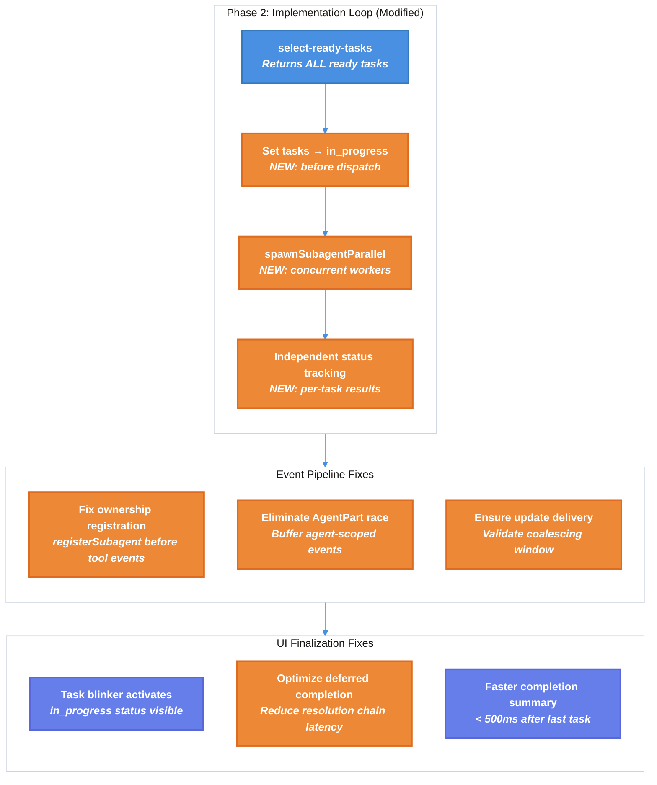

# Workflow Issues Fixes — Technical Design Document

| Document Metadata      | Details     |
| ---------------------- | ----------- |
| Author(s)              | Alex Lavaee |
| Status                 | Draft (WIP) |
| Team / Owner           | Atomic CLI  |
| Created / Last Updated | 2026-02-28  |

## 1. Executive Summary

This RFC addresses five interconnected issues in the Ralph workflow system that degrade the user experience during autonomous task execution. The issues are: (1) sub-agent tree UI stuck at "Initializing..." instead of showing tool call counts, (2) code-review running after every worker iteration due to an unconditional exit edge bug in the graph builder's `.loop()` construct, (3) sequential task execution where parallel execution is possible, (4) missing blink indicator for actively-worked-on tasks, and (5) multi-second delay between task completion and the final duration/token summary appearing. The proposed fixes range from event pipeline reliability improvements, a loop exit edge fix in `builder.ts`, a worker node refactor for parallel dispatching via `spawnSubagentParallel`, to explicit `"in_progress"` status transitions and deferred-completion pipeline optimizations. Together, these changes will make the Ralph workflow feel responsive, visually accurate, and significantly faster for multi-task workloads.

> **Research Reference:** [`research/docs/2026-02-28-workflow-issues-research.md`](../research/docs/2026-02-28-workflow-issues-research.md)

## 2. Context and Motivation

### 2.1 Current State

The Atomic CLI's Ralph workflow is a three-phase autonomous implementation system:

1. **Phase 1 (Planning):** A planner sub-agent decomposes a user prompt into a dependency-aware task list.
2. **Phase 2 (Implementation Loop):** A `select-ready-tasks` → `worker` loop iterates, dispatching one task per iteration via `spawnSubagent`.
3. **Phase 3 (Review & Fix):** A reviewer sub-agent evaluates all changes, optionally followed by a fixer sub-agent.

The graph engine (`compiled.ts`) executes nodes via a FIFO queue, processing one node at a time. The worker node (`graph.ts:154`) takes only `ready[0]` despite `getReadyTasks()` returning all dependency-satisfied tasks.

**Architecture References:**
- Graph engine: `src/workflows/graph/compiled.ts` (FIFO queue, sequential execution)
- Ralph graph: `src/workflows/ralph/graph.ts` (worker node, task selection)
- Executor: `src/workflows/executor.ts` (runtime wiring, `spawnSubagentParallel`)
- Event pipeline: `src/events/` (bus, coalescing, consumers)
- UI: `src/ui/chat.tsx` (agent state, stream finalization)

> **Research:** [`research/docs/2026-02-25-ralph-workflow-implementation.md`](../research/docs/2026-02-25-ralph-workflow-implementation.md), [`research/docs/2026-02-25-graph-execution-engine-technical-documentation.md`](../research/docs/2026-02-25-graph-execution-engine-technical-documentation.md)

### 2.2 The Problem

| Issue                                | User Impact                                                                         | Technical Root Cause                                                                                                                   |
| ------------------------------------ | ----------------------------------------------------------------------------------- | -------------------------------------------------------------------------------------------------------------------------------------- |
| **Sub-agent tree "Initializing..."** | Users see no feedback about tool activity during worker execution                   | `stream.agent.update` events may not reach the UI due to event pipeline chokepoints (coalescing, race conditions, ownership filtering) |
| **Code-review timing**               | Users perceive code review running after each task                                  | Already runs once post-loop; may be a perception issue or a different workflow configuration                                           |
| **Sequential task execution**        | Workflows with independent tasks take N× longer than necessary                      | Worker node takes only `ready[0]`; graph engine processes nodes sequentially via FIFO queue                                            |
| **Missing task blinker**             | Actively-worked-on tasks appear as static `○` (pending) instead of blinking `●`/`·` | Worker node doesn't set `"in_progress"` status before spawning; relies on sub-agent to set it via TodoWrite                            |
| **Completion delay**                 | Multi-second gap between last task completing and summary appearing                 | Deferred completion chain (active agents in React state), SDK `session.idle` latency, React state update batching                      |

> **Research:** [`research/docs/2026-02-28-workflow-issues-research.md`](../research/docs/2026-02-28-workflow-issues-research.md) §Summary

## 3. Goals and Non-Goals

### 3.1 Functional Goals

- [ ] **Issue 1:** Sub-agent tree displays tool call counts and current tool name for running worker agents, transitioning from "Initializing..." within the first tool use event
- [ ] **Issue 2:** Fix unconditional exit edge from `loop_check` → `reviewer` in `builder.ts` so reviewer only runs after loop exit; fix worker marking all currentTasks as completed when only one was dispatched
- [ ] **Issue 3:** Multiple dependency-ready tasks execute concurrently via `spawnSubagentParallel`, with independent status tracking per task
- [ ] **Issue 4:** Tasks actively being worked on display the blinking `●`/`·` indicator by having their status set to `"in_progress"` before worker dispatch
- [ ] **Issue 5:** Reduce the delay between the last task completing and the completion summary appearing to under 500ms

### 3.2 Non-Goals (Out of Scope)

- [ ] Refactoring the graph engine to support true parallel node execution (the FIFO queue stays; parallelism is within the worker node)
- [ ] Adding configurable concurrency limits for parallel task execution (all ready tasks run concurrently; throttling is a future enhancement)
- [ ] Redesigning the event bus or coalescing architecture
- [ ] Modifying the reviewer or fixer nodes
- [ ] Supporting user-interactive prompts during parallel task execution

## 4. Proposed Solution (High-Level Design)

### 4.1 System Architecture Diagram



### 4.2 Architectural Pattern

The solution uses an **intra-node parallelism** pattern: the graph engine's FIFO queue remains sequential (one node at a time), but the `worker` node internally dispatches multiple sub-agents concurrently via the existing `spawnSubagentParallel` infrastructure. This is the lowest-risk approach since:
- The graph engine doesn't need modification
- `spawnSubagentParallel` is already wired in `executor.ts:235-263`
- `getReadyTasks()` already returns all ready tasks
- The event pipeline already supports multiple concurrent sub-agents

> **Research:** [`research/docs/2026-02-28-workflow-issues-research.md`](../research/docs/2026-02-28-workflow-issues-research.md) §Issue 3, §3.3

### 4.3 Key Components

| Component            | Change                                                      | Files Affected                              | Justification                              |
| -------------------- | ----------------------------------------------------------- | ------------------------------------------- | ------------------------------------------ |
| Worker Node          | Dispatch all ready tasks via `spawnSubagentParallel`        | `src/workflows/ralph/graph.ts`              | Enables concurrent task execution          |
| Task Status Manager  | Set `"in_progress"` before dispatch, track per-task results | `src/workflows/ralph/graph.ts`              | Activates blink indicator, accurate status |
| Event Ownership      | Ensure sub-agent registration before tool events            | `src/events/adapters/subagent-adapter.ts`   | Prevents `isOwnedEvent()` drops            |
| Agent-Part Buffering | Buffer agent-scoped events until AgentPart exists           | `src/ui/parts/stream-pipeline.ts`           | Eliminates silent event drops              |
| Deferred Completion  | Reduce resolution chain latency                             | `src/ui/chat.tsx`, `src/ui/parts/guards.ts` | Faster completion summary                  |

## 5. Detailed Design

### 5.1 Issue 1: Sub-Agent Tree "Initializing..." Fix

#### 5.1.1 Root Cause Analysis

The `stream.agent.update` events carrying `toolUses` counts may fail to reach the UI through five identified chokepoints (see [research §1.3](../research/docs/2026-02-28-workflow-issues-research.md)):

1. **Event coalescing** (`coalescing.ts:31-34`): Updates are coalesced per agent per ~16ms batch window — acceptable for latest-wins semantics but drops all events if the subscription isn't yet active
2. **AgentPart race condition** (`stream-pipeline.ts:917-918`): Tool/text events with `agentId` are silently dropped if the `AgentPart` hasn't been created yet
3. **`useBusSubscription` bypass** (`chat.tsx:2882-2895`): The `stream.agent.update` handler bypasses the `StreamPipelineConsumer` entirely — if not mounted, events are lost
4. **Ownership check** (`wire-consumers.ts:83-86`): Events must pass `correlation.isOwnedEvent()` which checks `event.runId` matches `_activeRunId`
5. **Schema validation** (`event-bus.ts:140-152`): Malformed events are silently dropped

> **Research:** [`research/docs/2026-02-28-workflow-issues-research.md`](../research/docs/2026-02-28-workflow-issues-research.md) §1.2–§1.3, [`research/docs/2026-02-15-subagent-event-flow-diagram.md`](../research/docs/2026-02-15-subagent-event-flow-diagram.md)

#### 5.1.2 Proposed Fixes

**Fix 1A — Ensure agent registration before tool events:**

In `subagent-adapter.ts`, ensure `registerAgent()` is called and the `stream.agent.start` event is published to the bus **before** the first `handleToolUse()` can fire. Currently, the `SubagentStreamAdapter` constructor calls `registerAgent()` at line 95, but the `stream.agent.start` event is published by the executor (`executor.ts:217`). If the sub-agent SDK starts emitting tool events before the bus event is dispatched, tool events arrive at an unregistered agent.

```typescript
// subagent-adapter.ts — ensure synchronous registration
constructor(bus, sessionId, runId, agentId, agentName) {
  this.toolTracker = new SubagentToolTracker(bus, sessionId, runId);
  this.toolTracker.registerAgent(agentId);
  // Publish stream.agent.start synchronously before stream iteration begins
  bus.publish({
    type: "stream.agent.start",
    sessionId, runId, timestamp: Date.now(),
    data: { agentId, agentName, status: "running", isBackground: false }
  });
}
```

**Fix 1B — Buffer agent-scoped events until AgentPart exists:**

In `stream-pipeline.ts:917-918`, instead of silently dropping events when the target `AgentPart` doesn't exist, buffer them in a per-agent queue. When an `AgentPart` is created (via the `parallel-agents` event), flush the buffered events.

```typescript
// stream-pipeline.ts — add event buffering
private pendingAgentEvents = new Map<string, StreamPartEvent[]>();

routeToAgentInlineParts(event: StreamPartEvent, agentId: string): boolean {
  const agentPart = this.findAgentPart(agentId);
  if (!agentPart) {
    // Buffer instead of dropping
    const buffer = this.pendingAgentEvents.get(agentId) ?? [];
    buffer.push(event);
    this.pendingAgentEvents.set(agentId, buffer);
    return true; // Acknowledge event was handled (buffered)
  }
  // ... existing routing logic ...
  return true;
}

onAgentPartCreated(agentId: string): void {
  const buffered = this.pendingAgentEvents.get(agentId);
  if (buffered) {
    for (const event of buffered) {
      this.routeToAgentInlineParts(event, agentId);
    }
    this.pendingAgentEvents.delete(agentId);
  }
}
```

**Fix 1C — Add diagnostic logging:**

Add `console.debug` logging at each chokepoint to enable diagnosis when "Initializing..." persists:

| Location                      | Log Message                                                                       |
| ----------------------------- | --------------------------------------------------------------------------------- |
| `subagent-tool-tracker.ts:66` | `[ToolTracker] onToolStart: agentId=${agentId}, toolCount=${state.toolCount}`     |
| `event-bus.ts:150`            | `[EventBus] Schema validation failed for ${event.type}: ${error}`                 |
| `wire-consumers.ts:85`        | `[WireConsumers] Dropped unowned event: ${event.type}, runId=${event.runId}`      |
| `stream-pipeline.ts:918`      | `[StreamPipeline] Buffered agent-scoped event: ${event.type}, agentId=${agentId}` |

---

### 5.2 Issue 2: Code-Review Runs After Every Task (Unconditional Exit Edge Bug)

#### 5.2.1 Root Cause Identified

**The initial research was wrong** — the reviewer does NOT run only once. Deep investigation reveals the `loop_check` node has an **unconditional exit edge** to the reviewer, causing it to be enqueued on every loop iteration.

> **Research:** [`research/docs/2026-02-28-workflow-issues-research.md`](../research/docs/2026-02-28-workflow-issues-research.md) §Issue 2 (superseded by this analysis)

**The bug is in `builder.ts`'s `.loop()` method (line 734):**

After `.loop()` completes, it sets `this.currentNodeId = loopCheckId`. When the next chained method (`.subagent({ id: "reviewer" })`) calls `.then()` at `builder.ts:806` → `addEdge()` at line 360, it creates:

```typescript
// builder.ts:360 — created by .subagent() chained after .loop()
this.addEdge(this.currentNodeId, node.id);
// Translates to: addEdge("loop_check_N", "reviewer") — NO condition
```

This produces two outgoing edges from `loop_check_N`:

| Edge     | To                   | Condition                                 | Label             |
| -------- | -------------------- | ----------------------------------------- | ----------------- |
| Continue | `select-ready-tasks` | `!config.until(state) && iteration < max` | `"loop-continue"` |
| Exit     | `reviewer`           | **`undefined` (unconditional)**           | —                 |

In `getNextNodes()` (`compiled.ts:778-781`), both edges are evaluated independently:

```typescript
for (const edge of outgoingEdges) {
  if (!edge.condition || edge.condition(state)) {  // unconditional edges ALWAYS match
    matchingEdges.push(edge);
  }
}
```

**When the loop should continue** (`until` → `false`): BOTH edges match → both `select-ready-tasks` AND `reviewer` are enqueued in `nodeQueue`.

**Result:** The reviewer runs interleaved with the worker loop body on every single iteration:

| Step | Node Executed                                 | Queue After                                          |
| ---- | --------------------------------------------- | ---------------------------------------------------- |
| 1    | `worker` (task #1)                            | `[loop_check]`                                       |
| 2    | `loop_check`                                  | `[select-ready-tasks, reviewer]` ← **both enqueued** |
| 3    | `select-ready-tasks` (task #2)                | `[reviewer, worker]`                                 |
| 4    | **`reviewer`** ← runs mid-loop                | `[worker, decision]`                                 |
| 5    | `worker` (task #2)                            | `[decision, loop_check]`                             |
| ...  | *(interleaved reviewer/fixer and loop nodes)* |                                                      |

#### 5.2.2 Secondary Bug: Batch Status Marking

An additional bug compounds the issue. The worker node dispatches only `ready[0]` but marks ALL `currentTasks` as completed/error (`graph.ts:168-174`):

```typescript
// graph.ts:153 — dispatches ONLY the first ready task
const task = ready[0];

// graph.ts:168-174 — marks ALL currentTasks (not just ready[0])
tasks: ctx.state.tasks.map((t) => {
  const wasReady = ctx.state.currentTasks.some((ct) => ct.id === t.id);
  if (wasReady) {
    return { ...t, status: result.success ? "completed" : "error" };
  }
  return t;
}),
```

If `getReadyTasks()` returns `[A, B]` (both independent), the worker dispatches only A's prompt to the sub-agent, but marks **both A and B** as "completed" based on A's result. Task B's work is never performed.

#### 5.2.3 Proposed Fix: Conditional Exit Edge in `builder.ts`

**Fix 2A — Make the exit edge conditional (inverse of continue):**

The `.loop()` method must create an explicit conditional exit edge rather than relying on the implicit unconditional edge from the next chained `.then()` call. The exit edge should only match when the loop `until` condition is `true`.

```typescript
// builder.ts — inside loop() method, after creating the continue edge

// Create explicit conditional exit edge (inverse of continue condition)
// Store the loop exit target for the next chained method to use
this._loopExitNodeId = loopCheckId;
this._loopUntilCondition = config.until;
this._loopMaxIterations = maxIterations;
this._loopStartId = loopStartId;
```

Then modify `.then()` (or the `addEdge` call that connects from `loopCheckId`) to add a condition when the source is a loop check node:

**Preferred approach — override `currentNodeId` setter in `.loop()`:**

Instead of setting `this.currentNodeId = loopCheckId` directly, create a synthetic "loop_exit" node that only activates when the `until` condition is true:

```typescript
// builder.ts — end of loop() method

// Create a loop_exit sentinel node that passes through
const loopExitId = this.generateNodeId("loop_exit");
const loopExitNode = this.createNode(loopExitId, "decision", async (ctx) => {
  return { stateUpdate: {} as Partial<TState> };
});
this.nodes.push(loopExitNode);

// Conditional exit edge: only taken when until() is true
this.addEdge(
  loopCheckId,
  loopExitId,
  (state) => {
    const iterationKey = `${loopStartId}_iteration`;
    const currentIteration = (state.outputs[iterationKey] as number) ?? 0;
    return config.until(state) || currentIteration >= maxIterations;
  },
  "loop-exit"
);

// Set currentNodeId to the exit node so the next .then() chains from it
this.currentNodeId = loopExitId;
```

This ensures:
- The `loop-continue` edge matches when `!until(state) && iteration < max`
- The `loop-exit` edge matches when `until(state) || iteration >= max`
- These conditions are **mutually exclusive** — exactly one edge matches per iteration
- The next chained method (`.subagent({ id: "reviewer" })`) creates an unconditional edge from `loop_exit` (not from `loop_check`), so the reviewer is only reachable after the loop truly exits

**Edge topology after fix:**

```
loop_check ──[!until && iter < max]──→ select-ready-tasks  (continue)
loop_check ──[until || iter >= max]──→ loop_exit            (exit)
loop_exit  ──[unconditional]─────────→ reviewer
```

#### 5.2.4 Fix 2B — Worker Status Marking (addressed in §5.3)

The batch status marking bug is resolved by the parallel execution refactor in §5.3, which maps each task's result independently. For the sequential case (single ready task), the fix is:

```typescript
// graph.ts — worker node stateUpdate (fix for single-task case)
tasks: ctx.state.tasks.map((t) => {
  // Only mark the task that was actually dispatched, not all currentTasks
  if (t.id === task?.id) {
    return { ...t, status: result.success ? "completed" : "error" };
  }
  return t;
}),
```

This is superseded by the parallel execution refactor in §5.3 which handles multiple tasks correctly.

---

### 5.3 Issue 3: Parallel Task Execution

#### 5.3.1 Current Bottleneck

Two layers enforce sequential execution:
1. **Graph engine** (`compiled.ts:383`): FIFO queue processes one node at a time
2. **Worker node** (`graph.ts:154`): Takes only `ready[0]` from `getReadyTasks()`

> **Research:** [`research/docs/2026-02-28-workflow-issues-research.md`](../research/docs/2026-02-28-workflow-issues-research.md) §3.1–§3.2

#### 5.3.2 Proposed Solution: Intra-Node Parallelism

Modify the worker node to dispatch **all** ready tasks concurrently via `spawnSubagentParallel`, while keeping the graph engine sequential.

**Modified Worker Node (`graph.ts`):**

```typescript
{
  id: "worker",
  type: "agent",
  retry: { maxAttempts: 1, backoffMs: 0, backoffMultiplier: 1 },
  async execute(ctx: ExecutionContext<RalphWorkflowState>): Promise<NodeResult<RalphWorkflowState>> {
    const spawnSubagentParallel = ctx.config.runtime?.spawnSubagentParallel;
    if (!spawnSubagentParallel) {
      throw new Error("spawnSubagentParallel not available in runtime config");
    }

    const ready = ctx.state.currentTasks;
    if (ready.length === 0) {
      return {
        stateUpdate: { iteration: ctx.state.iteration + 1 },
      };
    }

    // Set all ready tasks to "in_progress" before dispatch (Issue 4 fix)
    const tasksWithProgress = ctx.state.tasks.map((t) => {
      const isReady = ready.some((r) => r.id === t.id);
      return isReady ? { ...t, status: "in_progress" } : t;
    });

    // Build spawn configs for all ready tasks
    const spawnConfigs = ready.map((task) => ({
      agentName: "worker",
      agentId: `worker-${task.id}`,
      task: buildWorkerAssignment(task, tasksWithProgress),
      // ... other spawn options (model, system prompt, etc.)
    }));

    // Dispatch all ready tasks concurrently
    const results = await spawnSubagentParallel(spawnConfigs, ctx.abortSignal);

    // Map results back to tasks independently
    const updatedTasks = tasksWithProgress.map((t) => {
      const readyIndex = ready.findIndex((r) => r.id === t.id);
      if (readyIndex === -1) return t;
      const result = results[readyIndex];
      return { ...t, status: result?.success ? "completed" : "error" };
    });

    return {
      stateUpdate: {
        iteration: ctx.state.iteration + 1,
        tasks: updatedTasks,
      },
    };
  },
}
```

**Key changes:**
1. Uses `spawnSubagentParallel` instead of `spawnSubagent`
2. Dispatches all ready tasks, not just `ready[0]`
3. Independently tracks each task's success/failure based on its corresponding result
4. Sets tasks to `"in_progress"` before dispatch (ties into Issue 4)
5. Increments `iteration` by 1 per batch (not per task)

#### 5.3.3 Loop Iteration Semantics

With parallel execution, `iteration` increments by 1 per loop pass (batch), regardless of how many tasks run concurrently. This matches the existing semantics: one pass through `select-ready-tasks → worker` = one iteration. The `maxIterations` guard (default 100) limits loop passes, not individual task executions.

#### 5.3.4 Dependency Safety

`getReadyTasks()` already ensures only tasks with all dependencies satisfied are returned. Since tasks dispatched in parallel are all dependency-ready at the point of selection, concurrent execution cannot violate dependency ordering. Tasks that depend on currently-executing tasks will not appear in `getReadyTasks()` until the next loop iteration when their dependencies are marked `"completed"`.

> **Research:** [`research/docs/2026-02-28-workflow-issues-research.md`](../research/docs/2026-02-28-workflow-issues-research.md) §3.3–§3.4, [`research/docs/2026-02-15-ralph-dag-orchestration-implementation.md`](../research/docs/2026-02-15-ralph-dag-orchestration-implementation.md)

---

### 5.4 Issue 4: Task List Blinker for Active Tasks

#### 5.4.1 Current Gap

The blink indicator infrastructure exists and works correctly for tasks with `status === "in_progress"`. However, the Ralph worker node transitions tasks directly from `"pending"` → `"completed"`/`"error"` without an intermediate `"in_progress"` state. The blinker only activates if the spawned sub-agent itself sets `"in_progress"` via TodoWrite — which is not guaranteed.

> **Research:** [`research/docs/2026-02-28-workflow-issues-research.md`](../research/docs/2026-02-28-workflow-issues-research.md) §4.7, [`research/docs/2026-02-13-ralph-task-list-ui.md`](../research/docs/2026-02-13-ralph-task-list-ui.md)

#### 5.4.2 Proposed Fix

**Explicit `"in_progress"` status in worker node (already included in §5.3.2):**

Before dispatching tasks, the worker node sets all dispatched tasks to `"in_progress"`. This is then persisted via `saveTasksToSession()` in the executor's `for await` loop, which triggers:

1. `saveTasksToActiveSession()` writes updated `tasks.json`
2. `watchTasksJson()` in `workflow-commands.ts:719` detects the file change
3. `TaskListPanel` re-renders with the `"in_progress"` status
4. `TaskListIndicator` renders `AnimatedBlinkIndicator` for those tasks

**Intermediate state update (emit before parallel spawn):**

To ensure the UI sees `"in_progress"` **before** workers start, we need to emit a state update with the `"in_progress"` tasks prior to awaiting `spawnSubagentParallel`. This requires either:

- **Option A:** Yielding an intermediate state from the worker node (requires node protocol change to support intermediate yields)
- **Option B:** Writing `tasks.json` directly from the worker node before spawning
- **Option C:** Accepting the delay — the state update will be visible once the worker node's result is processed by the executor, which may be after the spawn completes

**Recommended: Event-based approach** — The worker node publishes a `workflow.task.statusChange` event via the event bus, and the executor subscribes to persist the change:

```typescript
// In worker node execute():
// 1. Set tasks to in_progress in state
const tasksWithProgress = ctx.state.tasks.map((t) => {
  const isReady = ready.some((r) => r.id === t.id);
  return isReady ? { ...t, status: "in_progress" } : t;
});

// 2. Publish status change event — executor subscriber persists to tasks.json
ctx.config.runtime?.eventBus?.publish({
  type: "workflow.task.statusChange",
  sessionId: ctx.config.sessionId,
  runId: ctx.config.runId,
  timestamp: Date.now(),
  data: {
    taskIds: ready.map((r) => r.id),
    newStatus: "in_progress",
    tasks: tasksWithProgress,
  },
});

// 3. Dispatch workers (blinker is already visible via file watcher)
const results = await spawnSubagentParallel(spawnConfigs, ctx.abortSignal);
```

This requires:
- Defining `workflow.task.statusChange` in `bus-events.ts`
- Adding a bus subscriber in `executor.ts` that calls `saveTasksToSession` on this event
- Wiring `eventBus` into the runtime config (already partially done via `WorkflowEventAdapter`)

#### 5.4.3 Status Flow After Fix

```
pending (○ static) → in_progress (● ↔ · blink) → completed (✓ static)
                                                  → error (✗ static)
```

---

### 5.5 Issue 5: Streaming Delay After TODO Completion

#### 5.5.1 Identified Delay Sources

Six sources contribute to the delay between the last task completing and the completion summary appearing (see [research §5.5](../research/docs/2026-02-28-workflow-issues-research.md)):

| Source                        | Location                 | Est. Latency           | Fixable?        |
| ----------------------------- | ------------------------ | ---------------------- | --------------- |
| **A: Deferred completion**    | `chat.tsx:2516-2556`     | 50-200ms (React chain) | Yes             |
| **B: SDK `session.idle`**     | Adapter-specific         | 0-3s (SDK-internal)    | Partially       |
| **C: BatchDispatcher flush**  | `batch-dispatcher.ts:20` | ≤16ms                  | No (acceptable) |
| **D: File I/O in graph loop** | `executor.ts:301-306`    | 5-50ms per step        | Yes             |
| **E: React state batching**   | Multiple `set*` calls    | 16-50ms                | Partially       |
| **F: Task progress check**    | `loading-state.ts:35-55` | 0-16ms                 | No (acceptable) |

> **Research:** [`research/docs/2026-02-28-workflow-issues-research.md`](../research/docs/2026-02-28-workflow-issues-research.md) §5.4–§5.6

#### 5.5.2 Proposed Optimizations

**Fix 5A — Reduce deferred completion latency:**

The deferred completion resolution chain (`stream.agent.complete` → 16ms batch → React state → `useEffect` → `setTimeout(0)` → `handleStreamComplete`) can be shortened by:

1. **Bypass `setTimeout(0)` in `useEffect`** (`chat.tsx:3268`): The `setTimeout(…, 0)` was added to ensure React batch completion, but with React 18+ automatic batching, this is unnecessary. Call `pendingComplete()` directly:

```typescript
// chat.tsx useEffect at ~3268
if (pendingCompleteRef.current) {
  const pendingComplete = pendingCompleteRef.current;
  pendingCompleteRef.current = null;
  pendingComplete(); // Direct call instead of setTimeout(0)
}
```

2. **Early agent completion detection:** When the last foreground agent's `stream.agent.complete` event is processed in `useBusSubscription("stream.agent.complete")`, immediately check if deferred completion should resolve, rather than waiting for the React re-render → `useEffect` cycle:

```typescript
// chat.tsx useBusSubscription("stream.agent.complete") handler
useBusSubscription("stream.agent.complete", (event) => {
  setParallelAgents((current) => {
    const updated = current.map((a) =>
      a.id === event.data.agentId ? { ...a, status: "completed", ... } : a
    );
    // Eagerly check deferred completion
    if (pendingCompleteRef.current && !hasActiveForegroundAgents(updated)) {
      const pending = pendingCompleteRef.current;
      pendingCompleteRef.current = null;
      queueMicrotask(() => pending());
    }
    return updated;
  });
});
```

**Fix 5B — Debounce `saveTasksToSession` file I/O:**

Instead of performing `atomicWrite()` on every graph step, debounce task saves:

```typescript
// executor.ts — debounced task save
let pendingTaskSave: ReturnType<typeof setTimeout> | null = null;
let latestTasks: NormalizedTodoItem[] | null = null;

const debouncedSave = async (tasks: NormalizedTodoItem[], sessionId: string) => {
  latestTasks = tasks;
  if (pendingTaskSave) clearTimeout(pendingTaskSave);
  pendingTaskSave = setTimeout(async () => {
    if (latestTasks && options?.saveTasksToSession) {
      await options.saveTasksToSession(latestTasks, sessionId);
    }
    pendingTaskSave = null;
  }, 100); // 100ms debounce
};

// Ensure final save on graph completion
// After for-await loop:
if (latestTasks && options?.saveTasksToSession) {
  await options.saveTasksToSession(latestTasks, sessionId);
}
```

**Fix 5C — Consolidate React state updates:**

In `handleStreamComplete()` Path 3 (normal completion), consolidate the nested `setParallelAgents` → `setMessagesWindowed` calls into a single React batch:

```typescript
// Use ReactDOM.flushSync or unstable_batchedUpdates if needed
// Or restructure to set both states in a single callback
import { flushSync } from "react-dom";

flushSync(() => {
  setParallelAgents(finalizedAgents);
  setMessagesWindowed(finalizedMessages);
});
```

---

## 6. Alternatives Considered

| Option                                                                               | Pros                                  | Cons                                                                                       | Reason for Rejection                                                                                                    |
| ------------------------------------------------------------------------------------ | ------------------------------------- | ------------------------------------------------------------------------------------------ | ----------------------------------------------------------------------------------------------------------------------- |
| **Graph-level parallelism** (modify FIFO queue to process nodes concurrently)        | True DAG parallelism                  | High risk — requires rewriting graph engine, state merge conflicts, complex error handling | Unnecessary — intra-node parallelism via `spawnSubagentParallel` achieves the same user-facing result with minimal risk |
| **Web Worker for sub-agent streams** (offload event processing)                      | Eliminates React main-thread blocking | Adds complexity, requires serialization boundary                                           | Overkill for current scale — event processing is not the primary bottleneck                                             |
| **Polling-based tool count updates** (poll sub-agent status instead of event-driven) | Guaranteed regular updates            | Higher overhead, less responsive, architectural regression                                 | Event-driven is correct; the fix is ensuring events reach the UI                                                        |
| **SSE for completion signal** (replace deferred completion with server-sent events)  | Simpler completion model              | Requires infrastructure change, doesn't address root cause (React state)                   | The deferred completion pattern is fundamentally sound; optimizations are sufficient                                    |

> **Research:** [`research/docs/2026-02-25-workflow-sdk-patterns.md`](../research/docs/2026-02-25-workflow-sdk-patterns.md)

## 7. Cross-Cutting Concerns

### 7.1 Error Handling

**Parallel task failures:** When running tasks in parallel, individual task failures must not abort the entire batch. Each task's result is independently tracked:

```typescript
const results = await spawnSubagentParallel(spawnConfigs, ctx.abortSignal);
// results[i] corresponds to spawnConfigs[i] / ready[i]
// Each result has .success boolean — failed tasks become "error", others "completed"
```

**Abort signal propagation:** The `ctx.abortSignal` is passed to `spawnSubagentParallel`, which should propagate it to all concurrent sub-agents. If the workflow is cancelled, all running workers should abort.

### 7.2 Observability

- **Task execution metrics:** Log the number of parallel tasks dispatched per loop iteration, individual task durations, and success/failure rates
- **Event pipeline tracing:** Add trace-level logging at each chokepoint identified in Issue 1 to diagnose future "Initializing..." occurrences
- **Completion latency:** Log timestamps at `handleStreamComplete()` entry, deferred closure creation, and deferred resolution to measure improvement

### 7.3 Performance Impact

- **Parallel execution:** N concurrent tasks consume N× the memory and API tokens. For typical workflows (3-8 independent tasks), this is acceptable. For large task lists (20+), resource pressure may become a concern.
- **File I/O reduction:** Debouncing `saveTasksToSession` reduces disk writes from once-per-step to once-per-100ms, improving I/O-bound performance.
- **React render reduction:** Consolidating state updates reduces the number of render cycles during finalization from 3-5 to 1-2.

## 8. Migration, Rollout, and Testing

### 8.1 Deployment Strategy

- [ ] **Phase 1:** Issue 1 (event pipeline fixes) + Issue 4 (in_progress status) — lowest risk, immediate UX improvement
- [ ] **Phase 2:** Issue 3 (parallel task execution) — moderate risk, requires thorough testing of dependency logic and error handling
- [ ] **Phase 3:** Issue 5 (completion delay optimization) — requires careful testing to avoid race conditions in finalization
- [ ] **Phase 4:** Issue 2 (loop exit edge fix in `builder.ts`, worker status marking fix in `graph.ts`)

### 8.2 Test Plan

**Unit Tests:**

| Test Case                                | File                      | Description                                                    |
| ---------------------------------------- | ------------------------- | -------------------------------------------------------------- |
| `getReadyTasks returns all ready tasks`  | `graph.test.ts`           | Verify multiple independent tasks are returned                 |
| `worker dispatches all ready tasks`      | `graph.test.ts`           | Verify `spawnSubagentParallel` is called with all ready tasks  |
| `independent status tracking`            | `graph.test.ts`           | Verify task A success + task B failure produces correct states |
| `in_progress status set before dispatch` | `graph.test.ts`           | Verify tasks are set to `"in_progress"` before spawn           |
| `event buffering in stream pipeline`     | `stream-pipeline.test.ts` | Verify buffered events are flushed when AgentPart is created   |
| `deferred completion resolves eagerly`   | `chat.test.ts`            | Verify completion fires immediately after last agent completes |

**Integration Tests:**

| Test Case                               | Description                                                                                   |
| --------------------------------------- | --------------------------------------------------------------------------------------------- |
| `parallel workflow execution`           | Run Ralph with a task list containing 3 independent tasks; verify all 3 dispatch concurrently |
| `dependency chain respected`            | Run Ralph with A→B→C chain; verify sequential execution                                       |
| `mixed parallel and sequential`         | Run Ralph with tasks {A, B (depends on A), C}; verify A+C run in parallel, B runs after A     |
| `task blinker visible during execution` | Verify `tasks.json` contains `"in_progress"` status during worker execution                   |
| `completion summary timing`             | Measure delay between last task completion and summary render; verify < 500ms                 |

**E2E Tests:**

| Test Case                                 | Description                                                      |
| ----------------------------------------- | ---------------------------------------------------------------- |
| `full Ralph workflow with parallel tasks` | End-to-end workflow execution in TUI with parallel task dispatch |
| `sub-agent tree shows tool counts`        | Verify "Initializing..." transitions to tool count display       |

## 9. Resolved Questions

1. **Concurrency limit for parallel task execution?**
   **Decision: No limit** — run all ready tasks concurrently. For typical workflows (3-8 independent tasks), this is acceptable. A configurable `maxConcurrency` option can be added as a future enhancement if rate limiting becomes an issue.

2. **How should `iteration` increment with parallel tasks?**
   **Decision: 1 per batch** — matches current loop semantics. One pass through `select-ready-tasks → worker` = one iteration, regardless of how many tasks run concurrently. The `maxIterations` guard limits loop passes, not individual task executions.

3. **Event buffer vs. ownership fix for "Initializing..." issue?**
   **Decision: Both fixes (1A + 1B)** — belt-and-suspenders approach. Fix 1A (ownership registration) prevents the most common failure mode. Fix 1B (event buffering) is a safety net against all remaining race conditions in the AgentPart creation path.

4. **`saveTasksToSession` debounce strategy?**
   **Decision: Time-based debounce (100ms) with final flush** — matches OpenCode's pattern. OpenCode uses a debounce-and-flush approach with a `pending` map and `setTimeout` to batch pending writes, flushing them periodically rather than on every operation (see [OpenCode Storage](https://deepwiki.com/wiki/anomalyco/opencode)). The final flush on graph completion ensures no state is lost.

5. **Runtime config function vs. event-based approach for task status updates?**
   **Decision: Event-based approach** — cleaner long-term architecture, consistent with OpenCode's `Bus` + `Session.updatePart()` pattern. The worker node will publish a `workflow.task.statusChange` event (with new status and task IDs) via the event bus, and the executor will subscribe to this event to handle persistence via `saveTasksToSession`. This keeps the worker node decoupled from the persistence mechanism and enables other consumers (e.g., UI) to react to task status changes independently. This requires defining a new `workflow.task.statusChange` bus event type in `bus-events.ts` and adding a subscriber in `executor.ts`.
