# Workflow SDK Implementation: Custom Tools, Sub-Agents, and Graph Execution

| Document Metadata      | Details                                                   |
| ---------------------- | --------------------------------------------------------- |
| Author(s)              | Alex Lavaee                                               |
| Status                 | Draft (WIP)                                               |
| Team / Owner           | Atomic Core                                               |
| Created / Last Updated | 2026-02-11                                                |
| Research Reference     | `research/docs/2026-02-11-workflow-sdk-implementation.md` |

## 1. Executive Summary

This RFC proposes bridging three currently disjoint subsystems — custom tools (`src/sdk/tools/`), sub-agents (`src/ui/subagent-session-manager.ts`), and the graph execution engine (`src/graph/`) — into a cohesive workflow SDK. Today, custom tools defined in `.atomic/tools/` are registered at the SDK client level but cannot be referenced by name in graph node definitions. Sub-agents operate exclusively through the TUI layer's `SubagentSessionManager` with no integration into graph state management. This proposal introduces: (1) a **`customToolNode()` factory** that resolves discovered tools by name and wraps them as first-class graph nodes, (2) a **`subagentNode()` factory** that bridges `SubagentSessionManager` into the graph engine with state-aware result aggregation, and (3) a **tool registry** that enables declarative tool references across the workflow SDK.

**Research Reference:** [Workflow SDK Implementation Research](research/docs/2026-02-11-workflow-sdk-implementation.md)

## 2. Context and Motivation

### 2.1 Current State

The Atomic CLI has a layered architecture with three distinct subsystems relevant to workflow authoring:

```
┌─────────────────────────────────────────────────────────────┐
│                    TUI Layer (src/ui/)                       │
│  SubagentSessionManager (independent session lifecycle)     │
│  workflow-commands.ts (slash commands, workflow dispatch)    │
├─────────────────────────────────────────────────────────────┤
│                  Graph Engine (src/graph/)                   │
│  builder.ts (fluent API) │ compiled.ts (executor)           │
│  nodes.ts (agentNode, toolNode, decisionNode, etc.)         │
│  annotation.ts (typed state management)                     │
├─────────────────────────────────────────────────────────────┤
│                  SDK Layer (src/sdk/)                        │
│  tools/ (discovery.ts, plugin.ts, schema-utils.ts)          │
│  claude-client.ts │ opencode-client.ts │ copilot-client.ts  │
└─────────────────────────────────────────────────────────────┘
```

**Custom Tools** are discovered from `.atomic/tools/` and `~/.atomic/tools/`, converted from Zod schemas to JSON Schema via `convertToToolDefinition()`, and registered with the SDK client via `client.registerTool()` — making them available to AI agents during chat sessions. ([Research §4](research/docs/2026-02-11-workflow-sdk-implementation.md#4-custom-tools-system-srcsdktools))

**Sub-Agents** are managed by `SubagentSessionManager` in the TUI layer with concurrency limiting (default 5), independent session lifecycle, and `Promise.allSettled()`-based parallel spawning. Results are collected as truncated text summaries (max 2000 chars). ([Research §5](research/docs/2026-02-11-workflow-sdk-implementation.md#5-sub-agent-management))

**Graph Engine** provides node factories for `agentNode()`, `toolNode()`, `decisionNode()`, `subgraphNode()`, `parallelNode()`, `waitNode()`, `askUserNode()`, `clearContextNode()`, and `contextMonitorNode()`. The graph executor uses BFS traversal with retry logic, checkpointing, and signal handling. ([Research §1](research/docs/2026-02-11-workflow-sdk-implementation.md#1-graph-execution-engine-srcgraph))

**Reference:** [Pluggable Workflows SDK Design](research/docs/2026-02-05-pluggable-workflows-sdk-design.md), [Custom Tools Directory](research/docs/2026-02-09-165-custom-tools-directory.md)

### 2.2 The Problem

**Custom tools cannot be referenced from workflow graphs:**
- `toolNode()` requires an explicit `execute` function at graph definition time (`src/graph/nodes.ts:362`)
- Custom tools from `.atomic/tools/` are only registered with the SDK client, not accessible to the graph engine
- Workflow authors must duplicate tool logic instead of referencing existing tools by name

**Sub-agents are isolated from graph state:**
- `SubagentSessionManager` operates in the TUI layer independently of `GraphExecutor` (`src/ui/subagent-session-manager.ts:106`)
- No mechanism to feed sub-agent results back into parent workflow state updates
- `parallelNode()` defines branches by node IDs, not by sub-agent sessions — no native way to spawn multiple sub-agents and synchronize results
- Built-in sub-agent types (explore, task, general-purpose, code-review) are not formalized as a discoverable registry

**Tool context mismatch:**
- Custom tool handlers receive `ToolContext` (sessionID, messageID, agent, directory, abort) but lack workflow state access
- `agentNode()` operates within `ExecutionContext<TState>` with full state — this context is not propagated to tool handlers

**Workflow resolver type safety gap:**
- `WorkflowResolver` returns `CompiledSubgraph<BaseState>` but subgraph nodes are generic over `TSubState`
- Runtime casting at `src/graph/nodes.ts:1189` (`as unknown as CompiledSubgraph<TSubState>`) masks type mismatches

**Reference:** [Research — Open Questions](research/docs/2026-02-11-workflow-sdk-implementation.md#open-questions)

## 3. Goals and Non-Goals

### 3.1 Functional Goals

- [ ] **G1:** Custom tools from `.atomic/tools/` and `~/.atomic/tools/` can be invoked as graph nodes by name via a `customToolNode()` factory
- [ ] **G2:** A global tool registry provides name-based tool lookup at graph definition and execution time
- [ ] **G3:** A `subagentNode()` factory enables spawning sub-agents within graph execution with typed result mapping back to workflow state
- [ ] **G4:** Sub-agent orchestration supports `parallelSubagentNode()` for concurrent multi-agent execution with a `"merge"` strategy that aggregates all agent responses into the workflow session directory
- [ ] **G4a:** Each workflow execution gets a persistent session directory at `~/.atomic/workflows/sessions/{sessionId}/` with sub-agent outputs stored as individual files. All workflows (including Ralph) share this global directory.
- [ ] **G5:** Custom tools have optional access to workflow execution context (read-only state) when invoked from graph nodes
- [ ] **G6:** Workflow authors can declaratively specify tool availability per `agentNode()` using tool names from the registry
- [ ] **G7:** All new node factories integrate with existing graph engine features: retry, checkpointing, telemetry, and signal handling

### 3.2 Non-Goals (Out of Scope)

- [ ] We will NOT change the existing `toolNode()` API — it continues to work with explicit `execute` functions
- [ ] We will NOT modify the `SubagentSessionManager` TUI-layer implementation — we will bridge to it
- [ ] We will NOT implement custom sub-agent definitions from `.atomic/agents/` directories in this iteration (covered by pluggable workflows SDK spec)
- [ ] We will NOT add new SDK client methods — we work within the existing `CodingAgentClient` and `Session` interfaces
- [ ] We will NOT implement workflow-level tool security or sandboxing

## 4. Proposed Solution (High-Level Design)

### 4.1 System Architecture Diagram

```mermaid
%%{init: {'theme':'base', 'themeVariables': { 'primaryColor':'#f8f9fa','primaryTextColor':'#2c3e50','primaryBorderColor':'#4a5568','lineColor':'#4a90e2','secondaryColor':'#ffffff','tertiaryColor':'#e9ecef'}}}%%

flowchart TB
    classDef registry fill:#48bb78,stroke:#38a169,stroke-width:2.5px,color:#ffffff,font-weight:600
    classDef graphNode fill:#5a67d8,stroke:#4c51bf,stroke-width:2.5px,color:#ffffff,font-weight:600
    classDef existing fill:#718096,stroke:#4a5568,stroke-width:2px,color:#ffffff,font-weight:600
    classDef bridge fill:#ed8936,stroke:#dd6b20,stroke-width:2.5px,color:#ffffff,font-weight:600

    subgraph Discovery["Discovery Layer"]
        ToolFiles["📁 .atomic/tools/*.ts<br>~/.atomic/tools/*.ts"]:::existing
        ToolDiscovery["discoverToolFiles()<br>loadToolsFromDisk()"]:::existing
    end

    subgraph RegistryLayer["Tool Registry (NEW)"]
        ToolRegistry["🗄️ ToolRegistry<br>name → ToolEntry"]:::registry
    end

    subgraph GraphEngine["Graph Engine (src/graph/)"]
        CustomToolNode["customToolNode()<br>(NEW)"]:::graphNode
        SubagentNode["subagentNode()<br>(NEW)"]:::graphNode
        ParallelSubagent["parallelSubagentNode()<br>(NEW)"]:::graphNode
        ExistingNodes["agentNode() │ toolNode()<br>decisionNode() │ etc."]:::existing
    end

    subgraph Bridge["Bridge Layer (NEW)"]
        ToolBridge["ToolRegistryBridge<br>resolveByName()"]:::bridge
        SubagentBridge["SubagentGraphBridge<br>spawn + state map"]:::bridge
    end

    subgraph TUI["TUI Layer (existing)"]
        SubagentMgr["SubagentSessionManager"]:::existing
        SDKClient["CodingAgentClient<br>registerTool()"]:::existing
    end

    ToolFiles --> ToolDiscovery
    ToolDiscovery --> ToolRegistry
    ToolDiscovery --> SDKClient

    ToolRegistry --> ToolBridge
    ToolBridge --> CustomToolNode

    SubagentMgr --> SubagentBridge
    SubagentBridge --> SubagentNode
    SubagentBridge --> ParallelSubagent

    CustomToolNode --> ExistingNodes
    SubagentNode --> ExistingNodes
    ParallelSubagent --> ExistingNodes

    style Discovery fill:#ffffff,stroke:#cbd5e0,stroke-width:2px,stroke-dasharray:8 4
    style RegistryLayer fill:#f0fff4,stroke:#38a169,stroke-width:2px
    style GraphEngine fill:#ebf4ff,stroke:#4a90e2,stroke-width:2px
    style Bridge fill:#fffaf0,stroke:#dd6b20,stroke-width:2px,stroke-dasharray:8 4
    style TUI fill:#ffffff,stroke:#cbd5e0,stroke-width:2px,stroke-dasharray:8 4
```



### 4.2 Architectural Pattern

We adopt a **Registry + Bridge** pattern:

1. **Tool Registry** — A singleton registry that stores discovered tool entries (handler + metadata) and provides name-based lookup. Populated during startup alongside existing `registerCustomTools()` flow.
2. **Tool Bridge** — Adapts registry entries into `NodeDefinition<TState>` instances consumable by the graph engine.
3. **Sub-Agent Bridge** — Wraps `SubagentSessionManager` spawning within graph execution context, mapping sub-agent results back to typed state updates.

This avoids modifying existing subsystems. The bridges are thin adapters that compose existing behavior.

**Reference:** [Research — Dependency Injection Patterns](research/docs/2026-02-11-workflow-sdk-implementation.md#dependency-injection-patterns) — Follows existing `setClientProvider()` / `setWorkflowResolver()` global setter pattern.

### 4.3 Key Components

| Component                | Responsibility                                                | Location                         | Justification                                                      |
| ------------------------ | ------------------------------------------------------------- | -------------------------------- | ------------------------------------------------------------------ |
| `ToolRegistry`           | Global name→tool mapping for discovered custom tools          | `src/sdk/tools/registry.ts`      | Decouples tool lookup from client registration                     |
| `SubagentTypeRegistry`   | Global name→agent mapping for discovered sub-agents           | `src/graph/subagent-registry.ts` | Enables workflow authors to reference custom agents by name        |
| `customToolNode()`       | Graph node factory wrapping a registered tool by name         | `src/graph/nodes.ts`             | Co-located with existing node factories                            |
| `SubagentGraphBridge`    | Adapts `SubagentSessionManager` for graph execution           | `src/graph/subagent-bridge.ts`   | Bridge layer between TUI sub-agent system and graph engine         |
| `subagentNode()`         | Graph node factory for single sub-agent execution             | `src/graph/nodes.ts`             | Co-located with existing node factories                            |
| `parallelSubagentNode()` | Graph node factory for concurrent sub-agent execution         | `src/graph/nodes.ts`             | Co-located with existing node factories                            |
| `WorkflowToolContext`    | Extended tool context with read-only workflow state           | `src/graph/types.ts`             | Type extension for workflow-aware tool execution                   |
| `WorkflowSessionManager` | Manages `~/.atomic/workflows/sessions/{sessionId}/` lifecycle | `src/workflows/session.ts`       | Global-level session directory for all workflows (including Ralph) |

## 5. Detailed Design

### 5.1 Tool Registry

A singleton registry that sits between tool discovery and tool consumption.

**File:** `src/sdk/tools/registry.ts`

```typescript
import type { ToolDefinition } from "../types";
import type { ToolInput } from "./plugin";

interface ToolEntry {
  name: string;
  description: string;
  definition: ToolDefinition;
  source: "local" | "global";
  filePath: string;
}

class ToolRegistry {
  private tools = new Map<string, ToolEntry>();

  register(entry: ToolEntry): void {
    this.tools.set(entry.name, entry);
  }

  get(name: string): ToolEntry | undefined {
    return this.tools.get(name);
  }

  has(name: string): boolean {
    return this.tools.has(name);
  }

  getAll(): ToolEntry[] {
    return Array.from(this.tools.values());
  }

  clear(): void {
    this.tools.clear();
  }
}

// Singleton instance
let globalToolRegistry: ToolRegistry | null = null;

export function getToolRegistry(): ToolRegistry {
  if (!globalToolRegistry) {
    globalToolRegistry = new ToolRegistry();
  }
  return globalToolRegistry;
}

export function setToolRegistry(registry: ToolRegistry): void {
  globalToolRegistry = registry;
}
```

**Integration with existing discovery** (`src/sdk/tools/discovery.ts`):

Modify `registerCustomTools()` to also populate the `ToolRegistry`:

```typescript
export async function registerCustomTools(client: CodingAgentClient): Promise<number> {
  const registry = getToolRegistry();
  discoveredCustomTools = await loadToolsFromDisk();
  for (const { definition, source, filePath } of discoveredCustomTools) {
    client.registerTool(definition);
    registry.register({
      name: definition.name,
      description: definition.description,
      definition,
      source,
      filePath,
    });
  }
  return discoveredCustomTools.length;
}
```

This is additive — the existing `client.registerTool()` call is unchanged.

**Reference:** [Research §4.2 — Tool Discovery](research/docs/2026-02-11-workflow-sdk-implementation.md#42-tool-discovery-srcsdktoolsdiscoveryts), [Custom Tools Directory Research](research/docs/2026-02-09-165-custom-tools-directory.md)

### 5.2 Sub-Agent Type Registry

A singleton registry that mirrors `ToolRegistry` but for sub-agent definitions. It enables workflow authors to reference custom user-defined agents by name within `subagentNode()` and `parallelSubagentNode()` graph nodes.

**Discovery directories** — agents are discovered from engine-specific paths, matching the existing `AGENT_DISCOVERY_PATHS` and `GLOBAL_AGENT_PATHS` in `src/ui/commands/agent-commands.ts`:

| Priority    | Scope    | Paths                                                                           |
| ----------- | -------- | ------------------------------------------------------------------------------- |
| 3 (highest) | Project  | `.claude/agents/`, `.opencode/agents/`, `.github/agents/`                       |
| 2           | User     | `~/.claude/agents/`, `~/.opencode/agents/`, `$XDG_CONFIG_HOME/.copilot/agents/` |
| 1 (lowest)  | Built-in | Hardcoded in `BUILTIN_AGENTS` (codebase-analyzer, debugger, etc.)               |

Project-local agents override user-global agents, which override built-in agents — identical to the existing `shouldAgentOverride()` priority logic.

**File:** `src/graph/subagent-registry.ts`

```typescript
import type { AgentDefinition, AgentSource } from "../ui/commands/agent-commands";
import { discoverAgents, BUILTIN_AGENTS } from "../ui/commands/agent-commands";

interface SubagentEntry {
  name: string;
  definition: AgentDefinition;
  source: AgentSource;
}

class SubagentTypeRegistry {
  private agents = new Map<string, SubagentEntry>();

  register(entry: SubagentEntry): void {
    this.agents.set(entry.name, entry);
  }

  get(name: string): SubagentEntry | undefined {
    return this.agents.get(name);
  }

  has(name: string): boolean {
    return this.agents.has(name);
  }

  getAll(): SubagentEntry[] {
    return Array.from(this.agents.values());
  }

  clear(): void {
    this.agents.clear();
  }
}

// Singleton following existing setClientProvider/setWorkflowResolver pattern
let globalSubagentRegistry: SubagentTypeRegistry | null = null;

export function getSubagentRegistry(): SubagentTypeRegistry {
  if (!globalSubagentRegistry) {
    globalSubagentRegistry = new SubagentTypeRegistry();
  }
  return globalSubagentRegistry;
}

export function setSubagentRegistry(registry: SubagentTypeRegistry): void {
  globalSubagentRegistry = registry;
}
```

**Population** — reuses the existing `discoverAgents()` function which already handles multi-source discovery, deduplication, and priority resolution:

```typescript
export async function populateSubagentRegistry(): Promise<number> {
  const registry = getSubagentRegistry();

  // Built-in agents (lowest priority, registered first)
  for (const agent of BUILTIN_AGENTS) {
    registry.register({
      name: agent.name,
      definition: agent,
      source: "builtin",
    });
  }

  // Discovered agents (project + user) — overwrites built-in on conflict
  const discovered = await discoverAgents();
  for (const agent of discovered) {
    registry.register({
      name: agent.name,
      definition: agent,
      source: agent.source,
    });
  }

  return registry.getAll().length;
}
```

**Engine-aware filtering:** Not all agents are compatible with every SDK engine. For example, `.claude/agents/` markdown files use Claude-specific frontmatter, while `.opencode/agents/` may use a different format. The existing `discoverAgents()` function already normalizes all formats into `AgentDefinition`, so the registry stores the unified representation. Workflow authors reference agents by `name` only; the `SubagentGraphBridge` resolves the underlying engine-specific invocation.

**Usage in workflow nodes:**

```typescript
// subagentNode references a discovered agent by name
subagentNode<MyState>({
  id: "analyze",
  agentName: "codebase-analyzer",        // Resolved from SubagentTypeRegistry
  task: (state) => `Analyze ${state.targetFile}`,
})

// Custom user agent from .claude/agents/security-reviewer.md
subagentNode<MyState>({
  id: "security-review",
  agentName: "security-reviewer",        // Discovered from project-local agents
  task: (state) => `Review for vulnerabilities: ${state.code}`,
})
```

**Reference:** Existing agent discovery implementation in `src/ui/commands/agent-commands.ts` — `AGENT_DISCOVERY_PATHS` (line 35), `GLOBAL_AGENT_PATHS` (line 46), `discoverAgents()` (line 1440), `shouldAgentOverride()` (line 1475).

### 5.3 `customToolNode()` Factory

A new node factory that resolves a tool by name from the registry and wraps its handler as a graph node.

**File:** `src/graph/nodes.ts` (append to existing node factories)

```typescript
import type { z } from "zod";

interface CustomToolNodeConfig<TState extends BaseState, TArgs, TResult> {
  id: string;
  toolName: string;
  name?: string;
  description?: string;
  /** Zod schema enforcing the contract between the previous node's output and this tool's input.
   *  When provided, args are validated against this schema before tool execution.
   *  On validation failure, the graph engine's retry mechanism re-runs the preceding
   *  node to re-generate its output — controlled by the `retry` config. */
  inputSchema?: z.ZodType<TArgs>;
  args?: TArgs | ((state: TState) => TArgs);
  outputMapper?: (result: TResult, state: TState) => Partial<TState>;
  timeout?: number;
  /** Controls how many times the graph engine retries on failure (including Zod
   *  validation errors from inputSchema). When inputSchema validation fails, the
   *  error is propagated to the graph executor which re-runs the preceding node
   *  to re-generate output conforming to the schema. If retries are exhausted,
   *  the workflow fails with a SchemaValidationError. */
  retry?: RetryConfig;
}

export function customToolNode<
  TState extends BaseState,
  TArgs = Record<string, unknown>,
  TResult = unknown,
>(config: CustomToolNodeConfig<TState, TArgs, TResult>): NodeDefinition<TState> {
  return {
    id: config.id,
    type: "tool",
    name: config.name ?? config.toolName,
    description: config.description ?? `Execute custom tool: ${config.toolName}`,
    retry: config.retry,
    async execute(ctx: ExecutionContext<TState>): Promise<NodeResult<TState>> {
      const registry = getToolRegistry();
      const entry = registry.get(config.toolName);
      if (!entry) {
        throw new Error(
          `Custom tool "${config.toolName}" not found in registry. ` +
          `Available tools: ${registry.getAll().map(t => t.name).join(", ")}`
        );
      }

      const rawArgs = typeof config.args === "function"
        ? (config.args as (state: TState) => TArgs)(ctx.state)
        : config.args ?? ({} as TArgs);

      // Enforce input contract: validate args against the Zod schema.
      // On failure, throw SchemaValidationError so the graph executor can
      // retry the preceding node to re-generate conforming output.
      let args: TArgs;
      if (config.inputSchema) {
        const parseResult = config.inputSchema.safeParse(rawArgs);
        if (!parseResult.success) {
          throw new SchemaValidationError(
            `Tool "${config.toolName}" input validation failed: ` +
            `${parseResult.error.issues.map(i => `${i.path.join(".")}: ${i.message}`).join("; ")}`,
            parseResult.error,
          );
        }
        args = parseResult.data;
      } else {
        args = rawArgs as TArgs;
      }

      // WorkflowToolContext is passed unconditionally to all custom tool handlers.
      // Existing tools that only use base ToolContext properties work unchanged
      // due to structural typing.
      const toolContext: WorkflowToolContext = {
        sessionID: ctx.state.executionId,
        messageID: crypto.randomUUID(),
        agent: "workflow",
        directory: process.cwd(),
        abort: config.timeout
          ? AbortSignal.timeout(config.timeout)
          : new AbortController().signal,
        workflowState: Object.freeze({ ...ctx.state }),
        nodeId: config.id,
        executionId: ctx.state.executionId,
      };

      const result = await entry.definition.handler(args, toolContext) as TResult;

      const stateUpdate = config.outputMapper
        ? config.outputMapper(result, ctx.state)
        : { outputs: { ...ctx.state.outputs, [config.id]: result } } as Partial<TState>;

      return { stateUpdate };
    },
  };
}
```

**`SchemaValidationError`** (new error class in `src/graph/errors.ts`):

```typescript
import type { ZodError } from "zod";

export class SchemaValidationError extends Error {
  constructor(
    message: string,
    public readonly zodError: ZodError,
  ) {
    super(message);
    this.name = "SchemaValidationError";
  }
}
```

**Retry semantics for schema validation:** When `inputSchema` validation fails, `SchemaValidationError` is thrown. The graph executor's existing retry loop catches this error and re-runs the *preceding* node (typically an `agentNode()`) to re-generate output that conforms to the schema. The `retry.maxAttempts` field controls how many re-generation cycles are attempted before the workflow fails. This leverages the same retry infrastructure used by all graph nodes ([Research §1 — Graph Executor](research/docs/2026-02-11-workflow-sdk-implementation.md#1-graph-execution-engine-srcgraph)).

**Usage in workflow definitions:**

```typescript
import { z } from "zod";
import { graph, customToolNode, agentNode } from "@bastani/atomic/graph";

// Zod schema enforces the contract: the preceding agent node must produce
// output that includes a valid file path string.
const LintInputSchema = z.object({
  filePath: z.string().min(1, "filePath is required"),
});

export default function createWorkflow() {
  return graph<MyState>()
    .start(
      agentNode<MyState>({
        id: "identify-file",
        agentType: "claude",
        buildMessage: () => "Which file should be linted?",
      })
    )
    .then(
      customToolNode<MyState, z.infer<typeof LintInputSchema>>({
        id: "lint-code",
        toolName: "lint",                          // References .atomic/tools/lint.ts
        inputSchema: LintInputSchema,              // Validates args before execution
        args: (state) => ({ filePath: state.targetFile }),
        outputMapper: (result, state) => ({ lintResult: result }),
        retry: { maxAttempts: 3 },                 // Re-generate up to 3 times on schema failure
      })
    )
    .then(
      agentNode<MyState>({
        id: "fix-issues",
        agentType: "claude",
        buildMessage: (state) => `Fix these lint issues: ${state.lintResult}`,
      })
    )
    .end()
    .compile();
}
```

**Reference:** [Research — Open Question 1](research/docs/2026-02-11-workflow-sdk-implementation.md#open-questions) — "How should custom tools from `.atomic/tools/` be made available as first-class graph nodes?"

### 5.4 Workflow Session Management

Each workflow execution gets a persistent session directory at the global level (`~/.atomic/workflows/sessions/`), shared by all workflows including Ralph. This replaces the project-local `.ralph/sessions/` directory, consolidating all workflow state under a single, user-global location that persists across projects.

**Directory structure:**

```
~/.atomic/workflows/sessions/{sessionId}/
├── session.json          # Workflow session metadata
├── checkpoints/          # Graph executor checkpoints
├── agents/               # Sub-agent output files
│   ├── {agentId}.json    # Individual sub-agent results
│   └── ...
└── logs/                 # Execution logs
```

**File:** `src/workflows/session.ts`

```typescript
import { join } from "path";
import { homedir } from "os";

export interface WorkflowSession {
  sessionId: string;
  workflowName: string;
  sessionDir: string;
  createdAt: string;
  lastUpdated: string;
  status: "running" | "paused" | "completed" | "failed";
  nodeHistory: string[];
  outputs: Record<string, unknown>;
}

export const WORKFLOW_SESSIONS_DIR = join(
  homedir(),
  ".atomic",
  "workflows",
  "sessions",
);

export function generateWorkflowSessionId(): string {
  return crypto.randomUUID();
}

export function getWorkflowSessionDir(sessionId: string): string {
  return join(WORKFLOW_SESSIONS_DIR, sessionId);
}

export async function initWorkflowSession(
  workflowName: string,
  sessionId?: string,
): Promise<WorkflowSession> {
  const id = sessionId ?? generateWorkflowSessionId();
  const sessionDir = getWorkflowSessionDir(id);

  // Create directory structure
  await Bun.write(join(sessionDir, ".gitkeep"), "");
  for (const subdir of ["checkpoints", "agents", "logs"]) {
    await Bun.write(join(sessionDir, subdir, ".gitkeep"), "");
  }

  const session: WorkflowSession = {
    sessionId: id,
    workflowName,
    sessionDir,
    createdAt: new Date().toISOString(),
    lastUpdated: new Date().toISOString(),
    status: "running",
    nodeHistory: [],
    outputs: {},
  };

  await saveWorkflowSession(session);
  return session;
}

export async function saveWorkflowSession(session: WorkflowSession): Promise<void> {
  session.lastUpdated = new Date().toISOString();
  await Bun.write(
    join(session.sessionDir, "session.json"),
    JSON.stringify(session, null, 2),
  );
}

export async function saveSubagentOutput(
  sessionDir: string,
  agentId: string,
  result: SubagentResult,
): Promise<string> {
  const outputPath = join(sessionDir, "agents", `${agentId}.json`);
  await Bun.write(outputPath, JSON.stringify(result, null, 2));
  return outputPath;
}
```

**Session lifecycle in graph execution:**

The `SubagentGraphBridge` uses the workflow session directory to persist sub-agent outputs. When `parallelSubagentNode()` spawns multiple agents, each result is written to `~/.atomic/workflows/sessions/{sessionId}/agents/{agentId}.json`. The merge function receives both in-memory results and the session directory path for reference.

**Reference:** [Research §3.1 — Ralph Session Pattern](research/docs/2026-02-11-workflow-sdk-implementation.md#31-built-in-workflow-ralph) — Ralph previously stored sessions at `.ralph/sessions/{sessionId}/session.json`. This design generalizes and migrates that pattern to `~/.atomic/workflows/sessions/`.

### 5.5 Sub-Agent Graph Bridge

A bridge class that adapts `SubagentSessionManager` for use within graph execution context, with session-aware result persistence.

**File:** `src/graph/subagent-bridge.ts`

```typescript
import type { SubagentSessionManager, SubagentSpawnOptions, SubagentResult } from "../ui/subagent-session-manager";
import { saveSubagentOutput } from "../workflows/session";

interface SubagentGraphBridgeConfig {
  sessionManager: SubagentSessionManager;
  sessionDir?: string;
}

export class SubagentGraphBridge {
  private sessionManager: SubagentSessionManager;
  private sessionDir: string | undefined;

  constructor(config: SubagentGraphBridgeConfig) {
    this.sessionManager = config.sessionManager;
    this.sessionDir = config.sessionDir;
  }

  setSessionDir(dir: string): void {
    this.sessionDir = dir;
  }

  async spawn(options: SubagentSpawnOptions): Promise<SubagentResult> {
    const result = await this.sessionManager.spawn(options);
    if (this.sessionDir) {
      await saveSubagentOutput(this.sessionDir, options.agentId, result);
    }
    return result;
  }

  async spawnParallel(
    agents: SubagentSpawnOptions[],
  ): Promise<SubagentResult[]> {
    const results = await this.sessionManager.spawnParallel(agents);
    if (this.sessionDir) {
      await Promise.all(
        results.map((result, i) =>
          saveSubagentOutput(this.sessionDir!, agents[i].agentId, result),
        ),
      );
    }
    return results;
  }
}

// Global setter following existing pattern (setClientProvider, setWorkflowResolver)
let globalSubagentBridge: SubagentGraphBridge | null = null;

export function setSubagentBridge(bridge: SubagentGraphBridge): void {
  globalSubagentBridge = bridge;
}

export function getSubagentBridge(): SubagentGraphBridge | null {
  return globalSubagentBridge;
}
```

**Initialization** (in `src/ui/chat.tsx` or `src/commands/chat.ts`, after `SubagentSessionManager` creation):

```typescript
import { SubagentGraphBridge, setSubagentBridge } from "../graph/subagent-bridge";
import { initWorkflowSession } from "../workflows/session";

// After creating SubagentSessionManager
const bridge = new SubagentGraphBridge({ sessionManager });
setSubagentBridge(bridge);

// When a workflow starts, bind the session directory
const session = await initWorkflowSession("my-workflow");
bridge.setSessionDir(session.sessionDir);
```

**Reference:** [Research §5.1 — SubagentSessionManager](research/docs/2026-02-11-workflow-sdk-implementation.md#51-subagentsessionmanager-srcuisubagent-session-managerts), [Sub-Agent UI Research](research/docs/2026-02-05-subagent-ui-opentui-independent-context.md)

### 5.6 `subagentNode()` Factory

A graph node factory that spawns a single sub-agent within graph execution. The `agentName` is resolved from the `SubagentTypeRegistry`, enabling workflow authors to reference any discovered agent — built-in, user-global, or project-local — by name.

**File:** `src/graph/nodes.ts` (append to existing node factories)

```typescript
interface SubagentNodeConfig<TState extends BaseState> {
  id: string;
  name?: string;
  description?: string;
  /** Agent name resolved from SubagentTypeRegistry. Can reference built-in agents
   *  (e.g., "codebase-analyzer"), user-global agents (~/.claude/agents/), or
   *  project-local agents (.claude/agents/, .opencode/agents/, .github/agents/). */
  agentName: string;
  task: string | ((state: TState) => string);
  /** Override the agent's system prompt. If omitted, uses the prompt from the
   *  agent's definition in the registry (e.g., from the .md file frontmatter). */
  systemPrompt?: string | ((state: TState) => string);
  model?: string;
  tools?: string[];
  outputMapper?: (result: SubagentResult, state: TState) => Partial<TState>;
  retry?: RetryConfig;
}

export function subagentNode<TState extends BaseState>(
  config: SubagentNodeConfig<TState>,
): NodeDefinition<TState> {
  return {
    id: config.id,
    type: "agent",
    name: config.name ?? config.agentName,
    description: config.description ?? `Sub-agent: ${config.agentName}`,
    retry: config.retry,
    async execute(ctx: ExecutionContext<TState>): Promise<NodeResult<TState>> {
      const bridge = getSubagentBridge();
      if (!bridge) {
        throw new Error(
          "SubagentGraphBridge not initialized. " +
          "Ensure setSubagentBridge() is called before graph execution."
        );
      }

      // Resolve agent definition from the registry
      const registry = getSubagentRegistry();
      const entry = registry.get(config.agentName);
      if (!entry) {
        throw new Error(
          `Sub-agent "${config.agentName}" not found in registry. ` +
          `Available agents: ${registry.getAll().map(a => a.name).join(", ")}`
        );
      }

      const task = typeof config.task === "function"
        ? config.task(ctx.state)
        : config.task;

      // Use config overrides, fall back to registry definition
      const systemPrompt = typeof config.systemPrompt === "function"
        ? config.systemPrompt(ctx.state)
        : config.systemPrompt ?? entry.definition.prompt;

      const result = await bridge.spawn({
        agentId: `${config.id}-${ctx.state.executionId}`,
        agentName: config.agentName,
        task,
        systemPrompt,
        model: config.model ?? entry.definition.model ?? ctx.model,
        tools: config.tools ?? entry.definition.tools,
      });

      if (!result.success) {
        throw new Error(
          `Sub-agent "${config.agentName}" failed: ${result.error ?? "Unknown error"}`
        );
      }

      const stateUpdate = config.outputMapper
        ? config.outputMapper(result, ctx.state)
        : { outputs: { ...ctx.state.outputs, [config.id]: result.output } } as Partial<TState>;

      return { stateUpdate };
    },
  };
}
```

### 5.7 `parallelSubagentNode()` Factory

Enables concurrent sub-agent execution with a single `"merge"` strategy. All agents run to completion via `Promise.allSettled()`, their individual results are persisted to the workflow session directory at `~/.atomic/workflows/sessions/{sessionId}/agents/`, and the user-provided `merge` function aggregates them into a state update.

**File:** `src/graph/nodes.ts` (append to existing node factories)

```typescript
interface ParallelSubagentNodeConfig<TState extends BaseState> {
  id: string;
  name?: string;
  description?: string;
  agents: Array<{
    agentName: string;
    task: string | ((state: TState) => string);
    systemPrompt?: string;
    model?: string;
    tools?: string[];
  }>;
  merge: (results: Map<string, SubagentResult>, state: TState) => Partial<TState>;
  retry?: RetryConfig;
}

export function parallelSubagentNode<TState extends BaseState>(
  config: ParallelSubagentNodeConfig<TState>,
): NodeDefinition<TState> {
  return {
    id: config.id,
    type: "parallel",
    name: config.name ?? `Parallel sub-agents (${config.agents.length})`,
    description: config.description,
    retry: config.retry,
    async execute(ctx: ExecutionContext<TState>): Promise<NodeResult<TState>> {
      const bridge = getSubagentBridge();
      if (!bridge) {
        throw new Error("SubagentGraphBridge not initialized.");
      }

      const spawnOptions: SubagentSpawnOptions[] = config.agents.map((agent, i) => ({
        agentId: `${config.id}-${i}-${ctx.state.executionId}`,
        agentName: agent.agentName,
        task: typeof agent.task === "function" ? agent.task(ctx.state) : agent.task,
        systemPrompt: agent.systemPrompt,
        model: agent.model ?? ctx.model,
        tools: agent.tools,
      }));

      // All agents run to completion; results persisted to session dir by bridge
      const results = await bridge.spawnParallel(spawnOptions);

      const resultMap = new Map<string, SubagentResult>();
      results.forEach((result, i) => {
        const key = `${config.agents[i].agentName}-${i}`;
        resultMap.set(key, result);
      });

      const stateUpdate = config.merge(resultMap, ctx.state);
      return { stateUpdate };
    },
  };
}
```

**Usage example:**

```typescript
import { graph, parallelSubagentNode, agentNode } from "@bastani/atomic/graph";

export default function createWorkflow() {
  return graph<MyState>()
    .start(
      parallelSubagentNode<MyState>({
        id: "research-phase",
        agents: [
          { agentName: "explore", task: (s) => `Find files related to: ${s.topic}` },
          { agentName: "explore", task: (s) => `Find tests related to: ${s.topic}` },
          { agentName: "explore", task: (s) => `Find docs related to: ${s.topic}` },
        ],
        merge: (results, state) => ({
          researchFindings: Array.from(results.values()).map(r => r.output),
        }),
      })
    )
    .then(
      agentNode<MyState>({
        id: "synthesize",
        agentType: "claude",
        buildMessage: (s) => `Synthesize: ${s.researchFindings.join("\n")}`,
      })
    )
    .end()
    .compile();
}
```

**Reference:** [Research §2.7 — Parallel Node](research/docs/2026-02-11-workflow-sdk-implementation.md#27-parallel-node-parallelnode-line-981), [Research §5.1 — spawnParallel](research/docs/2026-02-11-workflow-sdk-implementation.md#51-subagentsessionmanager-srcuisubagent-session-managerts)

### 5.8 Extended Tool Context for Workflow Awareness

`WorkflowToolContext` is passed **unconditionally** to all custom tool handlers invoked from graph nodes via `customToolNode()`. This is not opt-in — every tool executed within a workflow receives the extended context. Existing tools that only consume base `ToolContext` properties work unchanged due to TypeScript's structural typing.

**File:** `src/graph/types.ts` (type extension)

```typescript
export interface WorkflowToolContext extends ToolContext {
  /** Read-only snapshot of the current workflow state */
  workflowState: Readonly<Record<string, unknown>>;
  /** The graph node ID invoking this tool */
  nodeId: string;
  /** The workflow execution ID */
  executionId: string;
}
```

**Rationale:** Because the tool's `inputSchema` (Zod) enforces the input contract between nodes, there is no ambiguity about what data a tool receives — the schema is the source of truth. Making workflow context unconditional avoids a second opt-in mechanism and keeps the API surface simple. Tools that don't need workflow state simply ignore the extra properties.

### 5.9 Graph Engine Exports

**File:** `src/graph/index.ts` (add re-exports)

```typescript
// Existing exports
export { graph } from "./builder";
export { agentNode, toolNode, decisionNode, /* ... */ } from "./nodes";

// New exports
export { customToolNode, subagentNode, parallelSubagentNode } from "./nodes";
export { SubagentGraphBridge, setSubagentBridge, getSubagentBridge } from "./subagent-bridge";
export { getSubagentRegistry, setSubagentRegistry, populateSubagentRegistry } from "./subagent-registry";
export type { WorkflowToolContext } from "./types";
export type { SubagentEntry } from "./subagent-registry";
```

**File:** `src/sdk/tools/index.ts` (add re-exports)

```typescript
export { getToolRegistry, setToolRegistry } from "./registry";
export type { ToolEntry } from "./registry";
```

### 5.10 Data Flow: Custom Tool in Graph Execution

```
Workflow author defines:
  customToolNode({ toolName: "lint", args: (state) => {...} })
    │
    ▼
Graph compilation (.compile())
    │ Node stored with type: "tool", lazy toolName reference
    ▼
Graph execution (GraphExecutor.execute(initialState))
    │
    ▼
customToolNode.execute(ctx):
    │
    ├── 1. getToolRegistry().get("lint") → ToolEntry
    ├── 2. Resolve args from state
    ├── 3. Build WorkflowToolContext (extends ToolContext + state snapshot)
    ├── 4. Call entry.definition.handler(args, toolContext)
    ├── 5. Apply outputMapper(result, state) → stateUpdate
    └── 6. Return NodeResult { stateUpdate }
    │
    ▼
Executor applies stateUpdate, checkpoints, continues traversal
```

### 5.11 Data Flow: Sub-Agent in Graph Execution

```
Workflow author defines:
  subagentNode({ agentName: "explore", task: (s) => "..." })
    │
    ▼
Graph execution (GraphExecutor.execute(initialState))
    │
    ▼
subagentNode.execute(ctx):
    │
    ├── 1. getSubagentBridge() → SubagentGraphBridge
    ├── 2. Resolve task string from state
    ├── 3. bridge.spawn({ agentId, agentName, task, model })
    │       │
    │       ▼
    │    SubagentSessionManager.spawn(options):
    │       ├── Check concurrency limit
    │       ├── createSession(config) → independent SDK session
    │       ├── session.stream(task) → collect response
    │       ├── Build SubagentResult { output, success, toolUses }
    │       └── session.destroy() in finally
    │       │
    │       ▼
    │    Persist result to ~/.atomic/workflows/sessions/{sessionId}/agents/{agentId}.json
    │
    ├── 4. Validate result.success
    ├── 5. Apply outputMapper(result, state) → stateUpdate
    └── 6. Return NodeResult { stateUpdate }
    │
    ▼
Executor applies stateUpdate, checkpoints, continues traversal
```

## 6. Alternatives Considered

| Option                                                              | Pros                                                                                 | Cons                                                                                                     | Reason for Rejection                                                                                    |
| ------------------------------------------------------------------- | ------------------------------------------------------------------------------------ | -------------------------------------------------------------------------------------------------------- | ------------------------------------------------------------------------------------------------------- |
| **A: Extend `toolNode()` to support name-based lookup**             | Single API surface, minimal new code                                                 | Overloads `toolNode()` semantics — explicit execute vs name-based resolve creates confusing API          | API ambiguity; existing `toolNode()` users expect deterministic execute function                        |
| **B: Inject tools directly into `agentNode()` sessions**            | Tools already available via `client.registerTool()` — no new node type needed        | Only works for AI-mediated tool use; no way to deterministically invoke tools in a graph step without AI | Doesn't support deterministic tool invocation in workflows                                              |
| **C: Create `SubagentExecutor` replacing `SubagentSessionManager`** | Clean separation, graph-native sub-agent system                                      | Duplicates session lifecycle logic; breaks existing TUI sub-agent UX                                     | Violates non-goal of not modifying `SubagentSessionManager`                                             |
| **D: Bridge pattern with registry (Selected)**                      | Additive changes only; preserves all existing behavior; follows codebase DI patterns | Requires global singleton initialization                                                                 | **Selected:** Lowest risk, follows established `setClientProvider()` / `setWorkflowResolver()` patterns |

**Reference:** [Research — Dependency Injection Patterns](research/docs/2026-02-11-workflow-sdk-implementation.md#dependency-injection-patterns)

## 7. Cross-Cutting Concerns

### 7.1 Error Handling

- **Tool not found:** `customToolNode()` throws descriptive error listing available tools from registry
- **Sub-agent failure:** `subagentNode()` throws with error message from `SubagentResult.error`; configurable via `retry` for transient failures
- **Bridge not initialized:** Both `getSubagentBridge()` and `getToolRegistry()` throw clear initialization errors
- **Tool timeout:** `customToolNode()` supports `timeout` via `AbortSignal.timeout()`, matching existing `toolNode()` behavior

### 7.2 Observability

- **Telemetry:** All new node factories emit telemetry events through existing `TelemetryProvider` interface integrated in `GraphExecutor`
- **Logging:** Tool registry operations log at debug level (tool registered, tool resolved, tool not found)
- **Metrics:** Sub-agent nodes track `durationMs` and `toolUses` from `SubagentResult` — available for workflow-level performance analysis

### 7.3 Testability

- **Tool Registry:** Pure data structure, unit-testable in isolation
- **`customToolNode()`:** Testable by populating registry with mock tool entries
- **`subagentNode()`:** Testable via mock `SubagentGraphBridge` injected with `setSubagentBridge()`
- **Integration:** Existing `GraphExecutor` test patterns apply — compile graph, execute with initial state, assert final state

## 8. Migration, Rollout, and Testing

### 8.1 Deployment Strategy

- [ ] **Phase 1:** Implement `ToolRegistry` and integrate with `registerCustomTools()` — zero behavior change, additive only
- [ ] **Phase 2:** Implement `customToolNode()` factory and export from `src/graph/index.ts`
- [ ] **Phase 3:** Implement `SubagentTypeRegistry`, `WorkflowSessionManager`, `SubagentGraphBridge`, `subagentNode()`, and `parallelSubagentNode()` factories
- [ ] **Phase 4:** Update built-in Ralph workflow to demonstrate `customToolNode()` and `subagentNode()` usage (optional, non-breaking)
- [ ] **Phase 5:** Update workflow documentation and add custom workflow examples in `docs/`

### 8.2 Test Plan

**Unit Tests:**
- `ToolRegistry`: register, get, has, getAll, clear operations
- `customToolNode()`: tool resolution, arg resolution (static + dynamic), timeout, output mapping, error on missing tool
- `subagentNode()`: task resolution, model fallback, success/failure handling, output mapping
- `parallelSubagentNode()`: multi-agent spawning, merge function application, result map keying
- `SubagentGraphBridge`: delegation to `SubagentSessionManager.spawn()` and `spawnParallel()`, session directory persistence
- `WorkflowSessionManager`: session init, directory creation, `saveSubagentOutput()` file writing

**Integration Tests:**
- End-to-end graph execution with `customToolNode()` using a mock tool registered in `ToolRegistry`
- End-to-end graph execution with `subagentNode()` using a mock `SubagentGraphBridge`
- Mixed graph with `agentNode()`, `customToolNode()`, `subagentNode()`, and `decisionNode()` in a single workflow

**Regression Tests:**
- Existing `toolNode()` behavior unchanged after `ToolRegistry` addition
- Existing `registerCustomTools()` continues to register tools with SDK client
- Existing `SubagentSessionManager` TUI operations unaffected by bridge

## 9. Implementation Structure

### New Files

| File                             | Purpose                                                                |
| -------------------------------- | ---------------------------------------------------------------------- |
| `src/sdk/tools/registry.ts`      | `ToolRegistry` singleton and `ToolEntry` type                          |
| `src/graph/subagent-registry.ts` | `SubagentTypeRegistry` singleton, discovery, and `SubagentEntry` type  |
| `src/graph/subagent-bridge.ts`   | `SubagentGraphBridge` class with session-aware persistence             |
| `src/graph/errors.ts`            | `SchemaValidationError` for Zod input contract failures                |
| `src/workflows/session.ts`       | `WorkflowSessionManager` for `~/.atomic/workflows/sessions/` lifecycle |

### Modified Files

| File                                        | Change                                                                                              |
| ------------------------------------------- | --------------------------------------------------------------------------------------------------- |
| `src/sdk/tools/discovery.ts`                | Add `ToolRegistry` population in `registerCustomTools()`                                            |
| `src/graph/nodes.ts`                        | Add `customToolNode()`, `subagentNode()`, `parallelSubagentNode()` factories                        |
| `src/graph/types.ts`                        | Add `WorkflowToolContext` interface                                                                 |
| `src/graph/index.ts`                        | Add re-exports for new factories, registry, and types                                               |
| `src/sdk/tools/index.ts`                    | Add re-exports for registry                                                                         |
| `src/commands/chat.ts` or `src/ui/chat.tsx` | Initialize `SubagentGraphBridge` and `SubagentTypeRegistry` after `SubagentSessionManager` creation |

### Dependency Graph

```
src/sdk/tools/registry.ts          (no dependencies — pure data structure)
    ↑
src/sdk/tools/discovery.ts         (existing, adds registry population)
    ↑
src/graph/subagent-registry.ts     (imports AgentDefinition types + discoverAgents())
    ↑
src/workflows/session.ts           (workflow session lifecycle, Bun.write)
    ↑
src/graph/subagent-bridge.ts       (imports SubagentSessionManager types + session.ts)
    ↑
src/graph/nodes.ts                 (imports registry + subagent-registry + bridge for node factories)
    ↑
src/graph/index.ts                 (re-exports all)
    ↑
src/commands/chat.ts               (initialization: bridge + registries)
```

## 10. Open Questions / Unresolved Issues

- [x] ~~**Strategy semantics for `parallelSubagentNode()`:**~~ Resolved — using a single `"merge"` strategy. All agents run to completion via `Promise.allSettled()` (matching existing `SubagentSessionManager.spawnParallel()` behavior). Individual results are persisted to `~/.atomic/workflows/sessions/{sessionId}/agents/{agentId}.json`. The user-provided `merge` function aggregates results into a state update. Future strategies (`race`, `any`) can be added later if needed.
- [x] ~~**Tool context extension opt-in:**~~ Resolved — `WorkflowToolContext` is passed **unconditionally** to all custom tool handlers from `customToolNode()`. The tool's Zod `inputSchema` enforces the contract between the preceding node's output and the tool's expected input. On validation failure, a `SchemaValidationError` is thrown, and the graph executor's retry mechanism re-runs the preceding node to re-generate conforming output. The `retry.maxAttempts` config controls how many re-generation cycles are attempted before the workflow fails. No opt-in is needed; structural typing ensures backward compatibility.
- [x] ~~**Sub-agent type registry:**~~ Resolved — `SubagentTypeRegistry` introduced in §5.2, mirroring `ToolRegistry`. Custom user-defined agents from `.claude/agents/`, `.opencode/agents/`, `.github/agents/` (project-local) and `~/.claude/agents/`, `~/.opencode/agents/`, `$XDG_CONFIG_HOME/.copilot/agents/` (user-global) are discovered via the existing `discoverAgents()` function and registered by name. Workflow authors reference agents by `agentName` in `subagentNode()` and `parallelSubagentNode()`; the registry resolves the underlying `AgentDefinition` including prompt, model, and tools. Priority: project > user > built-in.
- [x] ~~**`RalphExecutor` integration:**~~ Resolved — `RalphExecutor.run()` is confirmed dead code; it is never imported or invoked anywhere in the codebase ([specs/ralph-loop-enhancements.md §9, Open Question 4](specs/ralph-loop-enhancements.md#9-open-questions--unresolved-issues)). Both working invocation paths bypass it: the CLI path uses `createRalphWorkflow()` + `streamGraph()` directly, and the TUI path sends prompts to `session.stream()` via UI state flags. Additionally, the Ralph command API has been significantly overhauled per [specs/ralph-loop-enhancements.md](specs/ralph-loop-enhancements.md): the `/ralph` command is now a simplified `prompt`-based API (`/ralph "<prompt-or-spec-path>"` or `/ralph --resume <uuid> ["<prompt>"]`), removing `--yolo`, `--feature-list`, `--max-iterations`, and `--completion-promise` flags. Termination is deterministic via task-list completion using native `TodoItem[]` (no signal detection or iteration limits). Any stale code referencing the old Ralph config fields (`completionPromise`, `maxIterations`, yolo-specific completion) or `RalphExecutor` should be deleted as dead code. This spec's deliverables (`SubagentTypeRegistry`, `SubagentGraphBridge`, `subagentNode()`, `parallelSubagentNode()`) are **not** prerequisites for the Ralph enhancements — the two specs are independent and can be implemented in parallel.
- [x] ~~**Checkpointing sub-agent state:**~~ Resolved — deferred to a future iteration. Only `stateUpdate` (the mapped output) is checkpointed by the graph executor after output mapping, which is sufficient for workflow correctness and resumability. The raw `SubagentResult` (including `durationMs`, `toolUses`) remains persisted to `~/.atomic/workflows/sessions/{sessionId}/agents/{agentId}.json` for observability and debugging but is **not** written to graph checkpoints. Adding checkpoint support for raw results would require changes to the graph executor's checkpoint schema and is out of scope for this spec.
- [x] ~~**Ralph session migration:**~~ Resolved — `.ralph/sessions/` is migrated to `~/.atomic/workflows/sessions/`. All workflow sessions (including Ralph) are stored under this single, user-global directory. This consolidates workflow state across projects, avoids polluting project directories with session artifacts, and ensures Ralph sessions are co-located with any future workflow types. The Ralph loop enhancements spec ([specs/ralph-loop-enhancements.md](specs/ralph-loop-enhancements.md)) should be updated to reflect this path change (replacing `.ralph/sessions/{id}/` references with `~/.atomic/workflows/sessions/{id}/`).
