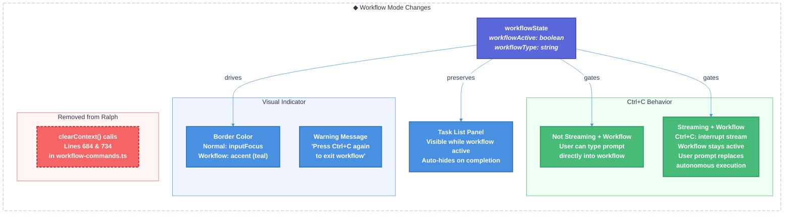

# Workflow SDK Inline Mode, Visual Mode Indicators & Clear Node Removal — Technical Design Document

| Document Metadata      | Details     |
| ---------------------- | ----------- |
| Author(s)              | lavaman131  |
| Status                 | Draft (WIP) |
| Team / Owner           | Atomic CLI  |
| Created / Last Updated | 2026-02-21  |

## 1. Executive Summary

This RFC proposes four coordinated changes to the Atomic CLI's workflow system: **(1)** a teal border visual indicator when a workflow (like `/ralph`) is actively running, **(2)** Ctrl+C only interrupts the current stream while keeping the workflow orchestration active — the user can then type a new prompt that gets passed to the model within the workflow context, **(3)** removal of `clearContextNode()` usage from the Ralph workflow so context persists through the entire run, and **(4)** auto-hiding the task list panel only when the workflow ends naturally or is fully cancelled. These changes improve the user experience by providing clear visual feedback about the system's operational mode, enabling mid-workflow user intervention without losing orchestration state, and preserving conversation context throughout.

**Research Reference:** [`research/docs/2026-02-21-workflow-sdk-inline-mode-research.md`](../research/docs/2026-02-21-workflow-sdk-inline-mode-research.md)

## 2. Context and Motivation

### 2.1 Current State

The workflow system already runs **inline within the main chat context** — workflow commands like `/ralph` use `streamAndWait()` which pipes prompts through the normal chat streaming pipeline ([research ref: §1 "Workflow SDK Architecture"](../research/docs/2026-02-21-workflow-sdk-inline-mode-research.md)). However, there is no visual distinction between "normal mode" and "workflow mode":

- **Border color**: The chat box border always uses `themeColors.inputFocus` (`#585b70` dark / `#acb0be` light) regardless of workflow state ([research ref: §3 "Chat Box Border/Outline Styling"](../research/docs/2026-02-21-workflow-sdk-inline-mode-research.md)).
- **Ctrl+C behavior**: When `workflowState.workflowActive` is true, a single Ctrl+C immediately cancels the entire workflow (priority chain step 4 in `chat.tsx:4351-4366`) ([research ref: §4 "Keyboard Input / Ctrl+C Handling"](../research/docs/2026-02-21-workflow-sdk-inline-mode-research.md)).
- **Context clearing**: The Ralph workflow calls `context.clearContext()` before the review phase (line 684) and again before fix decomposition (line 734), destroying conversation history ([research ref: §2 "Clear Nodes"](../research/docs/2026-02-21-workflow-sdk-inline-mode-research.md)).
- **Task list lifecycle**: The `TaskListPanel` shows/hides based on `ralphSessionDir` being set, but the panel's lifecycle after workflow completion is tied to whether `ralphSessionDir` persists ([research ref: §5 "Ralph Workflow Specifics"](../research/docs/2026-02-21-workflow-sdk-inline-mode-research.md)).

**Related Architecture:**

- [`research/docs/2026-02-16-atomic-chat-architecture-current.md`](../research/docs/2026-02-16-atomic-chat-architecture-current.md) — Chat system architecture
- [`research/docs/2026-02-13-ralph-task-list-ui.md`](../research/docs/2026-02-13-ralph-task-list-ui.md) — Task list panel design
- [`specs/ralph-task-list-ui.md`](./ralph-task-list-ui.md) — Task list panel spec

### 2.2 The Problem

- **User Impact:** Users have no visual cue that a workflow is running. Ctrl+C during a workflow kills the entire orchestration with no way to redirect the model mid-workflow. After the review phase clears context, users lose the conversation history from the implementation phase.
- **Technical Debt:** The `inputStreaming` theme color exists in `ThemeColors` but is never used for the chat input border. The `clearContextNode()` mechanism adds complexity without clear user benefit since the reviewer sub-agent receives its own isolated context anyway (via `spawnSubagent()`).

## 3. Goals and Non-Goals

### 3.1 Functional Goals

- [ ] **G1 — Visual Mode Indicator:** The chat input box border changes to a teal color (`themeColors.accent`: `#94e2d5` dark / `#179299` light) when a workflow is active (`workflowState.workflowActive === true`).
- [ ] **G2 — Ctrl+C Interrupts Stream, Not Workflow:** When a workflow is active and streaming, Ctrl+C interrupts the current stream **only**. The workflow orchestration remains active (`workflowActive: true`, teal border stays, task list persists). After the stream is interrupted, the user can type a new prompt which gets passed to the model within the workflow context, replacing the workflow's autonomous train of thought with the user's direction.
- [ ] **G3 — Remove Clear Context from Ralph:** Remove the `context.clearContext()` calls from the Ralph workflow's review phase so conversation context persists throughout the entire run.
- [ ] **G4 — Task List Auto-Hide:** The task list panel auto-hides only when the workflow ends naturally (all tasks complete) or is fully terminated. It remains visible while the workflow is active, including after a Ctrl+C stream interruption.

### 3.2 Non-Goals (Out of Scope)

- [ ] We will NOT remove the `clearContextNode()` factory function from the graph SDK entirely — it remains available for custom workflows.
- [ ] We will NOT add a workflow progress bar or step indicator (separate feature).
- [ ] We will NOT change the border color during streaming (the existing `inputStreaming` color remains unused for now).
- [ ] We will NOT change how `spawnSubagent()` works for the reviewer agent.
- [ ] We will NOT implement workflow pause/resume functionality.

## 4. Proposed Solution (High-Level Design)

### 4.1 System Architecture Diagram



### 4.2 Architectural Pattern

We are adopting a **state-driven UI theming** pattern where `workflowState.workflowActive` drives both visual presentation (border color) and behavioral changes (Ctrl+C handler logic). This follows the existing React state → props → render pattern already used throughout the chat component.

### 4.3 Key Components

| Component       | Responsibility                                                           | File                                           | Change Type |
| --------------- | ------------------------------------------------------------------------ | ---------------------------------------------- | ----------- |
| Chat Box Border | Renders teal border during workflow mode                                 | `src/ui/chat.tsx:5685-5694`                    | Modified    |
| Ctrl+C Handler  | Stream-only interruption; workflow stays active for user prompt          | `src/ui/chat.tsx:4212-4402`                    | Modified    |
| Ralph Workflow  | Remove `clearContext()` calls; accept user prompt after stream interrupt | `src/ui/commands/workflow-commands.ts:684,734` | Modified    |
| Task List Panel | Auto-hide on workflow completion, persist during active workflow         | `src/ui/chat.tsx:5674-5679`                    | Modified    |

## 5. Detailed Design

### 5.1 Visual Mode Indicator — Teal Border

**File:** `src/ui/chat.tsx` (~line 5688)

**Current:**

```tsx
borderColor={themeColors.inputFocus}
```

**Proposed:**

```tsx
borderColor={workflowState.workflowActive ? themeColors.accent : themeColors.inputFocus}
```

The `accent` color is already teal in both themes:

- Dark: `#94e2d5` (Catppuccin Mocha Teal)
- Light: `#179299` (Catppuccin Latte Teal)

This is a single-line change. OpenTUI's `<box>` component supports dynamic `borderColor` changes and triggers `requestRender()` on prop updates ([research ref: §3 "OpenTUI Border API"](../research/docs/2026-02-21-workflow-sdk-inline-mode-research.md)).

**No new theme colors needed.** The `accent` color is already defined and visually appropriate (teal), matching the `assistantMessage` and `codeTitle` colors.

### 5.2 Ctrl+C — Stream Interruption Within Active Workflow

**File:** `src/ui/chat.tsx` (~lines 4212-4402)

The core change: Ctrl+C during a workflow **only interrupts the current stream** — it does NOT deactivate the workflow itself. The workflow orchestration remains active, the teal border stays, and the task list stays visible. The user can then type a new prompt which gets passed to the model within the workflow context.

#### 5.2.1 When Streaming Inside a Workflow

**Current behavior (Step 2, lines 4222-4306):** Interrupting a stream also cancels the workflow (`workflowActive: false`).

**Proposed:** When `workflowState.workflowActive && isStreamingRef.current`, Ctrl+C interrupts the stream but **keeps `workflowActive: true`**. Remove the workflow cancellation block from within the streaming interrupt handler (lines 4289-4294):

```typescript
// REMOVE this block from the streaming interrupt handler:
// if (workflowState.workflowActive) {
//   updateWorkflowState({
//     workflowActive: false,
//     workflowType: null,
//     initialPrompt: null,
//   });
// }
```

After the stream is interrupted, the workflow's `streamAndWait()` returns `{ wasInterrupted: true }`. Instead of continuing its autonomous train of thought, the workflow should **yield control to the user** — waiting for the user's next prompt and passing it to the model.

#### 5.2.2 When Not Streaming Inside a Workflow (Idle Between Steps)

**Current behavior (Step 4, lines 4351-4366):** Single Ctrl+C cancels the workflow immediately.

**Proposed:** Remove the workflow cancellation from step 4. When the workflow is active but between steps (not streaming), the user can simply type a prompt into the input box. The workflow orchestration picks up the user's prompt and passes it to the model as the next message, rather than the autonomous prompt the workflow would have generated.

The step 4 block should be removed entirely:

```typescript
// REMOVE this block:
// if (workflowState.workflowActive) {
//   updateWorkflowState({
//     workflowActive: false,
//     workflowType: null,
//     initialPrompt: null,
//   });
//   ...
// }
```

#### 5.2.3 User Prompt Passthrough in Workflow Context

When a workflow is active and the user submits a prompt (after interrupting with Ctrl+C or during an idle phase between workflow steps):

1. The user's prompt is sent through `streamAndWait()` within the workflow context
2. The model receives the full conversation history (including prior workflow output) plus the user's new prompt
3. The model responds to the user's direction instead of the workflow's autonomous prompt
4. The workflow continues orchestrating from that point with the model's response

This requires the workflow loop in `workflow-commands.ts` to detect `wasInterrupted` on `streamAndWait()` and wait for user input before continuing:

```typescript
// In the implementation loop (Step 2):
const result = await context.streamAndWait(prompt);
if (result.wasInterrupted) {
    // Wait for user's next prompt instead of auto-continuing
    const userPrompt = await context.waitForUserInput();
    // Pass user's prompt to model within workflow context
    const userResult = await context.streamAndWait(userPrompt);
    // Continue orchestration with the response
}
```

> **Note:** The `context.waitForUserInput()` mechanism may need to be implemented if it doesn't exist. This would resolve the `streamAndWait()` promise with the user's typed input once they submit.

#### 5.2.4 Revised Priority Chain

| Step | Condition                            | Action                                         |
| ---- | ------------------------------------ | ---------------------------------------------- |
| 1    | Text selected                        | Copy to clipboard                              |
| 2    | Streaming (with or without workflow) | Interrupt stream only; workflow remains active |
| 3    | Sub-agents running                   | Interrupt sub-agents                           |
| 4    | Textarea has content                 | Clear textarea                                 |
| 5    | Empty/idle                           | Double-press to exit TUI                       |

**Note:** Step 4 (workflow cancel) from the current chain is **removed entirely**. Workflow deactivation only happens via natural completion or the workflow itself deciding to exit.

### 5.3 Remove Clear Context from Ralph Workflow

**File:** `src/ui/commands/workflow-commands.ts`

Remove the two `clearContext()` calls:

1. **Line ~684** — Before the reviewer sub-agent spawn:

    ```typescript
    // REMOVE: await context.clearContext();
    ```

2. **Line ~734** — Before fix spec decomposition:
    ```typescript
    // REMOVE: await context.clearContext();
    ```

**Justification:** The reviewer sub-agent is spawned via `context.spawnSubagent()`, which creates an **isolated session** with its own context ([research ref: §7 "Subagent Bridge Architecture"](../research/docs/2026-02-21-workflow-sdk-inline-mode-research.md)). Clearing the main chat context is unnecessary for the reviewer to function, and it destroys valuable conversation history that users may want to reference after the workflow completes.

**Risk Mitigation:** For long-running workflows, the context may grow large. The existing `contextMonitorNode()` mechanism ([research ref: §2 "Other Context Management"](../research/docs/2026-02-21-workflow-sdk-inline-mode-research.md)) already handles token usage monitoring and can trigger compaction as needed. This is a more graceful approach than hard-clearing.

### 5.4 Task List Panel Lifecycle

**Current behavior:** The `TaskListPanel` renders when `ralphSessionDir` is truthy ([research ref: §5 "Task List Panel Visibility"](../research/docs/2026-02-21-workflow-sdk-inline-mode-research.md)):

```tsx
{
    ralphSessionDir && showTodoPanel && (
        <TaskListPanel sessionDir={ralphSessionDir} expanded={tasksExpanded} />
    );
}
```

**Proposed:** The task list panel remains visible for the entire duration that `workflowActive === true`. This includes after Ctrl+C stream interruptions — the user can see the task progress while typing their follow-up prompt.

When `workflowActive` transitions to `false` (natural completion), clear `ralphSessionDir` to auto-hide the panel:

```typescript
useEffect(() => {
    if (!workflowState.workflowActive && ralphSessionDir) {
        setRalphSessionDir(null);
        setRalphSessionId(null);
    }
}, [workflowState.workflowActive]);
```

The `tasks.json` file on disk is preserved for future reference in the session directory (`~/.atomic/workflows/sessions/{sessionId}/`).

### 5.5 Workflow Completion State Reset

**Current Issue:** The Ralph workflow returns `{ success: true }` but does **not** explicitly set `workflowActive: false` at completion. It relies on Ctrl+C cancellation to reset the state.

**Proposed Fix:** At the end of the Ralph command's `execute()` function (after the implementation/review loop completes), explicitly reset workflow state:

```typescript
// At end of Ralph workflow execute():
return {
    success: true,
    message: "Workflow completed successfully.",
    stateUpdate: {
        workflowActive: false,
        workflowType: null,
        initialPrompt: null,
    },
};
```

This ensures the border reverts to the normal color and Ctrl+C behavior returns to default after a workflow finishes naturally. The `ralphSessionDir` and `ralphSessionId` are preserved (they're in separate refs), so the task list panel remains visible.

## 6. Alternatives Considered

| Option                                                                                    | Pros                                                           | Cons                                                                                           | Reason for Rejection                                                                                      |
| ----------------------------------------------------------------------------------------- | -------------------------------------------------------------- | ---------------------------------------------------------------------------------------------- | --------------------------------------------------------------------------------------------------------- |
| **A: New `inputWorkflow` theme color**                                                    | Fully independent color, no shared semantics                   | Adds theme complexity, requires changes to `ThemeColors` interface in all consuming components | Rejected: `accent` is already teal and semantically appropriate for "active/highlighted" state.           |
| **B: Reuse `inputStreaming` for workflow**                                                | Uses existing unused color                                     | `inputStreaming` semantically means "streaming", not "workflow mode"; creates confusion        | Rejected: Mixing semantic meanings makes future changes harder.                                           |
| **C: Ctrl+C deactivates workflow entirely**                                               | Clean exit, simple mental model                                | Loses orchestration state; user cannot redirect workflow mid-execution                         | Rejected: Keeping workflow active after stream interrupt enables powerful mid-workflow user intervention. |
| **D: Replace `clearContext()` with `compactContext()`**                                   | Preserves some context while reducing token usage              | Compaction is lossy and may remove important details; unnecessary since SDK handles it         | Rejected: SDK-level compaction is automatic and sufficient.                                               |
| **E (Selected): Accent color + stream-only Ctrl+C + user prompt passthrough + auto-hide** | Minimal changes, enables mid-workflow user direction, clean UX | Requires `waitForUserInput()` mechanism                                                        | **Selected.**                                                                                             |

## 7. Cross-Cutting Concerns

### 7.1 Observability Strategy

- **State Tracking:** `workflowState.workflowActive` and `workflowState.workflowType` are already tracked in React state and accessible via command context. No additional telemetry needed.
- **Ctrl+C Events:** The existing telemetry for interrupt events (via `handleInterrupt()` in `src/ui/index.ts:1448`) will naturally capture the new double-press pattern.

### 7.2 Backward Compatibility

- **Theme System:** No changes to `ThemeColors` interface. All existing themes continue to work.
- **Custom Workflows:** `clearContextNode()` remains in the SDK. Only Ralph's usage is removed.
- **Keyboard Shortcuts:** Ctrl+T toggle for task list panel is unchanged.

### 7.3 Edge Cases

| Edge Case                                  | Handling                                                                                                                                       |
| ------------------------------------------ | ---------------------------------------------------------------------------------------------------------------------------------------------- |
| Ctrl+C during streaming inside workflow    | Interrupts stream only. Workflow stays active (teal border, task list remain). User can type a new prompt to redirect the model.               |
| User types prompt after Ctrl+C in workflow | Prompt is passed to the model within the workflow context. Workflow continues orchestrating with the model's response to the user's direction. |
| Workflow completes naturally               | `stateUpdate` sets `workflowActive: false`. `useEffect` clears `ralphSessionDir`. Task list auto-hides. Border reverts.                        |
| Workflow errors mid-execution              | Workflow sets `workflowActive: false` on error exit via `stateUpdate`, border reverts and task list hides automatically.                       |
| Context grows large without clearing       | Handled automatically at the SDK level. No manual compaction needed.                                                                           |
| User types while workflow is streaming     | Normal message queuing behavior — prompt is queued and processed after the current stream completes.                                           |
| Multiple Ctrl+C presses during workflow    | Each press interrupts the current stream if streaming; if idle, falls through to textarea clear / double-press TUI exit.                       |

## 8. Migration, Rollout, and Testing

### 8.1 Deployment Strategy

- [ ] **Phase 1:** Implement visual mode indicator (teal border) — lowest risk, purely visual.
- [ ] **Phase 2:** Modify Ctrl+C handler to only interrupt stream (not workflow) and implement user prompt passthrough via `waitForUserInput()`.
- [ ] **Phase 3:** Remove `clearContext()` calls from Ralph workflow. Add task list auto-hide on workflow completion.
- [ ] **Phase 4:** Validation and testing across all three SDK agents (OpenCode, Claude, Copilot).

### 8.2 Test Plan

- **Unit Tests:**
    - [ ] Border color returns `accent` when `workflowActive === true`, `inputFocus` otherwise.
    - [ ] Ctrl+C handler: press during streaming workflow interrupts stream but does NOT set `workflowActive = false`.
    - [ ] Ctrl+C handler: workflow cancellation block (step 4) is removed from priority chain.
    - [ ] `useEffect` clears `ralphSessionDir` when `workflowActive` transitions to `false` on natural completion.
    - [ ] Workflow completion returns `stateUpdate` with `workflowActive: false`.
    - [ ] `waitForUserInput()` resolves with user-typed prompt.

- **Integration Tests:**
    - [ ] Ralph workflow runs end-to-end without `clearContext()` calls.
    - [ ] After Ctrl+C stream interruption, user prompt is passed to model within workflow context.
    - [ ] Workflow continues orchestrating after user prompt passthrough.
    - [ ] Task list panel remains visible after Ctrl+C stream interruption.
    - [ ] Task list panel auto-hides after workflow completes naturally.
    - [ ] Reviewer sub-agent functions correctly without prior context clearing.

- **E2E Tests:**
    - [ ] Visual verification: teal border appears when `/ralph` starts, stays after Ctrl+C, reverts on natural completion.
    - [ ] Ctrl+C during `/ralph` streaming stops stream; user types prompt; model responds within workflow.
    - [ ] Task list visible throughout workflow lifecycle, hides on completion.
    - [ ] `tasks.json` persists on disk after workflow ends.

## 9. Resolved Questions

- [x] **Q1 — Stream interruption recovery:** Ctrl+C interrupts the current stream but the **workflow stays active**. The user can then type a new prompt which gets passed to the model within the workflow context, replacing the workflow's autonomous train of thought. The workflow orchestration continues from there. The teal border and task list remain visible throughout.

- [x] **Q2 — Workflow border color for non-Ralph workflows:** **Teal for all workflow types.** The `themeColors.accent` color is universal for any active workflow, regardless of type.

- [x] **Q3 — Context compaction threshold:** **No changes needed.** Context compaction is handled automatically at the SDK level. No `contextMonitorNode()` adjustments required.

- [x] **Q4 — Task panel dismissal mechanism:** The task list panel **stays visible while the workflow is active** (including after Ctrl+C stream interruptions). It **auto-hides only when the workflow ends naturally** (all tasks complete) or on error exit. The teal border reverting to normal is the visual signal that the workflow and task list are deactivating.

- [x] **Q5 — Workflow exit message:** **No system message.** The workflow silently deactivates on natural completion. The border color reverting to normal and the task list hiding are sufficient visual feedback.
