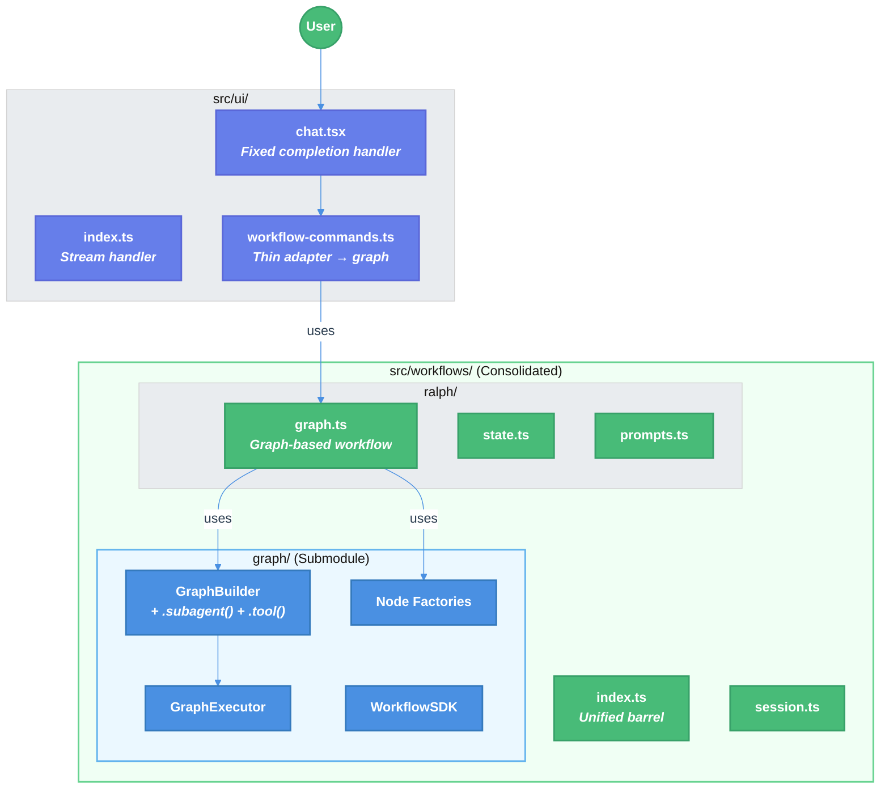

# Workflow SDK Refactor: Simplified Syntax, Module Consolidation, and Ralph TUI Freeze Fix

| Document Metadata      | Details     |
| ---------------------- | ----------- |
| Author(s)              | lavaman131  |
| Status                 | Draft (WIP) |
| Team / Owner           | Atomic CLI  |
| Created / Last Updated | 2026-02-25  |

## 1. Executive Summary

The Workflow SDK's graph engine (`src/graph/`) provides a powerful declarative API with 12 node types, fluent builder chaining, and BFS execution — but the Ralph workflow (`src/ui/commands/workflow-commands.ts`) **does not use it at all**, instead running as a 1195-line procedural command handler. Additionally, the TUI freezes after the review node due to a deferred completion handler that never resolves the `spawnSubagent()` promise. This RFC proposes three coordinated changes: **(1)** simplify the graph builder API to elevate `subagentNode()` and `toolNode()` as first-class chaining primitives (`.subagent()`, `.tool()`), **(2)** consolidate `src/graph/` as a submodule under `src/workflows/` to create a unified module, and **(3)** rewrite Ralph to use the graph engine and fix the TUI freeze caused by `streamCompletionResolverRef` single-slot limitation and deferred completion race conditions.

> **Research basis**: [2026-02-25-workflow-sdk-refactor-research.md](../research/docs/2026-02-25-workflow-sdk-refactor-research.md), [2026-02-25-workflow-sdk-standardization.md](../research/docs/2026-02-25-workflow-sdk-standardization.md), [2026-02-25-workflow-sdk-patterns.md](../research/docs/2026-02-25-workflow-sdk-patterns.md)

---

## 2. Context and Motivation

### 2.1 Current State

```
src/
├── graph/              ← Core execution engine (16+ modules, 206-line barrel)
│   ├── builder.ts      ← GraphBuilder fluent API (7 node types, loops, branching)
│   ├── compiled.ts     ← GraphExecutor BFS engine
│   ├── nodes.ts        ← 12 node factory functions
│   ├── sdk.ts          ← WorkflowSDK class
│   ├── nodes/ralph.ts  ← Ralph graph nodes (UNUSED at runtime)
│   └── ...
├── workflows/          ← Session management + Ralph state/prompts
│   ├── session.ts
│   └── ralph/
│       ├── state.ts    ← RalphWorkflowState (UNUSED by graph)
│       └── prompts.ts  ← 8 prompt builders (4 UNUSED)
└── ui/commands/
    └── workflow-commands.ts  ← Ralph procedural handler (1195 lines)
```

### 2.2 The Problem

1. **Ralph doesn't use the graph engine.** 1195-line procedural handler bypasses the graph module entirely — duplicate logic, hard to extend.
2. **TUI freezes after review node.** `spawnSubagent()` promise hangs when deferred completion handler is never invoked; `streamCompletionResolverRef` single-slot bottleneck.
3. **Verbose API for common patterns.** `subagentNode()`/`toolNode()` factories wrapped in `.then()` — no first-class builder shortcuts.
4. **Module structure mismatch.** `graph/` and `workflows/` are siblings, but graph _is_ the workflow engine.

---

## 3. Goals and Non-Goals

### 3.1 Functional Goals

- [ ] Add `.subagent(config)` and `.tool(config)` as first-class `GraphBuilder` chaining methods
- [ ] Consolidate `src/graph/` under `src/workflows/graph/` as a submodule
- [ ] Rewrite Ralph workflow to use the graph engine via `GraphBuilder` API
- [ ] Fix the TUI freeze after the review node (deferred completion + stream generation mismatch)
- [ ] Preserve all existing graph engine functionality (templates, streaming, checkpointing, annotations)
- [ ] Ensure all existing graph module tests continue to pass after consolidation
- [ ] Update all import paths across the codebase for the module move

### 3.2 Non-Goals (Out of Scope)

- [ ] We will NOT add new node types beyond `.subagent()` and `.tool()` builder shortcuts
- [ ] We will NOT add Zod-based runtime state validation in this phase
- [ ] We will NOT implement function-based (Temporal-style) workflows in this refactor
- [ ] We will NOT add new checkpointer backends (SQLite/PostgreSQL) — existing Memory/File suffice
- [ ] We will NOT refactor the TUI layer (`chat.tsx`) beyond the minimum needed to fix the freeze
- [ ] We will NOT add a hooks system (Copilot SDK-style `onPreToolUse`, etc.) in this phase

- [ ] We will NOT change the workflow discovery system (`.atomic/workflows/` paths)

---

## 4. Proposed Solution (High-Level Design)

### 4.1 System Architecture Diagram (Proposed)



### 4.3 Key Components

| Component                      | Responsibility               | Change Type | Justification                                                                    |
| ------------------------------ | ---------------------------- | ----------- | -------------------------------------------------------------------------------- |
| `GraphBuilder`                 | Fluent workflow construction | Extended    | `.subagent()` and `.tool()` reduce boilerplate for the most common node types    |
| `src/workflows/graph/`         | Core execution engine        | Moved       | Logical grouping under `workflows/` reflects that graph _is_ the workflow engine |
| `src/workflows/ralph/graph.ts` | Ralph workflow definition    | New         | Expresses Ralph as a graph, replacing 1195-line procedural handler               |
| `src/ui/chat.tsx`              | TUI completion handling      | Patched     | Fixes deferred completion race condition causing freeze                          |
| `src/ui/index.ts`              | Stream abort handling        | Patched     | Ensures `onComplete()` fires on abort paths                                      |

---

## 5. Detailed Design

### 5.1 Builder API Extension

Add `.subagent()`, `.tool()`, and `.if()` to `GraphBuilder<TState>` — thin wrappers that encapsulate logic via config objects. `.if()` takes a `{ condition, then, else? }` config with nested `NodeDefinition[]` arrays (same pattern as `.loop()`). The first chained call auto-detects as the entry point; the graph terminates after the last node.

**Config interfaces:**

```typescript
interface SubAgentConfig<TState extends BaseState> {
    id: string;
    agent: string;
    task: string | ((state: TState) => string);
    systemPrompt?: string | ((state: TState) => string);
    model?: string;
    tools?: string[];
    outputMapper?: (result: SubagentResult, state: TState) => Partial<TState>;
    retry?: RetryConfig;
    name?: string;
    description?: string;
}

interface ToolConfig<TState extends BaseState, TArgs, TResult> {
    id: string;
    toolName?: string;
    execute?: (args: TArgs, abortSignal?: AbortSignal) => Promise<TResult>;
    args?: TArgs | ((state: TState) => TArgs);
    outputMapper?: (result: TResult, state: TState) => Partial<TState>;
    timeout?: number;
    retry?: RetryConfig;
    name?: string;
    description?: string;
}

interface IfConfig<TState extends BaseState> {
    condition: (state: TState) => boolean;
    then: NodeDefinition<TState>[];
    else_if?: {
        condition: (state: TState) => boolean;
        then: NodeDefinition<TState>[];
    }[];
    else?: NodeDefinition<TState>[];
}
```

**Example:**

```typescript
graph<MyState>()
    .subagent({
        id: "planner",
        agent: "copilot",
        task: (state) => buildPlannerPrompt(state),
        outputMapper: (result, state) => ({ plan: result.output }),
    })
    .tool({
        id: "parse-tasks",
        execute: async (args) => parseTasks(args.plan),
        args: (state) => ({ plan: state.plan }),
        outputMapper: (result, state) => ({ tasks: result }),
    })
    .subagent({
        id: "worker",
        agent: "copilot",
        task: (state) => buildWorkerPrompt(state),
    })
    .compile();
```

> _Ref: [Patterns §"Recommendations for Standardized Workflow SDK"](../research/docs/2026-02-25-workflow-sdk-patterns.md) for external API inspiration_

### 5.2 Module Consolidation

**Move `src/graph/` → `src/workflows/graph/`:**

```
src/workflows/
├── index.ts              ← Unified barrel (re-exports graph/ + session + ralph)
├── session.ts
├── graph/                ← Moved from src/graph/
│   ├── index.ts          ← Existing barrel
│   ├── builder.ts        ← Extended with .subagent(), .tool()
│   ├── compiled.ts, types.ts, nodes.ts, annotation.ts
│   ├── templates.ts, stream.ts, sdk.ts, errors.ts
│   ├── agent-providers.ts, provider-registry.ts
│   ├── subagent-bridge.ts, subagent-registry.ts
│   ├── checkpointer.ts, state-validator.ts
│   └── __tests__/
└── ralph/
    ├── graph.ts           ← NEW: Graph-based workflow
    ├── state.ts           ← Updated with proper annotations
    └── prompts.ts         ← Cleaned (unused prompts removed)
```

**Barrel & imports**: `src/workflows/index.ts` re-exports `graph/`, `session.ts`, and `ralph/`. All existing `src/graph/` imports updated to `src/workflows/graph/` in a single pass — no shim.

### 5.3 Ralph Graph Rewrite

Express Ralph's 3-phase flow as a compiled graph:

```typescript
// src/workflows/ralph/graph.ts

import {
    graph,
    subagentNode,
    toolNode,
    type BaseState,
} from "../graph/index.ts";
import type { RalphWorkflowState } from "./state.ts";
import {
    buildSpecToTasksPrompt,
    buildWorkerAssignment,
    buildReviewPrompt,
    buildFixPrompt,
} from "./prompts.ts";

export function createRalphWorkflow() {
    return (
        graph<RalphWorkflowState>()
            // Phase 1: Task Decomposition
            .subagent({
                id: "planner",
                agent: "planner",
                task: (state) => buildSpecToTasksPrompt(state),
                outputMapper: (result, state) => ({
                    specDoc: result.output ?? "",
                }),
                description: "Decomposes user prompt into a task list / spec",
            })
            .tool({
                id: "parse-tasks",
                execute: async (args) => parseSpecToTasks(args.specDoc),
                args: (state) => ({ specDoc: state.specDoc }),
                outputMapper: (tasks, state) => ({
                    tasks,
                    iteration: 0,
                }),
                description: "Parse spec document into structured task list",
            })

            // Phase 2: Worker Loop
            .loop(
                [
                    toolNode({
                        id: "select-ready-tasks",
                        toolName: "select-ready-tasks",
                        execute: async (args) => getReadyTasks(args.tasks),
                        args: (state) => ({ tasks: state.tasks }),
                        outputMapper: (readyTasks, state) => ({
                            currentTasks: readyTasks,
                        }),
                        name: "Task Selector",
                    }),
                    subagentNode({
                        id: "worker",
                        agentName: "worker",
                        task: (state) => buildWorkerAssignment(state),
                        outputMapper: (result, state) => ({
                            iteration: state.iteration + 1,
                            tasks: markTasksCompleted(state.tasks, result),
                        }),
                        name: "Worker",
                        description: "Implements assigned tasks",
                    }),
                ],
                {
                    until: (state) =>
                        state.tasks.every((t) => t.status === "completed") ||
                        state.iteration >= state.maxIterations,
                    maxIterations: 100,
                },
            )

            // Phase 3: Review & Fix
            .subagent({
                id: "reviewer",
                agent: "reviewer",
                task: (state) => buildReviewPrompt(state),
                outputMapper: (result, state) => ({
                    reviewResult: parseReviewResult(result.output),
                }),
                description: "Reviews completed work",
            })
            .if({
                condition: (state) => state.reviewResult?.fixesNeeded === true,
                then: [
                    subagentNode({
                        id: "fixer",
                        agentName: "worker",
                        task: (state) => buildFixPrompt(state),
                        outputMapper: (result, state) => ({
                            fixesApplied: true,
                        }),
                        description: "Applies review fixes",
                    }),
                ],
            })
            .compile({
                name: "ralph",
                description:
                    "Autonomous task decomposition, implementation, and review workflow",
            })
    );
}
```

**Thin adapter in `workflow-commands.ts`:** Replaces the 1195-line procedural handler with ~50 lines that parse `/ralph` args, create initial state, call `createRalphWorkflow()`, and pipe `StepResult` events to the TUI. Session/discovery logic stays.

### 5.4 TUI Freeze Fix

**Root cause**: In `chat.tsx:3638-3647`, deferred completion handler (`pendingCompleteRef.current`) is set when `hasActiveAgents || hasRunningToolRef.current` is true. If `tryFinalizeParallelTracking()` never fires, `spawnSubagent()` promise hangs.

**Fix 1: Spawn-initiation timeout** (`chat.tsx`) — 30s timeout if sub-agent was never spawned; no timeout once spawned:

```typescript
if (hasActiveAgents || hasRunningToolRef.current) {
    pendingCompleteRef.current = handleComplete;
    const spawnTimeout = setTimeout(() => {
        if (
            pendingCompleteRef.current === handleComplete &&
            !subagentSpawnedRef.current
        ) {
            pendingCompleteRef.current = null;
            handleComplete();
        }
    }, 30_000);
    const originalHandleComplete = handleComplete;
    pendingCompleteRef.current = () => {
        clearTimeout(spawnTimeout);
        originalHandleComplete();
    };
    return;
}
```

**Fix 2: `onComplete()` on abort** (`index.ts`) — call `onComplete({ aborted: true, response })` on `AbortError` instead of silently returning.

**Fix 3: Generation guard relaxation** (`chat.tsx`) — accept callbacks from current generation OR immediately preceding one (off-by-one tolerance):

```typescript
if (
    !isCurrentStreamCallback(streamGenerationRef.current, currentGeneration) &&
    currentGeneration < streamGenerationRef.current - 1
) {
    return;
}
```

### 5.5 Ralph State Annotations

```typescript
// src/workflows/ralph/state.ts
export const RalphWorkflowState = {
    specDoc: annotation<string>("", Reducers.replace),
    tasks: annotation<Task[]>([], Reducers.replace),
    currentTasks: annotation<Task[]>([], Reducers.replace),
    iteration: annotation<number>(0, Reducers.replace),
    maxIterations: annotation<number>(100, Reducers.replace),
    reviewResult: annotation<ReviewResult | null>(null, Reducers.replace),
    fixesApplied: annotation<boolean>(false, Reducers.replace),
    ralphSessionId: annotation<string>("", Reducers.replace),
    ralphSessionDir: annotation<string>("", Reducers.replace),
};
```

---

## 6. Alternatives Considered

| Option                                                                               | Pros                                                                           | Cons                                                                                         | Reason for Rejection                                                                                                                                               |
| ------------------------------------------------------------------------------------ | ------------------------------------------------------------------------------ | -------------------------------------------------------------------------------------------- | ------------------------------------------------------------------------------------------------------------------------------------------------------------------ |
| **A: Fix freeze only, keep Ralph procedural**                                        | Minimal change, fast fix                                                       | Doesn't address the core problem of Ralph not using graph; continues dual maintenance burden | Short-term band-aid; graph engine remains unused for its primary use case                                                                                          |
| **B: Re-export `graph/` through `workflows/` without moving files**                  | No file moves, no import changes                                               | Misleading file structure; `graph/` still appears as a top-level peer                        | Doesn't achieve the consolidation goal; confusing for new contributors                                                                                             |
| **C: Add `.agent()` builder method (unify `agentNode` + `subagentNode`)**            | Fewer node types to understand                                                 | Different use cases (session-based agent vs spawned sub-agent) need distinct configs         | Premature unification; research shows they serve different purposes ([Research §1.1](../research/docs/2026-02-25-workflow-sdk-refactor-research.md#11-node-types)) |
| **D: Full function-based workflow API (Temporal-style)**                             | Supports imperative patterns natively                                          | Massive scope increase; existing graph engine would need parallel API                        | Better suited for a future phase; graph-based approach already works for Ralph ([Patterns doc](../research/docs/2026-02-25-workflow-sdk-patterns.md))              |
| **E: Selected approach (builder extension + module move + Ralph rewrite + TUI fix)** | Addresses all three problems; minimal API additions; leverages existing engine | Requires import path updates; Ralph rewrite needs careful testing                            | **Selected**: Balances scope, impact, and risk. Maximizes ROI on existing graph engine investment                                                                  |

---

## 7. Cross-Cutting Concerns

### 7.1 Breaking Changes

This refactor introduces breaking changes. There is no backward compatibility layer — all consumers must update.

- **Import paths**: All `src/graph/` imports are replaced with `src/workflows/graph/`. No shim or re-export bridge is provided.
- **Ralph workflow**: The procedural handler in `workflow-commands.ts` is fully replaced with a graph-based implementation. The `/ralph` command behavior is preserved but the internal execution path is entirely different.
- **Deleted files**: `src/graph/nodes/ralph.ts` (unused graph nodes), 4 unused prompt builders in `prompts.ts`, the entire `src/graph/` directory (moved to `src/workflows/graph/`).

### 7.2 Testing Strategy

- **Regression**: All 13 existing `src/graph/__tests__/` files pass after module move (path updates only)
- **Unit**: `.subagent()`, `.tool()` produce equivalent `NodeDefinition` to factory functions
- **Integration**: `createRalphWorkflow()` with mocked `SubagentGraphBridge` — 3-phase flow, loop exit, conditional fix
- **E2E**: `/ralph` with review that triggers fixes — no freeze

**Observability**: Existing `StepResult` events + `StreamRouter` debug mode — no new instrumentation needed. **Performance**: BFS traversal overhead negligible; same spread-copy immutability as procedural handler.

---

## 8. Migration, Rollout, and Testing

### 8.1 Deployment Strategy (Phased)

- [ ] **Phase 1: Module consolidation** — Move `src/graph/` → `src/workflows/graph/`, update ALL import paths immediately (no shim), delete `src/graph/nodes/ralph.ts`, verify all tests pass.
- [ ] **Phase 2: Builder API extension** — Add `.subagent()` and `.tool()` methods to `GraphBuilder` with implicit start detection. Add unit tests for new API surface.
- [ ] **Phase 3: TUI freeze fix** — Apply the three fixes to `chat.tsx` and `index.ts` (30s spawn-initiation timeout, abort `onComplete`, generation guard relaxation). Manual E2E test.
- [ ] **Phase 4: Ralph graph rewrite** — Create fresh `ralph/graph.ts` with parallel worker dispatch, update `workflow-commands.ts` to use it, remove procedural Ralph code, remove unused prompts from `prompts.ts`. Integration tests.
- [ ] **Phase 5: Cleanup** — Remove dead code, update documentation.

### 8.2 Rollback Plan

Each phase is independently deployable. If Ralph graph rewrite causes issues, the procedural handler can be restored by reverting Phase 4 only.

---

## 9. Resolved Decisions

| #   | Question                                      | Decision                                                                                                                        |
| --- | --------------------------------------------- | ------------------------------------------------------------------------------------------------------------------------------- |
| 1   | Re-export shim or update imports immediately? | Update all imports in single pass, no shim                                                                                      |
| 2   | Flow control API?                             | No `.start()`/`.end()`/`.endif()` — `.if({ condition, then, else? })` encapsulates conditional logic recursively like `.loop()` |
| 3   | Parallel worker dispatch for Ralph?           | Yes — use graph engine's `parallel()` node; address `streamCompletionResolverRef` limitation                                    |
| 4   | Deferred completion timeout?                  | 30s spawn-initiation timeout only (not execution); unbounded once spawned                                                       |
| 5   | Remove unused Ralph prompts?                  | Yes — 4 unused prompt builders deleted (in git history)                                                                         |
| 6   | Incorporate existing `nodes/ralph.ts`?        | No — replace with fresh definitions; existing were never runtime-tested                                                         |

---

## Appendix

### A. File Change Impact Summary

| File/Directory                         | Change                                      | Risk                               |
| -------------------------------------- | ------------------------------------------- | ---------------------------------- |
| `src/graph/` → `src/workflows/graph/`  | Move entire directory                       | Low (file move + import updates)   |
| `src/workflows/graph/builder.ts`       | Add `.subagent()` and `.tool()` methods     | Low (additive)                     |
| `src/workflows/ralph/graph.ts`         | New file: graph-based Ralph workflow        | Medium (new logic)                 |
| `src/ui/commands/workflow-commands.ts` | Replace procedural Ralph with graph adapter | High (major rewrite of ~500 lines) |
| `src/ui/chat.tsx`                      | Fix deferred completion handler             | Medium (sensitive area, many refs) |
| `src/ui/index.ts`                      | Fix abort path to call `onComplete()`       | Low (small change)                 |
| `src/workflows/index.ts`               | Update barrel to re-export graph + ralph    | Low                                |
| All files importing from `src/graph/`  | Update import paths                         | Low (mechanical)                   |

### B. Research Documents Referenced

| Document                                                                                                                                      | Relevance                                                                  |
| --------------------------------------------------------------------------------------------------------------------------------------------- | -------------------------------------------------------------------------- |
| [2026-02-25-workflow-sdk-refactor-research.md](../research/docs/2026-02-25-workflow-sdk-refactor-research.md)                                 | Primary research — module structure, Ralph analysis, TUI freeze root cause |
| [2026-02-25-workflow-sdk-standardization.md](../research/docs/2026-02-25-workflow-sdk-standardization.md)                                     | Current state analysis — all node types, builder API, execution engine     |
| [2026-02-25-workflow-sdk-patterns.md](../research/docs/2026-02-25-workflow-sdk-patterns.md)                                                   | External patterns — LangGraph, Temporal, Inngest API inspiration           |
| [2026-02-25-graph-execution-engine-technical-documentation.md](../research/docs/2026-02-25-graph-execution-engine-technical-documentation.md) | Graph engine deep dive                                                     |
| [2026-02-15-subagent-premature-completion-SUMMARY.md](../research/docs/2026-02-15-subagent-premature-completion-SUMMARY.md)                   | Sub-agent completion bug context                                           |
| [2026-02-15-ralph-dag-orchestration-implementation.md](../research/docs/2026-02-15-ralph-dag-orchestration-implementation.md)                 | `streamCompletionResolverRef` single-slot limitation                       |
| [2026-02-03-custom-workflow-file-format.md](../research/docs/2026-02-03-custom-workflow-file-format.md)                                       | Workflow file format and discovery paths                                   |
