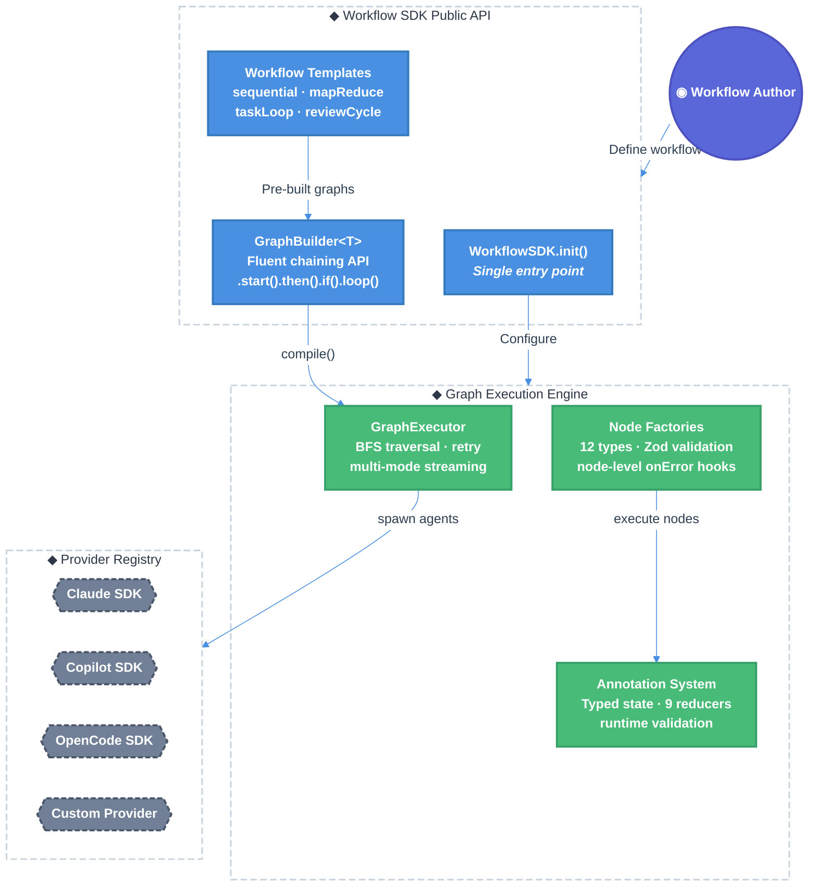

# Workflow SDK Standardization: Unified Graph Engine, Declarative API & Provider-Agnostic Execution

| Document Metadata      | Details                                                    |
| ---------------------- | ---------------------------------------------------------- |
| Author(s)              | lavaman131                                                 |
| Status                 | Draft (WIP)                                                |
| Team / Owner           | Atomic Core                                                |
| Created / Last Updated | 2026-02-25                                                 |
| Research Reference     | `research/docs/2026-02-25-workflow-sdk-standardization.md` |

## 1. Executive Summary

This RFC proposes standardizing the Atomic workflow SDK into a cohesive, user-friendly package that wraps the existing graph execution engine (`src/graph/`), sub-agent system, and workflow discovery into a clean public API. The current implementation — while powerful with 12 node factories, fluent builder API, typed state annotations, and BFS-based execution — suffers from fragmented initialization (6+ global singletons), tightly-coupled Ralph-specific state schemas, undocumented public API boundaries, and missing features identified across LangGraph, Temporal, and Inngest (multi-mode streaming, runtime state validation, checkpointing backends, error type hierarchy). The proposed standardization introduces: (1) a **unified `WorkflowSDK` entry point** that replaces and removes scattered global setters with a single initialization, (2) a **provider-agnostic sub-agent abstraction** decoupled from specific coding agent SDKs, (3) **multi-mode streaming** (values, updates, events, debug), (4) **Zod-based runtime state validation**, (5) a **higher-level workflow template system** for common patterns, and (6) a **clean public API surface** with barrel exports and comprehensive documentation. This is a **breaking change** — all legacy global setters, Ralph-specific types in `src/graph/`, and the `AgentNodeAgentType` union are completely removed. This consolidation reduces the authoring complexity for custom workflows from ~50 lines of boilerplate to ~15 lines while maintaining full power-user access to the graph API.

**Research Reference:** [Workflow SDK Standardization Research](research/docs/2026-02-25-workflow-sdk-standardization.md), [External SDK Patterns Analysis](research/docs/2026-02-25-workflow-sdk-patterns.md), [Graph Engine Technical Docs](research/docs/2026-02-25-graph-execution-engine-technical-documentation.md)

## 2. Context and Motivation

### 2.1 Current State

The Atomic CLI workflow system spans three architectural layers with 9,000+ lines of TypeScript across the graph engine, SDK clients, and workflow modules:

```
┌──────────────────────────────────────────────────────────────────┐
│                   Workflow Discovery Layer                        │
│  .atomic/workflows/*.ts (local) + ~/.atomic/workflows/*.ts       │
│  loadWorkflowsFromDisk() → dynamic import → register as /cmd    │
├──────────────────────────────────────────────────────────────────┤
│                   Graph Engine (src/graph/)                       │
│  builder.ts   │ compiled.ts  │ nodes.ts (12 node factories)      │
│  annotation.ts (typed state + 9 reducers)                        │
│  subagent-bridge.ts │ subagent-registry.ts                       │
│  checkpointer.ts (Memory, File, Research, Session backends)      │
├──────────────────────────────────────────────────────────────────┤
│                   SDK Abstraction (src/sdk/)                      │
│  base-client.ts │ types.ts (unified Session, Event interfaces)   │
│  clients/ (Claude, OpenCode, Copilot implementations)            │
│  tools/ (discovery, plugin, schema-utils)                        │
├──────────────────────────────────────────────────────────────────┤
│                   Workflow Session (src/workflows/)               │
│  session.ts (WorkflowSession lifecycle, tasks.json persistence)  │
│  index.ts (exports)                                              │
└──────────────────────────────────────────────────────────────────┘
```

**Architecture Strengths** ([Research §1](research/docs/2026-02-25-workflow-sdk-standardization.md#1-graph-execution-engine)):

- Fluent builder API (`graph<T>().start().then().if().loop().end().compile()`)
- LangGraph-inspired annotation system with 9 built-in reducers (`Reducers.concat`, `merge`, `replace`, etc.)
- BFS graph executor with retry logic, checkpointing, and signal handling
- Sub-agent bridge supporting Claude, OpenCode, and Copilot SDKs
- Workflow discovery from `.atomic/workflows/` directories

**Architecture Limitations:**

- 6+ global singletons requiring manual initialization order: `setClientProvider()`, `setSubagentBridge()`, `setSubagentRegistry()`, `setWorkflowResolver()` ([Research §4.4](research/docs/2026-02-25-workflow-sdk-standardization.md#44-global-singleton-pattern))
- Ralph-specific state (`RalphStateAnnotation`, `RalphWorkflowState`) mixed into the core graph module ([Research §2.3](research/docs/2026-02-25-workflow-sdk-standardization.md#23-predefined-state-schemas))
- Single stream mode (`StepResult` per node) vs. LangGraph's 6 streaming modes ([Research §7.2](research/docs/2026-02-25-workflow-sdk-standardization.md#72-workflow-orchestration-frameworks))
- No runtime state validation despite annotation system ([Research §12.2](research/docs/2026-02-25-workflow-sdk-standardization.md#12-open-questions))
- Serial worker dispatch in Ralph despite `spawnParallel()` existing ([Research §5.3](research/docs/2026-02-25-workflow-sdk-standardization.md#53-phase-2-dag-worker-dispatch))
- No workflow versioning or migration support ([Research §12.3](research/docs/2026-02-25-workflow-sdk-standardization.md#12-open-questions))

### 2.2 The Problem

**User Impact:** Custom workflow authors must understand internal initialization order, manually wire global singletons, and navigate a 304-line barrel export to find the right types and factories. The absence of a unified entry point makes the SDK hostile to new users.

**Developer Experience:** Writing a simple sequential workflow requires importing from 4+ modules (`graph`, `annotation`, `nodes`, `types`), setting up client providers, and understanding the full `BaseState` contract. Common patterns like "task decomposition → parallel dispatch → review" have no reusable templates.

**Technical Debt:** Ralph-specific state annotations and prompt builders are embedded in the core `src/graph/` module rather than isolated in the workflow layer. The graph engine cannot be used independently without pulling in Ralph-specific types. The 12 node factories lack consistent configuration patterns (some use `outputMapper`, others use `merge`, others use `inputMapper`).

**Provider Lock-in:** Sub-agent nodes are tightly coupled to the `AgentNodeAgentType` union (`"claude" | "opencode" | "copilot"`). Adding a new provider requires modifying core types rather than registering a plugin.

## 3. Goals and Non-Goals

### 3.1 Functional Goals

- [ ] **G1:** Provide a single `WorkflowSDK.init()` entry point that replaces all 6+ global setter calls with one configuration object
- [ ] **G2:** Extract Ralph-specific state/types from `src/graph/` into `src/workflows/ralph/` and remove them from `src/graph/` entirely — no re-exports
- [ ] **G3:** Implement multi-mode streaming: `values` (full state), `updates` (partial deltas), `events` (custom node emissions), `debug` (execution trace)
- [ ] **G4:** Add optional Zod-based runtime state validation at node boundaries with a `schema` field on `NodeDefinition`
- [ ] **G5:** Create workflow templates for common patterns: `sequential`, `mapReduce`, `taskLoop`, `reviewCycle`
- [ ] **G6:** Standardize node factory configuration with consistent `inputMapper`/`outputMapper` patterns across all node types
- [ ] **G7:** Decouple sub-agent execution from hardcoded agent types via a `ProviderRegistry` pattern
- [ ] **G8:** Add workflow versioning metadata to exported workflow definitions
- [ ] **G9:** Implement node-level error handlers (beyond graph-level `catch()`) with `onError` hooks returning `"retry" | "skip" | "abort"`
- [ ] **G10:** Document the complete public API surface with JSDoc, usage examples, and a "Getting Started" guide

### 3.2 Non-Goals (Out of Scope)

- [ ] We will NOT add new checkpointing backends (PostgreSQL, Redis) in this phase — existing Memory/File/Session backends are sufficient
- [ ] We will NOT implement a visual workflow editor or drag-and-drop UI
- [ ] We will NOT change the BFS execution strategy to support event sourcing (Temporal-style)
- [ ] We will NOT provide backward-compatible shims — existing custom workflows must be updated to use the new API
- [ ] We will NOT add a YAML/JSON workflow definition format — TypeScript-first remains the paradigm
- [ ] We will NOT implement distributed execution across multiple machines

## 4. Proposed Solution (High-Level Design)

### 4.1 System Architecture Diagram



### 4.2 Architectural Pattern

We adopt a **Layered SDK with Registry-based Dependency Injection** pattern:

1. **Public API Layer** — Clean entry points, workflow templates, and builder facade. This is the only layer custom workflow authors interact with.
2. **Engine Layer** — Graph execution, state management, node execution. Internal to the SDK, exposed via typed interfaces.
3. **Provider Layer** — Pluggable coding agent SDK adapters. New providers added without modifying engine code.

This pattern is informed by converging patterns across LangGraph (typed state + reducers + declarative composition), Temporal (durable execution + error hierarchy), and Inngest (step-based memoization + declarative functions) as documented in [Research §7](research/docs/2026-02-25-workflow-sdk-standardization.md#7-external-sdk-patterns).

### 4.3 Key Components

| Component           | Responsibility                                             | Technology Stack                     | Justification                                                                                                                                          |
| ------------------- | ---------------------------------------------------------- | ------------------------------------ | ------------------------------------------------------------------------------------------------------------------------------------------------------ |
| `WorkflowSDK`       | Single initialization, provider registration, global state | TypeScript class                     | Replaces 6+ global setters ([Research §4.4](research/docs/2026-02-25-workflow-sdk-standardization.md#44-global-singleton-pattern))                     |
| `ProviderRegistry`  | Maps agent types to SDK clients dynamically                | TypeScript Map + interface           | Decouples from hardcoded `AgentNodeAgentType` union                                                                                                    |
| `StreamRouter`      | Multi-mode streaming from executor to consumers            | AsyncGenerator + tagged unions       | Mirrors LangGraph's 6 streaming modes ([Research §7.2](research/docs/2026-02-25-workflow-sdk-standardization.md#72-workflow-orchestration-frameworks)) |
| `StateValidator`    | Optional Zod-based runtime state validation                | Zod schemas + annotation integration | Addresses [Research §12.2](research/docs/2026-02-25-workflow-sdk-standardization.md#12-open-questions)                                                 |
| `WorkflowTemplates` | Pre-built graph patterns for common workflows              | `GraphBuilder` composition           | Reduces boilerplate for workflow authors                                                                                                               |
| `ErrorRouter`       | Node-level error handling with action routing              | Hook functions + retry/skip/abort    | Extends graph-level `catch()` per [Research §12.4](research/docs/2026-02-25-workflow-sdk-standardization.md#12-open-questions)                         |

## 5. Detailed Design

### 5.1 WorkflowSDK Entry Point

**File:** `src/graph/sdk.ts` (new)

The `WorkflowSDK` class replaces all global setter calls with a single initialization:

```typescript
import { WorkflowSDK } from "@bastani/atomic/graph";

// Before (current — 6+ separate calls):
setClientProvider((type) => getClient(type));
setSubagentBridge(new SubagentGraphBridge(clientProvider));
setSubagentRegistry(registry);
setWorkflowResolver((name) => workflows.get(name));

// After (proposed — single init):
const sdk = WorkflowSDK.init({
    providers: {
        claude: claudeClient,
        opencode: opencodeClient,
        copilot: copilotClient,
    },
    workflows: loadedWorkflows, // Map<string, CompiledGraph>
    agents: discoveredAgents, // From populateSubagentRegistry()
    checkpointer: "session", // "memory" | "file" | "session"
    validation: true, // Enable runtime state validation
});
```

**Internal behavior:**

1. Creates `ProviderRegistry` from `providers` map
2. Instantiates `SubagentGraphBridge` using the provider registry
3. Populates `SubagentTypeRegistry` from `agents`
4. Sets workflow resolver from `workflows` map
5. Configures checkpointer backend
6. Legacy global setters (`setClientProvider`, `setSubagentBridge`, `setSubagentRegistry`, `setWorkflowResolver`) are **deleted** — `WorkflowSDK.init()` is the only initialization path

**Interface:**

```typescript
interface WorkflowSDKConfig {
    providers: Record<string, CodingAgentClient>;
    workflows?: Map<string, CompiledGraph<BaseState>>;
    agents?: Map<string, AgentInfo>;
    checkpointer?: CheckpointerType;
    validation?: boolean;
    defaultModel?: string;
    maxSteps?: number;
    telemetryProvider?: TelemetryProvider;
}

class WorkflowSDK {
    static init(config: WorkflowSDKConfig): WorkflowSDK;

    // Convenience accessors
    graph<TState extends BaseState>(): GraphBuilder<TState>;
    execute<TState>(
        compiled: CompiledGraph<TState>,
        options?: ExecutionOptions<TState>,
    ): Promise<ExecutionResult<TState>>;
    stream<TState>(
        compiled: CompiledGraph<TState>,
        options?: StreamOptions<TState>,
    ): AsyncIterable<StreamEvent<TState>>;

    // Workflow management (additive only — providers are immutable after init per Q4)
    registerWorkflow(name: string, workflow: CompiledGraph<BaseState>): void;

    // Cleanup
    destroy(): Promise<void>;
}
```

### 5.2 Multi-Mode Streaming

**File:** `src/graph/stream.ts` (new)

Extend `GraphExecutor.stream()` to support multiple streaming modes inspired by LangGraph ([Research §7.2](research/docs/2026-02-25-workflow-sdk-standardization.md#72-workflow-orchestration-frameworks)):

```typescript
type StreamMode = "values" | "updates" | "events" | "debug";

interface StreamOptions<TState> extends ExecutionOptions<TState> {
    modes: StreamMode[]; // Default: ["values"]
}

type StreamEvent<TState> =
    | { mode: "values"; nodeId: NodeId; state: TState }
    | { mode: "updates"; nodeId: NodeId; update: Partial<TState> }
    | { mode: "events"; nodeId: NodeId; event: CustomEvent }
    | { mode: "debug"; nodeId: NodeId; trace: DebugTrace };

interface CustomEvent {
    type: string;
    data: Record<string, unknown>;
    timestamp: number;
}

interface DebugTrace {
    nodeId: NodeId;
    executionTime: number;
    retryCount: number;
    modelUsed: string;
    stateSnapshot: unknown;
}
```

**Implementation:** The existing `GraphExecutor.stream()` already yields `StepResult` per node. The `StreamRouter` wraps this generator, projecting each `StepResult` into the requested modes:

- **`values`**: Emits full `state` after each node completes (current behavior)
- **`updates`**: Emits only the `stateUpdate` from `NodeResult` (delta)
- **`events`**: Emits custom events emitted by nodes via `ctx.emit(type, data)`
- **`debug`**: Emits execution trace with timing, retry counts, model info

**Node-level custom event emission:**

```typescript
// In a node's execute function:
async function execute(
    ctx: ExecutionContext<MyState>,
): Promise<NodeResult<MyState>> {
    ctx.emit?.("progress", { step: 1, total: 5 }); // Custom event
    const result = await doWork();
    ctx.emit?.("progress", { step: 5, total: 5 });
    return { stateUpdate: { result } };
}
```

The `emit` function is already present as an optional field on `ExecutionContext` ([Research §1.3](research/docs/2026-02-25-workflow-sdk-standardization.md#13-core-types-srctypests)). This proposal formalizes it as the channel for custom events.

### 5.3 Runtime State Validation

**File:** `src/graph/validation.ts` (new)

Add optional Zod-based validation at node boundaries. This addresses the open question about state schema enforcement ([Research §12.2](research/docs/2026-02-25-workflow-sdk-standardization.md#12-open-questions)):

```typescript
import { z } from "zod";

// Zod is the chosen validation library (Q1 resolved)
interface ValidatedNodeDefinition<TState> extends NodeDefinition<TState> {
    inputSchema?: z.ZodType<Partial<TState>>;
    outputSchema?: z.ZodType<Partial<TState>>;
}

// Usage in node factory:
const myNode = agentNode<MyState>({
    id: "analyzer",
    agentType: "claude",
    prompt: (s) => `Analyze: ${s.document}`,
    outputMapper: (result) => ({ analysis: result.text }),
    // New: optional validation
    outputSchema: z.object({
        analysis: z.string().min(1),
    }),
});
```

**Validation behavior:**

- If `validation: true` in `WorkflowSDKConfig`, the executor validates `stateUpdate` against `outputSchema` after each node
- Validation failures throw `SchemaValidationError` (already exists in `src/graph/errors.ts`)
- Validation is opt-in per node — nodes without schemas skip validation
- Input validation runs before `execute()`, output validation runs after

### 5.4 Node-Level Error Handling

**Extension to:** `src/graph/types.ts`, `src/graph/compiled.ts`

Add `onError` hooks to `NodeDefinition` for fine-grained error handling beyond graph-level `catch()` ([Research §12.4](research/docs/2026-02-25-workflow-sdk-standardization.md#12-open-questions)):

```typescript
type ErrorAction =
    | { action: "retry"; delay?: number }
    | { action: "skip"; fallbackState?: Partial<TState> }
    | { action: "abort"; error?: Error }
    | { action: "goto"; nodeId: NodeId }; // Restricted to nodes with isRecoveryNode: true (Q6 resolved)

// Nodes must opt-in to be goto targets in error handlers
interface NodeDefinition<TState> {
    // ... existing fields
    isRecoveryNode?: boolean; // If true, this node can be targeted by error handler goto actions
}

interface NodeDefinition<TState> {
    // ... existing fields
    onError?: (
        error: Error,
        ctx: ExecutionContext<TState>,
    ) => ErrorAction | Promise<ErrorAction>;
}
```

**Execution flow in `GraphExecutor`:**

1. Node execution throws → check `node.onError`
2. If `onError` exists → call it with error and context
3. Based on returned action:
    - `retry`: Re-execute with optional delay (respects `RetryConfig.maxAttempts`)
    - `skip`: Continue to next node with optional fallback state
    - `abort`: Stop execution, throw error
    - `goto`: Jump to specified node (escape hatch for recovery flows)
4. If `onError` not defined → fall through to graph-level `catch()` → then default retry logic

This mirrors the Copilot SDK's hook-based error handling (`onErrorOccurred` returning `"retry" | "skip" | "abort"`) and Temporal's failure type hierarchy ([Research §7.1](research/docs/2026-02-25-workflow-sdk-standardization.md#71-coding-agent-sdks)).

### 5.5 Provider Registry

**File:** `src/graph/provider-registry.ts` (new)

Decouple sub-agent execution from the hardcoded `AgentNodeAgentType` union:

```typescript
interface AgentProvider {
    name: string;
    createSession(config: SessionConfig): Promise<Session>;
    supportedModels(): string[];
}

// Registry is immutable after initialization (Q4 resolved)
class ProviderRegistry {
    private providers: ReadonlyMap<string, AgentProvider>;

    constructor(providers: Record<string, AgentProvider>);
    get(name: string): AgentProvider | undefined;
    list(): string[];
    has(name: string): boolean;
}
```

**Migration path:**

- Phase 1: Wrap existing Claude/OpenCode/Copilot clients as `AgentProvider` implementations
- Phase 2: Update `agentNode()` to accept `string` agent type (resolved via registry), removing the `AgentNodeAgentType` union entirely
- Phase 3: Delete `setClientProvider()` / `getClientProvider()` — no longer exposed

The existing `setClientProvider()` / `getClientProvider()` pattern ([Research §4.4](research/docs/2026-02-25-workflow-sdk-standardization.md#44-global-singleton-pattern)) is **deleted**, not wrapped or maintained internally.

### 5.6 Workflow Templates

**File:** `src/graph/templates.ts` (new)

Pre-built graph patterns for common workflows, reducing boilerplate for custom workflow authors ([Research §12.7](research/docs/2026-02-25-workflow-sdk-standardization.md#12-open-questions)):

```typescript
// Sequential: node1 → node2 → node3
// All templates return GraphBuilder for user customization before compile() (Q2 resolved)

// Sequential: node1 → node2 → node3
function sequential<TState extends BaseState>(
    nodes: NodeDefinition<TState>[],
    config?: Partial<GraphConfig>,
): GraphBuilder<TState>;

// MapReduce: split → parallel workers → merge results
function mapReduce<TState extends BaseState>(options: {
    splitter: NodeDefinition<TState>;
    worker: NodeDefinition<TState>;
    merger: (results: Partial<TState>[], state: TState) => Partial<TState>;
    config?: Partial<GraphConfig>;
}): GraphBuilder<TState>;

// TaskLoop: decompose → dispatch → review → fix (generalized Ralph)
function taskLoop<TState extends BaseState>(options: {
    decomposer: NodeDefinition<TState>;
    worker: NodeDefinition<TState>;
    reviewer?: NodeDefinition<TState>;
    maxIterations?: number;
    config?: Partial<GraphConfig>;
}): GraphBuilder<TState>;

// ReviewCycle: execute → review → fix loop
function reviewCycle<TState extends BaseState>(options: {
    executor: NodeDefinition<TState>;
    reviewer: NodeDefinition<TState>;
    fixer: NodeDefinition<TState>;
    until: (state: TState) => boolean;
    maxIterations?: number;
    config?: Partial<GraphConfig>;
}): GraphBuilder<TState>;
```

**Example — Custom workflow using templates:**

```typescript
// ~/.atomic/workflows/code-review.ts
import { taskLoop, agentNode, subagentNode } from "@bastani/atomic/graph";

export const name = "code-review";
export const description = "Automated code review workflow";

export function buildGraph() {
    return taskLoop({
        decomposer: agentNode({
            id: "decompose",
            agentType: "claude",
            prompt: (s) => `Break down review tasks: ${s.input}`,
        }),
        worker: subagentNode({
            id: "reviewer",
            name: "reviewer",
            promptBuilder: (s) => s.currentTaskPrompt,
            outputMapper: (result) => ({ reviewResult: result.text }),
        }),
        reviewer: agentNode({
            id: "quality-check",
            agentType: "claude",
            prompt: (s) => `Verify review quality: ${s.reviewResult}`,
        }),
        maxIterations: 5,
    });
}
```

### 5.7 Ralph State Extraction

**Proposed file moves:**

| Current Location                          | New Location                     | Action                                                                                    |
| ----------------------------------------- | -------------------------------- | ----------------------------------------------------------------------------------------- |
| `src/graph/annotation.ts` (lines 466-600) | `src/workflows/ralph/state.ts`   | Move `RalphWorkflowState`, `RalphStateAnnotation`, `createRalphState`, `updateRalphState` |
| `src/graph/nodes/ralph.ts`                | `src/workflows/ralph/prompts.ts` | Move Ralph prompt builders                                                                |
| `src/graph/annotation.ts` (lines 312-465) | `src/graph/annotation.ts` (keep) | Keep `AtomicStateAnnotation` as the base workflow state                                   |

**No re-exports.** All imports of Ralph types must be updated to the new location:

```typescript
// Old (removed):
import {
    RalphStateAnnotation,
    RalphWorkflowState,
} from "@bastani/atomic/graph";

// New (required):
import {
    RalphStateAnnotation,
    RalphWorkflowState,
} from "@bastani/atomic/workflows/ralph";
```

### 5.8 Workflow Versioning

**Extension to:** Workflow export contract ([Research §6.2](research/docs/2026-02-25-workflow-sdk-standardization.md#62-required-exports))

Add optional versioning metadata to workflow exports:

```typescript
// Required (existing)
export const name: string;
export const description: string;

// Optional (existing)
export const aliases: string[];
export const defaultConfig: Partial<GraphConfig>;
export function buildGraph<TState>(): CompiledGraph<TState>;

// New: Optional versioning
export const version: string;               // Semver string (e.g., "1.2.0")
export const minSDKVersion?: string;         // Minimum SDK version required
export const stateVersion?: number;          // State schema version for migration
export function migrateState?(oldState: unknown, fromVersion: number): BaseState;
```

The workflow discovery system (`loadWorkflowsFromDisk()`) will log warnings when a workflow's `minSDKVersion` exceeds the current SDK version.

### 5.9 Standardized Public API Surface

**File:** `src/graph/index.ts` (updated barrel exports)

Reorganize the 304-line barrel export into logical categories. All legacy global setters, Ralph-specific types, and the `AgentNodeAgentType` union are **removed entirely** (not deprecated):

```typescript
// === Core SDK ===
export { WorkflowSDK, type WorkflowSDKConfig } from "./sdk";

// === Graph Builder ===
export {
    GraphBuilder,
    graph,
    type LoopConfig,
    type MergeStrategy,
    type ParallelConfig,
} from "./builder";

// === Execution ===
export {
    GraphExecutor,
    createExecutor,
    executeGraph,
    streamGraph,
} from "./compiled";
export type { StreamMode, StreamEvent, StreamOptions } from "./stream";

// === State Management ===
export {
    annotation,
    Reducers,
    initializeState,
    applyStateUpdate,
} from "./annotation";
export {
    AtomicStateAnnotation,
    createAtomicState,
    updateAtomicState,
} from "./annotation";

// === Node Factories ===
export {
    agentNode,
    toolNode,
    decisionNode,
    waitNode,
    askUserNode,
} from "./nodes";
export {
    parallelNode,
    subgraphNode,
    subagentNode,
    parallelSubagentNode,
} from "./nodes";
export { clearContextNode, contextMonitorNode, customToolNode } from "./nodes";

// === Templates ===
export { sequential, mapReduce, taskLoop, reviewCycle } from "./templates";

// === Providers ===
export { ProviderRegistry, type AgentProvider } from "./provider-registry";

// === Validation ===
export { type ValidatedNodeDefinition } from "./validation";

// === Types (stable public API) ===
export type {
    BaseState,
    NodeDefinition,
    NodeResult,
    ExecutionContext,
} from "./types";
export type { CompiledGraph, GraphConfig, RetryConfig, Edge } from "./types";
export type { ExecutionOptions, StepResult, ExecutionResult } from "./compiled";
export type { ErrorAction } from "./types";
```

### 5.10 Data Model / Schema

**Workflow Definition Schema:**

```typescript
interface WorkflowDefinition {
    name: string; // Unique identifier
    description: string; // Human-readable description
    version?: string; // Semver version
    aliases?: string[]; // Alternative names
    stateVersion?: number; // State schema version
    defaultConfig?: Partial<GraphConfig>; // Execution defaults
}
```

**WorkflowSession Schema** (existing, from `src/workflows/session.ts`):

| Field           | Type     | Description                            |
| --------------- | -------- | -------------------------------------- |
| `sessionId`     | `string` | UUID session identifier                |
| `sessionDir`    | `string` | `~/.atomic/workflows/sessions/{uuid}/` |
| `tasksFile`     | `string` | Path to `tasks.json`                   |
| `checkpointDir` | `string` | Path to `checkpoints/` subdirectory    |

**State Flow:**

```
WorkflowSDK.init(config)
  └─> User calls sdk.graph<MyState>()
       └─> GraphBuilder chains: .start().then().loop().end()
       └─> .compile(graphConfig) → CompiledGraph<MyState>
  └─> sdk.stream(compiled, { modes: ["values", "events"] })
       └─> GraphExecutor.stream() yields StepResult
       └─> StreamRouter projects to StreamEvent[]
       └─> StateValidator checks outputSchema (if enabled)
       └─> Yields to consumer
```

## 6. Alternatives Considered

| Option                                          | Pros                                                   | Cons                                                            | Reason for Rejection                                                                                       |
| ----------------------------------------------- | ------------------------------------------------------ | --------------------------------------------------------------- | ---------------------------------------------------------------------------------------------------------- |
| **A: Full LangGraph port**                      | Battle-tested API, rich ecosystem                      | Python-first, poor Bun compatibility, large dependency          | The current graph engine already mirrors LangGraph's core patterns. A full port would be over-engineering. |
| **B: Temporal-style event sourcing**            | Durable execution, replay, deterministic               | Requires external Temporal server, significant complexity       | Overkill for single-machine CLI workflows. Event sourcing adds latency.                                    |
| **C: Inngest step API**                         | Simple step-based authoring, memoization               | HTTP-based, requires external server, less flexible than graphs | Graph-based composition is more expressive for complex DAGs.                                               |
| **D: Keep current architecture, add docs only** | No code changes, low risk                              | Doesn't address initialization complexity, fragmented API       | Documentation alone won't fix the 6+ global setter problem or lack of templates.                           |
| **E: Standardize with SDK wrapper (Selected)**  | Clean break, no legacy baggage, simplified API surface | Breaking change for existing consumers                          | **Selected:** Wraps existing engine without rewriting, removes all legacy APIs, adds missing features.     |

## 7. Cross-Cutting Concerns

### 7.1 Security and Privacy

- **Agent Isolation:** Each sub-agent runs in its own session with isolated context windows ([Research §4.1](research/docs/2026-02-25-workflow-sdk-standardization.md#41-subagentgraphbridge-srcgraphsubagent-bridgets)). This is maintained.
- **Tool Permissions:** The `PermissionMode` system (`"auto" | "prompt" | "deny" | "bypass"`) from `src/sdk/types.ts` is propagated through the provider registry to sub-agent sessions.
- **State Serialization:** Workflow state may contain sensitive data. Checkpointers that persist to disk (`FileSaver`, `SessionDirSaver`) must respect the existing file permission model (`0o600`).
- **Custom Workflow Loading:** Dynamic `import()` of user-defined TypeScript files from `~/.atomic/workflows/` executes arbitrary code. This is the existing security model and is not changed by this proposal.

### 7.2 Observability Strategy

- **Metrics:** Extend the existing `telemetryProvider` field in `GraphConfig` to capture per-node execution time, retry counts, and state sizes. Expose via the `debug` streaming mode.
- **Tracing:** The `executionId` field on `BaseState` serves as a trace ID. The `debug` stream mode provides per-node execution traces.
- **Alerting:** Not applicable for CLI tooling. The `contextMonitorNode()` already handles context window warnings with configurable thresholds (`BACKGROUND_COMPACTION_THRESHOLD = 0.45`, `BUFFER_EXHAUSTION_THRESHOLD = 0.6`).

### 7.3 Breaking Changes (Complete Removal)

**Strategy: Hard cut — all legacy APIs are deleted in a single major version bump.**

| Removed API                                | Replacement                                         |
| ------------------------------------------ | --------------------------------------------------- |
| `setClientProvider()`                      | `WorkflowSDK.init({ providers: { ... } })`          |
| `getClientProvider()`                      | `WorkflowSDK` instance manages providers internally |
| `setSubagentBridge()`                      | Created internally by `WorkflowSDK.init()`          |
| `getSubagentBridge()`                      | Accessed via `WorkflowSDK` instance                 |
| `setSubagentRegistry()`                    | `WorkflowSDK.init({ agents: ... })`                 |
| `setWorkflowResolver()`                    | `WorkflowSDK.init({ workflows: ... })`              |
| `getWorkflowResolver()`                    | Accessed via `WorkflowSDK` instance                 |
| `RalphStateAnnotation` (from `src/graph/`) | Import from `src/workflows/ralph/state`             |
| `RalphWorkflowState` (from `src/graph/`)   | Import from `src/workflows/ralph/state`             |
| `createRalphState()` (from `src/graph/`)   | Import from `src/workflows/ralph/state`             |
| `updateRalphState()` (from `src/graph/`)   | Import from `src/workflows/ralph/state`             |
| `AgentNodeAgentType` union                 | `string` type — resolved via `ProviderRegistry`     |

**No deprecation warnings, no shims, no re-exports.** All internal consumers (TUI layer, workflow commands, Ralph workflow) must be updated simultaneously.

## 8. Migration, Rollout, and Testing

### 8.1 Deployment Strategy

- [ ] **Phase 1:** Create `WorkflowSDK` class, `ProviderRegistry`, `StreamRouter`, `StateValidator`. Delete all 6 global setter/getter functions (`setClientProvider`, `getClientProvider`, `setSubagentBridge`, `getSubagentBridge`, `setSubagentRegistry`, `setWorkflowResolver`, `getWorkflowResolver`). Update all internal callers to use `WorkflowSDK.init()`.
- [ ] **Phase 2:** Extract Ralph state/types to `src/workflows/ralph/` and delete from `src/graph/annotation.ts`. Move `src/graph/nodes/ralph.ts` to `src/workflows/ralph/prompts.ts`. Delete the `AgentNodeAgentType` union and replace with `string` resolved via `ProviderRegistry`. Update all internal imports. Add `onError` hooks to `NodeDefinition`. Add Zod validation.
- [ ] **Phase 3:** Add workflow templates (`sequential`, `mapReduce`, `taskLoop`, `reviewCycle`). Update workflow discovery to support `version`, `minSDKVersion` exports. Rebuild barrel exports in `src/graph/index.ts` with clean categories — no legacy items.
- [ ] **Phase 4:** Documentation — JSDoc for all public APIs, "Getting Started" guide, migration guide for custom workflow authors listing all removed APIs and their replacements.

### 8.2 Data Migration Plan

- **No data migration required.** All changes are additive. Existing custom workflows in `.atomic/workflows/` continue to work without modification.
- **State compatibility:** Existing `RalphWorkflowState` instances are unaffected. The `stateVersion` field is optional and only used for future migrations.

### 8.3 Test Plan

- **Unit Tests:**
    - `WorkflowSDK.init()` creates all required registries and bridges
    - `ProviderRegistry` register/get/list operations
    - `StreamRouter` correctly projects `StepResult` into requested modes
    - `StateValidator` accepts valid state, rejects invalid state with `SchemaValidationError`
    - `ErrorAction` routing: retry re-executes, skip advances, abort throws, goto jumps
    - Workflow templates produce correct graph topology
    - Removed APIs (global setters, Ralph types in graph module) produce compile-time errors, not runtime

- **Integration Tests:**
    - Full workflow execution through `WorkflowSDK.stream()` with multi-mode output
    - Sub-agent spawning through `ProviderRegistry` (mock providers)
    - Ralph workflow executes identically after state extraction
    - Custom workflow loaded from `.atomic/workflows/` with version metadata

- **End-to-End Tests:**
    - Following existing E2E testing guidelines from `AGENTS.md`: Build snake game in Rust using each agent (opencode, copilot, claude) via TUI
    - Verify custom workflow discovery, execution, and streaming through the TUI chat interface

## 9. Open Questions / Unresolved Issues

All questions have been resolved:

- [x] **Q1 — Zod as a required dependency:** **Resolved: Use Zod schemas.** Rich validation, good DX, widely adopted in the TypeScript ecosystem. Zod is already a natural fit alongside the annotation system and will be added as a dependency.
- [x] **Q2 — Template granularity:** **Resolved: Return `GraphBuilder` instances.** Templates return `GraphBuilder` so users can customize the graph (add nodes, modify edges, set config) before calling `.compile()`. This provides maximum flexibility while reducing boilerplate.
- [x] **Q3 — Custom event naming:** **Resolved: Flat strings.** Custom events use simple flat strings (e.g., `"progress"`, `"status"`). No namespace convention is enforced — keeping the API simple with no overhead.
- [x] **Q4 — Provider hot-swap:** **Resolved: Initialization only.** The `ProviderRegistry` is immutable after `WorkflowSDK.init()`. Providers must be registered during initialization. This ensures predictable behavior and avoids race conditions during execution.
- [x] **Q5 — Stream backpressure:** **Resolved: Buffer all events.** The streaming system buffers all events in memory. Since workflows are bounded (by `maxSteps` and `maxIterations`), unbounded buffering is safe and keeps the implementation simple.
- [x] **Q6 — Error action `goto`:** **Resolved: Restrict to predefined recovery nodes.** The `goto` error action can only target nodes explicitly marked with `isRecoveryNode: true` in their `NodeDefinition`. This prevents arbitrary jumps while still allowing structured error recovery flows.
