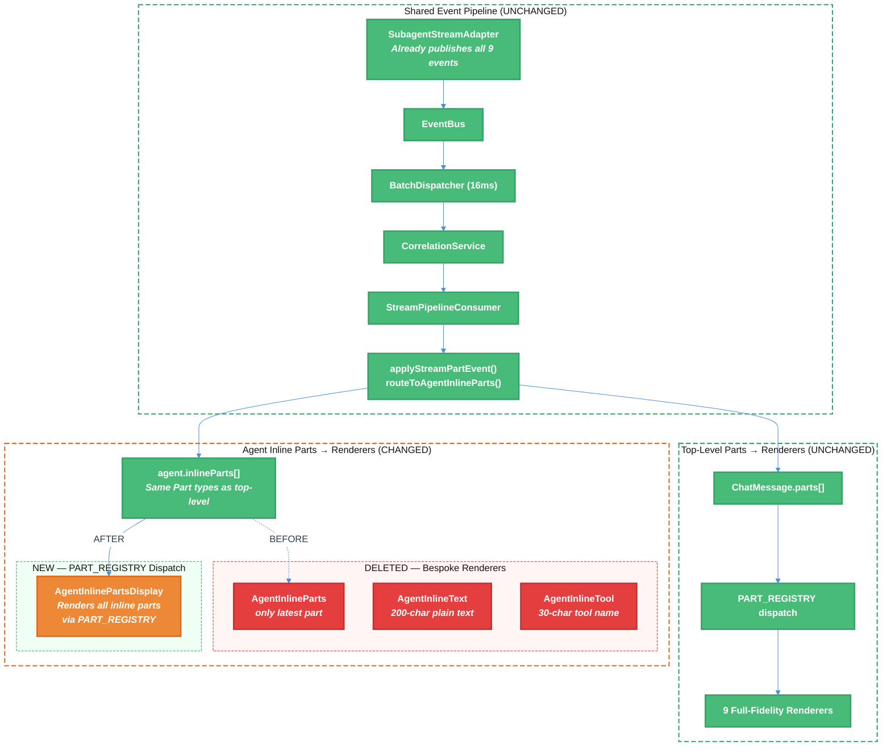

# Workflow TUI Rendering Unification Refactor — Technical Design Document / RFC

| Document Metadata      | Details     |
| ---------------------- | ----------- |
| Author(s)              | lavaman131  |
| Status                 | Draft (WIP) |
| Team / Owner           | Atomic CLI  |
| Created / Last Updated | 2026-02-28  |

---

## 1. Executive Summary

This RFC supersedes the rendering layer portion of [specs/workflow-tui-rendering-unification.md](./workflow-tui-rendering-unification.md) based on corrected findings from [research/docs/2026-02-28-workflow-tui-rendering-unification-refactor.md](../research/docs/2026-02-28-workflow-tui-rendering-unification-refactor.md). The prior spec assumed the event pipeline was broken for workflow sub-agents. Updated analysis reveals the pipeline is **already shared**: `spawnSubagentParallel()` already creates `SubagentStreamAdapter` instances that publish all 9 event types to the shared `EventBus`, and the reducer `applyStreamPartEvent()` already routes sub-agent events to `agent.inlineParts[]`.

**The divergence is only in the rendering layer.** Main chat dispatches `parts[]` through `PART_REGISTRY` — 9 full-fidelity renderers. Workflow sub-agent content lands in `agent.inlineParts[]` but is rendered by bespoke `AgentInlineText` (200-char truncated plain text) and `AgentInlineTool` (30-char tool name) — bypassing `PART_REGISTRY` entirely. Only 2 of 9 part types are handled, and only the latest part is shown.

**The fix is surgical:** replace `AgentInlineParts`/`AgentInlineText`/`AgentInlineTool` with `PART_REGISTRY` dispatch so workflow sub-agents render through the exact same renderers as the main chat. Route all part types (including `ReasoningPart`, currently missing) to `inlineParts`. Delete the bespoke rendering code.

---

## 2. Context and Motivation

### 2.1 Current State

The Atomic CLI rendering pipeline is a multi-stage event-driven system ([research §2](../research/docs/2026-02-28-workflow-tui-rendering-unification-refactor.md)):

```
SDK Stream → SDKStreamAdapter → EventBus → BatchDispatcher (16ms)
  → CorrelationService → StreamPipelineConsumer → StreamPartEvent[]
    → applyStreamPartEvent() reducer → ChatMessage.parts[] → PART_REGISTRY → renderers
```

**Critical correction from 2026-02-28 research:** The event pipeline is **fully shared** between main chat and workflow sub-agents. Specifically:

- `spawnSubagentParallel()` at `chat.tsx:4083` already creates `SubagentStreamAdapter` instances (lines 4163–4169) that publish **all 9 event types** to the shared `EventBus` ([research Finding 1](../research/docs/2026-02-28-workflow-tui-rendering-unification-refactor.md))
- `StreamPipelineConsumer` already has handlers for `workflow.step.start`, `workflow.step.complete`, and `workflow.task.update` ([research §3, updated analysis](../research/docs/2026-02-28-workflow-tui-rendering-unification-refactor.md))
- `applyStreamPartEvent()` already routes sub-agent events to `agent.inlineParts[]` via `routeToAgentInlineParts()` at `stream-pipeline.ts:938–959`
- Events arriving before the `AgentPart` exists are properly buffered and replayed via `drainBufferedEvents()` at `stream-pipeline.ts:681–721`

**Architecture (current):**

```
SHARED EVENT PIPELINE (works for both main chat and workflows):
═══════════════════════════════════════════════════════════════
SubagentStreamAdapter.consumeStream()
  ├── stream.text.delta          ✅ → pipeline → inlineParts TextPart
  ├── stream.thinking.delta      ✅ → pipeline → ⚠️ ReasoningPart on MAIN message
  ├── stream.tool.start/complete ✅ → pipeline → inlineParts ToolPart
  ├── stream.usage               ✅ → bus subscription → aggregate tokens
  ├── stream.agent.start/complete✅ → bus subscription → agent tree
  └── workflow.step/task events  ✅ → pipeline → WorkflowStepPart/TaskListPart

RENDERING DIVERGENCE (the actual problem):
══════════════════════════════════════════
Main Chat:
  parts[] → PART_REGISTRY dispatch → 9 full-fidelity renderers
    TextPartDisplay (markdown, syntax highlighting, streaming cursor)
    ReasoningPartDisplay (collapsible thinking with duration)
    ToolPartDisplay (lifecycle with collapsible I/O)
    + 6 more

Workflow Sub-Agent Inline Parts:
  agent.inlineParts[] → AgentInlineParts (bespoke)
    AgentInlineText (plain text, 200-char truncation, no markdown)
    AgentInlineTool (30-char tool name, single line)
    All other types → null (ignored)
```

**Limitations of the bespoke rendering path:**

- `AgentInlineParts` shows only the **latest** part (`parts[parts.length - 1]`) — all prior streaming content is invisible ([research Finding 12](../research/docs/2026-02-28-workflow-tui-rendering-unification-refactor.md), `parallel-agents-tree.tsx:615`)
- `AgentInlineText` renders as plain `<text>` — no markdown parsing, no syntax highlighting, no streaming cursor (`parallel-agents-tree.tsx:642–668`)
- `AgentInlineTool` renders tool name only (truncated to 30 chars) — no expandable I/O, no lifecycle state detail (`parallel-agents-tree.tsx:671–720`)
- `ReasoningPart` in `inlineParts` is **not handled** — thinking blocks from sub-agents are silently ignored
- 5 additional part types (`TaskListPart`, `SkillLoadPart`, `McpSnapshotPart`, `CompactionPart`, `WorkflowStepPart`) are completely bypassed

### 2.2 The Problem

- **User Impact:** Workflow sub-agents show minimal inline content — the latest text truncated to 200 characters with no markdown formatting, or the latest tool name in 30 characters. Users cannot see thinking blocks, tool input/output, or streaming progress. This creates a "black box" experience during the most complex and long-running operations.

- **Feature Parity Gap (High Severity):** Per [research Comprehensive Feature Parity Matrix](../research/docs/2026-02-28-workflow-tui-rendering-unification-refactor.md):

    | Feature                | Main Chat                       | Workflow Inline          | Gap Severity |
    | ---------------------- | ------------------------------- | ------------------------ | ------------ |
    | Streaming text         | Incremental markdown            | Plain text, 200 chars    | **High**     |
    | Thinking block content | ReasoningPart rendered          | Routed but not rendered  | **High**     |
    | Tool call rendering    | ToolPart lifecycle with rich UI | Plain text summary       | **High**     |
    | Markdown rendering     | Full syntax highlighting        | Plain text in agent rows | **High**     |
    | Agent inline parts     | N/A (main chat has no agents)   | Plain text only          | **High**     |

- **Wasted Infrastructure:** The event pipeline and reducer already do the work of routing events to `agent.inlineParts[]` with proper `Part` objects that are structurally identical to top-level `parts[]`. The `PART_REGISTRY` already has all 9 renderers registered. The bespoke rendering path simply bypasses all of this.

- **Technical Debt:** Three private components (`AgentInlineParts`, `AgentInlineText`, `AgentInlineTool`) duplicate rendering logic that already exists in the parts system, creating ongoing maintenance burden.

---

## 3. Goals and Non-Goals

### 3.1 Functional Goals

- [ ] Agent inline parts render through `PART_REGISTRY` dispatch — the same renderers used by main chat `parts[]`
- [ ] All 9 part types (`text`, `reasoning`, `tool`, `agent`, `task-list`, `skill-load`, `mcp-snapshot`, `compaction`, `workflow-step`) are supported in agent inline rendering
- [ ] `ReasoningPart` events from sub-agents are routed to `agent.inlineParts[]` (currently routed to main message parts)
- [ ] Multiple inline parts are visible per agent (not just the latest one), with sensible display limits to avoid cluttering the tree
- [ ] Bespoke `AgentInlineParts`, `AgentInlineText`, and `AgentInlineTool` components are removed
- [ ] Existing agent tree visual structure (`├─●` connectors, status indicators, task labels, tool counts) is preserved
- [ ] Compact mode behavior (auto-compact when all agents complete) continues to work

### 3.2 Non-Goals (Out of Scope)

- [ ] We will NOT modify the event bus pipeline — it is already shared and working correctly
- [ ] We will NOT modify `SubagentStreamAdapter` — it already publishes all event types
- [ ] We will NOT modify `routeToAgentInlineParts()` or `applyStreamPartEvent()` — the reducer already routes events correctly
- [ ] We will NOT add per-agent token count display in the tree (tracked as a Medium-severity gap in [research](../research/docs/2026-02-28-workflow-tui-rendering-unification-refactor.md), deferred)
- [ ] We will NOT add per-agent completion summaries (Low severity, deferred)
- [ ] We will NOT change HITL/tool approval behavior during workflows (auto-approve stays; Medium severity, deferred)
- [ ] We will NOT implement session recovery (Medium severity, deferred)
- [ ] We will NOT address message queue blocked during workflow execution (Low severity, deferred)

---

## 4. Proposed Solution (High-Level Design)

### 4.1 System Architecture Diagram



### 4.2 Architectural Pattern

We adopt a **Registry-Dispatched Inline Parts** pattern: the same `PART_REGISTRY` that dispatches top-level `parts[]` rendering is reused for agent `inlineParts[]`. The bespoke rendering components are replaced with a thin adapter component that iterates `inlineParts[]` and dispatches each part through `PART_REGISTRY[part.type]`.

This approach was selected because:

- It produces **zero new rendering code** — all 9 renderers already exist and are tested
- It achieves **automatic feature parity** — any future part type or renderer improvement applies to inline parts without changes
- It is a **rendering-only change** — the event pipeline, reducer, and data model are untouched

### 4.3 Key Components

| Component                   | Responsibility                                              | Location                                         | Change Type                              |
| --------------------------- | ----------------------------------------------------------- | ------------------------------------------------ | ---------------------------------------- |
| `AgentInlinePartsDisplay`   | Iterates `inlineParts[]` and dispatches via `PART_REGISTRY` | `src/ui/components/parallel-agents-tree.tsx`     | **REPLACE**                              |
| `AgentInlineParts` (old)    | Bespoke latest-only rendering                               | `src/ui/components/parallel-agents-tree.tsx:605` | **DELETE**                               |
| `AgentInlineText` (old)     | Plain text 200-char truncated rendering                     | `src/ui/components/parallel-agents-tree.tsx:642` | **DELETE**                               |
| `AgentInlineTool` (old)     | 30-char tool name rendering                                 | `src/ui/components/parallel-agents-tree.tsx:671` | **DELETE**                               |
| `routeToAgentInlineParts()` | Routes `thinking-meta` events to agent `inlineParts[]`      | `src/ui/parts/stream-pipeline.ts:938`            | **MODIFY** (add `thinking-meta` routing) |
| `PART_REGISTRY`             | Type → renderer dispatch map                                | `src/ui/components/parts/registry.tsx:23`        | **UNCHANGED**                            |

---

## 5. Detailed Design

### 5.1 Replace `AgentInlineParts` with `PART_REGISTRY` Dispatch

**Current code** (`parallel-agents-tree.tsx:605–639`):

```typescript
function AgentInlineParts({ parts, continuationPrefix, themeColors }) {
  const latestPart = parts.length > 0 ? parts[parts.length - 1] : undefined;
  if (!latestPart) return null;

  return (
    <box flexDirection="column">
      {latestPart.type === "text" ? (
        <AgentInlineText ... />
      ) : latestPart.type === "tool" ? (
        <AgentInlineTool ... />
      ) : null}
    </box>
  );
}
```

**Proposed replacement:**

```typescript
function AgentInlinePartsDisplay({
  parts,
  continuationPrefix,
  themeColors,
}: {
  parts: Part[];
  continuationPrefix: string;
  themeColors: ThemeColors;
}): React.ReactNode {
  if (parts.length === 0) return null;

  return (
    <box flexDirection="column">
      {parts.map((part, idx) => {
        const Renderer = PART_REGISTRY[part.type];
        if (!Renderer) return null;

        return (
          <box key={part.id} flexDirection="row">
            <box flexShrink={0}>
              <text style={{ fg: themeColors.muted }}>
                {continuationPrefix}{SUB_STATUS_PAD}{"  "}
              </text>
            </box>
            <box flexGrow={1} flexShrink={1}>
              <Renderer
                part={part}
                isLast={idx === parts.length - 1}
              />
            </box>
          </box>
        );
      })}
    </box>
  );
}
```

**Key behaviors:**

- Renders **all parts** through `PART_REGISTRY` dispatch — not just the latest one
- Each part is wrapped with the tree continuation prefix for visual alignment
- All 9 part types are supported automatically via the same renderers used by main chat
- The `isLast` prop is correctly passed to the last part
- No truncation, no limits — identical to how `MessageBubbleParts` renders top-level parts

### 5.2 Route `ReasoningPart` to Agent `inlineParts[]`

Currently, `stream.thinking.delta` events are processed in `useStreamConsumer` at `chat.tsx:2720–2774` and create/update `ReasoningPart` on the **main message's** `parts[]`, even when the event carries an `agentId`. These need to be routed to the agent's `inlineParts[]` instead.

**Required change in `applyStreamPartEvent()`** (`stream-pipeline.ts`):

Add a `thinking-meta` case to `routeToAgentInlineParts()` similar to the existing `text-delta`, `tool-start`, and `tool-complete` cases:

```typescript
case "thinking-meta": {
  if (event.agentId) {
    const routed = routeToAgentInlineParts(
      nextParts, event.agentId,
      (inlineParts) => handleThinkingDelta(inlineParts, event)
    );
    if (routed) return { ...message, parts: routed };
    bufferAgentEvent(event.agentId, event);
    return message;
  }
  // Existing main-message handling for non-agent thinking events
  // ...
}
```

### 5.3 Update `AgentRow` to Use New Inline Component

The `AgentRow` component at `parallel-agents-tree.tsx:514–593` currently filters `inlineParts` to avoid duplicate tool display and delegates to the old `AgentInlineParts`. Update it to:

1. Remove the duplicate-tool filtering logic at lines 547–554 (the `showCurrentTool` stripping of the last tool part)
2. Delegate to `AgentInlinePartsDisplay` instead of the old bespoke component

```typescript
// Current (line 587-591):
<AgentInlineParts
  parts={inlineParts}
  continuationPrefix={continuationPrefix}
  themeColors={themeColors}
/>

// Proposed:
<AgentInlinePartsDisplay
  parts={agent.inlineParts ?? []}
  continuationPrefix={continuationPrefix}
  themeColors={themeColors}
/>
```

Since `PART_REGISTRY` renders `ToolPart` with full lifecycle display (status, expandable I/O, collapsible output), the `currentTool` display in the agent row header becomes redundant and can be simplified or removed.

### 5.4 Data Model (Unchanged)

No changes to the data model. The `Part` union type, `AgentPart`, and `ParallelAgent.inlineParts` field already support all 9 part types. The `inlineParts: Part[]` field on `ParallelAgent` (`parallel-agents-tree.tsx:64`) is the same `Part` union used by top-level `parts[]`.

### 5.5 Data Flow (Unified State)

```
BEFORE (bespoke rendering):
agent.inlineParts[TextPart, ToolPart, ...]
  → AgentInlineParts
    → shows ONLY parts[parts.length - 1]
      → "text" → AgentInlineText (200 chars, plain text)
      → "tool" → AgentInlineTool (30 chars, tool name)
      → anything else → null

AFTER (registry dispatch):
agent.inlineParts[TextPart, ReasoningPart, ToolPart, ...]
  → AgentInlinePartsDisplay
    → shows last N parts via PART_REGISTRY
      → "text" → TextPartDisplay (full markdown)
      → "reasoning" → ReasoningPartDisplay (thinking with duration)
      → "tool" → ToolPartDisplay (lifecycle with collapsible I/O)
      → "agent" → AgentPartDisplay (nested agent tree)
      → all 9 types supported automatically
```

---

## 6. Alternatives Considered

| Option                                                    | Pros                                                                                            | Cons                                                                                                                                | Reason for Rejection                                                                         |
| --------------------------------------------------------- | ----------------------------------------------------------------------------------------------- | ----------------------------------------------------------------------------------------------------------------------------------- | -------------------------------------------------------------------------------------------- |
| **A: PART_REGISTRY dispatch for inline parts (Selected)** | Zero new rendering code; automatic future parity; renders all 9 types; minimal change footprint | None — uses renderers as-is                                                                                                         | **Selected:** Maximum code reuse; smallest delta; automatic parity with all future renderers |
| **B: Enhanced bespoke renderers**                         | No changes to PART_REGISTRY or existing renderers; self-contained in `parallel-agents-tree.tsx` | Must duplicate rendering logic for each of 9 types; ongoing maintenance burden; will diverge from PART_REGISTRY renderers over time | Would perpetuate the two-path problem rather than solving it                                 |
| **C: Separate inline part registry**                      | Could customize inline appearance per type without affecting main renderers                     | Another registry to maintain; adds complexity; doesn't reuse existing renderers                                                     | No advantage over using PART_REGISTRY directly — same renderers should be used everywhere    |

---

## 7. Cross-Cutting Concerns

### 7.1 Performance

- **Rendering volume:** Showing multiple inline parts per agent (vs. only the latest) increases React rendering work. The existing `BatchDispatcher` 16ms frame-aligned batching ensures updates are coalesced.
- **Part array growth:** For long-running workflows, `inlineParts[]` may grow. If memory becomes an issue, an eviction strategy (dropping old parts beyond a threshold) can be added to `routeToAgentInlineParts()` without changing the rendering layer.
- **Markdown rendering cost:** `TextPartDisplay` renders markdown via `<markdown>` or `<code filetype="markdown">`. With multiple agents showing inline markdown, this is more expensive than the old plain `<text>`. The `BatchDispatcher` coalescing mitigates rendering frequency.

### 7.2 Visual Consistency

- The tree visual structure (`├─●` connectors, status indicators, colors) is preserved — only the content below each agent row changes.
- Compact mode (`compact` prop to `ParallelAgentsTree`) continues to work since it's driven by agent status, not inline parts content.
- Verbose mode (Ctrl+E) automatically applies to inline parts rendered via `PART_REGISTRY` since the renderers already respect it.

### 7.3 Testing Strategy

- Existing tests for `AgentInlineParts`, `AgentInlineText`, `AgentInlineTool` in `parallel-agents-tree.test.ts` must be updated to test the new `AgentInlinePartsDisplay` component.
- Existing tests for `PART_REGISTRY` dispatch and individual renderers continue to validate correctness.
- New tests: verify that `inlineParts` with `ReasoningPart` type render correctly (since this part type was previously not routed).
- Integration test: verify end-to-end workflow execution renders inline parts through `PART_REGISTRY`.

---

## 8. Migration, Rollout, and Testing

### 8.1 Deployment Strategy

- [ ] **Phase 1 — Route `ReasoningPart` to agent `inlineParts[]`:** Modify `applyStreamPartEvent()` to route `thinking-meta` events with `agentId` to `routeToAgentInlineParts()` instead of main message parts. This ensures all relevant part types flow to inline parts.

- [ ] **Phase 2 — Replace bespoke renderers with `PART_REGISTRY` dispatch:** Remove `AgentInlineParts`, `AgentInlineText`, `AgentInlineTool`. Add `AgentInlinePartsDisplay` that iterates `inlineParts[]` and dispatches each through `PART_REGISTRY`. Update `AgentRow` to use the new component. Remove duplicate-tool filtering logic.

- [ ] **Phase 3 — Visual polish and testing:** Verify compact mode, verify verbose mode interaction, run E2E workflow tests to validate visual output.

### 8.2 Test Plan

- **Unit Tests:**
    - `AgentInlinePartsDisplay`: Verify it renders all 9 part types via `PART_REGISTRY`; verify empty parts returns `null`
    - `routeToAgentInlineParts()` with `thinking-meta`: Verify `ReasoningPart` is created in agent's `inlineParts` when `agentId` is present

- **Integration Tests:**
    - Workflow execution produces visible inline parts in agent tree rows
    - Concurrent sub-agents render independent inline parts without interleaving
    - `drainBufferedEvents()` correctly replays `thinking-meta` events for agents that materialize late

- **E2E Tests:**
    - Run a Ralph workflow and verify: streaming text with markdown, thinking blocks, tool progress, and step markers are visible in the agent tree
    - Verify compact mode auto-triggers when agents complete
    - Verify Ctrl+E verbose mode expands inline tool parts

---

## 9. Open Questions / Unresolved Issues

> **Note:** `AtomicEventBus` is being renamed to `EventBus` across the codebase. This spec uses the new name `EventBus`. Implementers should rename `AtomicEventBus` → `EventBus` in any files touched by this work.

All questions resolved:

1. ✅ **Inline parts display limit:** No limit — render all parts via `PART_REGISTRY`, same as the main engine. No `MAX_INLINE_PARTS_VISIBLE` constant needed. The main chat renders all parts in `MessageBubbleParts`; inline parts follow the same behavior.

2. ✅ **Inline text length limit:** No limit — render full markdown via `TextPartDisplay`, same as the main engine. No `MAX_INLINE_TEXT_LENGTH` constant needed. The old 200-char plain text truncation is eliminated along with the bespoke `AgentInlineText` component.

3. ✅ **`syntaxStyle` prop propagation:** No `syntaxStyle` prop — inline parts render identically to main engine parts. No changes to the `PartRenderer` interface. Renderers are used as-is.

4. ✅ **Thinking event routing scope:** Exclusive routing to `inlineParts` — `thinking-meta` events with `agentId` route exclusively to the agent's `inlineParts[]`, rendered via the same `PART_REGISTRY` as main chat. The aggregate thinking time display in the spinner is unaffected since it uses a separate `stream.thinking.complete` bus subscription.

5. ✅ **`AgentInlineTool` duplicate-tool filtering:** Remove deduplication — the `AgentRow` code that strips the last tool part when `showCurrentTool` is true (lines 547–554) is removed. `PART_REGISTRY` handles tool rendering fully, and the `currentTool` display in the agent row header can be removed or coexist since the inline `ToolPartDisplay` provides richer information.

---

## Appendix A: File Change Inventory

| File                                             | Change Type  | Description                                                                                                                                                                                                                                          |
| ------------------------------------------------ | ------------ | ---------------------------------------------------------------------------------------------------------------------------------------------------------------------------------------------------------------------------------------------------- |
| `src/ui/components/parallel-agents-tree.tsx`     | **MODIFIED** | Delete `AgentInlineParts` (605–639), `AgentInlineText` (642–668), `AgentInlineTool` (671–720). Add `AgentInlinePartsDisplay` with `PART_REGISTRY` dispatch. Update `AgentRow` to use new component. Remove duplicate-tool filtering logic (547–554). |
| `src/ui/parts/stream-pipeline.ts`                | **MODIFIED** | Add `thinking-meta` case to `routeToAgentInlineParts()` for agent-scoped `ReasoningPart` routing                                                                                                                                                     |
| `src/ui/components/parallel-agents-tree.test.ts` | **MODIFIED** | Update tests for `AgentInlinePartsDisplay`; remove tests for deleted bespoke components                                                                                                                                                              |

## Appendix B: Research References

| Document                                                                                                                                              | Relevance                                                                             |
| ----------------------------------------------------------------------------------------------------------------------------------------------------- | ------------------------------------------------------------------------------------- |
| [research/docs/2026-02-28-workflow-tui-rendering-unification-refactor.md](../research/docs/2026-02-28-workflow-tui-rendering-unification-refactor.md) | **Primary research** — corrected pipeline analysis, rendering-only gap identification |
| [research/docs/2026-02-27-workflow-tui-rendering-unification.md](../research/docs/2026-02-27-workflow-tui-rendering-unification.md)                   | Prior architecture audit — initial gap identification (partially superseded)          |
| [research/docs/2026-02-28-workflow-gaps-architecture.md](../research/docs/2026-02-28-workflow-gaps-architecture.md)                                   | Gap inventory — 7 categories of gaps including rendering pipeline                     |
| [research/docs/2026-02-25-ui-workflow-coupling.md](../research/docs/2026-02-25-ui-workflow-coupling.md)                                               | Coupling surface between UI and workflow layers                                       |
| [research/docs/2026-02-26-streaming-architecture-event-bus-migration.md](../research/docs/2026-02-26-streaming-architecture-event-bus-migration.md)   | Event bus migration — confirms shared infrastructure                                  |
| [specs/workflow-tui-rendering-unification.md](./workflow-tui-rendering-unification.md)                                                                | Prior spec — partially superseded by this refactor spec                               |
| [specs/chat-system-parts-based-rendering.md](./chat-system-parts-based-rendering.md)                                                                  | Parts-based rendering design — defines the `PART_REGISTRY` system                     |

## Appendix C: Relationship to Prior Spec

This spec **supersedes the rendering layer portions** of [specs/workflow-tui-rendering-unification.md](./workflow-tui-rendering-unification.md). Specifically:

- **§5.1 SubagentStreamAdapter** — No longer needed; already exists and works
- **§5.2 CorrelationService Enhancement** — No longer needed; already working
- **§5.3 spawnSubagentParallel Refactoring** — No longer needed; already using adapters
- **§5.4 Workflow Event UI Consumers** — Already wired in `StreamPipelineConsumer`
- **§5.5 Per-Agent Streaming Content Scoping** — Partially relevant; the `inlineParts` routing works, but rendering needs the change described in this spec
- **§5.6 Token Count Aggregation** — Deferred (out of scope for this rendering-focused spec)

The prior spec's phases 1–2 are effectively already implemented. This spec addresses the remaining Phase 3 gap (rendering) with a more precise, smaller-scope intervention.
