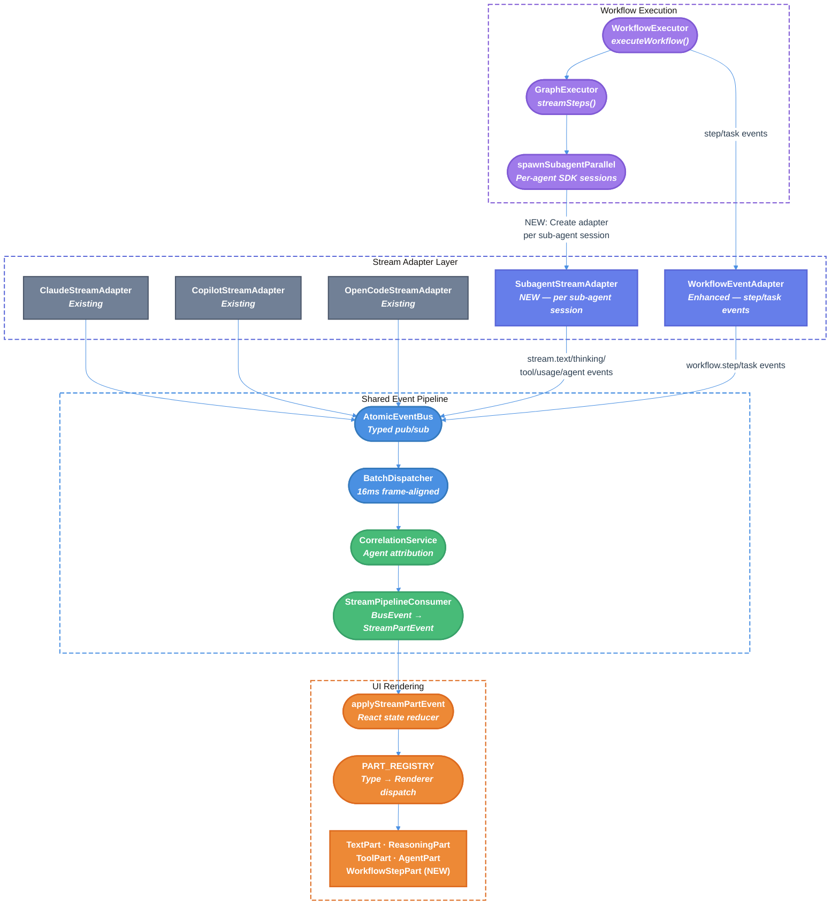

# Workflow TUI Rendering Unification — Technical Design Document / RFC

| Document Metadata      | Details     |
| ---------------------- | ----------- |
| Author(s)              | Alex Lavaee |
| Status                 | Draft (WIP) |
| Team / Owner           | Atomic CLI  |
| Created / Last Updated | 2026-02-27  |

---

## 1. Executive Summary

The Atomic CLI currently runs two completely separate rendering pipelines: one for the main chat interface (rich streaming with text deltas, thinking blocks, tool status, token counts, and sub-agent trees) and one for workflow execution (two static messages and silent sub-agent sessions). Workflow sub-agents create independent SDK sessions that discard all streaming content, thinking blocks, tool lifecycle events, and token usage — producing a visually impoverished experience compared to normal chat interactions.

This RFC proposes **unifying workflow rendering with the main TUI chat pipeline** so that workflow sub-agents stream through the same `AtomicEventBus → BatchDispatcher → StreamPipelineConsumer → Part[] → PART_REGISTRY` pipeline as normal chat messages. The result: workflows display real-time streaming text, thinking blocks, tool progress, token counts, and rich sub-agent trees — making workflow execution feel like a native extension of the chat experience rather than a separate execution mode.

> **Research basis:** [research/docs/2026-02-27-workflow-tui-rendering-unification.md](../research/docs/2026-02-27-workflow-tui-rendering-unification.md) — comprehensive architecture audit of both rendering pipelines, gap analysis, and integration point mapping.

---

## 2. Context and Motivation

### 2.1 Current State

The TUI renders chat messages through a sophisticated multi-stage event-driven pipeline:

```
SDK Stream → SDK Adapter → bus.publish() → BatchDispatcher (16ms)
  → CorrelationService → StreamPipelineConsumer → StreamPartEvent[]
    → React state reducer (applyStreamPartEvent) → Part[] → PART_REGISTRY → renderers
```

This pipeline supports ([research §1](../research/docs/2026-02-27-workflow-tui-rendering-unification.md)):
- **Streaming text** via `stream.text.delta` events → `TextPartDisplay` with markdown rendering
- **Thinking blocks** via `stream.thinking.delta` events → `ReasoningPartDisplay` with dimmed syntax
- **Tool lifecycle** via `stream.tool.start/complete` events → `ToolPartDisplay` with collapsible output
- **Token counts** via `stream.usage` events → `LoadingIndicator` and `CompletionSummary`
- **Sub-agent trees** via `stream.agent.*` events → `ParallelAgentsTree` with status colors and progress
- **Spinners** via braille animation frames with elapsed time, token count, and thinking duration

The workflow executor at `src/workflows/executor.ts` bypasses this entire pipeline ([research §2](../research/docs/2026-02-27-workflow-tui-rendering-unification.md)):

```
executeWorkflow()
  → context.addMessage("Starting workflow...")          ← static text
  → for await (step of streamGraph()):
    → spawnSubagentParallel():
      → createSubagentSession()                         ← INDEPENDENT session
      → for await (msg of stream):                      ← SILENT consumption
        → summaryParts.push(msg.content)                ← NO rendering
      → return SubagentResult                           ← truncated to 4000 chars
  → context.addMessage("Workflow completed.")           ← static text
```

**Architecture:** The workflow executor communicates with the TUI exclusively through the `CommandContext` interface ([research §6](../research/docs/2026-02-27-workflow-tui-rendering-unification.md)), which provides `addMessage()` (static text), `setStreaming()` (boolean flag), and `spawnSubagentParallel()` (silent sub-agent execution). It does not use `streamAndWait()` or any of the event bus infrastructure.

**Limitations:**
- Sub-agent SDK sessions are created independently and destroyed after use — they never publish to the shared `AtomicEventBus`
- Text, thinking, tool, and usage events are discarded in the silent consumption loop at `chat.tsx:3970-3984`
- `workflow.step.*` and `workflow.task.*` bus events are published but have **zero UI consumers**
- The sub-agent tree shows workflow agents but without live tool progress, streaming text, or thinking metadata

### 2.2 The Problem

- **User Impact:** Users running workflows see only "Starting workflow..." and "Workflow completed." messages with no visibility into what's happening. Sub-agents appear in the tree but show no streaming content, tool usage, or thinking activity. This creates a "black box" experience that erodes trust and makes debugging difficult.

- **Feature Parity Gap:** Normal chat interactions display rich streaming output while workflows — which are the most complex and long-running operations — show the least information. This inverts the expected relationship between operation complexity and observability.

- **Wasted Infrastructure:** The event bus system (`AtomicEventBus`, `BatchDispatcher`, `StreamPipelineConsumer`, `CorrelationService`) was specifically designed to handle multi-agent streaming scenarios. The workflow executor publishes some events (`stream.agent.*`, `workflow.step.*`, `workflow.task.*`) but doesn't leverage the consumption side. Three of the five published event types have no UI consumers at all ([research §2.3, Event Type Coverage table](../research/docs/2026-02-27-workflow-tui-rendering-unification.md)).

- **Technical Debt:** Two separate rendering paths mean every UI improvement (new part types, rendering optimizations, accessibility features) must be duplicated or doesn't apply to workflows.

---

## 3. Goals and Non-Goals

### 3.1 Functional Goals

- [ ] Workflow sub-agents stream text content through the same event bus pipeline as normal chat, with incremental rendering via `TextPartDisplay`
- [ ] Thinking blocks from workflow sub-agents are captured and displayed via `ReasoningPartDisplay`, including duration tracking
- [ ] Tool lifecycle events (`stream.tool.start/complete`) from workflow sub-agents render inline via `ToolPartDisplay` with collapsible output
- [ ] Token usage from workflow sub-agents is tracked and displayed in both `LoadingIndicator` (during streaming) and `CompletionSummary` (after completion)
- [ ] Sub-agent tree entries for workflow agents show live tool progress, current tool name, tool count, and elapsed time — matching normal chat behavior
- [ ] `workflow.step.*` events are consumed by UI components to display step/node transition progress
- [ ] `workflow.task.*` events are consumed by UI components to display task list updates inline
- [ ] `spawnSubagentParallel` returns streaming-aware results via the `SubagentStreamAdapter` — the old silent accumulation path is removed entirely
- [ ] The rendering pipeline correctly handles concurrent sub-agent streams without content interleaving corruption

### 3.2 Non-Goals (Out of Scope)

- [ ] We will NOT refactor the graph execution engine itself — it remains generic and UI-independent
- [ ] We will NOT change the `WorkflowSDK` class or reconcile it with `CommandContext` in this effort (covered by the [Unified Workflow Execution spec](./unified-workflow-execution.md))
- [ ] We will NOT generalize Ralph-specific coupling points (session dir, task IDs, etc.) — that is addressed by the Unified Workflow Execution RFC
- [ ] We will NOT introduce new part types beyond what is needed for `workflow.step.*` and `workflow.task.*` event rendering
- [ ] We will NOT change the SDK adapters (`claude-adapter.ts`, `copilot-adapter.ts`, `opencode-adapter.ts`) — they remain as-is for main chat
- [ ] We will NOT modify the graph engine's `StepResult` yield format or the `streamGraph()` async generator

---

## 4. Proposed Solution (High-Level Design)

### 4.1 System Architecture Diagram



### 4.2 Architectural Pattern

We adopt a **Bus-Integrated Sub-Agent Sessions** pattern (Option A from [research §4.2](../research/docs/2026-02-27-workflow-tui-rendering-unification.md)): instead of silently consuming sub-agent streams, we create lightweight stream adapters for each sub-agent session that publish normalized events to the shared `AtomicEventBus`. The existing `CorrelationService` is enhanced to attribute sub-agent events to their parent workflow agent, enabling proper scoping in the UI.

This approach was selected over the alternatives because:
- **Option B (Workflow-Specific Stream Adapter)** would create a third rendering path rather than reusing the existing one
- **Option C (Inline Agent Rendering via `streamAndWait`)** would serialize sub-agent execution, breaking the parallel execution model that workflows depend on

### 4.3 Key Components

| Component                            | Responsibility                                                                                  | Technology / Location                                          | Justification                                                                                 |
| ------------------------------------ | ----------------------------------------------------------------------------------------------- | -------------------------------------------------------------- | --------------------------------------------------------------------------------------------- |
| `SubagentStreamAdapter`              | Normalizes per-session SDK streams into `BusEvent`s for sub-agents                              | `src/events/adapters/subagent-adapter.ts` (NEW)                | Reuses existing adapter pattern; each sub-agent session gets its own adapter instance         |
| `CorrelationService` (enhanced)      | Tracks sub-agent session → parent agent ID mapping                                              | `src/events/consumers/correlation-service.ts` (MODIFIED)       | Already enriches events with `resolvedAgentId`; needs sub-agent session registry              |
| `StreamPipelineConsumer` (enhanced)  | Maps `workflow.step.*` and `workflow.task.*` events to `StreamPartEvent`s                       | `src/events/consumers/stream-pipeline-consumer.ts` (MODIFIED)  | Existing BusEvent→StreamPartEvent mapper; needs new event type handlers                       |
| `WorkflowStepPartDisplay`            | Renders workflow step transitions as progress markers                                           | `src/ui/components/parts/workflow-step-part-display.tsx` (NEW) | Visual indicator for graph node transitions within the message stream                         |
| `spawnSubagentParallel` (refactored) | Creates stream adapters alongside sessions; returns `SubagentStreamResult[]` with full metadata | `src/ui/chat.tsx` (MODIFIED)                                   | Core integration point — the silent consumption loop is replaced with adapter-based streaming |

---

## 5. Detailed Design

### 5.1 SubagentStreamAdapter

A new, lightweight adapter that bridges a sub-agent's SDK session stream to the shared event bus. Unlike the main SDK adapters (which handle full session lifecycle), this adapter is scoped to a single sub-agent execution.

**Location:** `src/events/adapters/subagent-adapter.ts`

**Interface:**

```typescript
interface SubagentStreamAdapterOptions {
  bus: AtomicEventBus;
  sessionId: string;        // parent session ID for bus event envelope
  agentId: string;           // sub-agent ID for correlation
  parentAgentId?: string;    // parent agent ID (for nested agents)
  runId: string;             // workflow run ID for staleness detection
}

class SubagentStreamAdapter {
  constructor(options: SubagentStreamAdapterOptions);

  /**
   * Consumes an SDK session stream, publishing normalized events
   * to the bus. Returns a SubagentStreamResult with full streaming
   * metadata (token counts, thinking duration, tool details).
   */
  consumeStream(
    stream: AsyncIterable<StreamMessage>,
    abortSignal?: AbortSignal
  ): Promise<SubagentStreamResult>;
}
```

**Behavior:**

The adapter iterates the SDK stream and for each message:

| SDK Message Type | Bus Event Published                                | Accumulation                     |
| ---------------- | -------------------------------------------------- | -------------------------------- |
| `text`           | `stream.text.delta` with `agentId` in metadata     | Accumulates full text for result |
| `thinking`       | `stream.thinking.delta` with `agentId` in metadata | —                                |
| `tool_use`       | `stream.tool.start`                                | Increments `toolUses` counter    |
| `tool_result`    | `stream.tool.complete`                             | —                                |
| `usage`          | `stream.usage` with per-agent token counts         | —                                |

On stream completion, publishes `stream.text.complete` and returns a `SubagentStreamResult` containing the full accumulated text, tool details, token usage, and thinking duration. The old `MAX_SUMMARY_LENGTH` = 4000 char truncation is removed — callers receive the complete output.

**Key constraint:** The adapter must publish events with the **parent session's** `sessionId` (not the sub-agent's isolated session ID), so the `CorrelationService` can attribute them to the correct message context. The `agentId` field in event metadata differentiates which sub-agent produced the event.

### 5.2 CorrelationService Enhancement

The `CorrelationService` at `src/events/consumers/correlation-service.ts` currently tracks agent context via `resolvedAgentId` and `isSubagentTool`. It needs a sub-agent session registry to map incoming events to the correct parent workflow agent.

**New internal state:**

```typescript
// Maps sub-agent agentId → parent context
private subagentRegistry: Map<string, {
  parentAgentId: string;
  workflowRunId: string;
  nodeId?: string;
}>;

registerSubagent(agentId: string, context: SubagentContext): void;
unregisterSubagent(agentId: string): void;
```

**Enrichment behavior:**

When processing events with `agentId` in metadata:
1. Look up the `agentId` in `subagentRegistry`
2. If found, set `resolvedAgentId` to the sub-agent's `agentId`
3. Set `parentAgentId` to the registered parent
4. Set `isSubagentTool = true` for tool events
5. Set `suppressFromMainChat = false` (workflow sub-agent events SHOULD render)

This enables the UI to scope sub-agent content within the correct agent tree node.

### 5.3 spawnSubagentParallel Refactoring

The core change is in `src/ui/chat.tsx`'s `spawnSubagentParallel` closure. The silent consumption loop is replaced with `SubagentStreamAdapter` usage.

**Current flow (silent):**
```typescript
// chat.tsx:3970-3984
for await (const msg of stream) {
  if (msg.type === "tool_use") { toolUses++; }
  else if (msg.type === "text") { summaryParts.push(msg.content); }
}
```

**New flow (bus-integrated):**
```typescript
// Each sub-agent gets a stream adapter
const adapter = new SubagentStreamAdapter({
  bus: eventBus,
  sessionId: currentSessionId,
  agentId: agent.agentId,
  parentAgentId: agent.parentAgentId,
  runId: workflowRunId,
});

// Register with correlation service for event attribution
correlationService.registerSubagent(agent.agentId, {
  parentAgentId: agent.parentAgentId,
  workflowRunId,
});

try {
  // Adapter publishes events AND returns SubagentStreamResult
  const result = await adapter.consumeStream(stream, agentAbort.signal);
  return result;
} finally {
  correlationService.unregisterSubagent(agent.agentId);
  session.destroy();
}
```

**Breaking change:** The old `SubagentResult` type and the silent consumption loop are removed entirely. `spawnSubagentParallel` now returns `SubagentStreamResult[]` which includes richer metadata (token counts, thinking duration, tool details) alongside the full untruncated output. All callers (workflow node functions, `@agent` commands) must use the new return type.

**Universal application:** The `SubagentStreamAdapter` is used for all sub-agent spawns — both workflow and non-workflow (e.g., `@agent` chat commands). There is no opt-in flag; `spawnSubagentParallel` always creates adapters. The old silent consumption path is deleted.

### 5.4 Workflow Event UI Consumers

Three bus event types are published but have no UI consumers ([research §2.3](../research/docs/2026-02-27-workflow-tui-rendering-unification.md)):

#### 5.4.1 `workflow.step.start` / `workflow.step.complete`

**New `StreamPartEvent` type:** `workflow-step`

**New `Part` type:** `WorkflowStepPart`

```typescript
interface WorkflowStepPart {
  type: "workflow-step";
  id: string;
  nodeId: string;
  nodeName: string;
  status: "running" | "completed" | "error";
  startedAt: number;
  completedAt?: number;
  durationMs?: number;
}
```

**Rendering:** `WorkflowStepPartDisplay` renders as a subtle divider/progress marker:

```
── Step: planner (running) ──────────────────
```
```
── Step: planner ✓ (2.3s) ───────────────────
```

This integrates into the existing `PART_REGISTRY` dispatch:

```typescript
// registry.tsx addition
"workflow-step": WorkflowStepPartDisplay,
```

#### 5.4.2 `workflow.task.update`

**Handled by existing infrastructure:** The `TaskListPart` and `TaskListPartDisplay` already exist in the parts system. `workflow.task.update` events should be mapped to `task-list` `StreamPartEvent`s, updating the inline task list within the message.

**Mapping in `StreamPipelineConsumer`:**

```typescript
case "workflow.task.update":
  return {
    type: "task-list-update",
    messageId: currentMessageId,
    tasks: event.data.tasks,
  };
```

### 5.5 Per-Agent Streaming Content Scoping

When multiple workflow sub-agents stream concurrently, their content must be scoped correctly in the UI. The `ParallelAgentsTree` component already renders per-agent entries. The enhancement is displaying each agent's streaming content (text, thinking, tools) nested under its tree entry.

**Approach:** The `AgentPartDisplay` at `src/ui/components/parts/agent-part-display.tsx` is enhanced to render inline content for agents that have streaming parts:

```
├─ ✓ worker-1 (analyze auth module) — 3 tools · 4.2s
│    ● Generated authentication middleware...
│    ∴ Thought (1.2s)
│    ⚙ edit src/auth/middleware.ts ✓
├─ ⟳ worker-2 (update API routes) — 1 tool · 2.1s
│    ● Updating route handlers...
└─ ◌ worker-3 (write tests) — pending
```

**Data model:** Each agent entry in the `Part[]` array gains an optional `inlineParts: Part[]` field that holds the agent's streaming content. The `applyStreamPartEvent` reducer routes events with `resolvedAgentId` to the correct agent's `inlineParts` sub-array.

### 5.6 Token Count Aggregation

Token usage from workflow sub-agents flows through `stream.usage` events to the existing subscription at `chat.tsx:2755`. Enhancement:

- **Per-agent tokens:** Each `stream.usage` event carries `agentId` in metadata. The UI tracks per-agent token counts for display in the sub-agent tree.
- **Aggregate tokens:** The `LoadingIndicator` and `CompletionSummary` show total tokens across all active workflow sub-agents.
- **Completion summary:** After workflow completion, shows aggregate stats: `⣿ Workflow completed in Xs · ↓ Xk tokens · N agents`

### 5.7 Data Flow for Unified Rendering

Complete data flow after unification:

```
Workflow Executor
  → executeWorkflow()
    → publishStepStart() → bus → WorkflowStepPart (NEW consumer)
    → spawnSubagentParallel()
      → For each agent:
        → createSubagentSession()
        → SubagentStreamAdapter.consumeStream()
          → stream.text.delta → bus → BatchDispatcher → CorrelationService
            → StreamPipelineConsumer → text-delta StreamPartEvent
              → applyStreamPartEvent → TextPart (scoped to agent)
          → stream.thinking.delta → bus → ... → ReasoningPart (scoped to agent)
          → stream.tool.start → bus → ... → ToolPart (scoped to agent)
          → stream.usage → bus → ... → token count update
        → Returns SubagentStreamResult (full metadata)
    → publishStepComplete() → bus → WorkflowStepPart update
    → publishTaskUpdate() → bus → TaskListPart update (existing)
  → Completion summary with aggregate tokens
```

---

## 6. Alternatives Considered

| Option                                              | Pros                                                                                     | Cons                                                                                                           | Reason for Rejection                                                                                     |
| --------------------------------------------------- | ---------------------------------------------------------------------------------------- | -------------------------------------------------------------------------------------------------------------- | -------------------------------------------------------------------------------------------------------- |
| **A: Bus-Integrated Sub-Agent Sessions (Selected)** | Reuses entire existing pipeline; sub-agents render identically to chat; minimal new code | Requires correlation service enhancement; concurrent stream management                                         | **Selected:** Maximum reuse of existing infrastructure; smallest gap between chat and workflow rendering |
| **B: Workflow-Specific Stream Adapter**             | Could add workflow-specific rendering features                                           | Creates a third rendering path; duplicates pipeline logic; ongoing maintenance burden                          | Would not achieve rendering parity — workflow content would still look different from chat content       |
| **C: Inline Agent Rendering via `streamAndWait`**   | Simplest implementation; `streamAndWait` already works                                   | Serializes sub-agent execution (breaks parallel model); each agent blocks until complete; significantly slower | Workflows spawn 3-5+ parallel sub-agents; serialization would multiply execution time proportionally     |
| **D: Post-hoc Rendering (accumulate then display)** | No concurrent stream complexity                                                          | No streaming feedback; users see nothing until agent completes; loses the "live" feel                          | Worse than current state for long-running agents (30s+ per agent) — users need real-time feedback        |

---

## 7. Cross-Cutting Concerns

### 7.1 Performance

- **Concurrent stream volume:** A workflow with 5 parallel sub-agents could produce 5× the event volume of a single chat stream. The `BatchDispatcher`'s 16ms frame-aligned batching already coalesces events, but peak throughput should be load-tested.
- **Part array growth:** Each sub-agent adds text, thinking, and tool parts. For workflows with many agents, the `Part[]` array per message could grow large. The existing binary search insertion (`src/ui/parts/store.ts:42`) is O(log n) per insertion.
- **Memory:** Sub-agent sessions are destroyed after completion. Stream adapter instances are lightweight and GC'd after `consumeStream()` returns.

### 7.2 Observability Strategy

- **Existing metrics:** `stream.usage` events already carry token counts. No new metrics infrastructure needed.
- **Step timing:** `workflow.step.start/complete` events carry timestamps. `WorkflowStepPart` computes `durationMs` for display.
- **Agent-level observability:** Per-agent tool counts, duration, and token usage are tracked in the sub-agent tree.

### 7.3 Error Handling

- **Sub-agent abort:** The existing three-tier abort chain (external → parallel → per-agent) is preserved. The `SubagentStreamAdapter` respects the abort signal and publishes a `stream.text.complete` with error state on abort.
- **Stream errors:** If a sub-agent stream throws, the adapter catches the error, publishes an error event, and returns a failure `SubagentStreamResult` with the error details.
- **Stale events:** The `runId` field in event metadata allows consumers to ignore events from cancelled/previous workflow runs.

### 7.4 Breaking Changes

- **`SubagentResult` replaced by `SubagentStreamResult`:** The old `SubagentResult` type (`{ agentId, success, output, toolUses, durationMs }`) is removed. The new `SubagentStreamResult` includes richer fields: `{ agentId, success, output, toolUses, durationMs, tokenUsage, thinkingDurationMs, toolDetails }`. All callers must be updated.
- **Silent consumption loop removed:** The `for await (msg of stream)` loop in `spawnSubagentParallel` that silently accumulated text is deleted. All sub-agent streams now flow through `SubagentStreamAdapter` and the event bus.
- **Output truncation removed:** The `MAX_SUMMARY_LENGTH = 4000` character truncation is removed. `SubagentStreamResult.output` contains the complete untruncated text.
- **Existing tests updated:** Tests referencing `SubagentResult` must be updated to use `SubagentStreamResult` and verify event bus publication.

---

## 8. Migration, Rollout, and Testing

### 8.1 Deployment Strategy

- [ ] **Phase 1 — SubagentStreamAdapter + CorrelationService enhancement:** Implement the adapter and correlation changes. Workflow sub-agents begin publishing events to the bus. UI renders them through the existing pipeline. This is the core architectural change.
- [ ] **Phase 2 — Workflow event consumers:** Add `WorkflowStepPartDisplay` and wire `workflow.step.*` / `workflow.task.*` events to the parts pipeline. This adds step transition markers and inline task updates.
- [ ] **Phase 3 — Per-agent inline content:** Enhance `AgentPartDisplay` to render `inlineParts` for each agent. Add per-agent token tracking. This is the visual polish phase.
- [ ] **Phase 4 — Performance validation and tuning:** Load-test with concurrent sub-agents, tune `BatchDispatcher` if needed, validate memory usage.

### 8.2 Test Plan

- **Unit Tests:**
  - `SubagentStreamAdapter`: Verify event publication for each SDK message type; verify `SubagentStreamResult` fields; verify abort handling
  - `CorrelationService`: Verify sub-agent registration/unregistration; verify event enrichment with parent context
  - `StreamPipelineConsumer`: Verify `workflow.step.*` and `workflow.task.*` mapping to `StreamPartEvent`s
  - `applyStreamPartEvent`: Verify agent-scoped part insertion for events with `resolvedAgentId`

- **Integration Tests:**
  - End-to-end workflow execution with bus event verification: assert that running a workflow produces the expected sequence of bus events
  - Concurrent sub-agent streaming: verify content from parallel agents is correctly scoped and doesn't interleave
  - Abort mid-workflow: verify cleanup of adapter instances, correlation registry entries, and UI state

- **E2E Tests:**
  - Visual verification that workflow execution displays streaming text, thinking blocks, tool progress, and token counts
  - Verify sub-agent tree shows live progress during workflow execution
  - Verify step transition markers appear between workflow graph nodes

---

## 9. Open Questions / Unresolved Issues

1. **Concurrency rendering model:** ✅ **Resolved.** Workflow sub-agents use the same sub-agent tree design defined in [docs/ui-design-patterns.md](../docs/ui-design-patterns.md) — tree-based UI with `├─●` / `└─●` connectors, per-agent task descriptions, tool counts, and current tool names streaming per-branch. Tools and text blocks stream using the same rendering engine as the main TUI (via the shared event bus pipeline). No separate rendering mode for workflows.

2. **Agent nesting depth:** ✅ **Resolved.** 1 level deep — only direct sub-agents of the workflow are shown in the tree. Nested sub-sub-agents (e.g., a worker agent's Task tool sub-agents) are summarized in the parent agent's tool count, not rendered as separate tree entries. This keeps the UI manageable and consistent with the existing `ParallelAgentsTree` max-5 visible limit.

3. **Per-node message boundaries:** ✅ **Resolved.** Single message with step dividers — all workflow output renders within one assistant message. Step transitions between graph nodes are shown as subtle inline dividers (e.g., `── Step: planner ✓ ──`). This keeps the chat history clean and avoids fragmenting the workflow's output across multiple message bubbles.

4. **Token count granularity:** ✅ **Resolved.** Aggregate only — a single total token count is shown in the workflow's `CompletionSummary` (e.g., `⣿ Workflow completed in 45s · ↓ 12k tokens · 5 agents`). Individual per-agent or per-node token breakdowns are not displayed.

5. **Non-workflow sub-agent opt-in:** ✅ **Resolved.** Apply to all sub-agents — bus-integrated streaming rendering is enabled for all sub-agent spawns, including non-workflow `@agent` chat commands. This ensures consistent rendering behavior across all sub-agent contexts and avoids maintaining two code paths in `spawnSubagentParallel`.

6. **`workflow.step.*` visual treatment:** ✅ **Resolved.** Subtle inline dividers — horizontal rule-style markers like `── Step: planner ✓ (2.3s) ──` using dimmed styling, consistent with the existing UI design patterns from [docs/ui-design-patterns.md](../docs/ui-design-patterns.md). Running steps show `── Step: planner (running) ──`; completed steps show the checkmark and duration.

---

## Appendix A: File Change Inventory

| File                                                     | Change Type | Description                                                                                                      |
| -------------------------------------------------------- | ----------- | ---------------------------------------------------------------------------------------------------------------- |
| `src/events/adapters/subagent-adapter.ts`                | **NEW**     | `SubagentStreamAdapter` class — bridges sub-agent SDK streams to event bus                                       |
| `src/events/consumers/correlation-service.ts`            | MODIFIED    | Add sub-agent registry for event attribution                                                                     |
| `src/events/consumers/stream-pipeline-consumer.ts`       | MODIFIED    | Add handlers for `workflow.step.*` and `workflow.task.*` events                                                  |
| `src/ui/chat.tsx`                                        | MODIFIED    | Refactor `spawnSubagentParallel` to use `SubagentStreamAdapter`; pass event bus + correlation service to adapter |
| `src/ui/parts/stream-pipeline.ts`                        | MODIFIED    | Add agent-scoped part routing in `applyStreamPartEvent`                                                          |
| `src/ui/parts/types.ts`                                  | MODIFIED    | Add `WorkflowStepPart` type definition; add `inlineParts` to agent parts                                         |
| `src/ui/components/parts/registry.tsx`                   | MODIFIED    | Register `WorkflowStepPartDisplay` in `PART_REGISTRY`                                                            |
| `src/ui/components/parts/workflow-step-part-display.tsx` | **NEW**     | Renderer for workflow step transition markers                                                                    |
| `src/ui/components/parts/agent-part-display.tsx`         | MODIFIED    | Render `inlineParts` for agents with streaming content                                                           |
| `src/events/adapters/workflow-adapter.ts`                | MODIFIED    | Minor — ensure step/task events carry consistent metadata                                                        |

## Appendix B: Event Flow Diagram (Unified State)

```
┌─────────────────────────────────────────────────────────────────────────┐
│                         EVENT BUS (AtomicEventBus)                      │
│                                                                         │
│  PRODUCERS:                          CONSUMERS:                         │
│  ┌──────────────────┐               ┌────────────────────────────────┐  │
│  │ ClaudeAdapter    │──┐            │ BatchDispatcher (16ms batch)   │  │
│  │ CopilotAdapter   │──┤            │   → CorrelationService        │  │
│  │ OpenCodeAdapter   │──┤  publish   │     → StreamPipelineConsumer  │  │
│  │ SubagentAdapter ◆ │──┼──────────→│       → applyStreamPartEvent  │  │
│  │ WorkflowAdapter   │──┘            │         → Part[] → Renderers │  │
│  └──────────────────┘               └────────────────────────────────┘  │
│                                                                         │
│  ◆ = NEW component                                                      │
│                                                                         │
│  Events now unified:                                                    │
│  ├── stream.text.delta      (chat ✓  workflow ✓)                       │
│  ├── stream.thinking.delta  (chat ✓  workflow ✓)                       │
│  ├── stream.tool.start      (chat ✓  workflow ✓)                       │
│  ├── stream.tool.complete   (chat ✓  workflow ✓)                       │
│  ├── stream.agent.start     (chat ✓  workflow ✓)                       │
│  ├── stream.agent.update    (chat ✓  workflow ✓)                       │
│  ├── stream.agent.complete  (chat ✓  workflow ✓)                       │
│  ├── stream.usage           (chat ✓  workflow ✓)                       │
│  ├── workflow.step.start    (chat n/a workflow ✓)  ← NEW consumer     │
│  ├── workflow.step.complete (chat n/a workflow ✓)  ← NEW consumer     │
│  └── workflow.task.update   (chat n/a workflow ✓)  ← NEW consumer     │
└─────────────────────────────────────────────────────────────────────────┘
```

## Appendix C: Related Research & Specs

| Document                                                                                                                                            | Relevance                                                                                         |
| --------------------------------------------------------------------------------------------------------------------------------------------------- | ------------------------------------------------------------------------------------------------- |
| [research/docs/2026-02-27-workflow-tui-rendering-unification.md](../research/docs/2026-02-27-workflow-tui-rendering-unification.md)                 | **Primary research** — full pipeline analysis, gap identification, integration point mapping      |
| [research/docs/2026-02-26-streaming-architecture-event-bus-migration.md](../research/docs/2026-02-26-streaming-architecture-event-bus-migration.md) | Event bus migration context — confirms bus infrastructure is ready for multi-producer use         |
| [research/docs/2026-02-25-unified-workflow-execution-research.md](../research/docs/2026-02-25-unified-workflow-execution-research.md)               | Ralph-specific coupling analysis — identifies 9 coupling points being generalized separately      |
| [research/docs/2026-02-25-ui-workflow-coupling.md](../research/docs/2026-02-25-ui-workflow-coupling.md)                                             | `CommandContext` bridge analysis — maps the communication interface between workflows and TUI     |
| [research/docs/2026-02-16-opentui-rendering-architecture.md](../research/docs/2026-02-16-opentui-rendering-architecture.md)                         | OpenTUI rendering pipeline — confirms three-pass render + dirty tracking supports batched updates |
| [research/docs/2026-02-15-subagent-event-flow-diagram.md](../research/docs/2026-02-15-subagent-event-flow-diagram.md)                               | Sub-agent event race conditions — relevant to concurrent workflow agent event ordering            |
| [research/docs/2026-02-12-tui-layout-streaming-content-ordering.md](../research/docs/2026-02-12-tui-layout-streaming-content-ordering.md)           | Streaming content ordering — informs how concurrent agent content should be positioned            |
| [specs/unified-workflow-execution.md](./unified-workflow-execution.md)                                                                              | Companion spec — generalizes Ralph-specific coupling; this spec handles the rendering pipeline    |
| [specs/chat-system-parts-based-rendering.md](./chat-system-parts-based-rendering.md)                                                                | Parts-based rendering design — defines the `Part[]` pipeline this spec integrates with            |
| [specs/streaming-architecture-event-bus-migration.md](./streaming-architecture-event-bus-migration.md)                                              | Event bus migration spec — defines the bus architecture this spec extends                         |
